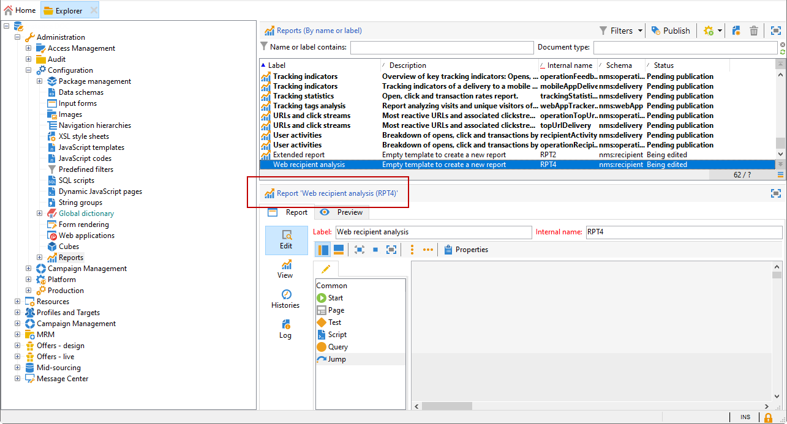

# Create a new report{#creating-a-new-report}

To create a report, apply the following steps:

1. Open the Adobe Campaign Explorer and from the **[!UICONTROL Administration > Configuration]** node, then select the **[!UICONTROL Reports]** folder.
1. Click the **[!UICONTROL New]** button above the list of reports. 
1. Select **[!UICONTROL Create a new report from a template]** and click **[!UICONTROL Next]**.

   

1. Select the report template in the drop-down list.

    * The **[!UICONTROL Extended report]** lets you create a report configured using a chart.
    * The **[!UICONTROL Qualitative distribution]** report lets you create statistics based on all types of data (company name, email domain, etc.). 
    * The **[!UICONTROL Quantitative distribution]** report lets you create statistics on data that can be measured or counted (invoice amount, recipient age, etc.).

   For more information on these report templates, refer to [this section](../../reporting/using/about-descriptive-analysis.md).

1. Enter the report name and its description in the corresponding fields. Specify the **[!UICONTROL schema]** on which the report will be applied.

   

1. Save this report.

## Modelizing the chart {#modelizing-the-chart}

After saving your report, this should be displayed. You can now build the chart of your report.

The chart for building the report is made up of a succession of activities. 

Activities are linked up using transitions, represented by arrows.

To build a report, depending on its nature and context, you need to identify the useful elements and modelize their logical sequence.

1. Use the **[!UICONTROL Start]** activity to materialize the first process to be carried out to build the report. You can only use one of these activities per report.

   It is mandatory if the chart includes a loop.

1. Add one or more **[!UICONTROL Query]** activities to collect data that is useful for building the report. Data can be collected either directly via a query on a schema of the database, or via an imported list or an existing Cube.

   For more on this, refer to [Collecting data to analyze](../../reporting/using/collecting-data-to-analyze.md).

   This data will be displayed (or not) in the report depending on page configuration.

1. Place one or more **[!UICONTROL Page]** activities to define the graphical representation of the collected data. You can insert tables, charts, input fields, and condition the display of one or more pages, or elements of the page. The displayed content is fully configurable.

   For more on this, refer to [Static elements](#static-elements).

1. Use a **[!UICONTROL Test]** activity to define the conditions for displaying or accessing data.

   For more on this, refer to [Conditioning page display](../../reporting/using/defining-a-conditional-content.md#conditioning-page-display).

1. If necessary, add personalized scripts via the **[!UICONTROL Script]** activity, for instance to calculate the name of a report, to filter the display of the result within a specific context, etc.

   For more on this, refer to [Script activity](../../reporting/using/advanced-functionalities.md#script-activity).

1. Finally, you for easier reading of complex reports, you can insert one or more **[!UICONTROL Jump]** type activities. This lets you go from one activity to another without materializing the transition on the report. The **[!UICONTROL Jump]** activity can also be used to display another report.

   For more on this, refer to [Jump activity](../../reporting/using/advanced-functionalities.md#jump-activity).

You cannot execute several branches at the same time. This means that a report built like this will not work:

However, you can place several branches. Only one of them will be executed:

## Creating a page {#creating-a-page}

Content is configured via the activities placed in the chart. For more on this, refer to [Modelizing the chart](#modelizing-the-chart).

To configure an activity, double-click its icon.

The displayed content is defined in the **Page** type activities.

A report can include one or more pages. Pages are created via a dedicated editor that lets you insert, in a tree structure, input fields, selection fields, static elements, charts, or tables. Containers help you define the layout. For more on this, refer to [Element layout](../../reporting/using/element-layout.md).

To add a component to the page, use the icons in the upper left-hand section of the toolbar.

You can also right-click the node where you want to add the component and select it from the list.

>[!CAUTION]
>
>If the report is destined to be exported in Excel format, we recommend not using complex HTML formatting. For more on this, refer to [Exporting a report](../../reporting/using/actions-on-reports.md#exporting-a-report).

A **[!UICONTROL Page]** can include the following elements:

* Bar, pie, curve type **[!UICONTROL charts]**, etc. 
* Pivot; List with group, or Breakdown **[!UICONTROL tables]**. 
* Text or number type **[!UICONTROL Input controls]**. 
* Drop-down list, checkbox, radio button, multiple choice, date, or Matrix type **[!UICONTROL Selection controls]**. 
* Link editor, Constant, Folder selection type **[!UICONTROL Advanced controls]**.
* Value, Link, HTML, Image, etc. **[!UICONTROL Static elements]**. 
* **[!UICONTROL Containers]** that enable you to control component layout.

The configuration mode of a page and its components is detailed in [this section](../../web/using/about-web-forms.md).

The toolbar lets you add or remove controls and organize their sequence in the report page(s).

### Static elements {#static-elements}

Static elements enable you to display information in the report, such as graphical elements or scripts, which the user will not interact with. Refer to [this section](../../web/using/static-elements-in-a-web-form.md#inserting-html-content) for more information.

### Filtering information in a report {#filtering-information-in-a-report}

Input and selection controls enable you to filter the information displayed in the report. For more on implementing this type of filtering, refer to [Filtering options in the queries](../../reporting/using/collecting-data-to-analyze.md#filtering-options-in-the-queries).

To learn more on creating and configuring input fields and selection fields, refer to [this section](../../web/using/about-web-forms.md).

You can integrate one or more input controls into your reports. This type of control lets you filter information displayed according to a value entered.

You can also integrate one or more selection controls into your reports. This type of control lets you filter the information contained in the report, based on the selected value(s), such as:

* via radio buttons or checkboxes:

  

* via a drop-down list: 

  

* via a calendar:

  

Finally, you can integrate one or more advanced controls into your reports. This type of control enables you to insert a link, a constant, or to select a folder.

Here you can filter the data in the report to display only the information contained in one of the folders of the tree: 

