# Creating indicators{#creating-indicators}

To make a cube functional, you need to identify the relevant dimensions and measures and create them in the cube.

To create a Cube, apply the following steps:

1. Select the work table. Refer to [Selecting the work table](#selecting-the-work-table).
1. Define dimensions. Refer to [Defining dimensions](#defining-dimensions).
1. Define measures. Refer to [Building indicators](#building-indicators).
1. Create aggregates (optional). Refer to [Calculating and using aggregates](../../reporting/using/concepts-and-methodology.md#calculating-and-using-aggregates).

This example shows you how to quickly create a simple cube in a report to export its measures.

The implementation steps are detailed below. Exhaustive options and descriptions are available in the other sections of this chapter.

## Selecting the work table {#selecting-the-work-table}

To create a cube, click the **[!UICONTROL New]** button above the list of cubes.

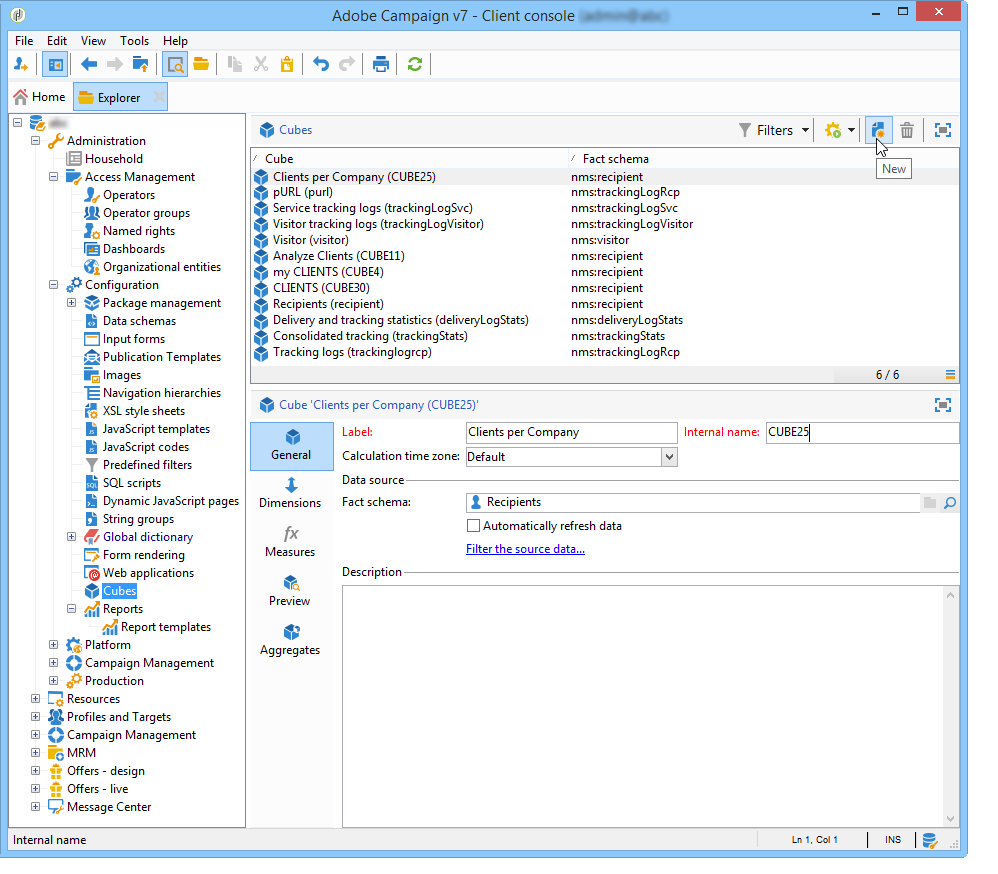

Select the fact schema, i.e. the schema which contains the elements you want to explore. In this example, we are going to select the **Recipient** table.

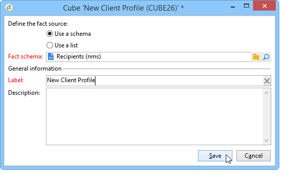

Click **[!UICONTROL Save]** to create the Cube: it will appear on the list of Cubes and may then be configured using the appropriate tabs.

Click the **[!UICONTROL Filter the source data...]** link to apply the calculations of this Cube to a select of data in the database.

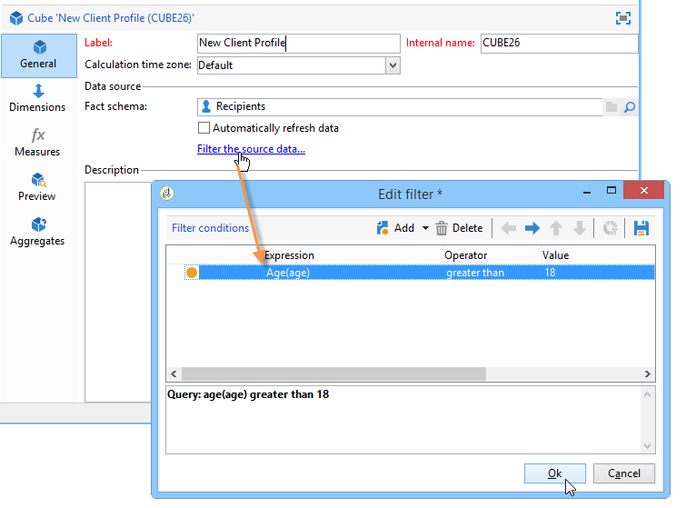

## Defining dimensions {#defining-dimensions}

Dimensions coincide with analysis axes defined for each Cube based on their related fact schema. These are the dimensions explored in the analysis, such as time (year, month, date...), a classification of products or contracts (family, reference, etc.), a population segment (by city, age group, status, etc.).

These analysis axes are defined in the **[!UICONTROL Dimension]** tab of the Cube.

Click the **[!UICONTROL Add]** button to create a new dimension, then in the **[!UICONTROL Expression field]**, click the **[!UICONTROL Edit expression]** icon to select the field that contains the concerned data.

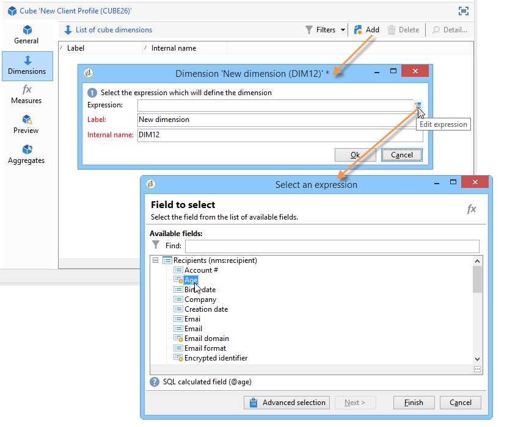

* Start by selecting the recipient **Age**. For this field, you can define binning to group ages and make information reading easier. We recommend using binning when there is a likelihood of several separate values.

  To do this, check the **[!UICONTROL Enable binning]** option. Binning modes are detailed in [Data binning](../../reporting/using/concepts-and-methodology.md#data-binning).

  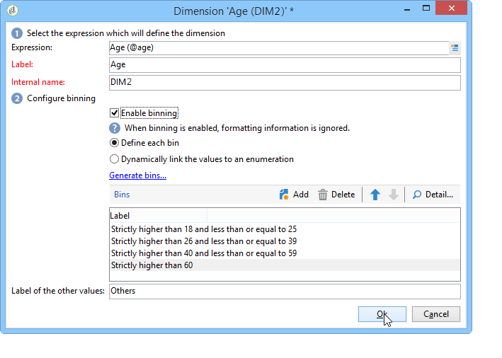

* Add a **Date** type dimension. Here, we want to display recipient profile creation dates

  To do this, click **[!UICONTROL Add]** and select the **[!UICONTROL Creation date]** field in the recipient table.

  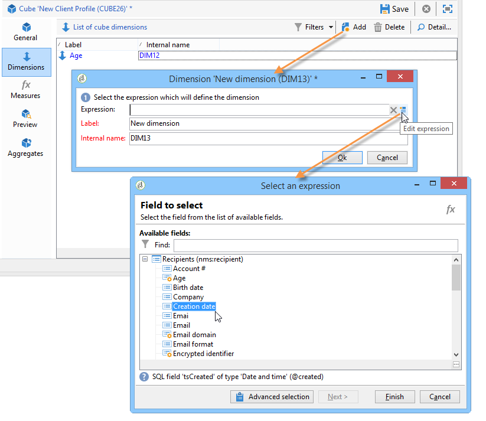

  It's possible to select the date display mode. To do this, select the hierarchy to use and the levels to generate:

  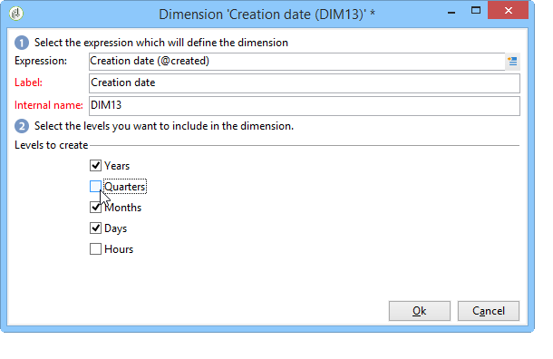

  In our example, we only want to display years, months and days since it's not possible to work with weeks and semesters/months at the same time: these levels aren't compatible.

* Create another dimension to analyze data relative to the recipient's city

  To do this, add a new dimension and select the city in the **[!UICONTROL Location]** node of the recipient schema. 

  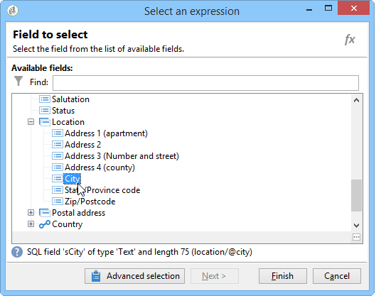

  You can enable binning to make information reading easier and link the values to an enumeration.

  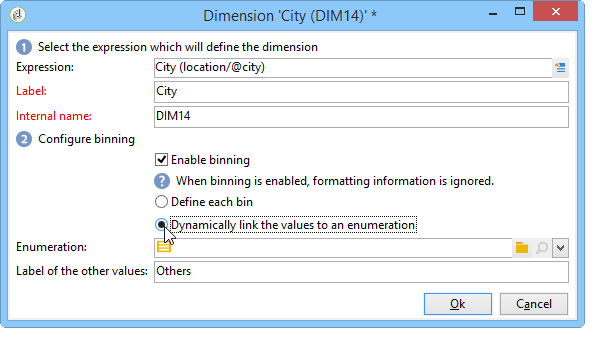

  Select the enumeration from the drop-down list 

  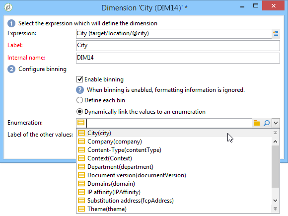

  Only the values in the enumeration will be displayed. The others will be grouped under the label defined in the **[!UICONTROL Label of the other values]** field.

  For more on this, refer to [Dynamically managing bins](../../reporting/using/concepts-and-methodology.md#dynamically-managing-bins).

## Building indicators {#building-indicators}

Once the dimensions are defined, you need to specify a calculation mode for the values to be displayed in the cells. To do this, create the matching indicators in the **[!UICONTROL Measures]** tab: create as many measures as there are columns to display in the report which will use the cube.

To do this, apply the following steps:

1. Click the **[!UICONTROL Add]** button.
1. Select the type of measure and the formula to apply. Here we want to count the number of women among the recipients.

   Our measure is based on the fact schema and uses the **[!UICONTROL Count]** operator.

   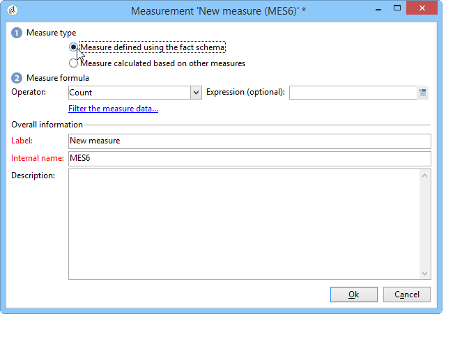

   The **[!UICONTROL Filter the measure data...]** link lets you select only women. For more on defining measures and the available options, refer to [Defining measures](../../reporting/using/concepts-and-methodology.md#defining-measures).

   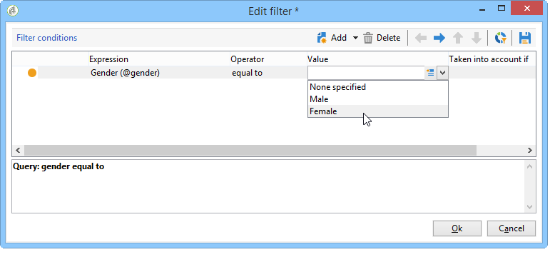

1. Enter the label of the measure and save it.

   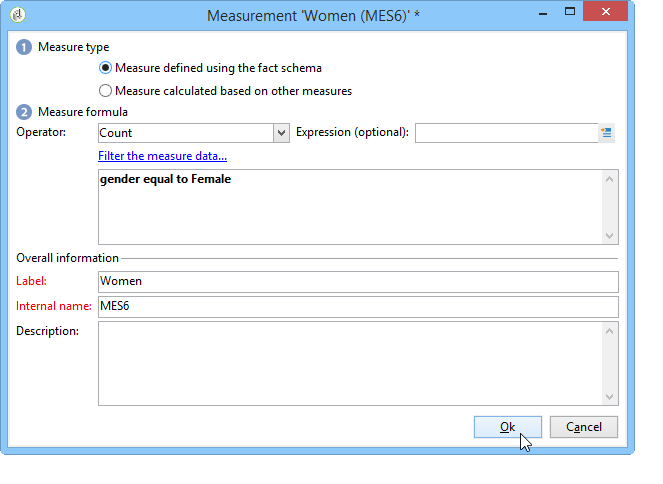

1. Save the cube.

## Creating a report based on a cube {#creating-a-report-based-on-a-cube}

Once the cube is configured, it can be used as a template for creating a new report.

To do this:

1. Click the **[!UICONTROL Create]** button of the **[!UICONTROL Reports]** tab and select the cube you have just created.

   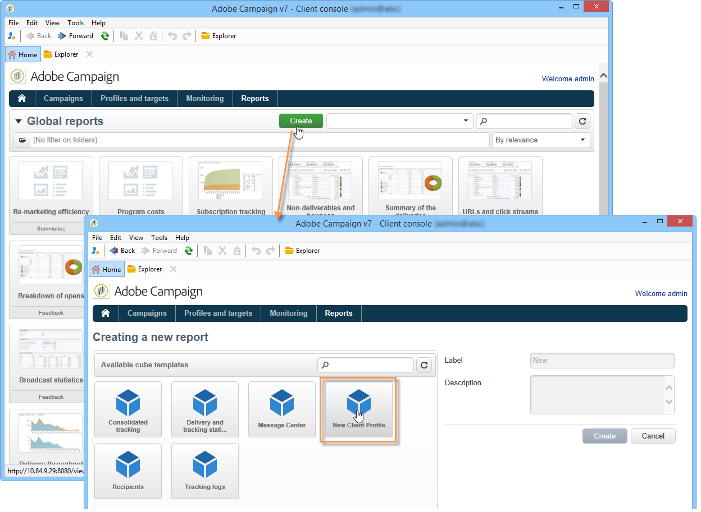

1. Click the **[!UICONTROL Create]** button to confirm: this will take you to the report configuration and viewing page.

   By default, the first two available dimensions are offered in lines and columns but no value is displayed in the table. To generate the table, click the main icon:

   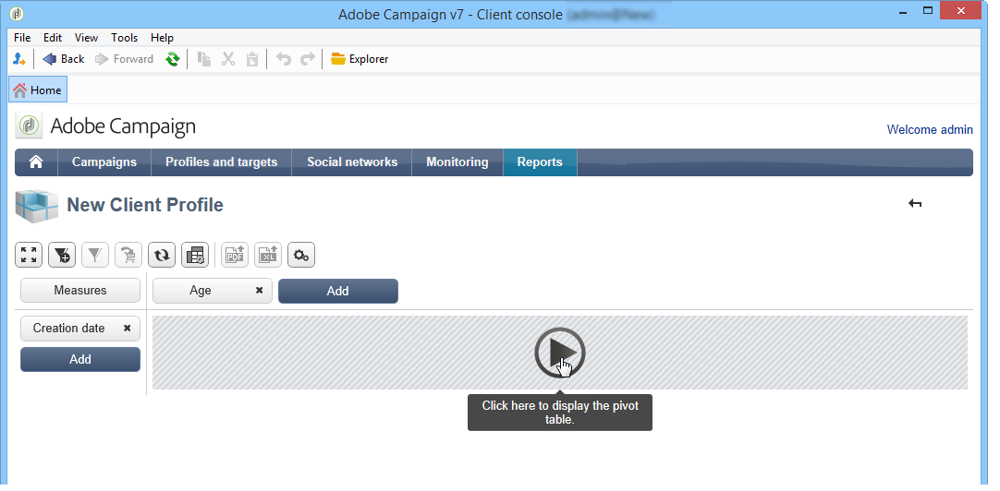

1. You can switch the axes of the dimension, delete them, add new measures, etc. Possible operations are detailed here: [Using cubes to explore data](../../reporting/using/using-cubes-to-explore-data.md).

   To do this, use the appropriate icons.

   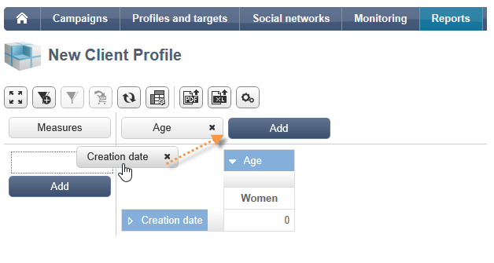
