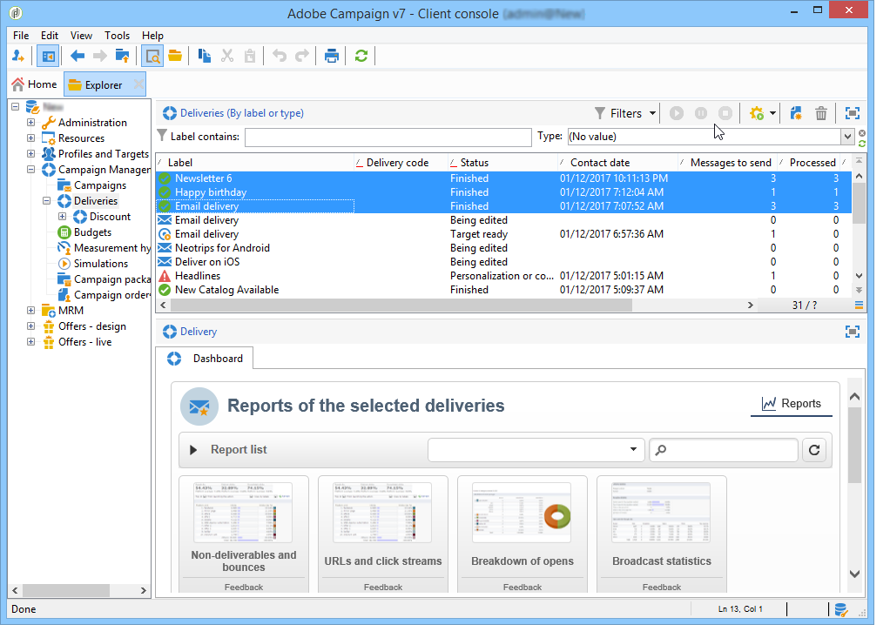
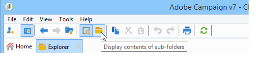

# Cumulative reports {#cumulative-reports}

 

You can display cumulated reports on deliveries. To do this, select the deliveries to be compared to obtain the list of reports for these deliveries.

To select non-adjacent deliveries from the list, hold down the CTRL key while making your selection.

To select deliveries saved in a different folder click **[!UICONTROL Display sub-levels]** (accessible via the toolbar). They will then be displayed in the same list.

