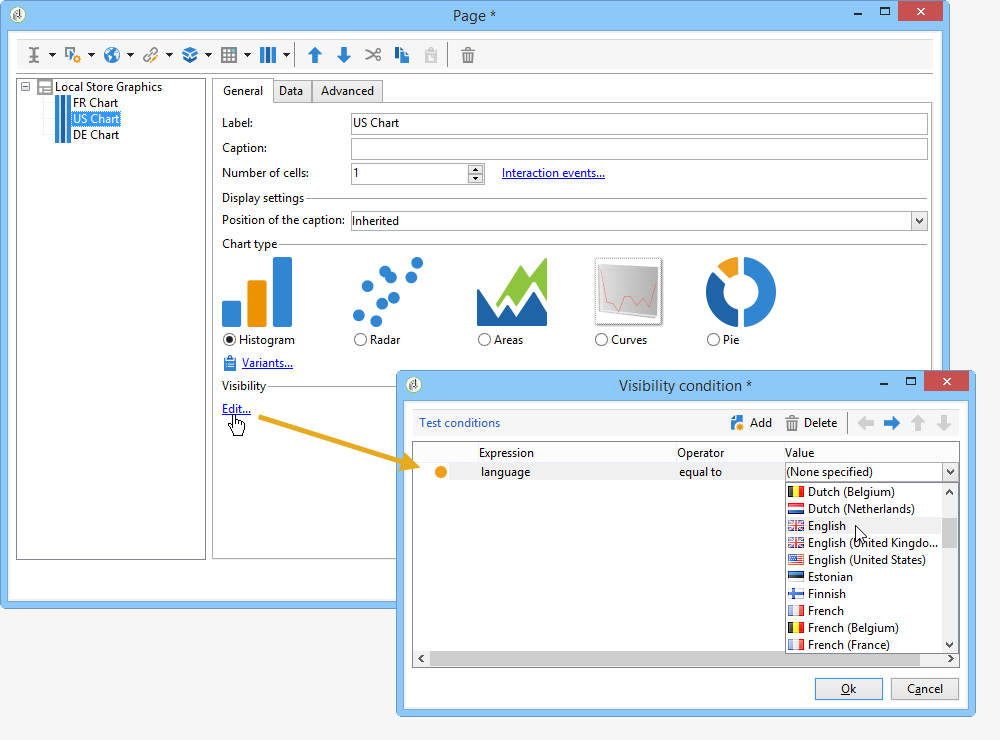
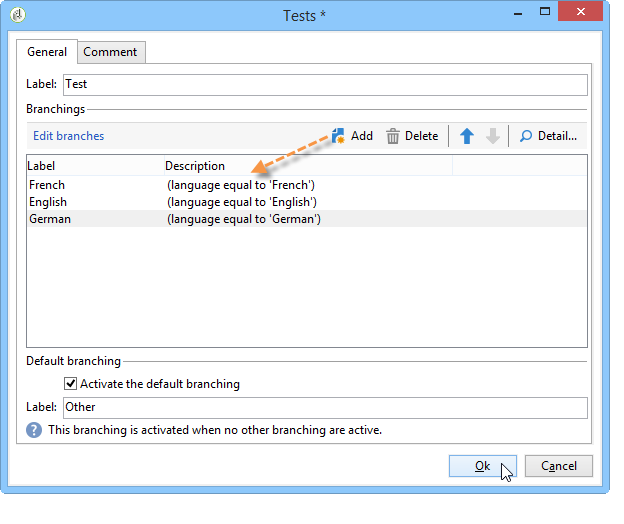
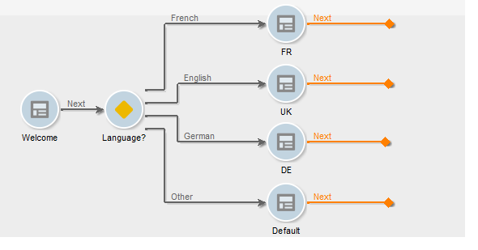

# Defining a conditional content{#defining-a-conditional-content}

You can condition the display of specific report items or pages.

To make specific items conditional, adapt their visibility settings. For more on this, refer to [Conditioning item display](#conditioning-item-display).

To make the display of one or more pages conditional, use a **[!UICONTROL Test]** type activity. For more on this, refer to [Conditioning page display](#conditioning-page-display).

## Conditioning item display {#conditioning-item-display}

To make the display of part of a report conditional, you need to define its visibility conditions: if these aren't met, the items will not be displayed.

Visibility conditions may depend on the operator status, on the items selected or entered in the report page.

Examples showing the conditional display of items on a page are provided in [this section](../../web/using/form-rendering.md#defining-fields-conditional-display).

In the following example, the display condition depends on the language:

## Conditioning page display {#conditioning-page-display}

In the chart of a report, the **[!UICONTROL Test]** activity lets you change the sequence of pages depending on one or more conditions.

This activity is based on the following operating principle:

1. Place a **[!UICONTROL Test]** in a chart and edit it.
1. Click the **[!UICONTROL Add]** button to create the various possible cases.

   

   For each case, an output transition is added to the **[!UICONTROL Test]** activity.

   

1. Select the **[!UICONTROL Enable default transition]** to add a transition, in case one of the configured conditions isn't met.

   For more on this, refer to [this section](../../web/using/defining-web-forms-page-sequencing.md#conditional-page-display).

A **[!UICONTROL Test]** activity can be placed at the start of the chart to condition the display depending on context or operator profile for instance.
