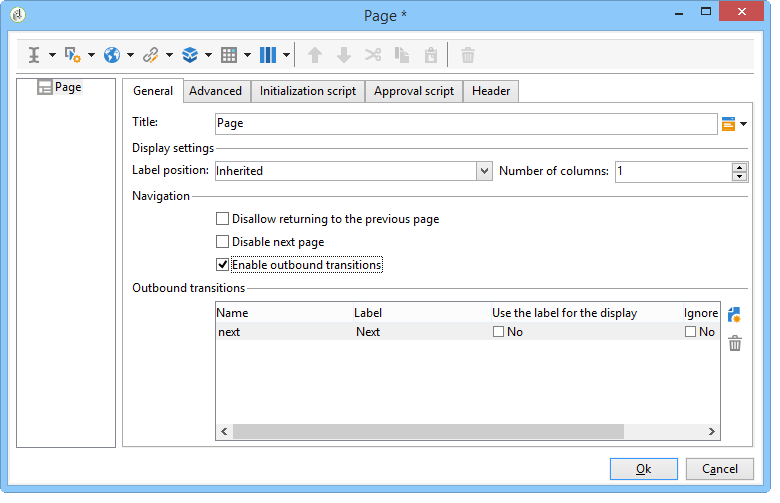
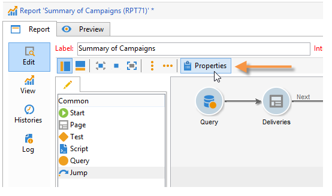
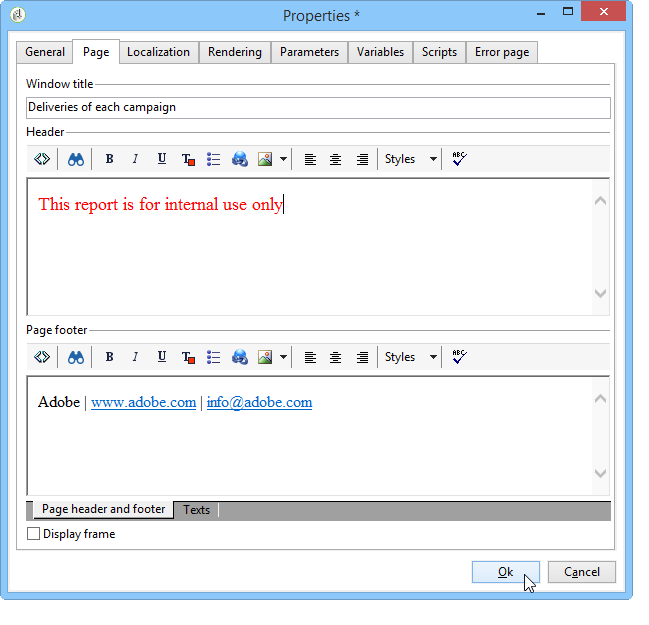
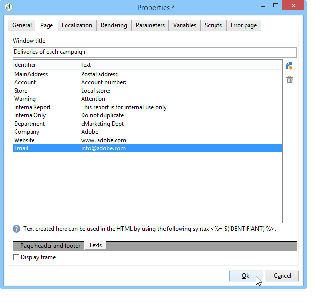
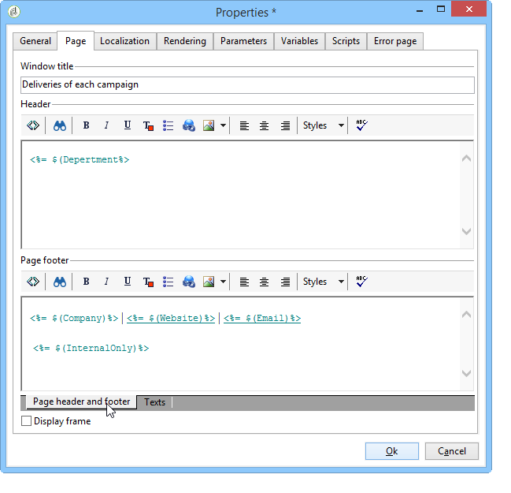

# Element layout{#element-layout}

In addition to the various charts detailed here: [Chart types and variants](../../reporting/using/creating-a-chart.md#chart-types-and-variants), you can adapt the display and add elements to the report page(s).

You can use containers: these enable you to link several elements of a page and configure their layout in columns and/or cells. How to use them is detailed in [this section](../../web/using/defining-web-forms-layout.md#creating-containers).

You can configure the report layout at the root of the tree and overload it for each container. Pages are sorted into columns. Containers are also sorted into columns. Only the static and graphical items are sorted into cells.

## Defining the options for each page {#defining-the-options-for-each-page}

You can use the options on each page of the report.

The **[!UICONTROL General]** tab lets you change the title of the page, as well as configure legend positions and browsing between the report pages. 

The **[!UICONTROL Title]** field lets you personalize the label in the header of the report page. The title of the window can be configured via the **[!UICONTROL Properties]** window of the report. For more on this, refer to [Adding a header and a footer](#adding-a-header-and-a-footer).

The **[!UICONTROL Display settings]** options enable you to select the position of the control caption within a report page and to define the number of columns on the page. For more on page layout, refer to the **Item layout** section of [this section](../../web/using/defining-web-forms-layout.md#positioning-the-fields-on-the-page).

Select the various options in the **[!UICONTROL Browse]** section to authorize browsing from one report page to another. If the **[!UICONTROL Disable next page]** or the **[!UICONTROL Disable previous page]** option is selected, the **[!UICONTROL Next]** and **[!UICONTROL Previous]** buttons disappear from the report page.

## Adding a header and a footer {#adding-a-header-and-a-footer}

The report properties window also lets you define the layout elements, such as: the title of the window, the HTML content of the headers and footers.

To access the properties window, click the **[!UICONTROL Properties]** button of the report.

The **[!UICONTROL Page]** tab enables you to personalize your display. 

The content configured in this tab will be visible on all report pages.

The **[!UICONTROL Texts]** sub-tab enables you to define variable content: it will be taken into account during the translation cycle if the report is designed for use in several languages.

This lets you create a list of text fragments and link them to identifiers:

Then insert these identifiers into HTML contents of the report:

They will be automatically replaced with the appropriate content when the report is displayed.

Like for HTML texts, this operating mode enables you to centralize the texts used in the report and manage their translation. The texts created in this tab are collected automatically by the Adobe Campaign integrated translation tool.
