# Global reports {#global-reports}

These reports concern the activity of the data in the entire database. To view the reports dashboard, go to the **[!UICONTROL Reports]** tab. 

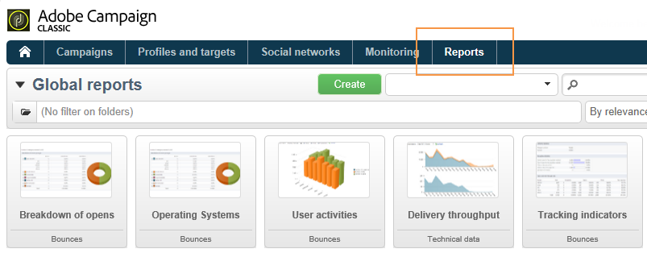

To display reports, click their names. The following reports are available by default:

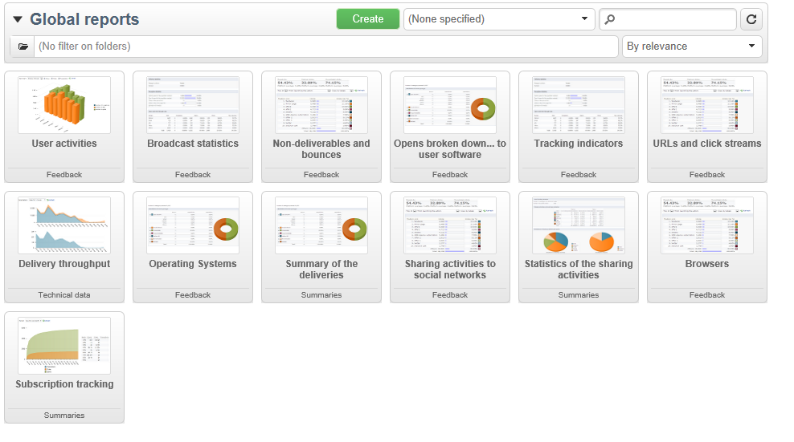

>[!NOTE]
>
>This section shows only the reports linked to deliveries.

* **[!UICONTROL Delivery throughput]** : refer to [Delivery throughput](#delivery-throughput).
* **[!UICONTROL Browsers]** : refer to [Browsers](#browsers).
* **[!UICONTROL Sharing to social networks]** : refer to [Sharing to social networks](#sharing-to-social-networks).
* **[!UICONTROL Statistics on sharing activities]** : refer to [Statistics on sharing activities](#statistics-on-sharing-activities).
* **[!UICONTROL Operating systems]** : refer to [Operating systems](#operating-systems).
* **[!UICONTROL URLs and click streams]** : refer to [URLs and click streams](../../reporting/using/delivery-reports.md#urls-and-click-streams).
* **[!UICONTROL Tracking indicators]** : refer to [Tracking indicators](../../reporting/using/delivery-reports.md#tracking-indicators).
* **[!UICONTROL Non-deliverables and bounces]** : refer to [Non-deliverables and bounces](#non-deliverables-and-bounces).
* **[!UICONTROL User activities]** : refer to [User activities](#user-activities).
* **[!UICONTROL Subscription tracking]** : refer to [Subscription tracking](#subscription-tracking).
* **[!UICONTROL Delivery summary]** : refer to [Delivery summary](../../reporting/using/delivery-reports.md#delivery-summary).
* **[!UICONTROL Delivery statistics]** : refer to [Delivery statistics](#delivery-statistics).
* **[!UICONTROL Breakdown of opens]** : refer to [Breakdown of opens](#breakdown-of-opens).

## Delivery throughput {#delivery-throughput}

This report contains information on the delivery throughput of the entire platform for a given period. To measure the speed at which the messages are delivered, the criteria are the number of messages sent per hour and the size of the messages (in bits per second). In the example below, the first graph shows the successful deliveries in blue, and the number of erroneous deliveries in orange.

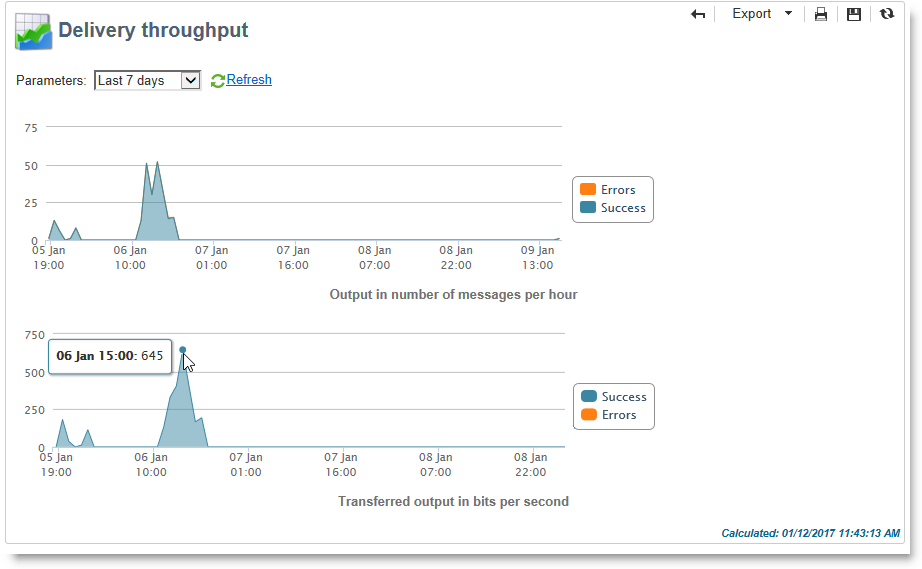

You can configure the values displayed by changing the timescale: 1-hour view, 3-hour view, 24-hour view, etc. Click **[!UICONTROL Refresh]** to confirm your selection.

## User activities {#user-activities}

This report shows the breakdown of opens, clicks and transactions per half-hour, hour or day, in the form of a chart.

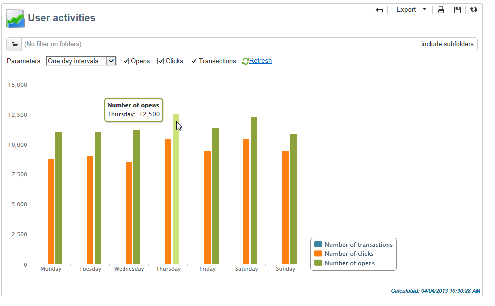

The following options are available:

* **[!UICONTROL Opens]** : Total number of messages opened. Emails in text format are not taken into account. For more information on tracking opens, refer to [Tracking opens](../../reporting/using/indicator-calculation.md#tracking-opens-).
* **[!UICONTROL Clicks]** : Total number of clicks on links in deliveries. Clicks on unsubscription links and mirror pages are not taken into account.
* **[!UICONTROL Transactions]** : Total number of transactions after a message is received. In order for a transaction to be taken into account, a transaction type webtracking tag must be inserted into the matching web page. Webtracking configuration is presented in [this section](../../configuration/using/about-web-tracking.md).

## Non-deliverables and bounces {#non-deliverables-and-bounces}

This report shows the breakdown of non-deliverables as well as a breakdown of bounces per internet domain.

The **[!UICONTROL Number of messages processed]** represents the total number of messages processed by the delivery server. This value is lower than the number of messages to be delivered when some deliveries have been stopped or paused (before being processed by the server).

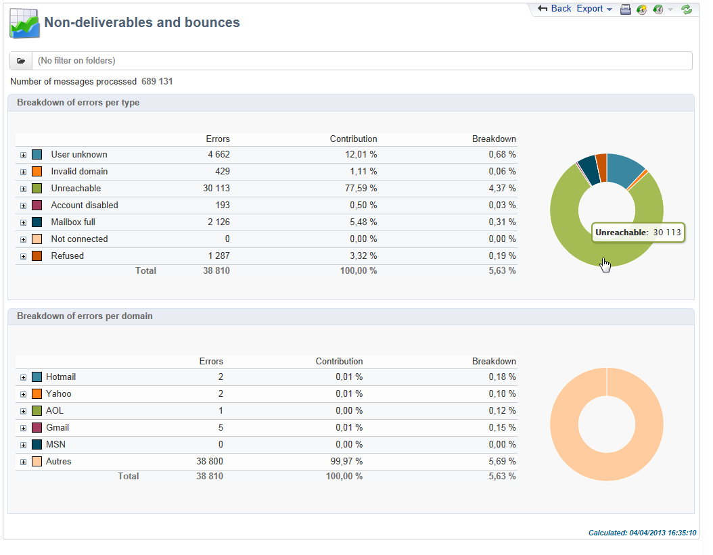

**[!UICONTROL Breakdown of errors by type]**

>[!NOTE]
>
>The errors shown in this report trigger the quarantine process. For more on quarantine management, refer to [Quarantine management](../../delivery/using/understanding-quarantine-management.md).

The first section of this report shows the breakdown of non-deliverables in the form of a table of values and a chart.

For each error type, we have:

* the number of error messages of this type,
* the percentage of messages with errors of this type compared to the total number of messages with errors,
* the percentage of error messages of this type compared to the total number of messages processed.

The following indicators are used:

* **[!UICONTROL User unknown]** : Error type generated during delivery to indicate that the email address is invalid.
* **[!UICONTROL Invalid domain]** : Error type generated when sending a delivery to indicate that the domain of the email address is wrong or does not exist.
* **[!UICONTROL Inbox full]** : Error type generated after five delivery attempts to indicate that the recipients' inbox contains too many messages.
* **[!UICONTROL Account disabled]** : Error type generated when sending a delivery to indicate that the address no longer exists.
* **[!UICONTROL Rejected]** : Error type generated when an address is rejected by the IAP (Internet Access Provider), for instance following the application of a security rule (anti-spam software). 
* **[!UICONTROL Unreachable]** : Error type which occurs in the message distribution string: incident on the SMTP relay, domain temporarily unreachable, etc 
* **[!UICONTROL Not connected]** : Error type to indicate that the recipients' mobile phone is switched off or disconnected from the network at the time of sending.

  >[!NOTE]
  >
  >This indicator only concerns deliveries on mobile channels. For more on this, refer to [this section](../../delivery/using/sms-channel.md).

  You can open up each line of the value table by clicking the `[+]` symbol. For each error type, you can show the breakdown of error messages by domain.

  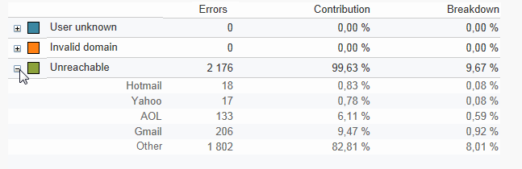

**[!UICONTROL Breakdown of errors per domain]**

The second section of this report shows the breakdown of errors per Internet domain in the form of a table of values and a chart.

For each domain name, we have:

* the number of messages with errors for this domain,
* the percentage of messages with errors for this domain compared to the total number of messages processed for this domain, 
* the percentage of error messages for this domain compared to the total number of error messages.

You can open up each line of the value table by clicking the [+] symbol. For each domain type, you can show the breakdown of error messages by error type.

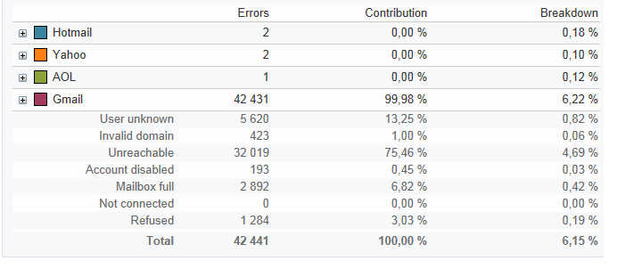

>[!NOTE]
>
>The domain names displayed in this report are defined at cube level. To change theses values, edit the **[!UICONTROL Delivery logs (broadlogrcp)]** cube. For more on this, refer to [this section](../../reporting/using/about-cubes.md). The **[!UICONTROL Others]** category includes domain names that don't belong to a specific class.

## Browsers {#browsers}

This report shows the breakdown of internet browsers used by delivery recipients for the concerned period.

>[!NOTE]
>
>The values shown in this report are estimates: only recipients who have clicked in a delivery will be taken into account.

**Global statistics**

The global statistics on browser use are presented in the form of a table of values and a chart. 

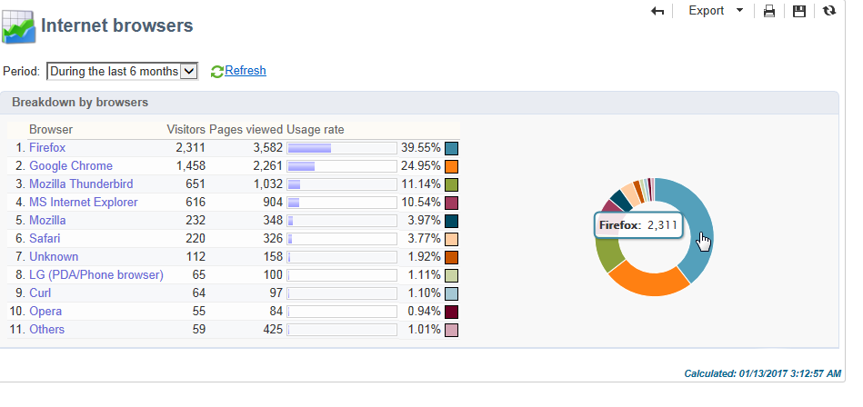

The following indicators are used:

* **[!UICONTROL Visitors]** : Total number of recipients targeted (per internet browser) and having clicked on a delivery at least once.
* **[!UICONTROL Pages viewed]** : Total number of clicks on links in a delivery (per internet browser) for all deliveries.
* **[!UICONTROL Usage rate]** : This rate represents the breakdown of visitors (per internet browser) in relation to the total number of visitors.

**Statistics per browser**

In the table of global statistic values, you can click each browser name to view their usage statistics. 

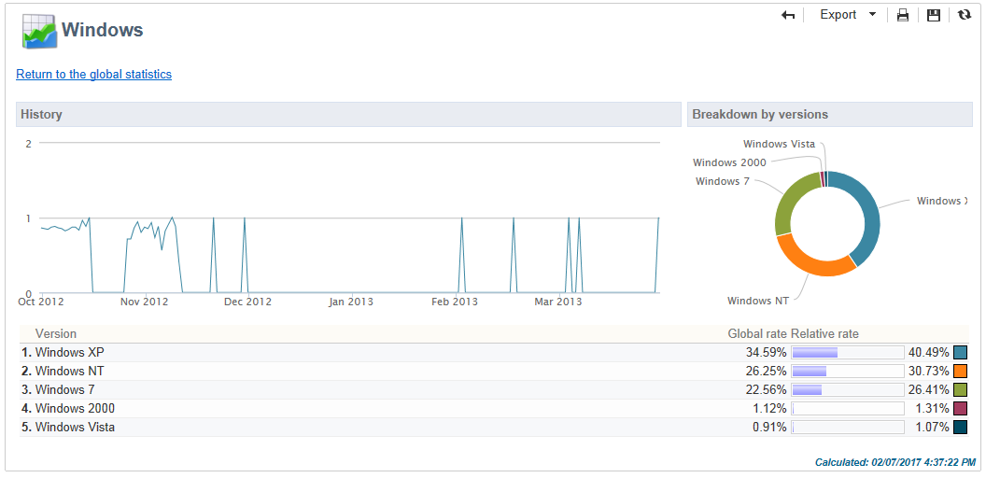

Statistics are presented in the form of a curve, a chart and a table of values.

The **[!UICONTROL History]** curve represents the attendance rate of this browser per day. The rate is the ratio of the number of visitors per day (on this browser) compared to the number of visitors measured on the day with the highest attendance rate.

The **[!UICONTROL Breakdown per version]** chart represents the breakdown of visitors per version compared to the total number of visitors (on this browser).

The table of values uses the following indicators:

* **[!UICONTROL Global rate]** : This rate represents the breakdown of visitors per version compared to the total number of visitors (on all browsers).
* **[!UICONTROL Relative rate]** : This rate represents the breakdown of visitors per version compared to the total number of visitors (on this browser).

### Sharing to social networks {#sharing-to-social-networks}

Viral marketing lets delivery recipients share information with their contact network: they can add a link to their profile (Facebook, Twitter, etc.) or send a message to a friend. Each share and each access to shared information is tracked within the delivery. For more information on viral marketing, refer to [this section](../../delivery/using/viral-and-social-marketing.md).

This report shows the breakdown of shared and opened messages per social network (Facebook, Twitter, etc.) and/or per email.

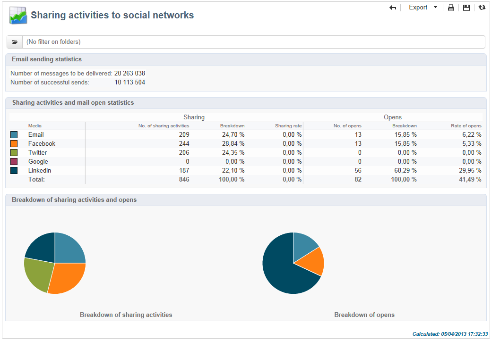

**[!UICONTROL Email delivery statistics]**

In the email delivery statistics, two values are displayed:

* **[!UICONTROL Number of messages to be delivered]** : Total number of messages processed during delivery analysis.
* **[!UICONTROL Number of successful deliveries]** : Number of messages processed successfully.

**[!UICONTROL Sharing activities and mail open statistics]**

The central table shows the statistics on email shares and opens.

In the **[!UICONTROL Shares]** column, we have the following indicators:

* **[!UICONTROL No. of sharing activities]** : Total number of messages shared on each social network. This value equals the total number of clicks on the icon of the matching **[!UICONTROL Links for sharing to social networks]** personalization block.
* **[!UICONTROL Breakdown]** : This rate represents the breakdown of shares per social network, in relation to the total number of shares.
* **[!UICONTROL Sharing rate]** : This rate represents the breakdown of shares per social network, in relation to the number of messages to be delivered.

In the **[!UICONTROL Opens]** column, we have the following indicators:

* **[!UICONTROL No. of opens]** : Total number of messages opened by people whom the message was forwarded to (via the **[!UICONTROL Links for sharing to social networks]** personalization block). This value equals the number of times the mirror page was displayed. Opens by delivery recipients are not taken into account.
* **[!UICONTROL Breakdown]** : This rate represents the breakdown of opens per social network, in relation to the total number of opens.
* **[!UICONTROL Rate of opens]** : This rate represents the breakdown of opens per social network, in relation to the total number of shares.

**[!UICONTROL Breakdown of sharing activities and opens]**

This section includes two charts which represent the breakdown of sharing activities and opens per social network.

## Statistics on sharing activities {#statistics-on-sharing-activities}

This report shows the evolution of shares to social networks (Facebook, Twitter, email, etc.) in time.

For more information on viral marketing, refer to [this section](../../delivery/using/viral-and-social-marketing.md).

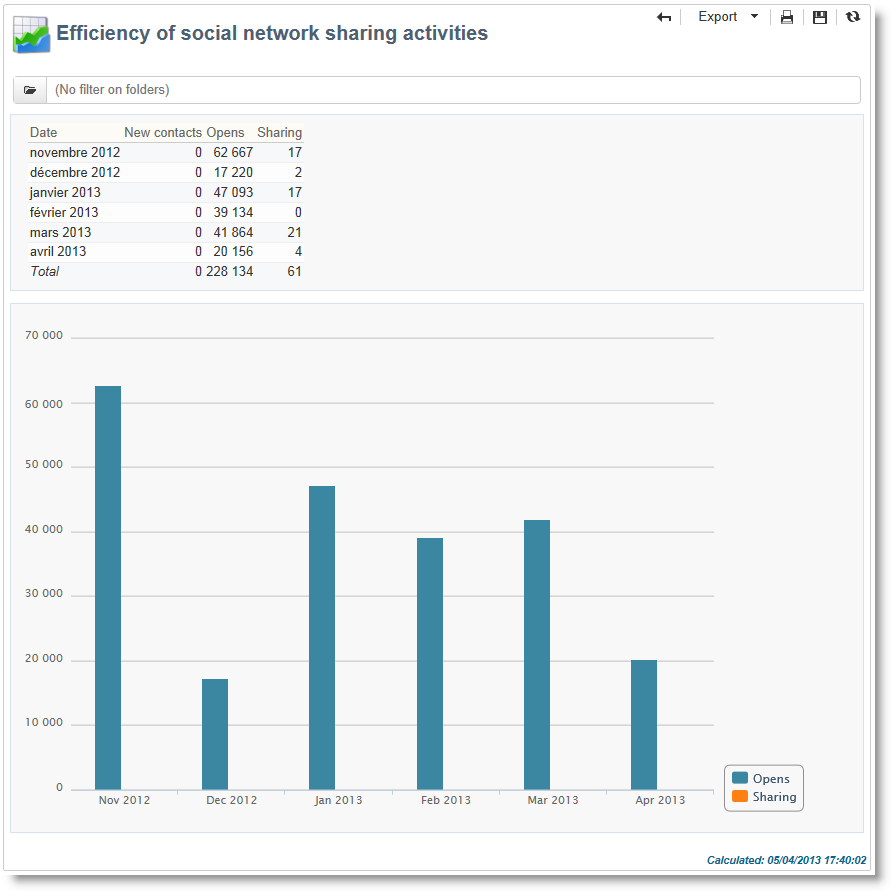

Statistics are presented in the form of a table of values and a chart.

The following indicators are used:

* **[!UICONTROL New contacts]** : Number of new subscriptions following the reception of a message shared via email. This value matches the number of people who received a message shared via email, clicked the **[!UICONTROL Subscription link]** and filled in the subscription form. 
* **[!UICONTROL Opens]** : Total number of messages opened by people whom the message was transferred to (via the **[!UICONTROL Link for sharing to social networks]** personalization block). This value equals the number of times the mirror page was displayed. Opens by delivery recipients are not taken into account.
* **[!UICONTROL Sharing activities]** : Total number of messages shared via social networks. This value matches the total number of clicks on the icon of the **[!UICONTROL Links for sharing to social networks]** personalization block.

## Operating systems {#operating-systems}

This report shows the breakdown of operating systems used by delivery recipients for the concerned period.

>[!NOTE]
>
>The values shown in this report are estimates: only recipients who have clicked in a delivery will be taken into account.

**Global statistics**

The global usage statistics of operating systems are presented in the form of a table of values and a chart. 

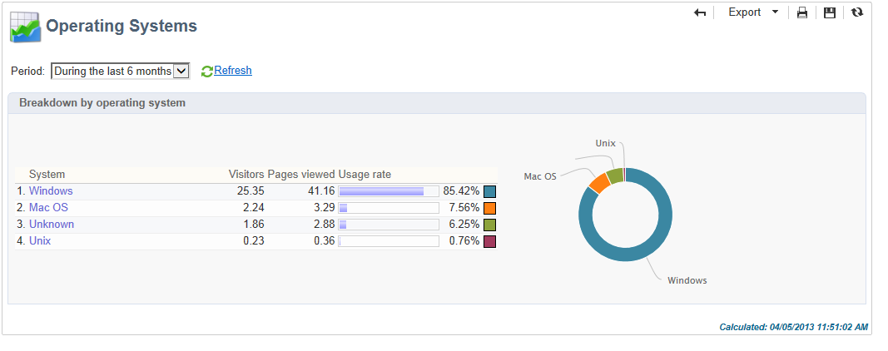

The following indicators are used:

* **[!UICONTROL Visitors]** : Daily average of the total number of targeted recipients (per operating system) who clicked in a delivery at least once.
* **[!UICONTROL Pages viewed]** : Daily average of the total number of clicks on delivery links (per operating system) for all deliveries.
* **[!UICONTROL Rate of use]** : This rate represents the breakdown of visitors (per operating system) in relation to the total number of visitors.

**Statistics per operating system**

In the table of global statistics values, click the name of each operating system to view the statistics per operating system. 

Statistics are presented in the form of a curve, a chart and a table of values.

The **[!UICONTROL History]** curve represents the rate of use of this operating system per day. This rate is the ratio of the number of visitors per day (on this operating systems) in relation to the number of visitors measured on the day with the highest attendance.

The **[!UICONTROL Breakdown by version]** chart represents the breakdown of visitors per version in relation to the total number of visitors on this operating system.

The table of values uses the following indicators:

* **[!UICONTROL Global rate]** : This rate represents the breakdown of visitors (per version) in relation to the total number of visitors throughout the operating systems.
* **[!UICONTROL Relative rate]** : This rate represents the breakdown of visitors (per version) in relation to the total number of visitors for this operating system.

## Subscription tracking {#subscription-tracking}

This report lets you monitor subscriptions to information services. It shows subscriptions and unsubscriptions.

It can be displayed for a subscription by clicking the **[!UICONTROL Profiles and targets > Services and subscriptions]** node of the home page or the explorer. Select the desired subscription, and then click the **[!UICONTROL Reports]** tab. The **[!UICONTROL Subscriptions tracking]** report is available by default. It lets you see the subscription and unsubscription trends and the loyalty rate over a period. You can configure the representation of this data via the drop-down list. Click **[!UICONTROL Refresh]** to validate the selected configuration.

For further information, refer to [this page](../../delivery/using/managing-subscriptions.md).

The **[!UICONTROL Number subscribed to date]** represents the total number of people currently subscribed.

**[!UICONTROL Overall evolution of subscriptions]**

The table of values uses the following indicators:

* **[!UICONTROL Subscribers]** : Total number of subscribers for the concerned period.
* **[!UICONTROL Subscriptions]** : Number of subscriptions for the concerned period.
* **[!UICONTROL Unsubscriptions]** : Number of unsubscriptions for the concerned period.
* **[!UICONTROL Evolution]** : Number of unsubscriptions minus the number of subscriptions. The rate is calculated based on the total number of subscribers.
* **[!UICONTROL Loyalty]** : Loyalty rate of subscribers for the concerned period.

**[!UICONTROL Subscription evolution curves]**

This chart shows the evolution of subscriptions and unsubscriptions for the concerned period.

## Delivery statistics {#delivery-statistics}

This report shows the breakdown by internet domain, of all messages processed and sent, of hard and soft bounces, opens, clicks and unsubscriptions.

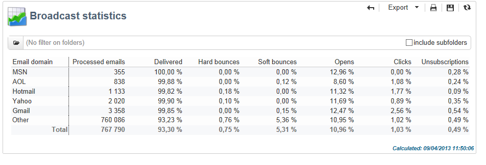

The following indicators are used:

* **[!UICONTROL Emails processed]** : Total number of messages processed by the delivery server.
* **[!UICONTROL Delivered]** : percentage of the number of messages successfully processed compared to the total number of messages processed.
* **[!UICONTROL Hard bounces]** : percentage of the number of "hard" bounces compared to the total number of messages processed.
* **[!UICONTROL Soft bounces]** : percentage of the number of "soft" bounces compared to the total number of messages processed.

  >[!NOTE]
  >
  >For more on hard and soft bounces, refer to [Quarantine management](../../delivery/using/understanding-quarantine-management.md).

* **[!UICONTROL Opens]** : percentage of the number of targeted recipients who opened a message at least once compared to the number of messages processed successfully.
* **[!UICONTROL Clicks]** : percentage of the number of people who clicked in a delivery at least once compared to the number of messages processed successfully. 
* **[!UICONTROL Unsubscription]** : percentage of the number of clicks on an unsubscription link compared to the number of messages processed successfully.

## Breakdown of opens {#breakdown-of-opens}

This report shows the breakdown of opens by operating system, device and browser for the period concerned. For each category, two charts are used. The first displays statistics regarding opens on a computer and mobile devices. The second displays statistics relating only to opens on mobile devices.

The number of opens corresponds to the total number of messages opened. Text format emails are not counted. For more information on Tracking opens, refer to the [Tracking opens](../../reporting/using/indicator-calculation.md#tracking-opens-) section.

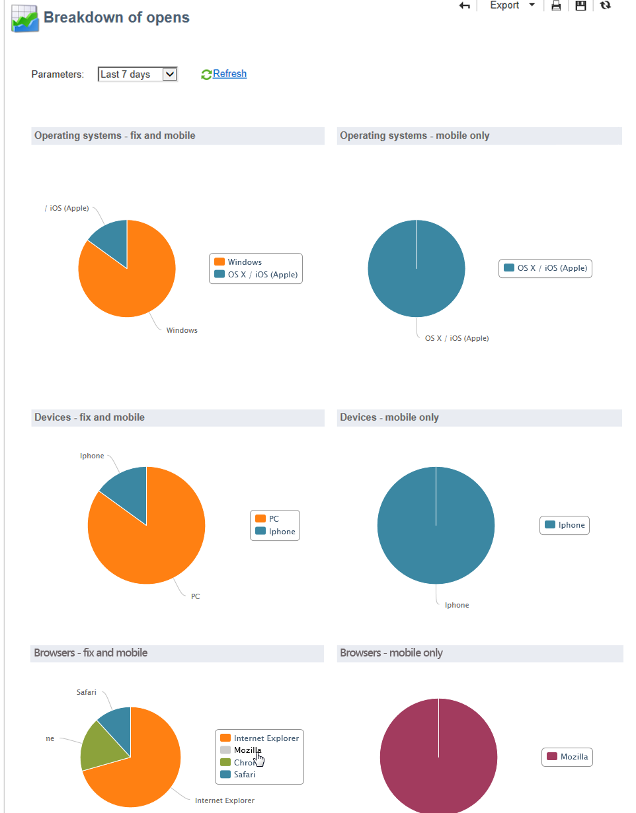

>[!NOTE]
>
>Browser and operating system names make up part of the information sent by the browser's user agent to which the message has been opened. Adobe Campaign deduces the type of device using its the device information.
