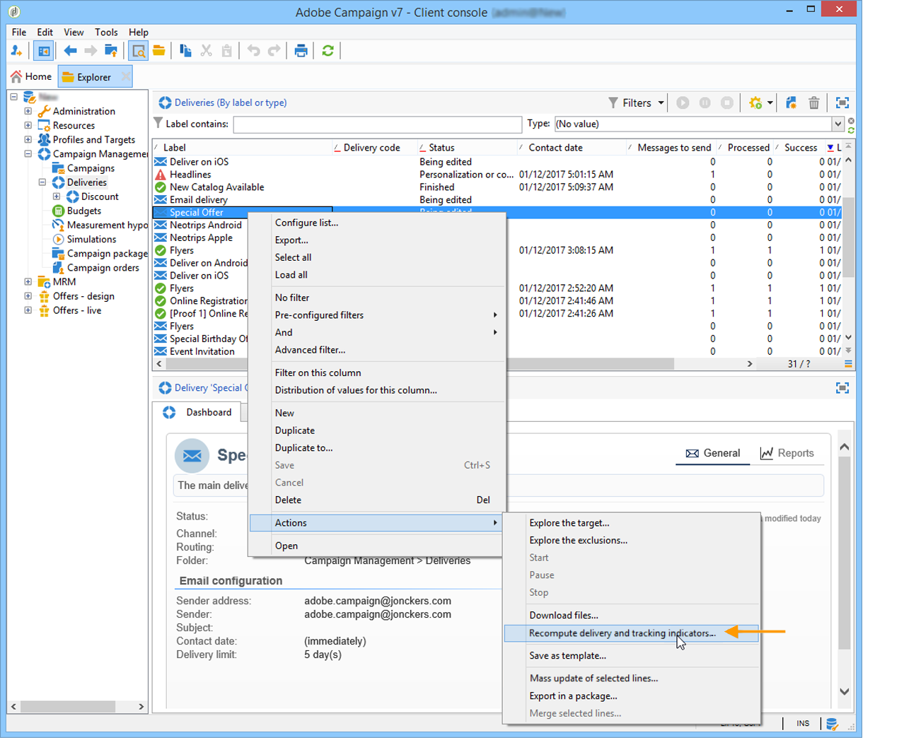

# Indicator calculation {#indicator-calculation}

## User activities {#user-activities-1}

<table> 
 <thead> 
  <tr> 
   <th> <strong>Label</strong>   </th> 
   <th> <strong>Field name</strong>   </th> 
   <th> <strong>Indicator description</strong>   </th> 
   <th> <strong>Indicator calculation formula</strong>   </th> 
  </tr> 
 </thead> 
 <tbody> 
  <tr> 
   <td> Opens  </td> 
   <td> @opens  </td> 
   <td> Sum of all @totalClicks with a URL primary key equal to 1.  </td> 
   <td> sum(Iif([@url-id]=1, @totalClicks, 0))  </td> 
  </tr> 
  <tr> 
   <td> Clicks  </td> 
   <td> @clicks  </td> 
   <td> Sum of all @totalClicks with a URL type equal to "Email click".  </td> 
   <td> sum(Iif([url/@type]=1, @totalClicks, 0))  </td> 
  </tr> 
  <tr> 
   <td> Transactions  </td> 
   <td> @transactions  </td> 
   <td> Sum of all @totalClicks with a URL type equal to "Transaction".  </td> 
   <td> sum(Iif([url/@type]=5, @totalClicks, 0))  </td> 
  </tr> 
 </tbody> 
</table>

This report is based on the **[!UICONTROL Consolidated tracking]** table (nms:trackingStats). This aggregate table is used for performance reasons when displaying reports, in the place of the **[!UICONTROL Recipient tracking logs]** table (nms:trackingLogRcp) and it is not calculated in real-time. The table is generated a few minutes after the tracking logs are retrieved. If the indicators are up-to-date, the results will be the same as for the indicators of the **Tracking indicators** report. The @totalclicks indicator expresses the total number of clicks over a 5-minute period.

## Non-deliverables and bounces {#non-deliverables-and-bounces-1}

**Breakdown by error type**

This report is based on the **[!UICONTROL Delivery and tracking statistics]** table (nms:deliveryLogStats).

<table> 
 <thead> 
  <tr> 
   <th> <strong>Label</strong>   </th> 
   <th> <strong>Field name</strong>   </th> 
   <th> <strong>Indicator description</strong>   </th> 
   <th> <strong>Indicator calculation formula</strong>   </th> 
  </tr> 
 </thead> 
 <tbody> 
  <tr> 
   <td> Total number of processed messages  </td> 
   <td> @totalProcessed  </td> 
   <td> Sum of messages with a status equal to "Ready", "Sent" or "Failed".  </td> 
   <td> @prepared + @error + @success  </td> 
  </tr> 
  <tr> 
   <td> User unknown  </td> 
   <td> @unknownUser  </td> 
   <td> Count of all messages with a status equal to "Failed" and a reason equal to "User unknown".   </td> 
   <td> Count(@status=2 and msg/@failureReason=1)  </td> 
  </tr> 
  <tr> 
   <td> Unreachable   </td> 
   <td> @unreachable  </td> 
   <td> Count of all messages with a status equal to "Failed" and a reason equal to "Unreachable".   </td> 
   <td> Count(@status=2 and msg/@failureReason=3)  </td> 
  </tr> 
  <tr> 
   <td> Rejected  </td> 
   <td> @refused  </td> 
   <td> Count of all messages with a status equal to "Failed" and a reason equal to "Rejected".   </td> 
   <td> Count(@status=2 and msg/@failureReason=20)  </td> 
  </tr> 
  <tr> 
   <td> Invalid domain  </td> 
   <td> @invalidDomain  </td> 
   <td> Count of all messages with a status equal to "Failed" and a reason equal to "Invalid domain".   </td> 
   <td> Count(@status=2 and msg/@failureReason=2)  </td> 
  </tr> 
  <tr> 
   <td> Account disabled  </td> 
   <td> @disabled  </td> 
   <td> Count of all messages with a status equal to "Failed" and a reason equal to "Account disabled".  </td> 
   <td> Count(@status=2 and msg/@failureReason=4)  </td> 
  </tr> 
  <tr> 
   <td> Inbox full  </td> 
   <td> @mailBoxFull  </td> 
   <td> Count of all messages with a status equal to "Failed" and a reason equal to "Inbox full".   </td> 
   <td> Count(@status=2 and msg/@failureReason=5)  </td> 
  </tr> 
  <tr> 
   <td> Errors  </td> 
   <td> @value  </td> 
   <td> Number of failed messages for this type of error.  </td> 
   <td> Count(@status=2 and msg/@failureReason="Value of the error type")  </td> 
  </tr> 
  <tr> 
   <td> Contribution  </td> 
   <td> -  </td> 
   <td> Percentage of errors of this type compared to the total number of error messages.  </td> 
   <td> percent(@value,@totalErrors)  </td> 
  </tr> 
  <tr> 
   <td> Breakdown  </td> 
   <td> -  </td> 
   <td> Percentage of errors of this type compared to the total number of processed messages.  </td> 
   <td> percent(@value,@totalProcessed)  </td> 
  </tr> 
 </tbody> 
</table>

**Breakdown by domain**

The second part of the report details the breakdown of failed messages by internet domain as opposed to error type. The formula linked to the **Error** indicator (@value) in this case is: Count(@status=2 and @domain="Value of the domain name"), i.e. a count of all messages with a failed status for this domain.

## Browsers {#browsers-1}

This report is based on the **[!UICONTROL Internet Browser Statistics]** table (nms:userAgentsStats).

**Global statistics**

<table> 
 <thead> 
  <tr> 
   <th> <strong>Label</strong>   </th> 
   <th> <strong>Field name</strong>   </th> 
   <th> <strong>Indicator description</strong>   </th> 
   <th> <strong>Indicator calculation formula</strong>   </th> 
  </tr> 
 </thead> 
 <tbody> 
  <tr> 
   <td> Visitors  </td> 
   <td> @totalVisitors  </td> 
   <td> Total number of targeted recipients for this browser who clicked in a delivery at least once.  </td> 
   <td> Sum(@visitors)  </td> 
  </tr> 
  <tr> 
   <td> Page views  </td> 
   <td> @totalPages  </td> 
   <td> Total number of clicks on delivery links using this browser, for all deliveries.  </td> 
   <td> Sum(@pages)   </td> 
  </tr> 
  <tr> 
   <td> Usage rate  </td> 
   <td> -  </td> 
   <td> Percentage of visitors for this browser compared to the total number of visitors.  </td> 
   <td> percent(@totalVisitors, sum(@totalVisitors))   </td> 
  </tr> 
 </tbody> 
</table>

**Statistics per browser**

<table> 
 <thead> 
  <tr> 
   <th> <strong>Label</strong>   </th> 
   <th> <strong>Field name</strong>   </th> 
   <th> <strong>Indicator description</strong>   </th> 
   <th> <strong>Indicator calculation formula</strong>   </th> 
  </tr> 
 </thead> 
 <tbody> 
  <tr> 
   <td> Usage rate  </td> 
   <td> @visitors  </td> 
   <td> Percentage of the number of visitors per day using this browser compared to the number of visitors measured on the day with the most visits.  </td> 
   <td> percent(sum(@visitors),max(@visitorsOfTheDay))  </td> 
  </tr> 
  <tr> 
   <td> Global rate  </td> 
   <td> -  </td> 
   <td> Percentage of visitors for this version compared to the total number of visitors using all browsers.  </td> 
   <td> percent(@totalVisitors, @globalVisitors)  </td> 
  </tr> 
  <tr> 
   <td> Relative weight  </td> 
   <td> -  </td> 
   <td> Percentage of visitors for this version compared to the total number of visitors using this browser.  </td> 
   <td> percent(@totalVisitors, sum(@totalVisitors))   </td> 
  </tr> 
 </tbody> 
</table>

## Sharing to social networks {#sharing-to-social-networks-1}

This report is based on the **[!UICONTROL Delivery]** (nms:delivery), **[!UICONTROL Consolidated tracking]** (nms:trackingStats), and **[!UICONTROL Web tracking]** (nms:webTrackingLog) tables.

<table> 
 <thead> 
  <tr> 
   <th> <strong>Label</strong>   </th> 
   <th> <strong>Field name</strong>   </th> 
   <th> <strong>Indicator description</strong>   </th> 
   <th> <strong>Indicator calculation formula</strong>   </th> 
  </tr> 
 </thead> 
 <tbody> 
  <tr> 
   <td> Number of messages to deliver  </td> 
   <td> @totalTarget  </td> 
   <td> Total number of messages processed during the delivery analysis.  </td> 
   <td> sum([properties/@totalTarget])  </td> 
  </tr> 
  <tr> 
   <td> Number of successful deliveries  </td> 
   <td> @success  </td> 
   <td> Number of messages processed successfully   </td> 
   <td> sum([indicators/@success])  </td> 
  </tr> 
  <tr> 
   <td> Email  </td> 
   <td> @email  </td> 
   <td> Sum of all @totalClicks for which the URL category equals "email".  </td> 
   <td> Sum(iIf([url/@category]='email',@totalClicks,0))  </td> 
  </tr> 
  <tr> 
   <td> Facebook  </td> 
   <td> @facebook  </td> 
   <td> Sum of all @totalClicks for which the URL category equals "facebook".  </td> 
   <td> Sum(iIf([url/@category]='facebook',@totalClicks,0))  </td> 
  </tr> 
  <tr> 
   <td> Twitter  </td> 
   <td> @twitter  </td> 
   <td> Sum of all @totalClicks for which the URL category equals "twitter".  </td> 
   <td> Sum(iIf([url/@category]='twitter',@totalClicks,0))  </td> 
  </tr> 
  <tr> 
   <td> Delicious  </td> 
   <td> @delicious  </td> 
   <td> Sum of all @totalClicks for which the URL category equals "delicious".  </td> 
   <td> Sum(iIf([url/@category]='delicious',@totalClicks,0))  </td> 
  </tr> 
  <tr> 
   <td> Digg  </td> 
   <td> @digg  </td> 
   <td> Sum of all @totalClicks for which the URL category equals "digg".  </td> 
   <td> Sum(iIf([url/@category]='digg',@totalClicks,0))  </td> 
  </tr> 
  <tr> 
   <td> Google  </td> 
   <td> @google  </td> 
   <td> Sum of all @totalClicks for which the URL category equals "google".  </td> 
   <td> Sum(iIf([url/@category]='google',@totalClicks,0))  </td> 
  </tr> 
  <tr> 
   <td> Linkedin  </td> 
   <td> @linkedin  </td> 
   <td> Sum of all @totalClicks for which the URL category equals "linkedin".  </td> 
   <td> Sum(iIf([url/@category]='linkedin',@totalClicks,0))  </td> 
  </tr> 
 </tbody> 
</table>

**Shares**

<table> 
 <thead> 
  <tr> 
   <th> <strong>Label</strong>   </th> 
   <th> <strong>Field name</strong>   </th> 
   <th> <strong>Indicator description</strong>   </th> 
   <th> <strong>Indicator calculation formula</strong>   </th> 
  </tr> 
 </thead> 
 <tbody> 
  <tr> 
   <td> Number of shares  </td> 
   <td> @forward  </td> 
   <td> Total number of messages shared on this social network.  </td> 
   <td> Sum(iIf([url/@category]="Value of the social network type",@totalClicks,0))  </td> 
  </tr> 
  <tr> 
   <td> Breakdown  </td> 
   <td> @percent  </td> 
   <td> Percentage of the number of shares on this social network compared to the total number of shares.  </td> 
   <td> percent(@forward, sum(@forward))  </td> 
  </tr> 
  <tr> 
   <td> Sharing rate  </td> 
   <td> @rate  </td> 
   <td> Number of shares on this network compared to the number of messages to deliver.  </td> 
   <td> @forward / @totalTarget  </td> 
  </tr> 
 </tbody> 
</table>

**Opens**

<table> 
 <thead> 
  <tr> 
   <th> <strong>Label</strong>   </th> 
   <th> <strong>Field name</strong>   </th> 
   <th> <strong>Indicator description</strong>   </th> 
   <th> <strong>Indicator calculation formula</strong>   </th> 
  </tr> 
 </thead> 
 <tbody> 
  <tr> 
   <td> Number of opens   </td> 
   <td> @open  </td> 
   <td> Total number of tracking lines in the web tracking table.  </td> 
   <td> Count  </td> 
  </tr> 
  <tr> 
   <td> Breakdown  </td> 
   <td> @percentOpen  </td> 
   <td> Percentage of the number of opens on this social network compared to the total number of opens.  </td> 
   <td> percent(@open, sum(@open))  </td> 
  </tr> 
  <tr> 
   <td> Rate of opens  </td> 
   <td> @rateOpen  </td> 
   <td> Number of opens on this social network compared to the total number of messages to deliver.  </td> 
   <td> @open / @totalTarget  </td> 
  </tr> 
 </tbody> 
</table>

## Statistics on sharing activities {#statistics-on-sharing-activities-1}

This report is based on the **[!UICONTROL Delivery]** (nms:delivery), **[!UICONTROL Consolidated tracking]** (nms:trackingStats), and **[!UICONTROL Web tracking]** (nms:webTrackingLog) tables. 

<table> 
 <thead> 
  <tr> 
   <th> <strong>Label</strong>   </th> 
   <th> <strong>Field name</strong>   </th> 
   <th> <strong>Indicator description</strong>   </th> 
   <th> <strong>Indicator calculation formula</strong>   </th> 
  </tr> 
 </thead> 
 <tbody> 
  <tr> 
   <td> New contacts  </td> 
   <td> @newContacts  </td> 
   <td> Count of the number of visitors linked to a recipient.  </td> 
   <td> Formula: count(@id)  Filter: @recipient-id != 0  </td> 
  </tr> 
  <tr> 
   <td> Opens  </td> 
   <td> @opened  </td> 
   <td> Count of all @ids with a URL type equal to "Open".  </td> 
   <td> count (Iif([url/@type] = 2, @id, 0))  </td> 
  </tr> 
  <tr> 
   <td> Shares  </td> 
   <td> @shared  </td> 
   <td> URL category included in 'email' , 'facebook' , 'twitter' , 'delicious' , 'digg' , 'google' , 'linkedin'  Count of all @totalClicks with a URL category that equals "email", "facebook", "twitter", "delicious", "digg", "google" or "linkedin".  </td> 
   <td> count (Iif([url/@category] IN (email' , 'facebook' , 'twitter' , 'delicious' , 'digg' , 'google' , 'linkedin'), @totalClicks, 0))  </td> 
  </tr> 
 </tbody> 
</table>

## Operating systems {#operating-systems-1}

This report is based on the **[!UICONTROL Internet Browser Statistics]** table (nms:userAgentsStats).

**Global statistics**

<table> 
 <thead> 
  <tr> 
   <th> <strong>Label</strong>   </th> 
   <th> <strong>Field name</strong>   </th> 
   <th> <strong>Indicator description</strong>   </th> 
   <th> <strong>Indicator calculation formula</strong>   </th> 
  </tr> 
 </thead> 
 <tbody> 
  <tr> 
   <td> Visitors  </td> 
   <td> @totalVisitors / @days  </td> 
   <td> Daily average of the total number of recipients targeted by the operating system who clicked in a delivery at least once.  </td> 
   <td> Sum(@visitors)  </td> 
  </tr> 
  <tr> 
   <td> Pages viewed  </td> 
   <td> @totalPages / @days  </td> 
   <td> Daily average of the total number of clicks on the delivery links per operating systems for all deliveries.  </td> 
   <td> Sum(@pages)  </td> 
  </tr> 
  <tr> 
   <td> Usage rate  </td> 
   <td> -  </td> 
   <td> Breakdown of visitors per operating system compared to the total number of visitors.  </td> 
   <td> percent(@totalVisitors, sum(@totalVisitors))  </td> 
  </tr> 
 </tbody> 
</table>

**Statistics per operating system**

<table> 
 <thead> 
  <tr> 
   <th> <strong>Label</strong>   </th> 
   <th> <strong>Field name</strong>   </th> 
   <th> <strong>Indicator description</strong>   </th> 
   <th> <strong>Indicator calculation formula</strong>   </th> 
  </tr> 
 </thead> 
 <tbody> 
  <tr> 
   <td> Usage rate  </td> 
   <td> @visitors  </td> 
   <td> Percentage of the number of visitors per day on this operating system compared to the number of visitors measured on the day with the most visits.  </td> 
   <td> percent(sum(@visitors), max(@visitorsOfTheDay))  </td> 
  </tr> 
  <tr> 
   <td> Global rate  </td> 
   <td> -  </td> 
   <td> Percentage of visitors per version compared to the total number of visitors on all operating systems.  </td> 
   <td> percent(@totalVisitors, @globalVisitors)  </td> 
  </tr> 
  <tr> 
   <td> Relative rate  </td> 
   <td> -  </td> 
   <td> Percentage of visitors per version compared to the total number of visitors using this operating system.  </td> 
   <td> percent(@totalVisitors, sum(@totalVisitors))  </td> 
  </tr> 
 </tbody> 
</table>

## Subscription tracking {#subscription-tracking-1}

This report is based on the **[!UICONTROL Services]** table (nms:service). 

<table> 
 <thead> 
  <tr> 
   <th> <strong>Label</strong>   </th> 
   <th> <strong>Field name</strong>   </th> 
   <th> <strong>Indicator description</strong>   </th> 
   <th> <strong>Indicator calculation formula</strong>   </th> 
  </tr> 
 </thead> 
 <tbody> 
  <tr> 
   <td> Registered  </td> 
   <td> @_subscriber  </td> 
   <td> Count of registered people on the previous day.  </td> 
   <td> sum(Iif(@created &lt; addDays(getDate(), (-1)), 1, 0))  </td> 
  </tr> 
  <tr> 
   <td> Subscriptions  </td> 
   <td> @_subscription  </td> 
   <td> count of subscriptions (@action = 1) on the previous day.  </td> 
   <td> sum(Iif(@action = 1 and @date &gt; addDays(getDate(), (-1)), 1, 0))  </td> 
  </tr> 
  <tr> 
   <td> Unsubscriptions  </td> 
   <td> @_unsubscription  </td> 
   <td> count of unsubscriptions (action = 0) on the previous day.  </td> 
   <td> sum(Iif(@action = 0 and @date &gt; addDays(getDate(), (-1)), 1, 0))  </td> 
  </tr> 
  <tr> 
   <td> Evolution  </td> 
   <td> -  </td> 
   <td> Number of subscriptions minus the number of unsubscriptions. The rate is calculated in relation to the total number of subscribers.  </td> 
   <td> Iif(number(@_subscription) &gt; number(@_unsubscription), '+', '')+format(@_subscription - @_unsubscription, 'number', '# ##0')+ Iif(@_subscriber&gt;0,' (' + format(100*percent(@_subscription - @_unsubscription, @_subscriber), 'number', '#,##0.00')+ '%)','')  </td> 
  </tr> 
  <tr> 
   <td> Loyalty  </td> 
   <td> -  </td> 
   <td> Subscriber loyalty rate for the related period.  </td> 
   <td> 1-percent(@_unsubscription,@_subscriber+@_subscription-@_unsubscription)  </td> 
  </tr> 
 </tbody> 
</table>

## Tracking indicators {#tracking-indicators-1}

This report is based on the **[!UICONTROL Delivery and tracking statistics]** (nms:deliveryLogStats) and **[!UICONTROL Consolidated tracking]** (nms:trackingStats) tables. 

<table> 
 <thead> 
  <tr> 
   <th> <strong>Label</strong>   </th> 
   <th> <strong>Field name</strong>   </th> 
   <th> <strong>Indicator description</strong>   </th> 
   <th> <strong>Indicator calculation formula</strong>   </th> 
  </tr> 
 </thead> 
 <tbody> 
  <tr> 
   <td> Messages to deliver  </td> 
   <td> @toDeliver  </td> 
   <td> Count of the number of broadLogs after target analysis.  </td> 
   <td> sum([properties/@toDeliver])  </td> 
  </tr> 
  <tr> 
   <td> Success  </td> 
   <td> @successWithoutSeeds  </td> 
   <td> Count of messages for which the "seed address" field equals "No" and with a status equal to "Taken into account by the service provider" or "Sent" or "Received on the mobile".  </td> 
   <td> sum([indicators/@success])  </td> 
  </tr> 
  <tr> 
   <td> Distinct opens on the population reached  </td> 
   <td> @estimatedRecipientOpen  </td> 
   <td> Extrapolation of the number of distinct opens for all emails based on the number of distinct opens for emails in html format.  </td> 
   <td> Iif(([@toDeliver] - [@text]) = 0, 0, round(toDouble(@recipientOpen) * [@toDeliver] / ([@toDeliver] - [@text]), 0))  </td> 
  </tr> 
  <tr> 
   <td> Sum of opens on the population reached  </td> 
   <td> @estimatedTotalRecipientOpen  </td> 
   <td> Extrapolation of the total number of opens for all emails based on the total number of opens of emails in html format.  </td> 
   <td> Iif(([@toDeliver] - [@text]) = 0, 0, round(toDouble(@totalRecipientOpen) * [@toDeliver] / ([@toDeliver] - [@text]), 0))  </td> 
  </tr> 
  <tr> 
   <td> Clicks on the unsubscription link  </td> 
   <td> @optOut  </td> 
   <td> Count of all @ids with a URL category equal to "Opt-out".  </td> 
   <td> count(Iif([url/@type]=3, @id, 0))  </td> 
  </tr> 
  <tr> 
   <td> Clicks on the link to the mirror page  </td> 
   <td> @mirrorPage  </td> 
   <td> Count of all @ids with a URL category equal to "Mirror page".  </td> 
   <td> count(Iif([url/@type]=6, @id, 0))  </td> 
  </tr> 
  <tr> 
   <td> Estimation of forwards  </td> 
   <td> @forward  </td> 
   <td> Difference between the number of distinct people and the number of distinct recipients who clicked in the email at least once.  </td> 
   <td> @personClick - @recipientClick  </td> 
  </tr> 
  <tr> 
   <td> Sends  </td> 
   <td> @successWithoutSeeds  </td> 
   <td> Count of the messages for which the "seed address" field equals "No" and with a status equal to "taken into account by the recipient" or "Sent" or "Received on mobile".  </td> 
   <td> sum([indicators/@success])  </td> 
  </tr> 
  <tr> 
   <td> Complaints  </td> 
   <td> @complaints  </td> 
   <td> Count of messages with a status equal to "Failed" and a reason equal to "address on denylist".  </td> 
   <td> Count(@status=2 and msg/@failureReason=8)  </td> 
  </tr> 
  <tr> 
   <td> Opens  </td> 
   <td> @recipientOpen  </td> 
   <td> Count of all @broadLog-ids in all tracking logs.  </td> 
   <td> Countdistinct ([@broadLog-id])  </td> 
  </tr> 
  <tr> 
   <td> Clicks  </td> 
   <td> @recipientClick  </td> 
   <td> Distinct count of @broadLog-ids with a URL type equal to "Email click".   </td> 
   <td> Countdistinct(Iif([url/@type]=1, @broadLog-id, 0))  </td> 
  </tr> 
  <tr> 
   <td> Raw reactivity  </td> 
   <td> -  </td> 
   <td> Percentage of the number of recipients who clicked in a delivery at least once compared to the number of recipients who opened a delivery at least once.  </td> 
   <td> percent(@recipientClick,@recipientOpen)  </td> 
  </tr> 
  <tr> 
   <td> Distinct clicks on the population reached  </td> 
   <td> @personClick  </td> 
   <td> Count of all @source-ids with a URL category equal to "Email click".  </td> 
   <td> Countdistinct(Iif([url/@type]=1, @source-id, 0))  </td> 
  </tr> 
  <tr> 
   <td> Cumulated clicks  </td> 
   <td> @totalRecipientClick  </td> 
   <td> Count of all @ids with a URL category that equals "Email click".  </td> 
   <td> count(Iif([url/@type]=1, @id, 0))  </td> 
  </tr> 
  <tr> 
   <td> Recipient clicks  </td> 
   <td> @recipientClick  </td> 
   <td> Distinct count of the @broadLog-ids with a URL type that equals "Email click".  </td> 
   <td> Countdistinct(Iif([url/@type]=1, @broadLog-id, 0))  </td> 
  </tr> 
  <tr> 
   <td> Estimated reactivity  </td> 
   <td> -  </td> 
   <td> Ratio of the number of recipients who clicked in a delivery at least once compared to the estimate of recipients who opened the delivery at least once.  </td> 
   <td> percent(@recipientClick, @estimatedRecipientOpen  </td> 
  </tr> 
  <tr> 
   <td> Visited pages  </td> 
   <td> @totalWebPage  </td> 
   <td> Count of all @ids with a URL type equal to "Web" or "Transaction".  </td> 
   <td> count(Iif([url/@type]=4 or [url/@type]=5, @id, 0))  </td> 
  </tr> 
  <tr> 
   <td> Transactions  </td> 
   <td> @transaction  </td> 
   <td> Count of all @ids with a URL type equal to "Transaction".  </td> 
   <td> count(Iif([url/@type]=5, @id, 0))  </td> 
  </tr> 
  <tr> 
   <td> Total amount  </td> 
   <td> @amount  </td> 
   <td> Sum of webTrackingLog/@amounts with a URL type equal to "Transaction".   </td> 
   <td> Sum(Iif([url/@type]=5, webTrackingLog/@amount, 0))  </td> 
  </tr> 
  <tr> 
   <td> Average transaction amount  </td> 
   <td> -  </td> 
   <td> Ratio of the total amount compared to the number of transactions.  </td> 
   <td> div(@amount, @transaction)  </td> 
  </tr> 
  <tr> 
   <td> Items  </td> 
   <td> @article  </td> 
   <td> Sum of webTrackingLog/@articles with a URL type that equals "Transaction".  </td> 
   <td> Sum(Iif([url/@type]=5, webTrackingLog/@article, 0))  </td> 
  </tr> 
  <tr> 
   <td> Average number of items per transaction  </td> 
   <td> -  </td> 
   <td> Ratio of the number of items compared to the number of transactions.  </td> 
   <td> div(@article, @transaction)  </td> 
  </tr> 
  <tr> 
   <td> Average amount per message  </td> 
   <td> -  </td> 
   <td> Ratio of the total amount compared to the number of messages to deliver.  </td> 
   <td> div(@amount, @toDeliver)  </td> 
  </tr> 
  <tr> 
   <td> Email  </td> 
   <td> @email  </td> 
   <td> Sum of all @totalClicks with a URL category that equals "email".  </td> 
   <td> Sum(iIf([url/@category]='email',@totalClicks,0))  </td> 
  </tr> 
  <tr> 
   <td> Facebook  </td> 
   <td> @facebook  </td> 
   <td> Sum of all @totalClicks with a URL category that equals "facebook".  </td> 
   <td> Sum(iIf([url/@category]='facebook',@totalClicks,0))  </td> 
  </tr> 
  <tr> 
   <td> Twitter  </td> 
   <td> @twitter  </td> 
   <td> Sum of all @totalClicks with a URL category that equals "twitter".  </td> 
   <td> Sum(iIf([url/@category]='twitter',@totalClicks,0))  </td> 
  </tr> 
  <tr> 
   <td> Delicious  </td> 
   <td> @delicious  </td> 
   <td> Sum of all @totalClicks with a URL category that equals "delicious".  </td> 
   <td> Sum(iIf([url/@category]='delicious',@totalClicks,0))  </td> 
  </tr> 
  <tr> 
   <td> Digg  </td> 
   <td> @digg  </td> 
   <td> Sum of all @totalClicks with a URL category that equals "digg".  </td> 
   <td> Sum(iIf([url/@category]='digg',@totalClicks,0))  </td> 
  </tr> 
  <tr> 
   <td> Google  </td> 
   <td> @google  </td> 
   <td> Sum of all @totalClicks with a URL category that equals "google".  </td> 
   <td> Sum(iIf([url/@category]='google',@totalClicks,0))  </td> 
  </tr> 
  <tr> 
   <td> Linkedin  </td> 
   <td> @linkedin  </td> 
   <td> Sum of all @totalClicks with a URL category that equals "linkedin".  </td> 
   <td> Sum(iIf([url/@category]='linkedin',@totalClicks,0))  </td> 
  </tr> 
 </tbody> 
</table>

## URLs and click streams {#urls-and-click-streams-1}

This report is based on the **[!UICONTROL Delivery]** table (nms:delivery). 

<table> 
 <thead> 
  <tr> 
   <th> <strong>Label</strong>   </th> 
   <th> <strong>Field name</strong>   </th> 
   <th> <strong>Indicator description</strong>   </th> 
   <th> <strong>Indicator calculation formula</strong>   </th> 
  </tr> 
 </thead> 
 <tbody> 
  <tr> 
   <td> Reactivity  </td> 
   <td> @reactivity  </td> 
   <td> Ratio of the number of targeted recipients who clicked in a delivery at least once compared to the estimated number of targeted recipients who opened a delivery at least once.  </td> 
   <td> percent([indicators/@recipientClick], [indicators/@estimatedRecipientOpen])  </td> 
  </tr> 
  <tr> 
   <td> Distinct clicks  </td> 
   <td> @distinctClicks  </td> 
   <td> Ratio of the number of distinct people who clicked in a delivery at least once compared to the number of messages delivered with success.  </td> 
   <td> percent([indicators/@personClick], [indicators/@success])  </td> 
  </tr> 
  <tr> 
   <td> Cumulated clicks  </td> 
   <td> @totalClicks  </td> 
   <td> Ratio of the total number of clicks by targeted recipients compared to the number of messages delivered with success.  </td> 
   <td> percent([indicators/@totalRecipientClick], [indicators/@success])  </td> 
  </tr> 
  <tr> 
   <td> Clicks  </td> 
   <td> @_click  </td> 
   <td> Count of all @totalClicks with a URL primary key different from 1  </td> 
   <td> count(Iif([@url-id] != 1, @totalClicks, 0))  </td> 
  </tr> 
  <tr> 
   <td> Clicks (%)  </td> 
   <td> -  </td> 
   <td> Percentage of the number of clicks compared to the total number of cumulated clicks.  </td> 
   <td> percent(@_click, @_total)  </td> 
  </tr> 
 </tbody> 
</table>

## Delivery summary {#delivery-summary-1}

This report is based on the **[!UICONTROL Delivery]** table (nms:delivery). 

<table> 
 <thead> 
  <tr> 
   <th> <strong>Label</strong>   </th> 
   <th> <strong>Field name</strong>   </th> 
   <th> <strong>Indicator description</strong>   </th> 
   <th> <strong>Indicator calculation formula</strong>   </th> 
  </tr> 
 </thead> 
 <tbody> 
  <tr> 
   <td> Initial population  </td> 
   <td> @totalTarget  </td> 
   <td> Total number of recipients targeted by the delivery.  </td> 
   <td> sum([properties/@totalTarget])  </td> 
  </tr> 
  <tr> 
   <td> Messages rejected by the rule  </td> 
   <td> @reject  </td> 
   <td> Number of addresses ignored during the analysis in keeping with typology rules: address not specified, quarantined, on denylist, etc.  </td> 
   <td> sum([properties/@reject])  </td> 
  </tr> 
  <tr> 
   <td> Messages to deliver  </td> 
   <td> @toDeliver  </td> 
   <td> Total number of messages to deliver after delivery analysis.  </td> 
   <td> sum([properties/@toDeliver])  </td> 
  </tr> 
  <tr> 
   <td> Success  </td> 
   <td> @success  </td> 
   <td> Number of messages processed with success.  </td> 
   <td> sum([indicators/@success])  </td> 
  </tr> 
  <tr> 
   <td> Errors  </td> 
   <td> @error  </td> 
   <td> Total number of errors cumulated during deliveries and automatic bounce processing.  </td> 
   <td> sum([indicators/@error])  </td> 
  </tr> 
  <tr> 
   <td> New quarantines  </td> 
   <td> @newQuarantine  </td> 
   <td> Number of quarantined addresses following a delivery fail (user unknown, invalid domain).  </td> 
   <td> sum([indicators/@newQuarantine])  </td> 
  </tr> 
 </tbody> 
</table>

## Hot clicks {#hot-clicks-1}

This report is based on the Delivery(nms:delivery) and **[!UICONTROL Consolidated tracking]** (nms:trackingStats) tables.

This report shows the message content (HTML and/or text) with, on each link, the percentage of clicks on links. Personalization blocks unsubscription links and mirror page links are taken into account in the total cumulated clicks but are not displayed in the report.

## Tracking statistics {#tracking-statistics-1}

This report is based on the **[!UICONTROL Delivery]** table (nms:delivery). 

<table> 
 <thead> 
  <tr> 
   <th> <strong>Label</strong>   </th> 
   <th> <strong>Field name</strong>   </th> 
   <th> <strong>Indicator description</strong>   </th> 
   <th> <strong>Indicator calculation formula</strong>   </th> 
  </tr> 
 </thead> 
 <tbody> 
  <tr> 
   <td> Transactions  </td> 
   <td> @transactions  </td> 
   <td> Sum of all @totalClicks with a URL type that equals "Transaction".  </td> 
   <td> sum(Iif([url/@type] = 5, @totalClicks, 0))  </td> 
  </tr> 
  <tr> 
   <td> Clicks  </td> 
   <td> @clicks  </td> 
   <td> Sum of all @totalClicks with a URL type that equals "Email click".  </td> 
   <td> sum(Iif([url/@type] = 1, @totalClicks, 0))  </td> 
  </tr> 
  <tr> 
   <td> Open  </td> 
   <td> @opens  </td> 
   <td> Sum of all @totalClicks with a URL primary key that equals 1.  </td> 
   <td> sum(Iif([@url-id] = 1, @totalClicks, 0))  </td> 
  </tr> 
 </tbody> 
</table>

## Delivery statistics {#delivery-statistics-1}

This report is based on the **[!UICONTROL Delivery and tracking statistics]** table (nms:deliveryLogStats). 

<table> 
 <thead> 
  <tr> 
   <th> <strong>Label</strong>   </th> 
   <th> <strong>Field name</strong>   </th> 
   <th> <strong>Indicator description</strong>   </th> 
   <th> <strong>Indicator calculation formula</strong>   </th> 
  </tr> 
 </thead> 
 <tbody> 
  <tr> 
   <td> Emails processed  </td> 
   <td> @processed  </td> 
   <td> Total number of messages with a status that equals "Ready", "Sent" or "Failed".  </td> 
   <td> @prepared + @error + @success  </td> 
  </tr> 
  <tr> 
   <td> Delivered  </td> 
   <td> @success  </td> 
   <td> Number of messages processed successfully.  </td> 
   <td> indicators/@success  </td> 
  </tr> 
  <tr> 
   <td> Hard bounces  </td> 
   <td> @hardBounce  </td> 
   <td> Total number of messages with a status that equals "Failed" and a reason that equals "User unknown".  </td> 
   <td> @unknownUser  </td> 
  </tr> 
  <tr> 
   <td> Soft bounces  </td> 
   <td> @softBounce  </td> 
   <td> Total of all messages with a status that equals "Failed" and a reason that equals "unreachable", "inbox full", "invalid domain", "disabled account", "not connected" or "rejected"  </td> 
   <td> @unreachable + @mailBoxFull + @invalidDomain + @disabled + @notConnected + @refused  </td> 
  </tr> 
  <tr> 
   <td> Opens  </td> 
   <td> @recipientOpen  </td> 
   <td> Total number of @broadLog-ids in the tracking logs.  </td> 
   <td> Countdistinct ([@broadLog-id])  </td> 
  </tr> 
  <tr> 
   <td> Clicks  </td> 
   <td> @personClick  </td> 
   <td> Total number of @source-ids for which the URL category equals "Email click".   </td> 
   <td> Countdistinct(Iif([url/@type]=1, @source-id, 0))   </td> 
  </tr> 
  <tr> 
   <td> Unsubscriptions  </td> 
   <td> @optOut  </td> 
   <td> Total number of @ids for which the URL category equals "Opt-out".  </td> 
   <td> count(Iif([url/@type]=3, @id, 0))  </td> 
  </tr> 
 </tbody> 
</table>

## Breakdown of opens {#breakdown-of-opens-1}

This report is based on **Deliveries** (nms:delivery) and **Tracking logs** (nms:trackingLogRcp) tables.

<table> 
 <thead> 
  <tr> 
   <th> <strong>Label</strong>   </th> 
   <th> <strong>Field name</strong>   </th> 
   <th> <strong>Indicator description</strong>   </th> 
   <th> <strong>Indicator calculation formula</strong>   </th> 
  </tr> 
 </thead> 
 <tbody> 
  <tr> 
   <td> Opens  </td> 
   <td> @totalRecipientOpen  </td> 
   <td> Sum of all @id with a URL primary key equal to 1 (open).   </td> 
   <td> count(Iif([@url-id] = 1, @id, 0))  </td> 
  </tr> 
 </tbody> 
</table>

## Other indicators {#other-indicators}

The **Sent** indicator (@sent), accessed via the **Deliveries (nms:delivery) > Indicators** node corresponds to the total number of SMS sent to the service provider. This indicator is only used for SMS deliveries and must not be used for other types of deliveries (not to be confused with the **@success** and **@processed** indicators).

## Indicator synchronization {#indicator-synchronization}

If you experience desynchronization or inconsistency for certain indicators, select the concerned delivery in the Adobe Campaign explorer, right-click and choose **[!UICONTROL Action>Recompute delivery and tracking indicators]**. Click **[!UICONTROL Next]**, then click **[!UICONTROL Finish]**.

## Tracking opens {#tracking-opens-}

In order for Adobe Campaign to detect message opens, the recipient must download the images in the email. HTML and Multipart/Alternative emails include a 0 pixel image, which enable you to detect messages which have been opened. Since messages in text format do not include any images, it is impossible to detect whether they have been opened or not. Values calculated based on message opens are always estimates, due to the error margin linked to image display.

## Targeted persons / recipients {#targeted-persons---recipients}

In some reports, Adobe Campaign differentiates targeted persons and targeted recipients.

Targeted recipients are all the recipients whom the delivery was sent to.

The number of persons includes targeted recipients plus all persons whom the email was forwarded to. Each time there is an open or a click in a new browser (which the message has not yet been opened in), another person is added to the statistics.

For instance, if you receive an email (sent by Adobe Campaign) at work and open or click in it, you will be counted as a targeted recipient (i.e. recipient=1, person=1). If you forward this email to two friends, the number of targeted recipients will still equal one, while the number of persons will equal three. Value 3 coincides with each open/click in a new browser.
