# Person/people and recipients {#person-people-and-recipients}

This sample will help you understanding the difference between a person/a people and a recipient in Adobe Campaign. We will send a delivery to several people to highlight the difference between people and recipients while detailing the calculation method for the following indicators:

* **[!UICONTROL Clicks]** 
* **[!UICONTROL Distinct clicks for the population reached]** 
* **[!UICONTROL Distinct opens for the population reached]** 
* **[!UICONTROL Estimation of forwards]** 
* **[!UICONTROL Raw reactivity]**

>[!NOTE]
>
>These indicators are used in the **[!UICONTROL Tracking indicators]** report. For more on this, refer to [Tracking indicators](../../reporting/using/delivery-reports.md#tracking-indicators).

Three links are added to a delivery. It is sent to 4 recipients:

* **[!UICONTROL John Davis]** : this recipient does not open the email (and therefore does not click any links).
* **[!UICONTROL Marie Stuart]** : opens the email but does not click any links.
* **[!UICONTROL Florian David]** : opens the email and clicks the links 9 times. He also forwards the email to someone who opens it and clicks twice.
* **[!UICONTROL Henry Macdonald]** : this recipient has configured their internet browser to reject cookies. He opens the email and clicks the links 4 times.

The following tracking logs are returned:

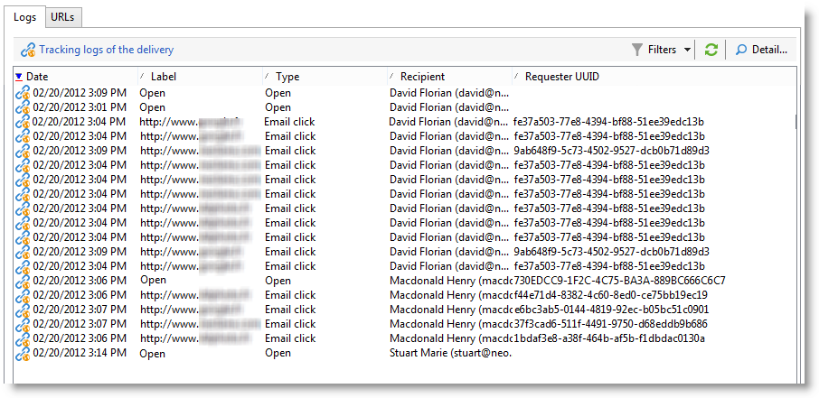

To get a clearer idea of how people and recipients are counted, we are going to analyze the logs of each profile.

## Step 1: John {#step-1--john}

**[!UICONTROL John Davis]** does not open the email (and therefore does not click any links).

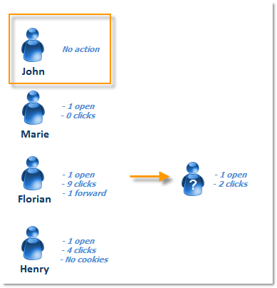

Since John neither opened nor clicked in the email, he doesn't appear in the logs.

**Intermediate calculation:**

|   | Recipients who clicked  | People who clicked  | Recipients who opened  |
|---|---|---|---|
|  John  | -  | -  | -  |
|  Intermediate total  | 0  | 0  | 0  |

## Step 2: Marie {#step-2--marie}

**[!UICONTROL Marie Stuart]** opens the email but does not click any links.

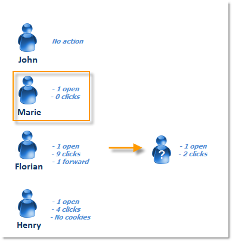

Marie's open is displayed in the following log:

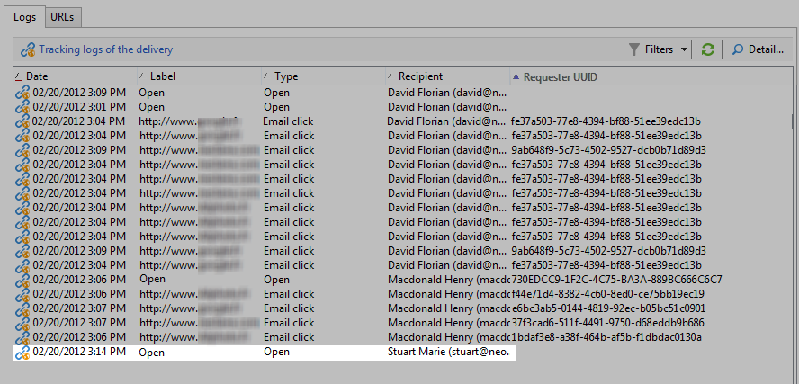

The open is assigned to a recipient: Marie. Adobe Campaign therefore adds a new recipient to the count.

**Intermediate calculation:**

|   | Recipients who clicked  | People who clicked  | Recipients who opened  |
|---|---|---|---|
|  John  | -  | -  | -  |
|  Marie  | -  | -  | +1  |
|  Intermediate total  | 0  | 0  | 1  |

## Step 3: Florian {#step-3--florian}

**[!UICONTROL Florian David]** opens the email and clicks the links 9 times. He also forwards the email to someone who opens it and clicks twice.

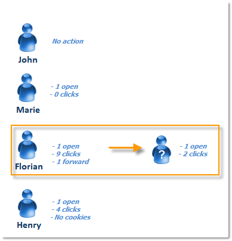

Florian's actions (one open and 9 clicks) appear in the following logs:

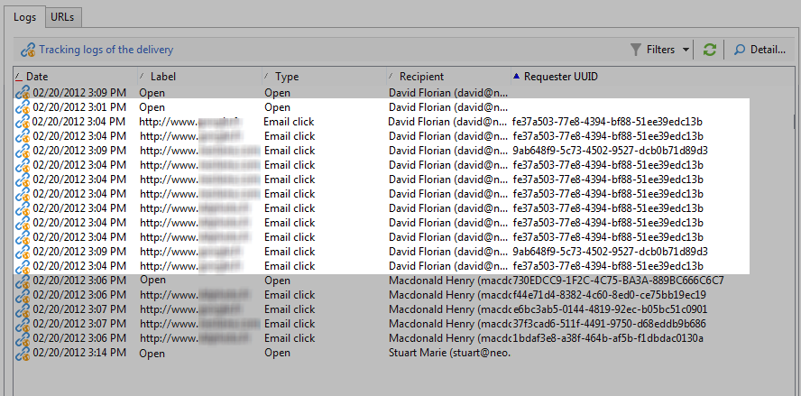

**Recipients**: the open and the clicks are assigned to the same recipient (Florian). Since this recipient is different from the previous one (Marie), Adobe Campaign adds a new recipient to the count.

People: Since this recipient's browser accepts cookies, we can see that the same identifier (UUID) is assigned to all click logs: **`fe37a503 [...]`**. Adobe Campaign correctly identifies these clicks as belonging to the same person. A new person is added to the count.

**Intermediate calculation:**

|   | Recipients who clicked  | People who clicked  | Recipients who opened  |
|---|---|---|---|
|  John  | -  | -  | -  |
|  Marie  | -  | -  | +1  |
|  Florian  | +1  | +1  | +1  |
|  Intermediate total  | 1  | 1  | 2  |

The following logs coincide with the open and two clicks carried out by the person whom Florian forwarded the email to:

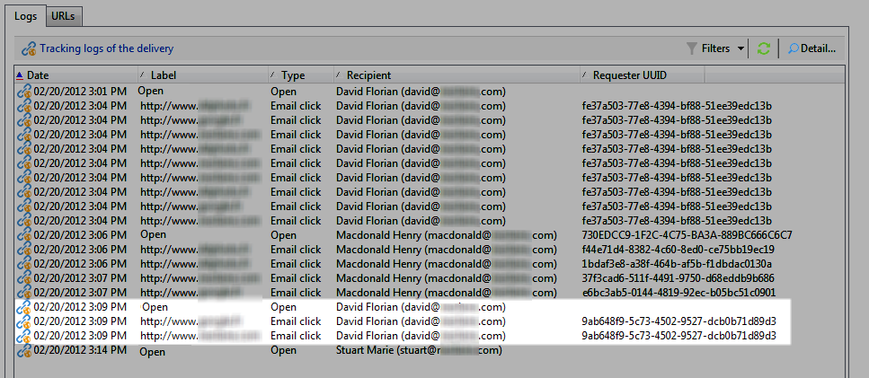

**Recipients**: its open and clicks are assigned to the recipient who forwarded the email (Florian). Since this recipient has already been counted, the recipient count remains the same. 

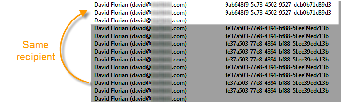

**People**: concerning clicks, we can see that the same identifier (UUID) is assigned to all logs: **`9ab648f9 [...]`**. This identifier hasn't been counted yet. A new person is therefore added to the count. 

**Intermediate calculation:**

|   | Recipients who clicked  | People who clicked  | Recipients who opened  |
|---|---|---|---|
|  John  | -  | -  | -  |
|  Marie  | -  | -  | +1  |
|  Florian  | +1  | +1  | +1  |
|  Unknown person  | -  | +1  | -  |
|  Intermediate total  | 1  | 2  | 2  |

## Step 4: Henry {#step-4--henry}

**[!UICONTROL Henry Macdonald]** has configured his internet browser to reject cookies. He opens the email and clicks the links 4 times.

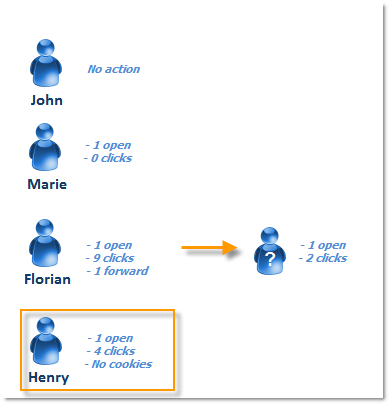

The open and 4 clicks carried out by Henry appear in the following logs:

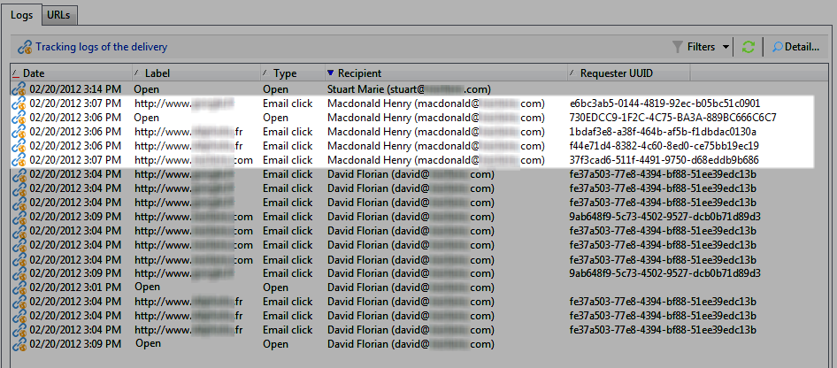

**Recipients**: the open and clicks are assigned to the same recipient (Henry). Since this recipient hasn't been counted yet, Adobe Campaign adds a recipient to the count.

**People**: Since Henry's browser does not accept cookies, a new identifier (UUID) is generated for each click. Each of the 4 clicks is interpreted as coming from a different person. Since these identifiers haven't been counted yet, they are added to the count.

**Intermediate calculation:**

|   | Recipients who clicked  | People who clicked  | Recipients who opened  |
|---|---|---|---|
|  John  | -  | -  | -  |
|  Marie  | -  | -  | +1  |
|  Florian  | +1  | +1  | +1  |
|  Unknown person  | -  | +1  | -  |
|  Henry  | +1  | +4  | +1  |
|  Intermediate total  | 2  | 6  | 3  |

## Summary {#summary}

At the delivery level, we have the following results:

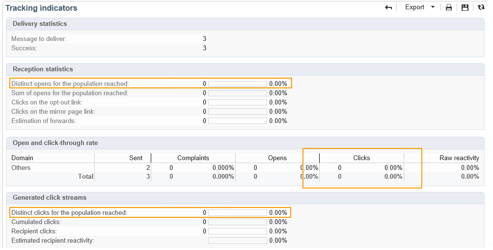

* **[!UICONTROL Clicks]** (recipients who clicked): 2
* **[!UICONTROL Distinct clicks for the population reached]** (people who clicked): 6
* **[!UICONTROL Distinct opens for the population reached]** (recipients who opened): 3

Raw reactivity and estimation of forwards are calculated as follows: 

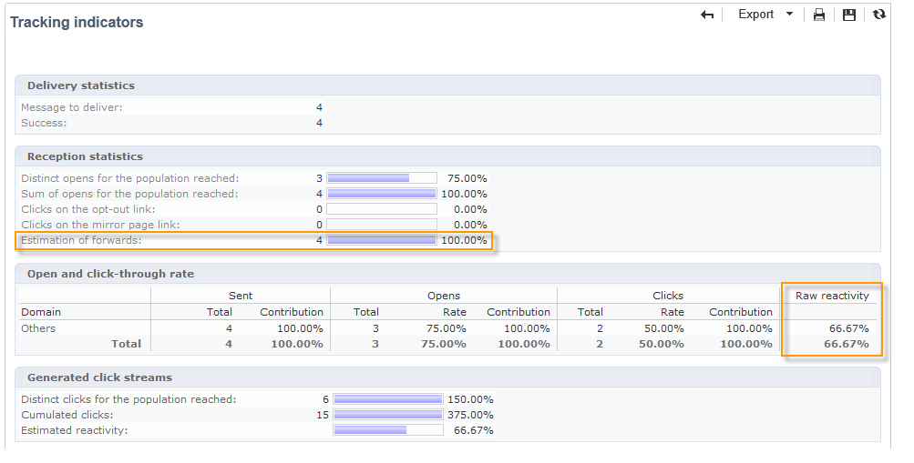

* **[!UICONTROL Estimation of forwards]** = **B - A** (thus 6 - 2 = 4)
* **[!UICONTROL Raw reactivity]** = **A / C** (thus 2 / 3 = 66,67%)

>[!NOTE]
>
>In the following formulas:  
>
>* A represents the **[!UICONTROL Clicks]** indicator (recipients who clicked).
>* B represents the **[!UICONTROL Distinct clicks for the population reached]** indicator (people who clicked).
>* C represents the **[!UICONTROL Distinct opens for the population reached]** indicator (recipients who opened).
