# Using an analysis report{#processing-a-report}

## Saving an analysis report {#saving-an-analysis-report}

If you have the appropriate rights, you can save an analysis report created from a template or export it in Excel, PDF, or OpenOffice format.

To save your report, click **[!UICONTROL Save]** and give your report a label.

Select **[!UICONTROL Also save data]** if you wish to create a history of your report and see the values of the report at the time of saving. For more on this, refer to [Archiving analysis reports](#archiving-analysis-reports).

The **[!UICONTROL Share this report]** option allows other operators to access the report.

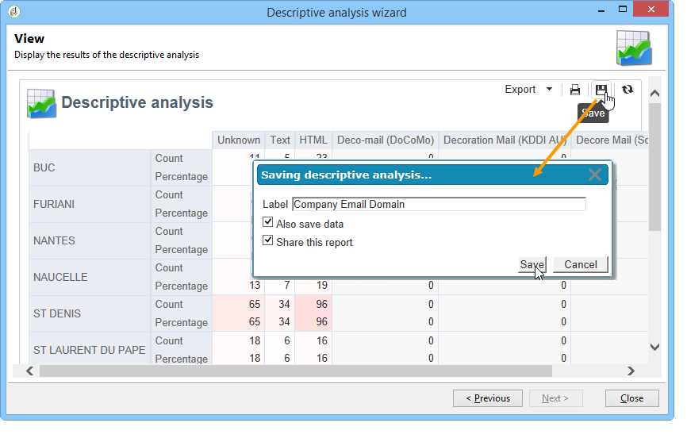

Once it has been saved, this report can be re-used to generate other analysis reports: 

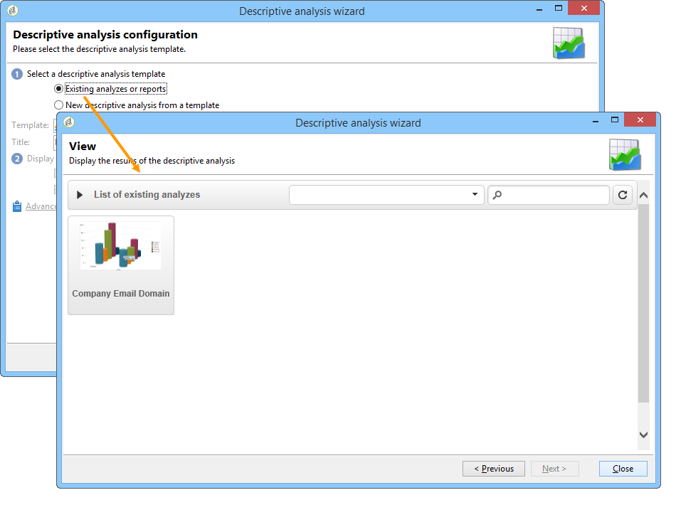

To make changes to this report, edit the **[!UICONTROL Administration > Configuration > Adobe Campaign tree reports]** node of the Adobe Campaign tree (or the first 'Reports' type folder for which the operator has editing rights). For more on this, refer to [Configuring the layout of a descriptive analysis report](#configuring-the-layout-of-a-descriptive-analysis-report).

## Analysis report additional settings {#analysis-report-additional-settings}

Once a descriptive analysis report has been saved, you can edit its properties and access additional options. 

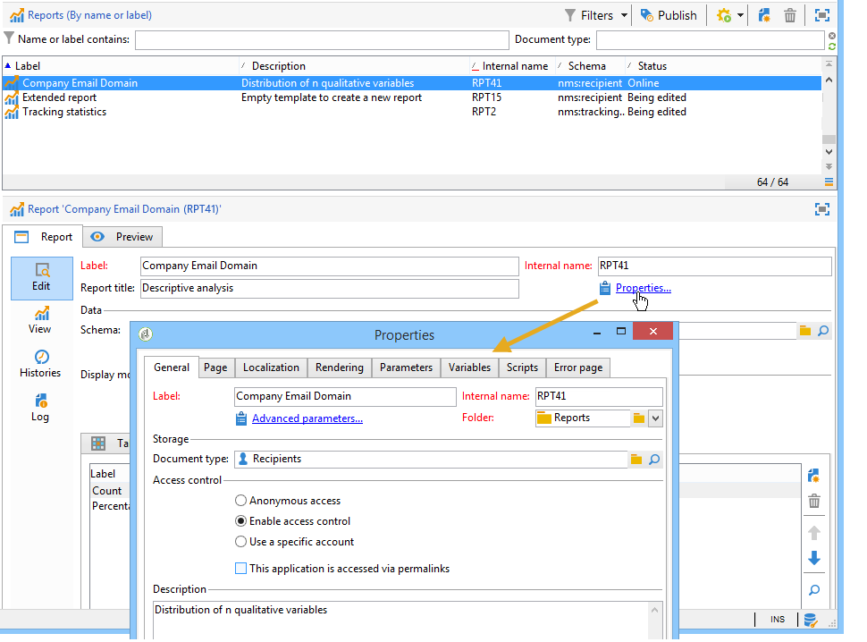

These options are the same as standard reports and are detailed in [this page](../../reporting/using/properties-of-the-report.md).

## Configuring the layout of a descriptive analysis report {#configuring-the-layout-of-a-descriptive-analysis-report}

You can personalize the display and layout of your data in the charts and tables of the descriptive analysis. All options are accessed via the Adobe Campaign tree, in the **[!UICONTROL Edit]** tab of each report.

### Analysis report display mode {#analysis-report-display-mode}

When you create a report using the **[!UICONTROL qualitative distribution]** template, table and chart display modes are selected by default. If you only want one display mode, un-check the appropriate box. This means that only the tab of the checked display mode will be available.

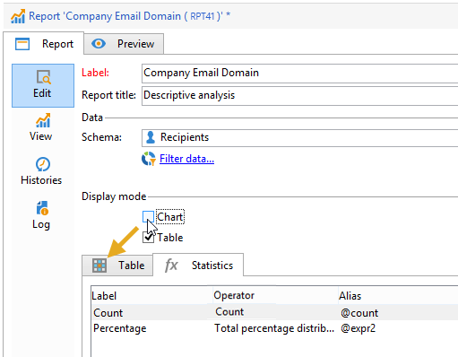

To change the schema of the report, click the **[!UICONTROL Select the link]** and select another table from the database.

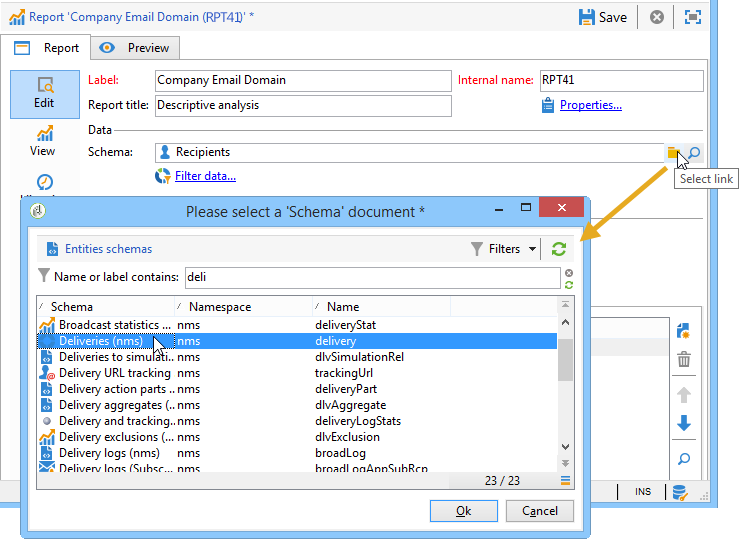

### Analysis report display settings {#analysis-report-display-settings}

It's possible to hide or show statistics and sub-totals as well as choose the orientation of your statistics.

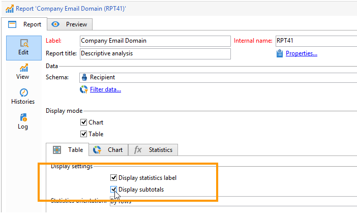

When you create statistics you can personalize their label. 

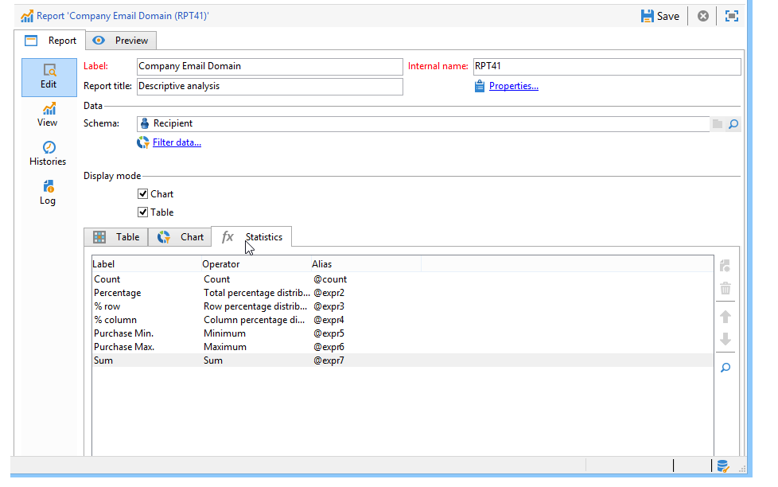

Their name will be displayed in the report.

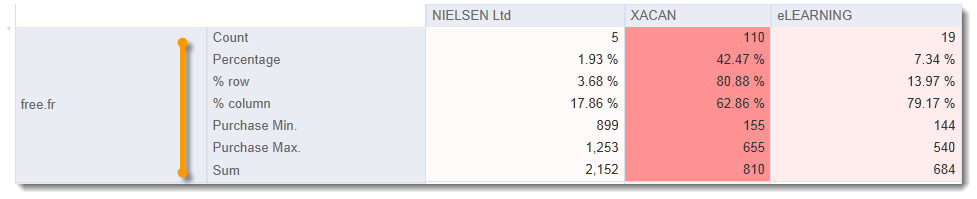

However, if you un-check the label and sub-total display option, they will not be visible in the report. The name will appear in a tooltip when you hover over a cell of the table.

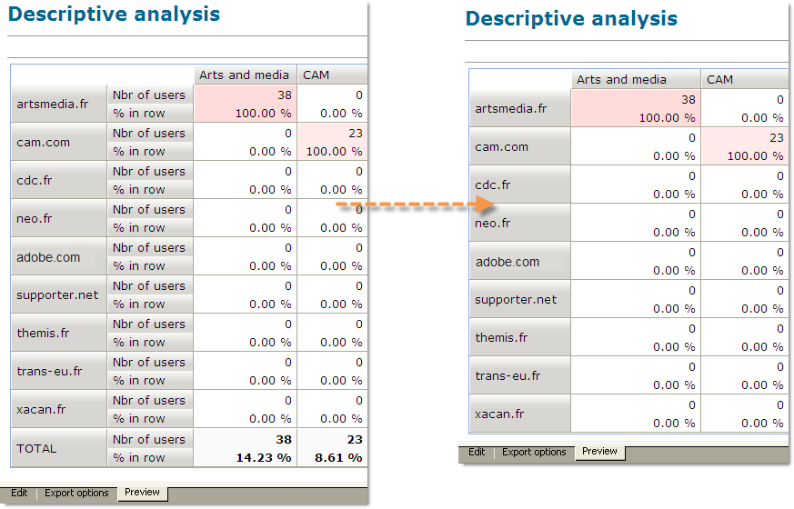

By default, the statistics are displayed online. To change the orientation, select the appropriate option from the drop-down list. 

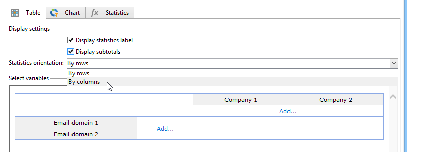

In the following example, the statistics are displayed in columns.

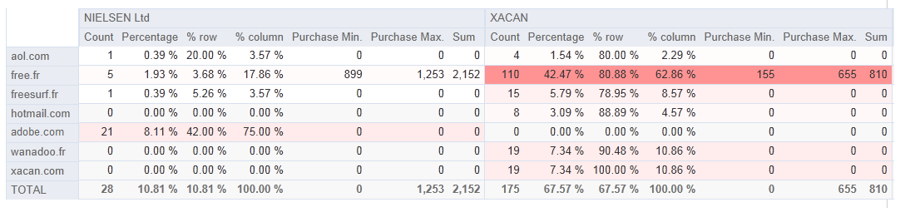

### Analysis report data layout {#analysis-report-data-layout}

You can personalize the data layout directly in the descriptive analysis tables. To do this, right-click the variable you want to work with. Select the available options from the drop-down menu:

* **[!UICONTROL Pivot]** to change the axis of the variable.
* **[!UICONTROL Up]** / **[!UICONTROL Down]** to swap the variables in lines.
* **[!UICONTROL Move to the right]** / **[!UICONTROL Move to the left]** to swap the variables in columns.
* **[!UICONTROL Turn]** to invert the variables axes.
* **[!UICONTROL Sort from A to Z]** to sort the variable values low to high.
* **[!UICONTROL Sort from Z to A]** to sort the variable values high to low.

  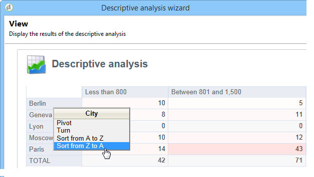

To return to the initial display, refresh the view.

### Analysis report chart options {#analysis-report-chart-options}

It's possible to personalize the display of data in the chart. To do this, click the **[!UICONTROL Variables...]** link available during the chart type selection stage.

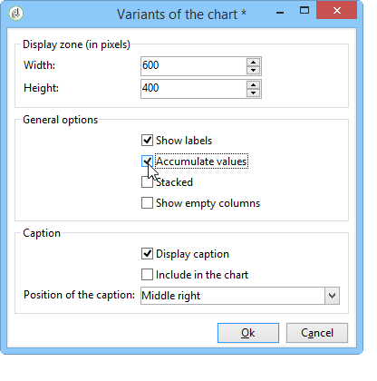

The following options are available:

* The upper section of the window lets you modify the chart display area.
* By default, labels are displayed in the chart. You can hide them by un-checking the **[!UICONTROL Show values]** option.
* The **[!UICONTROL Accumulate values]** option lets you add up values from one series to another. 
* You can decide whether or not to display the chart legend: to hide it, un-check the appropriate option. By default, the legend is displayed outside the chart in the top right-hand corner.

  The legend can also be displayed on top of the chart in order to save on display space. To do this, select the option **[!UICONTROL Include in the chart]**

  Select the vertical and horizontal alignment in the **[!UICONTROL Caption position]** drop-down list.

  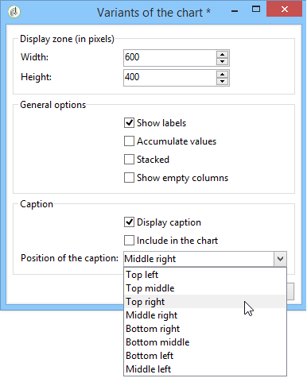

## Exporting an analysis report {#exporting-an-analysis-report}

To export data from an analysis report, click the drop-down list and select the desired output format.

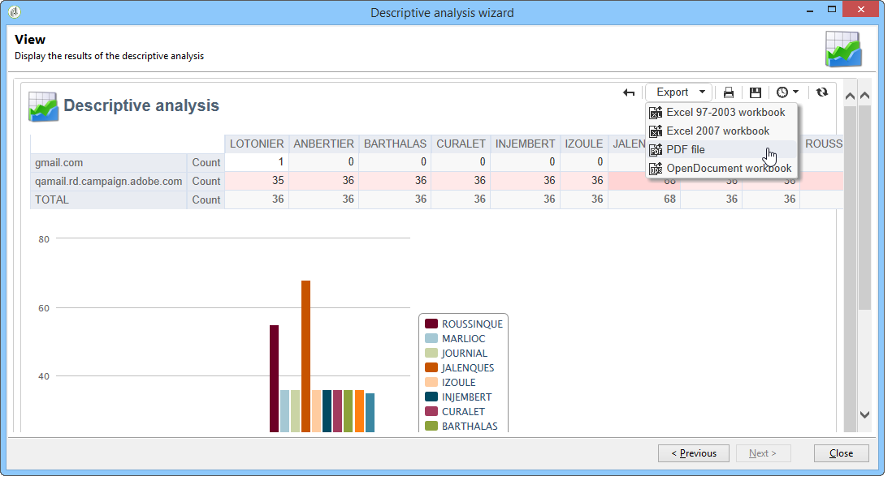

For more on this, refer to [this page](../../reporting/using/actions-on-reports.md).

## Re-using existing reports and analyses {#re-using-existing-reports-and-analyses}

You can create descriptive analysis reports on data using existing reports already stored in Adobe Campaign. This mode is possible when analyses have been saved or when reports have been created and configured to be accessed via the descriptive analysis wizard.

To find out how to save descriptive analyses, refer to [Saving an analysis report](#saving-an-analysis-report).

To create descriptive analysis reports, the descriptive analysis wizard must be executed via a workflow transition or via the **[!UICONTROL Tools > Descriptive analysis]** menu.

1. Select **[!UICONTROL Existing analyses and reports]** and click **[!UICONTROL Next]**.
1. This lets you access the list of available reports. Select the report you wish to generate.

   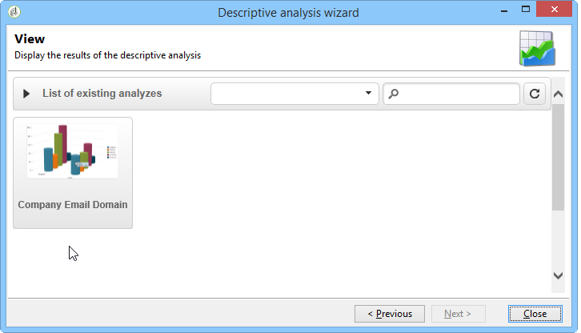

## Archiving analysis reports {#archiving-analysis-reports}

When you create a descriptive analysis based on an existing analysis, you can create archives to store data and compare report results.

To create a history, apply the following steps:

1. Open an existing analysis or create a new descriptive analysis wizard.
1. In the report display page, click the button to create a history in the tool bar, then confirm as shown below:

   

1. Use the archive access button to show previous analyses.

   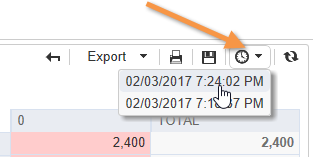
