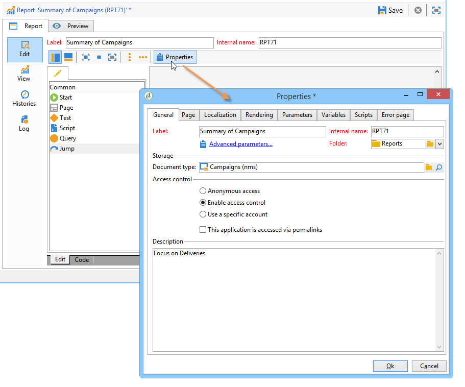
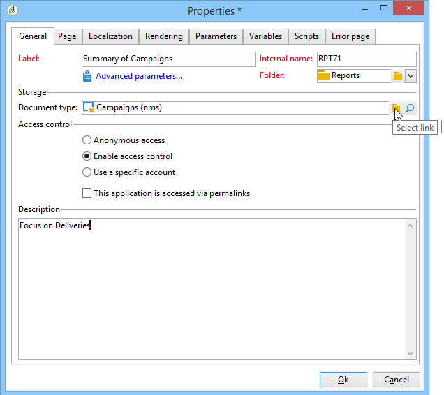
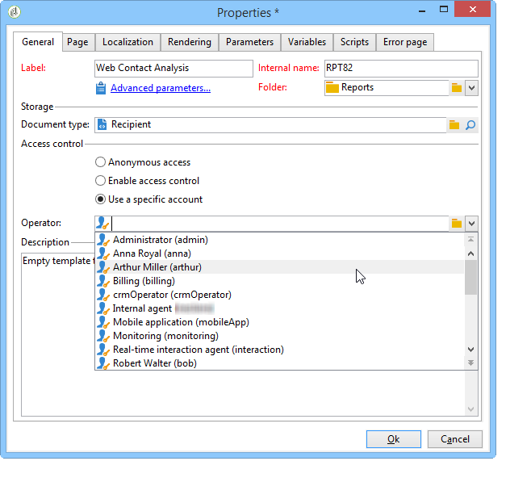
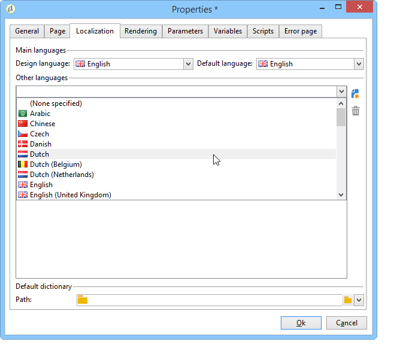
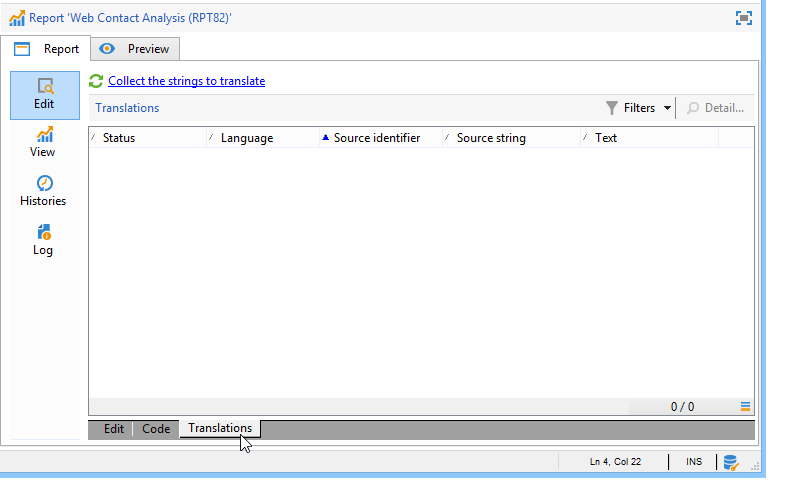
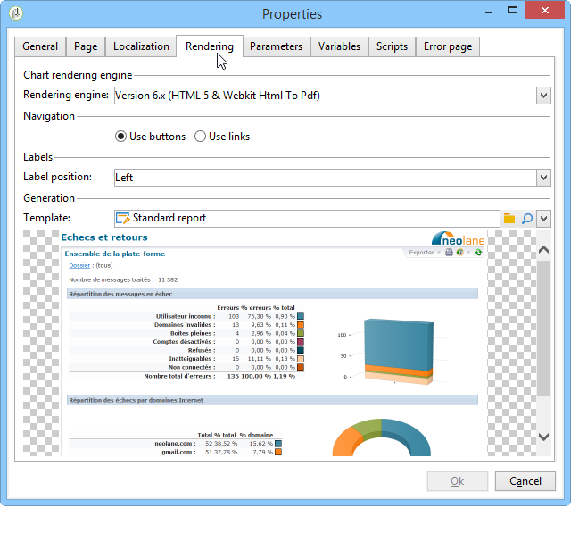
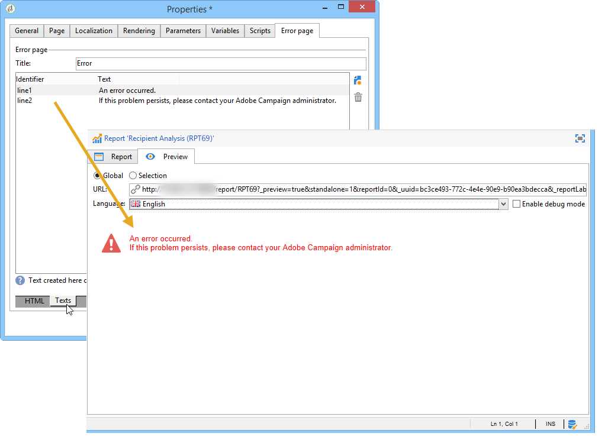

# Properties of the report{#properties-of-the-report}

You can fully personalize and configure your report to suit your needs. To do this, edit its properties. Report properties are accessed via the **[!UICONTROL Properties]** button above the activity sequence chart.

General properties are described below. Advanced capabilities configured in the **[!UICONTROL Parameters]**, **[!UICONTROL Variables]** and **[!UICONTROL Scripts]** tabs are described [in this section](../../reporting/using/advanced-functionalities.md).

## General properties {#overall-properties}

In the **[!UICONTROL General]** tab of the report properties, you can edit the settings listed below:

* The label and the internal name of the report. The **[!UICONTROL Internal name]** is used in the report final URL. It should not be changed after the report creation.

* The report **Folder** is selected during report creation. A best practice is to create a dedicated folder for custom reports so that they are not mixed with [built-in reports](../../reporting/using/about-campaign-built-in-reports.md).

* The **Storage** is selected when creating the report. To change the data table of the report, click the **[!UICONTROL Select link]** icon to the right of the **[!UICONTROL Document type]** field.

   

* The **Access control** parameters. These settings are described below.

## Controlling access to the report {#report-accessibility}

A report can be accessed in the Adobe Campaign console or with a web browser. In this case, it can be necessary to configure the report access control as shown below.

Possible options are:

* **[!UICONTROL Anonymous access]**: this option enables unrestricted access to the report. However, no manipulation is possible.

  Permissions of the 'webapp' technical operator are used to display report elements. Learn more [in this section](../../platform/using/access-management-operators.md).

* **[!UICONTROL Access control]**: this option enables Adobe Campaign operators to access it once they are logged on.
* **[!UICONTROL Specific account]**: this option lets you execute the report with the rights of the operator selected in the **[!UICONTROL Operator]** field.

## Managing report localization {#managing-report-localization}

You can configure the languages which you want the report to be translated into. To do this, click the **[!UICONTROL Localization]** tab.

The editing language is the language which you write in. When you add a language, the sub-tab appears in the report editing page.

>[!NOTE]
>
>For more on web page localization in Campaign, refer to [this section](../../web/using/translating-a-web-form.md).

## Personalizing HTML rendering {#personalizing-html-rendering}

In the **[!UICONTROL Rendering]** tab, you can personalize the data display mode for the page. You can select:

* The chart rendering engine: by default, the rendering engine is HTML 5.
* The navigation type in the report: via buttons or links.
* The default position of labels for report elements. This position can be overloaded for each element.
* The template or theme used for generating report pages.

## Personalizing the error page {#personalizing-the-error-page}

The **[!UICONTROL Error page]** tab lets you configure the message that will come up in case of an error in the report display.

You can define texts and link them to specific identifiers to manage report localization. For more on this, refer to [Adding a header and a footer](../../reporting/using/element-layout.md#adding-a-header-and-a-footer).

