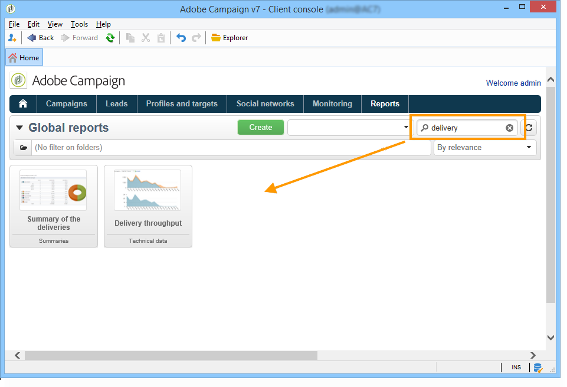

# About reports on deliveries{#reports-on-deliveries}

 

Adobe Campaign offers several types of reports, accessible via the customer console or an internet browser.

The following types of report are available:

* Reports on the entire platform, see [Global reports](../../reporting/using/global-reports.md).
* Delivery reports, see [Delivery reports](../../reporting/using/delivery-reports.md).
* Cumulated reports, see [Cumulative reports](../../reporting/using/cumulative-reports.md).

You can access reports from the client console home page, the reports dashboard or the delivery list. The display mode of a report depends on its context. The list of main reports is available on the home page and lets you access delivery data quickly. This list can be changed to suit your needs. Refer to [this section](../../reporting/using/about-reports-creation-in-campaign.md) for more information.

A search field is available via the report dashboard for quick access to one of the reports on the list.

When the report is generated, you can perform various actions using the icons on the toolbar to the right of the report window.

You can:

* Export the report to Excel, PDF or Open Document,
* Print the report,
* Create the report history,
* Display different report histories,
* Update the data in the report.

>[!NOTE]
>
>Some reports feature charts (curve, bar, funnel, etc.). Move your cursor over a chart to display its values.

For more information on these options, refer to [this section](../../reporting/using/about-adobe-campaign-reporting-tools.md).
