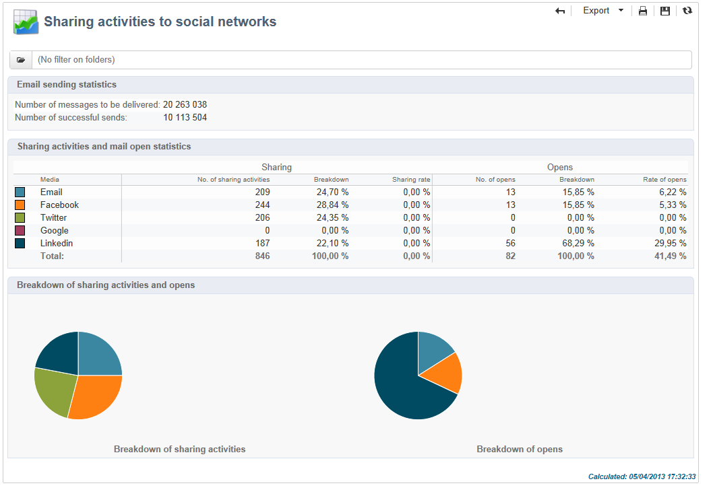

# Reports on deliveries{#reports-on-deliveries}

## Accessing existing reports {#accessing-existing-reports}

Adobe Campaign offers several types of reports, accessible via the customer console or an internet browser.

The following types of report are available:

* Reports on the entire platform, see [Global reports](../../reporting/using/reports-on-deliveries.md#global-reports).
* Delivery reports, see [Delivery reports](../../reporting/using/reports-on-deliveries.md#delivery-reports).
* Cumulated reports, see [Cumulative reports](../../reporting/using/reports-on-deliveries.md#cumulative-reports).

You can access reports from the client console home page, the reports dashboard or the delivery list. The display mode of a report depends on its context. The list of main reports is available on the home page and lets you access delivery data quickly. This list can be changed to suit your needs. Refer to [this section](../../reporting/using/about-reports-creation-in-campaign.md) for more information.

## Using reports {#using-reports}

A search field is available via the report dashboard for quick access to one of the reports on the list.

When the report is generated, you can perform various actions using the icons on the toolbar to the right of the report window.

You can:

* Export the report to Excel, PDF or Open Document,
* Print the report,
* Create the report history,
* Display different report histories,
* Update the data in the report.

>[!NOTE]
>
>Some reports feature charts (curve, bar, funnel, etc.). Move your cursor over a chart to display its values.

For more information on these options, refer to [this section](../../reporting/using/about-adobe-campaign-reporting-tools.md).

## Global reports {#global-reports}

These reports concern the activity of the data in the entire database. To view the reports dashboard, go to the **[!UICONTROL Reports]** tab. 

To display reports, click their names. The following reports are available by default:

>[!CAUTION]
>
>This section shows only the reports linked to deliveries.

* **[!UICONTROL Delivery throughput]** : refer to [Delivery throughput](../../reporting/using/reports-on-deliveries.md#delivery-throughput).
* **[!UICONTROL Browsers]** : refer to [Browsers](../../reporting/using/reports-on-deliveries.md#browsers).
* **[!UICONTROL Sharing to social networks]** : refer to [Sharing to social networks](../../reporting/using/reports-on-deliveries.md#sharing-to-social-networks).
* **[!UICONTROL Statistics on sharing activities]** : refer to [Statistics on sharing activities](../../reporting/using/reports-on-deliveries.md#statistics-on-sharing-activities).
* **[!UICONTROL Operating systems]** : refer to [Operating systems](../../reporting/using/reports-on-deliveries.md#operating-systems).
* **[!UICONTROL URLs and click streams]** : refer to [URLs and click streams](../../reporting/using/reports-on-deliveries.md#urls-and-click-streams).
* **[!UICONTROL Tracking indicators]** : refer to [Tracking indicators](../../reporting/using/reports-on-deliveries.md#tracking-indicators).
* **[!UICONTROL Non-deliverables and bounces]** : refer to [Non-deliverables and bounces](../../reporting/using/reports-on-deliveries.md#non-deliverables-and-bounces).
* **[!UICONTROL User activities]** : refer to [User activities](../../reporting/using/reports-on-deliveries.md#user-activities).
* **[!UICONTROL Subscription tracking]** : refer to [Subscription tracking](../../reporting/using/reports-on-deliveries.md#subscription-tracking).
* **[!UICONTROL Delivery summary]** : refer to [Delivery summary](../../reporting/using/reports-on-deliveries.md#delivery-summary).
* **[!UICONTROL Delivery statistics]** : refer to [Delivery statistics](../../reporting/using/reports-on-deliveries.md#delivery-statistics).
* **[!UICONTROL Breakdown of opens]** : refer to [Breakdown of opens](../../reporting/using/reports-on-deliveries.md#breakdown-of-opens).

### Delivery throughput {#delivery-throughput}

This report contains information on the delivery throughput of the entire platform for a given period. To measure the speed at which the messages are delivered, the criteria are the number of messages sent per hour and the size of the messages (in bits per second). In the example below, the first graph shows the successful deliveries in blue, and the number of erroneous deliveries in orange.

You can configure the values displayed by changing the timescale: 1-hour view, 3-hour view, 24-hour view, etc. Click **[!UICONTROL Refresh]** to confirm your selection.

### User activities {#user-activities}

This report shows the breakdown of opens, clicks and transactions per half-hour, hour or day, in the form of a chart.

The following options are available:

* **[!UICONTROL Opens]** : Total number of messages opened. Emails in text format are not taken into account. For more information on tracking opens, refer to [Tracking opens](../../reporting/using/reports-on-deliveries.md#tracking-opens-).
* **[!UICONTROL Clicks]** : Total number of clicks on links in deliveries. Clicks on unsubscription links and mirror pages are not taken into account.
* **[!UICONTROL Transactions]** : Total number of transactions after a message is received. In order for a transaction to be taken into account, a transaction type webtracking tag must be inserted into the matching web page. Webtracking configuration is presented in [this section](../../configuration/using/about-web-tracking.md).

### Non-deliverables and bounces {#non-deliverables-and-bounces}

This report shows the breakdown of non-deliverables as well as a breakdown of bounces per internet domain.

The **[!UICONTROL Number of messages processed]** represents the total number of messages processed by the delivery server. This value is lower than the number of messages to be delivered when some deliveries have been stopped or paused (before being processed by the server).

**[!UICONTROL Breakdown of errors by type]**

>[!NOTE]
>
>The errors shown in this report trigger the quarantine process. For more on quarantine management, refer to [Quarantine management](../../delivery/using/understanding-quarantine-management.md).

The first section of this report shows the breakdown of non-deliverables in the form of a table of values and a chart.

For each error type, we have:

* the number of error messages of this type,
* the percentage of messages with errors of this type compared to the total number of messages with errors,
* the percentage of error messages of this type compared to the total number of messages processed.

The following indicators are used:

* **[!UICONTROL User unknown]** : Error type generated during delivery to indicate that the email address is invalid.
* **[!UICONTROL Invalid domain]** : Error type generated when sending a delivery to indicate that the domain of the email address is wrong or does not exist.
* **[!UICONTROL Inbox full]** : Error type generated after five delivery attempts to indicate that the recipients' inbox contains too many messages.
* **[!UICONTROL Account disabled]** : Error type generated when sending a delivery to indicate that the address no longer exists.
* **[!UICONTROL Rejected]** : Error type generated when an address is rejected by the IAP (Internet Access Provider), for instance following the application of a security rule (anti-spam software). 
* **[!UICONTROL Unreachable]** : Error type which occurs in the message distribution string: incident on the SMTP relay, domain temporarily unreachable, etc 
* **[!UICONTROL Not connected]** : Error type to indicate that the recipients' mobile phone is switched off or disconnected from the network at the time of sending.

  >[!NOTE]
  >
  >This indicator only concerns deliveries on mobile channels. For more on this, refer to [this section](../../delivery/using/sms-channel.md).

  You can open up each line of the value table by clicking the [+] symbol. For each error type, you can show the breakdown of error messages by domain.

  

**[!UICONTROL Breakdown of errors per domain]**

The second section of this report shows the breakdown of errors per Internet domain in the form of a table of values and a chart.

For each domain name, we have:

* the number of messages with errors for this domain,
* the percentage of messages with errors for this domain compared to the total number of messages processed for this domain, 
* the percentage of error messages for this domain compared to the total number of error messages.

You can open up each line of the value table by clicking the [+] symbol. For each domain type, you can show the breakdown of error messages by error type.

>[!NOTE]
>
>The domain names displayed in this report are defined at cube level. To change theses values, edit the **[!UICONTROL Delivery logs (broadlogrcp)]** cube. For more on this, refer to [this section](../../reporting/using/about-cubes.md). The **[!UICONTROL Others]** category includes domain names that don't belong to a specific class.

### Browsers {#browsers}

This report shows the breakdown of internet browsers used by delivery recipients for the concerned period.

>[!NOTE]
>
>The values shown in this report are estimates: only recipients who have clicked in a delivery will be taken into account.

**Global statistics**

The global statistics on browser use are presented in the form of a table of values and a chart. 

The following indicators are used:

* **[!UICONTROL Visitors]** : Total number of recipients targeted (per internet browser) and having clicked on a delivery at least once.
* **[!UICONTROL Pages viewed]** : Total number of clicks on links in a delivery (per internet browser) for all deliveries.
* **[!UICONTROL Usage rate]** : This rate represents the breakdown of visitors (per internet browser) in relation to the total number of visitors.

**Statistics per browser**

In the table of global statistic values, you can click each browser name to view their usage statistics. 

Statistics are presented in the form of a curve, a chart and a table of values.

The **[!UICONTROL History]** curve represents the attendance rate of this browser per day. The rate is the ratio of the number of visitors per day (on this browser) compared to the number of visitors measured on the day with the highest attendance rate.

The **[!UICONTROL Breakdown per version]** chart represents the breakdown of visitors per version compared to the total number of visitors (on this browser).

The table of values uses the following indicators:

* **[!UICONTROL Global rate]** : This rate represents the breakdown of visitors per version compared to the total number of visitors (on all browsers).
* **[!UICONTROL Relative rate]** : This rate represents the breakdown of visitors per version compared to the total number of visitors (on this browser).

### Sharing to social networks {#sharing-to-social-networks}

Viral marketing lets delivery recipients share information with their contact network: they can add a link to their profile (Facebook, Twitter, etc.) or send a message to a friend. Each share and each access to shared information is tracked within the delivery. For more information on viral marketing, refer to [this section](../../delivery/using/viral-and-social-marketing.md).

This report shows the breakdown of shared and opened messages per social network (Facebook, Twitter, etc.) and/or per email.

**[!UICONTROL Email delivery statistics]**

In the email delivery statistics, two values are displayed:

* **[!UICONTROL Number of messages to be delivered]** : Total number of messages processed during delivery analysis.
* **[!UICONTROL Number of successful deliveries]** : Number of messages processed successfully.

**[!UICONTROL Sharing activities and mail open statistics]**

The central table shows the statistics on email shares and opens.

In the **[!UICONTROL Shares]** column, we have the following indicators:

* **[!UICONTROL No. of sharing activities]** : Total number of messages shared on each social network. This value equals the total number of clicks on the icon of the matching **[!UICONTROL Links for sharing to social networks]** personalization block.
* **[!UICONTROL Breakdown]** : This rate represents the breakdown of shares per social network, in relation to the total number of shares.
* **[!UICONTROL Sharing rate]** : This rate represents the breakdown of shares per social network, in relation to the number of messages to be delivered.

In the **[!UICONTROL Opens]** column, we have the following indicators:

* **[!UICONTROL No. of opens]** : Total number of messages opened by people whom the message was forwarded to (via the **[!UICONTROL Links for sharing to social networks]** personalization block). This value equals the number of times the mirror page was displayed. Opens by delivery recipients are not taken into account.
* **[!UICONTROL Breakdown]** : This rate represents the breakdown of opens per social network, in relation to the total number of opens.
* **[!UICONTROL Rate of opens]** : This rate represents the breakdown of opens per social network, in relation to the total number of shares.

**[!UICONTROL Breakdown of sharing activities and opens]**

This section includes two charts which represent the breakdown of sharing activities and opens per social network.

### Statistics on sharing activities {#statistics-on-sharing-activities}

This report shows the evolution of shares to social networks (Facebook, Twitter, email, etc.) in time.

For more information on viral marketing, refer to [this section](../../delivery/using/viral-and-social-marketing.md).

Statistics are presented in the form of a table of values and a chart.

The following indicators are used:

* **[!UICONTROL New contacts]** : Number of new subscriptions following the reception of a message shared via email. This value matches the number of people who received a message shared via email, clicked the **[!UICONTROL Subscription link]** and filled in the subscription form. 
* **[!UICONTROL Opens]** : Total number of messages opened by people whom the message was transferred to (via the **[!UICONTROL Link for sharing to social networks]** personalization block). This value equals the number of times the mirror page was displayed. Opens by delivery recipients are not taken into account.
* **[!UICONTROL Sharing activities]** : Total number of messages shared via social networks. This value matches the total number of clicks on the icon of the **[!UICONTROL Links for sharing to social networks]** personalization block.

### Operating systems {#operating-systems}

This report shows the breakdown of operating systems used by delivery recipients for the concerned period.

>[!NOTE]
>
>The values shown in this report are estimates: only recipients who have clicked in a delivery will be taken into account.

**Global statistics**

The global usage statistics of operating systems are presented in the form of a table of values and a chart. 

The following indicators are used:

* **[!UICONTROL Visitors]** : Daily average of the total number of targeted recipients (per operating system) who clicked in a delivery at least once.
* **[!UICONTROL Pages viewed]** : Daily average of the total number of clicks on delivery links (per operating system) for all deliveries.
* **[!UICONTROL Rate of use]** : This rate represents the breakdown of visitors (per operating system) in relation to the total number of visitors.

**Statistics per operating system**

In the table of global statistics values, click the name of each operating system to view the statistics per operating system. 

Statistics are presented in the form of a curve, a chart and a table of values.

The **[!UICONTROL History]** curve represents the rate of use of this operating system per day. This rate is the ratio of the number of visitors per day (on this operating systems) in relation to the number of visitors measured on the day with the highest attendance.

The **[!UICONTROL Breakdown by version]** chart represents the breakdown of visitors per version in relation to the total number of visitors on this operating system.

The table of values uses the following indicators:

* **[!UICONTROL Global rate]** : This rate represents the breakdown of visitors (per version) in relation to the total number of visitors throughout the operating systems.
* **[!UICONTROL Relative rate]** : This rate represents the breakdown of visitors (per version) in relation to the total number of visitors for this operating system.

### Subscription tracking {#subscription-tracking}

This report lets you monitor subscriptions to information services. It shows subscriptions and unsubscriptions.

It can be displayed for a subscription by clicking the **[!UICONTROL Profiles and targets > Services and subscriptions]** node of the home page or the explorer. Select the desired subscription, and then click the **[!UICONTROL Reports]** tab. The **[!UICONTROL Subscriptions tracking]** report is available by default. It lets you see the subscription and unsubscription trends and the loyalty rate over a period. You can configure the representation of this data via the drop-down list. Click **[!UICONTROL Refresh]** to validate the selected configuration.

For further information, refer to [this page](../../delivery/using/managing-subscriptions.md).

The **[!UICONTROL Number subscribed to date]** represents the total number of people currently subscribed.

**[!UICONTROL Overall evolution of subscriptions]**

The table of values uses the following indicators:

* **[!UICONTROL Subscribers]** : Total number of subscribers for the concerned period.
* **[!UICONTROL Subscriptions]** : Number of subscriptions for the concerned period.
* **[!UICONTROL Unsubscriptions]** : Number of unsubscriptions for the concerned period.
* **[!UICONTROL Evolution]** : Number of unsubscriptions minus the number of subscriptions. The rate is calculated based on the total number of subscribers.
* **[!UICONTROL Loyalty]** : Loyalty rate of subscribers for the concerned period.

**[!UICONTROL Subscription evolution curves]**

This chart shows the evolution of subscriptions and unsubscriptions for the concerned period.

### Delivery statistics {#delivery-statistics}

This report shows the breakdown by internet domain, of all messages processed and sent, of hard and soft bounces, opens, clicks and unsubscriptions.

The following indicators are used:

* **[!UICONTROL Emails processed]** : Total number of messages processed by the delivery server.
* **[!UICONTROL Delivered]** : percentage of the number of messages successfully processed compared to the total number of messages processed.
* **[!UICONTROL Hard bounces]** : percentage of the number of "hard" bounces compared to the total number of messages processed.
* **[!UICONTROL Soft bounces]** : percentage of the number of "soft" bounces compared to the total number of messages processed.

  >[!NOTE]
  >
  >For more on hard and soft bounces, refer to [Quarantine management](../../delivery/using/understanding-quarantine-management.md).

* **[!UICONTROL Opens]** : percentage of the number of targeted recipients who opened a message at least once compared to the number of messages processed successfully.
* **[!UICONTROL Clicks]** : percentage of the number of people who clicked in a delivery at least once compared to the number of messages processed successfully. 
* **[!UICONTROL Unsubscription]** : percentage of the number of clicks on an unsubscription link compared to the number of messages processed successfully.

### Breakdown of opens {#breakdown-of-opens}

This report shows the breakdown of opens by operating system, device and browser for the period concerned. For each category, two charts are used. The first displays statistics regarding opens on a computer and mobile devices. The second displays statistics relating only to opens on mobile devices.

The number of opens corresponds to the total number of messages opened. Text format emails are not counted. For more information on Tracking opens, refer to the [Tracking opens](../../reporting/using/reports-on-deliveries.md#tracking-opens-) section.

>[!NOTE]
>
>Browser and operating system names make up part of the information sent by the browser's user agent to which the nail has been opened. Adobe Campaign deduces the type of device using its the device information.

## Delivery reports {#delivery-reports}

You can track the execution of deliveries via various reports accessible from the delivery overview. To display reports, apply the following procedure:

1. Go to the **[!UICONTROL Campaigns]** universe and click the **[!UICONTROL Delivery]** link to display the list of deliveries.
1. Click the name of the delivery you want to display to show its details. 

   

1. Select the **[!UICONTROL Summary]** tab and click the **[!UICONTROL Reports]** link to access the reports specific to the delivery.

   

   By default, the following reports are available:

    * **[!UICONTROL Delivery throughput]** : refer to [Delivery throughput](../../reporting/using/reports-on-deliveries.md#delivery-throughput).
    * **[!UICONTROL Sharing to social networks]** : refer to [Sharing to social networks](../../reporting/using/reports-on-deliveries.md#sharing-to-social-networks).
    * **[!UICONTROL Statistics on sharing activities]** : refer to [Statistics on sharing activities](../../reporting/using/reports-on-deliveries.md#statistics-on-sharing-activities).
    * **[!UICONTROL Hot clicks]** : refer to [Hot clicks](../../reporting/using/reports-on-deliveries.md#hot-clicks).
    * **[!UICONTROL Tracking statistics]** : refer to [Tracking statistics](../../reporting/using/reports-on-deliveries.md#tracking-statistics)
    * **[!UICONTROL URLs and click streams]** : refer to [URLs and click streams](../../reporting/using/reports-on-deliveries.md#urls-and-click-streams).
    * **[!UICONTROL Tracking indicators]** : refer to [Tracking indicators](../../reporting/using/reports-on-deliveries.md#tracking-indicators).
    * **[!UICONTROL Non-deliverables and bounces]** : refer to [Non-deliverables and bounces](../../reporting/using/reports-on-deliveries.md#non-deliverables-and-bounces).
    * **[!UICONTROL User activities]** : refer to [User activities](../../reporting/using/reports-on-deliveries.md#user-activities).
    * **[!UICONTROL Delivery summary]** : refer to [Delivery summary](../../reporting/using/reports-on-deliveries.md#delivery-summary).
    * **[!UICONTROL Subscription tracking]** : refer to [Subscription tracking](../../reporting/using/reports-on-deliveries.md#subscription-tracking).
    * **[!UICONTROL Delivery statistics]** : refer to [Delivery statistics](../../reporting/using/reports-on-deliveries.md#delivery-statistics).
    * **[!UICONTROL Breakdown of opens]** : refer to [Breakdown of opens](../../reporting/using/reports-on-deliveries.md#breakdown-of-opens).

### Tracking indicators {#tracking-indicators}

This report combines the key indicators for tracking the behavior of recipients upon receiving the delivery. It gives access to delivery and reception statistics, open and click-through rates, generated click streams, web tracking as well as sharing activities to social networks.

>[!NOTE]
>
>Values calculated based on message opens are always estimates, due to the margin of error linked to emails in text format. The **[!UICONTROL Distinct opens/Sum of opens for the population reached]** indicators take this margin of error into account. For more information on tracking opens, refer to [Tracking opens](../../reporting/using/reports-on-deliveries.md#tracking-opens-).

**[!UICONTROL 1. Delivery statistics]**

* **[!UICONTROL Messages to deliver]** : Total number of messages to be delivered after delivery analysis.
* **[!UICONTROL Success]** : Number of messages successfully processed.

**[!UICONTROL 2. Reception statistics]**

>[!NOTE]
>
>The related percentages are calculated based on the number of messages forwarded successfully.

* **[!UICONTROL Distinct opens for the population reached]** : Estimation of the number of targeted recipients having opened a message at least once. Clicks on unsubscription links and mirror pages are taken into account. 
* **[!UICONTROL Sum of opens for the population reached]** : Estimation of the total number of opens by targeted recipients. 
* **[!UICONTROL Clicks on opt-out link]** : Number of clicks on the unsubscription link.
* **[!UICONTROL Clicks on the mirror page link]** : Number of clicks on the link to the mirror page. In order to be taken into account, the link must be defined as such in the delivery wizard (tracked URLs). Refer to this [page](../../delivery/using/monitoring-a-delivery.md). 
* **[!UICONTROL Estimation of forwards]** : Estimation of the number of emails forwarded by the targeted recipients. This value is calculated by subtracting the number of distinct people and the number of distinct recipients who clicked in the email.

  >[!NOTE]
  >
  >For more information on the difference between distinct people and targeted recipients, refer to [Targeted persons / recipients](../../reporting/using/reports-on-deliveries.md#targeted-persons---recipients).

**[!UICONTROL 3. Open and click-through rate]**

This table of values shows the breakdown of deliveries, opens, clicks and raw reactivity per Internet domain. The following indicators are used:

* **[!UICONTROL Sent]** : Total number of messages sent on this domain. 
* **[!UICONTROL Complaints]** : Number of messages for this domain that have been reported as undesirable by the recipient. The rate is calculated based on the total number of messages sent on this domain.
* **[!UICONTROL Opens]** : Number of distinct targeted recipients for this domain who have opened a message at least once. The rate is calculated based on the total number of messages sent on this domain.
* **[!UICONTROL Clicks]** : Number of distinct targeted recipients who clicked in the same delivery at least once. The rate is calculated based on the total number of messages sent on this domain 
* **[!UICONTROL Raw reactivity]** : Percentage of the number of recipient who clicked in a delivery at least once compared to the number of recipients who opened a delivery at least once.

>[!NOTE]
>
>The domain names displayed in this report are defined in the itemized list used at cube level. To change, add or remove default domains, edit the **[!UICONTROL Domains]** itemized list and modify values and aliases. For more on this, refer to [this section](../../platform/using/managing-enumerations.md). The **[!UICONTROL Others]** category includes domain names that don't belong to any value of the itemized list.

**[!UICONTROL 4. Generated click streams]**

>[!NOTE]
>
>The related percentages are calculated based on the number of messages forwarded successfully.

* **[!UICONTROL Distinct clicks for the population reached]** : Number of distinct people having clicked in a delivery at least once. 
* **[!UICONTROL Cumulated clicks]** : Total number of clicks by targeted recipients, excluding unsubscription links and mirror pages.
* **[!UICONTROL Recipient clicks]** : Number of distinct targeted recipients who clicked in the same delivery at least once.
* **[!UICONTROL Estimated recipient reactivity]** : Ratio of the number of recipients having clicked at least once in a delivery compared to the estimated number of recipients having opened a delivery at least once. Clicks on the opt-out and mirror page links are not taken into account.

**[!UICONTROL 5. Web tracking]**

* **[!UICONTROL Visited pages]** : Number of web pages visited following message reception.
* **[!UICONTROL Transactions]** : Number of purchases following message reception.
* **[!UICONTROL Total amount]** : Total amount of purchases following message reception. 
* **[!UICONTROL Average transaction amount]** : Average purchase made by distinct delivery recipients. 
* **[!UICONTROL Articles]** : Number of articles purchased by the delivery recipients. 
* **[!UICONTROL Average count of articles per transaction]** : Average number of items per purchase made by distinct recipients.
* **[!UICONTROL Average amount per message]** : Average amount of purchases generated per message.

  >[!NOTE]
  >
  >In order for a visited page, transaction, amount or article to be taken into account, a webtracking tag must be inserted into the matching web page. Webtracking configuration is presented in [this section](../../configuration/using/about-web-tracking.md).

**[!UICONTROL 6. Sharing activities to email and social networks]**

This section shows the number of messages shared on each social network. For more on this, refer to [Sharing to social networks](../../reporting/using/reports-on-deliveries.md#sharing-to-social-networks).

### URLs and click streams {#urls-and-click-streams}

This report shows the list of pages visited following a delivery. 

You can configure the contents of this report by selecting: the score chart to be displayed, the time filter (since the action launch, over the first 6 hours following launch, etc.) and the data display mode (by label, by URL, by category - for more on this, refer to [this page](../../delivery/using/monitoring-a-delivery.md)). Click **[!UICONTROL Refresh]** to confirm your selection.

The following rates are displayed in the upper section of the report:

* **[!UICONTROL Reactivity]** : Ratio of the number of targeted recipients having clicked in a delivery, in relation to the estimated number of targeted recipients having opened a delivery. Clicks on the opt-out link and on the mirror page are not taken into account.

  >[!NOTE]
  >
  >For more information on tracking opens, refer to [Tracking opens](../../reporting/using/reports-on-deliveries.md#tracking-opens-).

* **[!UICONTROL Distinct clicks]** : Number of distinct people having clicked at least once (excluding unsubscription link and mirror page) in a delivery. The rate displayed is calculated based on the number of messages delivered successfully. 
* **[!UICONTROL Cumulated clicks]** : Total number of clicks by targeted recipients (excluding unsubscription link and mirror page). The rate displayed is calculated based on the number of messages forwarded successfully.

**[!UICONTROL Platform average]** : This average rate, displayed under each rate (reactivity, distinct clicks, and cumulated clicks), is calculated for deliveries sent over the previous six months. Only deliveries with the same typology and on the same channel are taken into account. Proofs are excluded.

The central table provides the following information:

* **[!UICONTROL Clicks]** : Number of cumulated clicks, per link. 
* **[!UICONTROL Clicks (in %)]** : Breakdown of the number of clicks per link, in relation to the total number of cumulated clicks.

**[!UICONTROL Breakdown of clicks in time]**

This chart shows the breakdown of cumulated clicks per day.

### Delivery summary {#delivery-summary}

This report provides all the main information on the delivery. 

**[!UICONTROL Target population]**

This section has two indicators:

* **[!UICONTROL Initial population]** : Total number of recipients targeted by the delivery. 
* **[!UICONTROL Messages rejected by the rule]** : Number of addresses ignored during the analysis when applying typology rules: address missing, quarantined, blacklisted, etc. For more information on typology rules, refer to this [page](../../delivery/using/steps-validating-the-delivery.md#validation-process-with-typologies).

**[!UICONTROL Causes of exclusion]**

The middle chart shows the breakdown per rule of messages rejected during the analysis.

**[!UICONTROL Delivery statistics]**

This section includes the following indicators:

* **[!UICONTROL Messages to be delivered]** : Total number of messages to be delivered after delivery analysis. 
* **[!UICONTROL Success]** : Number of messages processed successfully. The associated rate is the ratio with the number of messages to be delivered.
* **[!UICONTROL Errors]** : Total number of errors cumulated during deliveries and automatic rebound processing. The associated rate is the ratio with the number of messages to be delivered. 
* **[!UICONTROL New quarantines]** : Number of addresses quarantined following a failed delivery (user unknown, invalid domain). The associated rate is the ratio with the number of messages to be delivered.

### Hot clicks {#hot-clicks}

This report shows the message content (HTML and/or text) with, on each link, the percentage of clicks on links. Personalization blocks unsubscription links, mirror page links and offer links are taken into account in the total cumulated clicks but are not displayed in the report.

>[!NOTE]
>
>If your delivery contains offers (Interaction), a box appears in the part above the report displaying the percentage of clicks on the offers.

### Tracking statistics {#tracking-statistics}

This report provides statistics on opens, clicks and transactions.

It lets you track the marketing impact of the delivery. You can configure how values are displayed by changing the timescale (1-hour, 3-hour, or 24-hour view, etc.). Click **[!UICONTROL Refresh]** to confirm your selection.

This report provides a table of values and a Pareto chart which display the time required for the delivery to reach maximum efficiency. The following indicators are used:

* **[!UICONTROL Opens]** : Estimate of the time needed to reach a percentage of the total number of messages opened. Emails in text format aren't taken into account. For more information on tracking opens, refer to [Tracking opens](../../reporting/using/reports-on-deliveries.md#tracking-opens-).
* **[!UICONTROL Clicks]** : Estimate of the time required to reach a percentage of the total number of clicks recorded. Clicks on the opt-out link and the mirror page are not taken into account.
* **[!UICONTROL Transactions]** : Time required to achieve a percentage of the total number of transactions following message reception. In order for a transaction to be taken into account, a transaction type webtracking tag must be inserted into the matching web page. Webtracking configuration is presented in [this section](../../configuration/using/about-web-tracking.md).

## Cumulative reports {#cumulative-reports}

You can display cumulated reports on deliveries. To do this, select the deliveries to be compared to obtain the list of reports for these deliveries.

To select non-adjacent deliveries from the list, hold down the CTRL key while making your selection.

To select deliveries saved in a different folder click **[!UICONTROL Display sub-levels]** (accessible via the toolbar). They will then be displayed in the same list.

## Indicator calculation {#indicator-calculation}

### User activities {#user-activities-1}

<table> 
 <thead> 
  <tr> 
   <th> <strong>Label</strong>   </th> 
   <th> <strong>Field name</strong>   </th> 
   <th> <strong>Indicator description</strong>   </th> 
   <th> <strong>Indicator calculation formula</strong>   </th> 
  </tr> 
 </thead> 
 <tbody> 
  <tr> 
   <td> Opens  </td> 
   <td> @opens  </td> 
   <td> Sum of all @totalClicks with a URL primary key equal to 1.  </td> 
   <td> sum(Iif([@url-id]=1, @totalClicks, 0))  </td> 
  </tr> 
  <tr> 
   <td> Clicks  </td> 
   <td> @clicks  </td> 
   <td> Sum of all @totalClicks with a URL type equal to "Email click".  </td> 
   <td> sum(Iif([url/@type]=1, @totalClicks, 0))  </td> 
  </tr> 
  <tr> 
   <td> Transactions  </td> 
   <td> @transactions  </td> 
   <td> Sum of all @totalClicks with a URL type equal to "Transaction".  </td> 
   <td> sum(Iif([url/@type]=5, @totalClicks, 0))  </td> 
  </tr> 
 </tbody> 
</table>

This report is based on the **[!UICONTROL Consolidated tracking]** table (nms:trackingStats). This aggregate table is used for performance reasons when displaying reports, in the place of the **[!UICONTROL Recipient tracking logs]** table (nms:trackingLogRcp) and it is not calculated in real-time. The table is generated a few minutes after the tracking logs are retrieved. If the indicators are up-to-date, the results will be the same as for the indicators of the **Tracking indicators** report. The @totalclicks indicator expresses the total number of clicks over a 5-minute period.

### Non-deliverables and bounces {#non-deliverables-and-bounces-1}

**Breakdown by error type**

This report is based on the **[!UICONTROL Delivery and tracking statistics]** table (nms:deliveryLogStats).

<table> 
 <thead> 
  <tr> 
   <th> <strong>Label</strong>   </th> 
   <th> <strong>Field name</strong>   </th> 
   <th> <strong>Indicator description</strong>   </th> 
   <th> <strong>Indicator calculation formula</strong>   </th> 
  </tr> 
 </thead> 
 <tbody> 
  <tr> 
   <td> Total number of processed messages  </td> 
   <td> @totalProcessed  </td> 
   <td> Sum of messages with a status equal to "Ready", "Sent" or "Failed".  </td> 
   <td> @prepared + @error + @success  </td> 
  </tr> 
  <tr> 
   <td> User unknown  </td> 
   <td> @unknownUser  </td> 
   <td> Count of all messages with a status equal to "Failed" and a reason equal to "User unknown".   </td> 
   <td> Count(@status=2 and msg/@failureReason=1)  </td> 
  </tr> 
  <tr> 
   <td> Unreachable   </td> 
   <td> @unreachable  </td> 
   <td> Count of all messages with a status equal to "Failed" and a reason equal to "Unreachable".   </td> 
   <td> Count(@status=2 and msg/@failureReason=3)  </td> 
  </tr> 
  <tr> 
   <td> Rejected  </td> 
   <td> @refused  </td> 
   <td> Count of all messages with a status equal to "Failed" and a reason equal to "Rejected".   </td> 
   <td> Count(@status=2 and msg/@failureReason=20)  </td> 
  </tr> 
  <tr> 
   <td> Invalid domain  </td> 
   <td> @invalidDomain  </td> 
   <td> Count of all messages with a status equal to "Failed" and a reason equal to "Invalid domain".   </td> 
   <td> Count(@status=2 and msg/@failureReason=2)  </td> 
  </tr> 
  <tr> 
   <td> Account disabled  </td> 
   <td> @disabled  </td> 
   <td> Count of all messages with a status equal to "Failed" and a reason equal to "Account disabled".  </td> 
   <td> Count(@status=2 and msg/@failureReason=4)  </td> 
  </tr> 
  <tr> 
   <td> Inbox full  </td> 
   <td> @mailBoxFull  </td> 
   <td> Count of all messages with a status equal to "Failed" and a reason equal to "Inbox full".   </td> 
   <td> Count(@status=2 and msg/@failureReason=5)  </td> 
  </tr> 
  <tr> 
   <td> Errors  </td> 
   <td> @value  </td> 
   <td> Number of failed messages for this type of error.  </td> 
   <td> Count(@status=2 and msg/@failureReason="Value of the error type")  </td> 
  </tr> 
  <tr> 
   <td> Contribution  </td> 
   <td> -  </td> 
   <td> Percentage of errors of this type compared to the total number of error messages.  </td> 
   <td> percent(@value,@totalErrors)  </td> 
  </tr> 
  <tr> 
   <td> Breakdown  </td> 
   <td> -  </td> 
   <td> Percentage of errors of this type compared to the total number of processed messages.  </td> 
   <td> percent(@value,@totalProcessed)  </td> 
  </tr> 
 </tbody> 
</table>

**Breakdown by domain**

The second part of the report details the breakdown of failed messages by internet domain as opposed to error type. The formula linked to the **Error** indicator (@value) in this case is: Count(@status=2 and @domain="Value of the domain name"), i.e. a count of all messages with a failed status for this domain.

### Browsers {#browsers-1}

This report is based on the **[!UICONTROL Internet Browser Statistics]** table (nms:userAgentsStats).

**Global statistics**

<table> 
 <thead> 
  <tr> 
   <th> <strong>Label</strong>   </th> 
   <th> <strong>Field name</strong>   </th> 
   <th> <strong>Indicator description</strong>   </th> 
   <th> <strong>Indicator calculation formula</strong>   </th> 
  </tr> 
 </thead> 
 <tbody> 
  <tr> 
   <td> Visitors  </td> 
   <td> @totalVisitors  </td> 
   <td> Total number of targeted recipients for this browser who clicked in a delivery at least once.  </td> 
   <td> Sum(@visitors)  </td> 
  </tr> 
  <tr> 
   <td> Page views  </td> 
   <td> @totalPages  </td> 
   <td> Total number of clicks on delivery links using this browser, for all deliveries.  </td> 
   <td> Sum(@pages)   </td> 
  </tr> 
  <tr> 
   <td> Usage rate  </td> 
   <td> -  </td> 
   <td> Percentage of visitors for this browser compared to the total number of visitors.  </td> 
   <td> percent(@totalVisitors, sum(@totalVisitors))   </td> 
  </tr> 
 </tbody> 
</table>

**Statistics per browser**

<table> 
 <thead> 
  <tr> 
   <th> <strong>Label</strong>   </th> 
   <th> <strong>Field name</strong>   </th> 
   <th> <strong>Indicator description</strong>   </th> 
   <th> <strong>Indicator calculation formula</strong>   </th> 
  </tr> 
 </thead> 
 <tbody> 
  <tr> 
   <td> Usage rate  </td> 
   <td> @visitors  </td> 
   <td> Percentage of the number of visitors per day using this browser compared to the number of visitors measured on the day with the most visits.  </td> 
   <td> percent(sum(@visitors),max(@visitorsOfTheDay))  </td> 
  </tr> 
  <tr> 
   <td> Global rate  </td> 
   <td> -  </td> 
   <td> Percentage of visitors for this version compared to the total number of visitors using all browsers.  </td> 
   <td> percent(@totalVisitors, @globalVisitors)  </td> 
  </tr> 
  <tr> 
   <td> Relative weight  </td> 
   <td> -  </td> 
   <td> Percentage of visitors for this version compared to the total number of visitors using this browser.  </td> 
   <td> percent(@totalVisitors, sum(@totalVisitors))   </td> 
  </tr> 
 </tbody> 
</table>

### Sharing to social networks {#sharing-to-social-networks-1}

This report is based on the **[!UICONTROL Delivery]** (nms:delivery), **[!UICONTROL Consolidated tracking]** (nms:trackingStats), and **[!UICONTROL Web tracking]** (nms:webTrackingLog) tables.

<table> 
 <thead> 
  <tr> 
   <th> <strong>Label</strong>   </th> 
   <th> <strong>Field name</strong>   </th> 
   <th> <strong>Indicator description</strong>   </th> 
   <th> <strong>Indicator calculation formula</strong>   </th> 
  </tr> 
 </thead> 
 <tbody> 
  <tr> 
   <td> Number of messages to deliver  </td> 
   <td> @totalTarget  </td> 
   <td> Total number of messages processed during the delivery analysis.  </td> 
   <td> sum([properties/@totalTarget])  </td> 
  </tr> 
  <tr> 
   <td> Number of successful deliveries  </td> 
   <td> @success  </td> 
   <td> Number of messages processed successfully   </td> 
   <td> sum([indicators/@success])  </td> 
  </tr> 
  <tr> 
   <td> Email  </td> 
   <td> @email  </td> 
   <td> Sum of all @totalClicks for which the URL category equals "email".  </td> 
   <td> Sum(iIf([url/@category]='email',@totalClicks,0))  </td> 
  </tr> 
  <tr> 
   <td> Facebook  </td> 
   <td> @facebook  </td> 
   <td> Sum of all @totalClicks for which the URL category equals "facebook".  </td> 
   <td> Sum(iIf([url/@category]='facebook',@totalClicks,0))  </td> 
  </tr> 
  <tr> 
   <td> Twitter  </td> 
   <td> @twitter  </td> 
   <td> Sum of all @totalClicks for which the URL category equals "twitter".  </td> 
   <td> Sum(iIf([url/@category]='twitter',@totalClicks,0))  </td> 
  </tr> 
  <tr> 
   <td> Delicious  </td> 
   <td> @delicious  </td> 
   <td> Sum of all @totalClicks for which the URL category equals "delicious".  </td> 
   <td> Sum(iIf([url/@category]='delicious',@totalClicks,0))  </td> 
  </tr> 
  <tr> 
   <td> Digg  </td> 
   <td> @digg  </td> 
   <td> Sum of all @totalClicks for which the URL category equals "digg".  </td> 
   <td> Sum(iIf([url/@category]='digg',@totalClicks,0))  </td> 
  </tr> 
  <tr> 
   <td> Google  </td> 
   <td> @google  </td> 
   <td> Sum of all @totalClicks for which the URL category equals "google".  </td> 
   <td> Sum(iIf([url/@category]='google',@totalClicks,0))  </td> 
  </tr> 
  <tr> 
   <td> Linkedin  </td> 
   <td> @linkedin  </td> 
   <td> Sum of all @totalClicks for which the URL category equals "linkedin".  </td> 
   <td> Sum(iIf([url/@category]='linkedin',@totalClicks,0))  </td> 
  </tr> 
 </tbody> 
</table>

**Shares**

<table> 
 <thead> 
  <tr> 
   <th> <strong>Label</strong>   </th> 
   <th> <strong>Field name</strong>   </th> 
   <th> <strong>Indicator description</strong>   </th> 
   <th> <strong>Indicator calculation formula</strong>   </th> 
  </tr> 
 </thead> 
 <tbody> 
  <tr> 
   <td> Number of shares  </td> 
   <td> @forward  </td> 
   <td> Total number of messages shared on this social network.  </td> 
   <td> Sum(iIf([url/@category]="Value of the social network type",@totalClicks,0))  </td> 
  </tr> 
  <tr> 
   <td> Breakdown  </td> 
   <td> @percent  </td> 
   <td> Percentage of the number of shares on this social network compared to the total number of shares.  </td> 
   <td> percent(@forward, sum(@forward))  </td> 
  </tr> 
  <tr> 
   <td> Sharing rate  </td> 
   <td> @rate  </td> 
   <td> Number of shares on this network compared to the number of messages to deliver.  </td> 
   <td> @forward / @totalTarget  </td> 
  </tr> 
 </tbody> 
</table>

**Opens**

<table> 
 <thead> 
  <tr> 
   <th> <strong>Label</strong>   </th> 
   <th> <strong>Field name</strong>   </th> 
   <th> <strong>Indicator description</strong>   </th> 
   <th> <strong>Indicator calculation formula</strong>   </th> 
  </tr> 
 </thead> 
 <tbody> 
  <tr> 
   <td> Number of opens   </td> 
   <td> @open  </td> 
   <td> Total number of tracking lines in the web tracking table.  </td> 
   <td> Count  </td> 
  </tr> 
  <tr> 
   <td> Breakdown  </td> 
   <td> @percentOpen  </td> 
   <td> Percentage of the number of opens on this social network compared to the total number of opens.  </td> 
   <td> percent(@open, sum(@open))  </td> 
  </tr> 
  <tr> 
   <td> Rate of opens  </td> 
   <td> @rateOpen  </td> 
   <td> Number of opens on this social network compared to the total number of messages to deliver.  </td> 
   <td> @open / @totalTarget  </td> 
  </tr> 
 </tbody> 
</table>

### Statistics on sharing activities {#statistics-on-sharing-activities-1}

This report is based on the **[!UICONTROL Delivery]** (nms:delivery), **[!UICONTROL Consolidated tracking]** (nms:trackingStats), and **[!UICONTROL Web tracking]** (nms:webTrackingLog) tables. 

<table> 
 <thead> 
  <tr> 
   <th> <strong>Label</strong>   </th> 
   <th> <strong>Field name</strong>   </th> 
   <th> <strong>Indicator description</strong>   </th> 
   <th> <strong>Indicator calculation formula</strong>   </th> 
  </tr> 
 </thead> 
 <tbody> 
  <tr> 
   <td> New contacts  </td> 
   <td> @newContacts  </td> 
   <td> Count of the number of visitors linked to a recipient.  </td> 
   <td> Formula: count(@id)  Filter: @recipient-id != 0  </td> 
  </tr> 
  <tr> 
   <td> Opens  </td> 
   <td> @opened  </td> 
   <td> Count of all @ids with a URL type equal to "Open".  </td> 
   <td> count (Iif([url/@type] = 2, @id, 0))  </td> 
  </tr> 
  <tr> 
   <td> Shares  </td> 
   <td> @shared  </td> 
   <td> URL category included in 'email' , 'facebook' , 'twitter' , 'delicious' , 'digg' , 'google' , 'linkedin'  Count of all @totalClicks with a URL category that equals "email", "facebook", "twitter", "delicious", "digg", "google" or "linkedin".  </td> 
   <td> count (Iif([url/@category] IN (email' , 'facebook' , 'twitter' , 'delicious' , 'digg' , 'google' , 'linkedin'), @totalClicks, 0))  </td> 
  </tr> 
 </tbody> 
</table>

### Operating systems {#operating-systems-1}

This report is based on the **[!UICONTROL Internet Browser Statistics]** table (nms:userAgentsStats).

**Global statistics**

<table> 
 <thead> 
  <tr> 
   <th> <strong>Label</strong>   </th> 
   <th> <strong>Field name</strong>   </th> 
   <th> <strong>Indicator description</strong>   </th> 
   <th> <strong>Indicator calculation formula</strong>   </th> 
  </tr> 
 </thead> 
 <tbody> 
  <tr> 
   <td> Visitors  </td> 
   <td> @totalVisitors / @days  </td> 
   <td> Daily average of the total number of recipients targeted by the operating system who clicked in a delivery at least once.  </td> 
   <td> Sum(@visitors)  </td> 
  </tr> 
  <tr> 
   <td> Pages viewed  </td> 
   <td> @totalPages / @days  </td> 
   <td> Daily average of the total number of clicks on the delivery links per operating systems for all deliveries.  </td> 
   <td> Sum(@pages)  </td> 
  </tr> 
  <tr> 
   <td> Usage rate  </td> 
   <td> -  </td> 
   <td> Breakdown of visitors per operating system compared to the total number of visitors.  </td> 
   <td> percent(@totalVisitors, sum(@totalVisitors))  </td> 
  </tr> 
 </tbody> 
</table>

**Statistics per operating system**

<table> 
 <thead> 
  <tr> 
   <th> <strong>Label</strong>   </th> 
   <th> <strong>Field name</strong>   </th> 
   <th> <strong>Indicator description</strong>   </th> 
   <th> <strong>Indicator calculation formula</strong>   </th> 
  </tr> 
 </thead> 
 <tbody> 
  <tr> 
   <td> Usage rate  </td> 
   <td> @visitors  </td> 
   <td> Percentage of the number of visitors per day on this operating system compared to the number of visitors measured on the day with the most visits.  </td> 
   <td> percent(sum(@visitors), max(@visitorsOfTheDay))  </td> 
  </tr> 
  <tr> 
   <td> Global rate  </td> 
   <td> -  </td> 
   <td> Percentage of visitors per version compared to the total number of visitors on all operating systems.  </td> 
   <td> percent(@totalVisitors, @globalVisitors)  </td> 
  </tr> 
  <tr> 
   <td> Relative rate  </td> 
   <td> -  </td> 
   <td> Percentage of visitors per version compared to the total number of visitors using this operating system.  </td> 
   <td> percent(@totalVisitors, sum(@totalVisitors))  </td> 
  </tr> 
 </tbody> 
</table>

### Subscription tracking {#subscription-tracking-1}

This report is based on the **[!UICONTROL Services]** table (nms:service). 

<table> 
 <thead> 
  <tr> 
   <th> <strong>Label</strong>   </th> 
   <th> <strong>Field name</strong>   </th> 
   <th> <strong>Indicator description</strong>   </th> 
   <th> <strong>Indicator calculation formula</strong>   </th> 
  </tr> 
 </thead> 
 <tbody> 
  <tr> 
   <td> Registered  </td> 
   <td> @_subscriber  </td> 
   <td> Count of registered people on the previous day.  </td> 
   <td> sum(Iif(@created &lt; addDays(getDate(), (-1)), 1, 0))  </td> 
  </tr> 
  <tr> 
   <td> Subscriptions  </td> 
   <td> @_subscription  </td> 
   <td> count of subscriptions (@action = 1) on the previous day.  </td> 
   <td> sum(Iif(@action = 1 and @date &gt; addDays(getDate(), (-1)), 1, 0))  </td> 
  </tr> 
  <tr> 
   <td> Unsubscriptions  </td> 
   <td> @_unsubscription  </td> 
   <td> count of unsubscriptions (action = 0) on the previous day.  </td> 
   <td> sum(Iif(@action = 0 and @date &gt; addDays(getDate(), (-1)), 1, 0))  </td> 
  </tr> 
  <tr> 
   <td> Evolution  </td> 
   <td> -  </td> 
   <td> Number of subscriptions minus the number of unsubscriptions. The rate is calculated in relation to the total number of subscribers.  </td> 
   <td> Iif(number(@_subscription) &gt; number(@_unsubscription), '+', '')+format(@_subscription - @_unsubscription, 'number', '# ##0')+ Iif(@_subscriber&gt;0,' (' + format(100*percent(@_subscription - @_unsubscription, @_subscriber), 'number', '#,##0.00')+ '%)','')  </td> 
  </tr> 
  <tr> 
   <td> Loyalty  </td> 
   <td> -  </td> 
   <td> Subscriber loyalty rate for the related period.  </td> 
   <td> 1-percent(@_unsubscription,@_subscriber+@_subscription-@_unsubscription)  </td> 
  </tr> 
 </tbody> 
</table>

### Tracking indicators {#tracking-indicators-1}

This report is based on the **[!UICONTROL Delivery and tracking statistics]** (nms:deliveryLogStats) and **[!UICONTROL Consolidated tracking]** (nms:trackingStats) tables. 

<table> 
 <thead> 
  <tr> 
   <th> <strong>Label</strong>   </th> 
   <th> <strong>Field name</strong>   </th> 
   <th> <strong>Indicator description</strong>   </th> 
   <th> <strong>Indicator calculation formula</strong>   </th> 
  </tr> 
 </thead> 
 <tbody> 
  <tr> 
   <td> Messages to deliver  </td> 
   <td> @toDeliver  </td> 
   <td> Count of the number of broadLogs after target analysis.  </td> 
   <td> sum([properties/@toDeliver])  </td> 
  </tr> 
  <tr> 
   <td> Success  </td> 
   <td> @successWithoutSeeds  </td> 
   <td> Count of messages for which the "seed address" field equals "No" and with a status equal to "Taken into account by the service provider" or "Sent" or "Received on the mobile".  </td> 
   <td> sum([indicators/@success])  </td> 
  </tr> 
  <tr> 
   <td> Distinct opens on the population reached  </td> 
   <td> @estimatedRecipientOpen  </td> 
   <td> Extrapolation of the number of distinct opens for all emails based on the number of distinct opens for emails in html format.  </td> 
   <td> Iif(([@toDeliver] - [@text]) = 0, 0, round(toDouble(@recipientOpen) * [@toDeliver] / ([@toDeliver] - [@text]), 0))  </td> 
  </tr> 
  <tr> 
   <td> Sum of opens on the population reached  </td> 
   <td> @estimatedTotalRecipientOpen  </td> 
   <td> Extrapolation of the total number of opens for all emails based on the total number of opens of emails in html format.  </td> 
   <td> Iif(([@toDeliver] - [@text]) = 0, 0, round(toDouble(@totalRecipientOpen) * [@toDeliver] / ([@toDeliver] - [@text]), 0))  </td> 
  </tr> 
  <tr> 
   <td> Clicks on the unsubscription link  </td> 
   <td> @optOut  </td> 
   <td> Count of all @ids with a URL category equal to "Opt-out".  </td> 
   <td> count(Iif([url/@type]=3, @id, 0))  </td> 
  </tr> 
  <tr> 
   <td> Clicks on the link to the mirror page  </td> 
   <td> @mirrorPage  </td> 
   <td> Count of all @ids with a URL category equal to "Mirror page".  </td> 
   <td> count(Iif([url/@type]=6, @id, 0))  </td> 
  </tr> 
  <tr> 
   <td> Estimation of forwards  </td> 
   <td> @forward  </td> 
   <td> Difference between the number of distinct people and the number of distinct recipients who clicked in the email at least once.  </td> 
   <td> @personClick - @recipientClick  </td> 
  </tr> 
  <tr> 
   <td> Sends  </td> 
   <td> @successWithoutSeeds  </td> 
   <td> Count of the messages for which the "seed address" field equals "No" and with a status equal to "taken into account by the recipient" or "Sent" or "Received on mobile".  </td> 
   <td> sum([indicators/@success])  </td> 
  </tr> 
  <tr> 
   <td> Complaints  </td> 
   <td> @complaints  </td> 
   <td> Count of messages with a status equal to "Failed" and a reason equal to "blacklisted address".  </td> 
   <td> Count(@status=2 and msg/@failureReason=8)  </td> 
  </tr> 
  <tr> 
   <td> Opens  </td> 
   <td> @recipientOpen  </td> 
   <td> Count of all @broadLog-ids in all tracking logs.  </td> 
   <td> Countdistinct ([@broadLog-id])  </td> 
  </tr> 
  <tr> 
   <td> Clicks  </td> 
   <td> @recipientClick  </td> 
   <td> Distinct count of @broadLog-ids with a URL type equal to "Email click".   </td> 
   <td> Countdistinct(Iif([url/@type]=1, @broadLog-id, 0))  </td> 
  </tr> 
  <tr> 
   <td> Raw reactivity  </td> 
   <td> -  </td> 
   <td> Percentage of the number of recipients who clicked in a delivery at least once compared to the number of recipients who opened a delivery at least once.  </td> 
   <td> percent(@recipientClick,@recipientOpen)  </td> 
  </tr> 
  <tr> 
   <td> Distinct clicks on the population reached  </td> 
   <td> @personClick  </td> 
   <td> Count of all @source-ids with a URL category equal to "Email click".  </td> 
   <td> Countdistinct(Iif([url/@type]=1, @source-id, 0))  </td> 
  </tr> 
  <tr> 
   <td> Cumulated clicks  </td> 
   <td> @totalRecipientClick  </td> 
   <td> Count of all @ids with a URL category that equals "Email click".  </td> 
   <td> count(Iif([url/@type]=1, @id, 0))  </td> 
  </tr> 
  <tr> 
   <td> Recipient clicks  </td> 
   <td> @recipientClick  </td> 
   <td> Distinct count of the @broadLog-ids with a URL type that equals "Email click".  </td> 
   <td> Countdistinct(Iif([url/@type]=1, @broadLog-id, 0))  </td> 
  </tr> 
  <tr> 
   <td> Estimated reactivity  </td> 
   <td> -  </td> 
   <td> Ratio of the number of recipients who clicked in a delivery at least once compared to the estimate of recipients who opened the delivery at least once.  </td> 
   <td> percent(@recipientClick, @estimatedRecipientOpen  </td> 
  </tr> 
  <tr> 
   <td> Visited pages  </td> 
   <td> @totalWebPage  </td> 
   <td> Count of all @ids with a URL type equal to "Web" or "Transaction".  </td> 
   <td> count(Iif([url/@type]=4 or [url/@type]=5, @id, 0))  </td> 
  </tr> 
  <tr> 
   <td> Transactions  </td> 
   <td> @transaction  </td> 
   <td> Count of all @ids with a URL type equal to "Transaction".  </td> 
   <td> count(Iif([url/@type]=5, @id, 0))  </td> 
  </tr> 
  <tr> 
   <td> Total amount  </td> 
   <td> @amount  </td> 
   <td> Sum of webTrackingLog/@amounts with a URL type equal to "Transaction".   </td> 
   <td> Sum(Iif([url/@type]=5, webTrackingLog/@amount, 0))  </td> 
  </tr> 
  <tr> 
   <td> Average transaction amount  </td> 
   <td> -  </td> 
   <td> Ratio of the total amount compared to the number of transactions.  </td> 
   <td> div(@amount, @transaction)  </td> 
  </tr> 
  <tr> 
   <td> Items  </td> 
   <td> @article  </td> 
   <td> Sum of webTrackingLog/@articles with a URL type that equals "Transaction".  </td> 
   <td> Sum(Iif([url/@type]=5, webTrackingLog/@article, 0))  </td> 
  </tr> 
  <tr> 
   <td> Average number of items per transaction  </td> 
   <td> -  </td> 
   <td> Ratio of the number of items compared to the number of transactions.  </td> 
   <td> div(@article, @transaction)  </td> 
  </tr> 
  <tr> 
   <td> Average amount per message  </td> 
   <td> -  </td> 
   <td> Ratio of the total amount compared to the number of messages to deliver.  </td> 
   <td> div(@amount, @toDeliver)  </td> 
  </tr> 
  <tr> 
   <td> Email  </td> 
   <td> @email  </td> 
   <td> Sum of all @totalClicks with a URL category that equals "email".  </td> 
   <td> Sum(iIf([url/@category]='email',@totalClicks,0))  </td> 
  </tr> 
  <tr> 
   <td> Facebook  </td> 
   <td> @facebook  </td> 
   <td> Sum of all @totalClicks with a URL category that equals "facebook".  </td> 
   <td> Sum(iIf([url/@category]='facebook',@totalClicks,0))  </td> 
  </tr> 
  <tr> 
   <td> Twitter  </td> 
   <td> @twitter  </td> 
   <td> Sum of all @totalClicks with a URL category that equals "twitter".  </td> 
   <td> Sum(iIf([url/@category]='twitter',@totalClicks,0))  </td> 
  </tr> 
  <tr> 
   <td> Delicious  </td> 
   <td> @delicious  </td> 
   <td> Sum of all @totalClicks with a URL category that equals "delicious".  </td> 
   <td> Sum(iIf([url/@category]='delicious',@totalClicks,0))  </td> 
  </tr> 
  <tr> 
   <td> Digg  </td> 
   <td> @digg  </td> 
   <td> Sum of all @totalClicks with a URL category that equals "digg".  </td> 
   <td> Sum(iIf([url/@category]='digg',@totalClicks,0))  </td> 
  </tr> 
  <tr> 
   <td> Google  </td> 
   <td> @google  </td> 
   <td> Sum of all @totalClicks with a URL category that equals "google".  </td> 
   <td> Sum(iIf([url/@category]='google',@totalClicks,0))  </td> 
  </tr> 
  <tr> 
   <td> Linkedin  </td> 
   <td> @linkedin  </td> 
   <td> Sum of all @totalClicks with a URL category that equals "linkedin".  </td> 
   <td> Sum(iIf([url/@category]='linkedin',@totalClicks,0))  </td> 
  </tr> 
 </tbody> 
</table>

### URLs and click streams {#urls-and-click-streams-1}

This report is based on the **[!UICONTROL Delivery]** table (nms:delivery). 

<table> 
 <thead> 
  <tr> 
   <th> <strong>Label</strong>   </th> 
   <th> <strong>Field name</strong>   </th> 
   <th> <strong>Indicator description</strong>   </th> 
   <th> <strong>Indicator calculation formula</strong>   </th> 
  </tr> 
 </thead> 
 <tbody> 
  <tr> 
   <td> Reactivity  </td> 
   <td> @reactivity  </td> 
   <td> Ratio of the number of targeted recipients who clicked in a delivery at least once compared to the estimated number of targeted recipients who opened a delivery at least once.  </td> 
   <td> percent([indicators/@recipientClick], [indicators/@estimatedRecipientOpen])  </td> 
  </tr> 
  <tr> 
   <td> Distinct clicks  </td> 
   <td> @distinctClicks  </td> 
   <td> Ratio of the number of distinct people who clicked in a delivery at least once compared to the number of messages delivered with success.  </td> 
   <td> percent([indicators/@personClick], [indicators/@success])  </td> 
  </tr> 
  <tr> 
   <td> Cumulated clicks  </td> 
   <td> @totalClicks  </td> 
   <td> Ratio of the total number of clicks by targeted recipients compared to the number of messages delivered with success.  </td> 
   <td> percent([indicators/@totalRecipientClick], [indicators/@success])  </td> 
  </tr> 
  <tr> 
   <td> Clicks  </td> 
   <td> @_click  </td> 
   <td> Count of all @totalClicks with a URL primary key different from 1  </td> 
   <td> count(Iif([@url-id] != 1, @totalClicks, 0))  </td> 
  </tr> 
  <tr> 
   <td> Clicks (%)  </td> 
   <td> -  </td> 
   <td> Percentage of the number of clicks compared to the total number of cumulated clicks.  </td> 
   <td> percent(@_click, @_total)  </td> 
  </tr> 
 </tbody> 
</table>

### Delivery summary {#delivery-summary-1}

This report is based on the **[!UICONTROL Delivery]** table (nms:delivery). 

<table> 
 <thead> 
  <tr> 
   <th> <strong>Label</strong>   </th> 
   <th> <strong>Field name</strong>   </th> 
   <th> <strong>Indicator description</strong>   </th> 
   <th> <strong>Indicator calculation formula</strong>   </th> 
  </tr> 
 </thead> 
 <tbody> 
  <tr> 
   <td> Initial population  </td> 
   <td> @totalTarget  </td> 
   <td> Total number of recipients targeted by the delivery.  </td> 
   <td> sum([properties/@totalTarget])  </td> 
  </tr> 
  <tr> 
   <td> Messages rejected by the rule  </td> 
   <td> @reject  </td> 
   <td> Number of addresses ignored during the analysis in keeping with typology rules: address not specified, quarantined, blacklisted, etc.  </td> 
   <td> sum([properties/@reject])  </td> 
  </tr> 
  <tr> 
   <td> Messages to deliver  </td> 
   <td> @toDeliver  </td> 
   <td> Total number of messages to deliver after delivery analysis.  </td> 
   <td> sum([properties/@toDeliver])  </td> 
  </tr> 
  <tr> 
   <td> Success  </td> 
   <td> @success  </td> 
   <td> Number of messages processed with success.  </td> 
   <td> sum([indicators/@success])  </td> 
  </tr> 
  <tr> 
   <td> Errors  </td> 
   <td> @error  </td> 
   <td> Total number of errors cumulated during deliveries and automatic bounce processing.  </td> 
   <td> sum([indicators/@error])  </td> 
  </tr> 
  <tr> 
   <td> New quarantines  </td> 
   <td> @newQuarantine  </td> 
   <td> Number of quarantined addresses following a delivery fail (user unknown, invalid domain).  </td> 
   <td> sum([indicators/@newQuarantine])  </td> 
  </tr> 
 </tbody> 
</table>

### Hot clicks {#hot-clicks-1}

This report is based on the Delivery(nms:delivery) and **[!UICONTROL Consolidated tracking]** (nms:trackingStats) tables.

This report shows the message content (HTML and/or text) with, on each link, the percentage of clicks on links. Personalization blocks unsubscription links and mirror page links are taken into account in the total cumulated clicks but are not displayed in the report.

### Tracking statistics {#tracking-statistics-1}

This report is based on the **[!UICONTROL Delivery]** table (nms:delivery). 

<table> 
 <thead> 
  <tr> 
   <th> <strong>Label</strong>   </th> 
   <th> <strong>Field name</strong>   </th> 
   <th> <strong>Indicator description</strong>   </th> 
   <th> <strong>Indicator calculation formula</strong>   </th> 
  </tr> 
 </thead> 
 <tbody> 
  <tr> 
   <td> Transactions  </td> 
   <td> @transactions  </td> 
   <td> Sum of all @totalClicks with a URL type that equals "Transaction".  </td> 
   <td> sum(Iif([url/@type] = 5, @totalClicks, 0))  </td> 
  </tr> 
  <tr> 
   <td> Clicks  </td> 
   <td> @clicks  </td> 
   <td> Sum of all @totalClicks with a URL type that equals "Email click".  </td> 
   <td> sum(Iif([url/@type] = 1, @totalClicks, 0))  </td> 
  </tr> 
  <tr> 
   <td> Open  </td> 
   <td> @opens  </td> 
   <td> Sum of all @totalClicks with a URL primary key that equals 1.  </td> 
   <td> sum(Iif([@url-id] = 1, @totalClicks, 0))  </td> 
  </tr> 
 </tbody> 
</table>

### Delivery statistics {#delivery-statistics-1}

This report is based on the **[!UICONTROL Delivery and tracking statistics]** table (nms:deliveryLogStats). 

<table> 
 <thead> 
  <tr> 
   <th> <strong>Label</strong>   </th> 
   <th> <strong>Field name</strong>   </th> 
   <th> <strong>Indicator description</strong>   </th> 
   <th> <strong>Indicator calculation formula</strong>   </th> 
  </tr> 
 </thead> 
 <tbody> 
  <tr> 
   <td> Emails processed  </td> 
   <td> @processed  </td> 
   <td> Total number of messages with a status that equals "Ready", "Sent" or "Failed".  </td> 
   <td> @prepared + @error + @success  </td> 
  </tr> 
  <tr> 
   <td> Delivered  </td> 
   <td> @success  </td> 
   <td> Number of messages processed successfully.  </td> 
   <td> indicators/@success  </td> 
  </tr> 
  <tr> 
   <td> Hard bounces  </td> 
   <td> @hardBounce  </td> 
   <td> Total number of messages with a status that equals "Failed" and a reason that equals "User unknown".  </td> 
   <td> @unknownUser  </td> 
  </tr> 
  <tr> 
   <td> Soft bounces  </td> 
   <td> @softBounce  </td> 
   <td> Total of all messages with a status that equals "Failed" and a reason that equals "unreachable", "inbox full", "invalid domain", "disabled account", "not connected" or "rejected"  </td> 
   <td> @unreachable + @mailBoxFull + @invalidDomain + @disabled + @notConnected + @refused  </td> 
  </tr> 
  <tr> 
   <td> Opens  </td> 
   <td> @recipientOpen  </td> 
   <td> Total number of @broadLog-ids in the tracking logs.  </td> 
   <td> Countdistinct ([@broadLog-id])  </td> 
  </tr> 
  <tr> 
   <td> Clicks  </td> 
   <td> @personClick  </td> 
   <td> Total number of @source-ids for which the URL category equals "Email click".   </td> 
   <td> Countdistinct(Iif([url/@type]=1, @source-id, 0))   </td> 
  </tr> 
  <tr> 
   <td> Unsubscriptions  </td> 
   <td> @optOut  </td> 
   <td> Total number of @ids for which the URL category equals "Opt-out".  </td> 
   <td> count(Iif([url/@type]=3, @id, 0))  </td> 
  </tr> 
 </tbody> 
</table>

### Breakdown of opens {#breakdown-of-opens-1}

This report is based on **Deliveries** (nms:delivery) and **Tracking logs** (nms:trackingLogRcp) tables.

<table> 
 <thead> 
  <tr> 
   <th> <strong>Label</strong>   </th> 
   <th> <strong>Field name</strong>   </th> 
   <th> <strong>Indicator description</strong>   </th> 
   <th> <strong>Indicator calculation formula</strong>   </th> 
  </tr> 
 </thead> 
 <tbody> 
  <tr> 
   <td> Opens  </td> 
   <td> @totalRecipientOpen  </td> 
   <td> Sum of all @id with a URL primary key equal to 1 (open).   </td> 
   <td> count(Iif([@url-id] = 1, @id, 0))  </td> 
  </tr> 
 </tbody> 
</table>

### Other indicators {#other-indicators}

The **Sent** indicator (@sent), accessed via the **Deliveries (nms:delivery) > Indicators** node corresponds to the total number of SMS sent to the service provider. This indicator is only used for SMS deliveries and must not be used for other types of deliveries (not to be confused with the **@success** and **@processed** indicators).

### Indicator synchronization {#indicator-synchronization}

If you experience desynchronization or inconsistency for certain indicators, select the concerned delivery in the Adobe Campaign explorer, right-click and choose **[!UICONTROL Action>Recompute delivery and tracking indicators]**. Click **[!UICONTROL Next]**, then click **[!UICONTROL Finish]**.

### Tracking opens {#tracking-opens-}

In order for Adobe Campaign to detect message opens, the recipient must download the images in the email. HTML and Multipart/Alternative emails include a 0 pixel image, which enable you to detect messages which have been opened. Since messages in text format do not include any images, it is impossible to detect whether they have been opened or not. Values calculated based on message opens are always estimates, due to the error margin linked to image display.

### Targeted persons / recipients {#targeted-persons---recipients}

In some reports, Adobe Campaign differentiates targeted persons and targeted recipients.

Targeted recipients are all the recipients whom the delivery was sent to.

The number of persons includes targeted recipients plus all persons whom the email was forwarded to. Each time there is an open or a click in a new browser (which the message has not yet been opened in), another person is added to the statistics.

For instance, if you receive an email (sent by Adobe Campaign) at work and open or click in it, you will be counted as a targeted recipient (i.e. recipient=1, person=1). If you forward this email to two friends, the number of targeted recipients will still equal one, while the number of persons will equal three. Value 3 coincides with each open/click in a new browser.

## Person/people and recipients {#person-people-and-recipients}

This sample will help you understanding the difference between a person/a people and a recipient in Adobe Campaign. We will send a delivery to several people to highlight the difference between people and recipients while detailing the calculation method for the following indicators:

* **[!UICONTROL Clicks]** 
* **[!UICONTROL Distinct clicks for the population reached]** 
* **[!UICONTROL Distinct opens for the population reached]** 
* **[!UICONTROL Estimation of forwards]** 
* **[!UICONTROL Raw reactivity]**

>[!NOTE]
>
>These indicators are used in the **[!UICONTROL Tracking indicators]** report. For more on this, refer to [Tracking indicators](../../reporting/using/reports-on-deliveries.md#tracking-indicators).

Three links are added to a delivery. It is sent to 4 recipients:

* **[!UICONTROL John Davis]** : this recipient does not open the email (and therefore does not click any links).
* **[!UICONTROL Marie Stuart]** : opens the email but does not click any links.
* **[!UICONTROL Florian David]** : opens the email and clicks the links 9 times. He also forwards the email to someone who opens it and clicks twice.
* **[!UICONTROL Henry Macdonald]** : this recipient has configured their internet browser to reject cookies. He opens the email and clicks the links 4 times.

The following tracking logs are returned:

To get a clearer idea of how people and recipients are counted, we are going to analyze the logs of each profile.

### Step 1: John {#step-1--john}

**[!UICONTROL John Davis]** does not open the email (and therefore does not click any links).

Since John neither opened nor clicked in the email, he doesn't appear in the logs.

**Intermediate calculation:**

|   | Recipients who clicked  | People who clicked  | Recipients who opened  |
|---|---|---|---|
|  John  | -  | -  | -  |
|  Intermediate total  | 0  | 0  | 0  |

### Step 2: Marie {#step-2--marie}

**[!UICONTROL Marie Stuart]** opens the email but does not click any links.

Marie's open is displayed in the following log:

The open is assigned to a recipient: Marie. Adobe Campaign therefore adds a new recipient to the count.

**Intermediate calculation:**

|   | Recipients who clicked  | People who clicked  | Recipients who opened  |
|---|---|---|---|
|  John  | -  | -  | -  |
|  Marie  | -  | -  | +1  |
|  Intermediate total  | 0  | 0  | 1  |

### Step 3: Florian {#step-3--florian}

**[!UICONTROL Florian David]** opens the email and clicks the links 9 times. He also forwards the email to someone who opens it and clicks twice.

Florian's actions (one open and 9 clicks) appear in the following logs:

**Recipients**: the open and the clicks are assigned to the same recipient (Florian). Since this recipient is different from the previous one (Marie), Adobe Campaign adds a new recipient to the count.

People: Since this recipient's browser accepts cookies, we can see that the same identifier (UUID) is assigned to all click logs: **`fe37a503 [...]`**. Adobe Campaign correctly identifies these clicks as belonging to the same person. A new person is added to the count.

**Intermediate calculation:**

|   | Recipients who clicked  | People who clicked  | Recipients who opened  |
|---|---|---|---|
|  John  | -  | -  | -  |
|  Marie  | -  | -  | +1  |
|  Florian  | +1  | +1  | +1  |
|  Intermediate total  | 1  | 1  | 2  |

The following logs coincide with the open and two clicks carried out by the person whom Florian forwarded the email to:

**Recipients**: its open and clicks are assigned to the recipient who forwarded the email (Florian). Since this recipient has already been counted, the recipient count remains the same. 

**People**: concerning clicks, we can see that the same identifier (UUID) is assigned to all logs: **`9ab648f9 [...]`**. This identifier hasn't been counted yet. A new person is therefore added to the count. 

**Intermediate calculation:**

|   | Recipients who clicked  | People who clicked  | Recipients who opened  |
|---|---|---|---|
|  John  | -  | -  | -  |
|  Marie  | -  | -  | +1  |
|  Florian  | +1  | +1  | +1  |
|  Unknown person  | -  | +1  | -  |
|  Intermediate total  | 1  | 2  | 2  |

### Step 4: Henry {#step-4--henry}

**[!UICONTROL Henry Macdonald]** has configured his internet browser to reject cookies. He opens the email and clicks the links 4 times.

The open and 4 clicks carried out by Henry appear in the following logs:

**Recipients**: the open and clicks are assigned to the same recipient (Henry). Since this recipient hasn't been counted yet, Adobe Campaign adds a recipient to the count.

**People**: Since Henry's browser does not accept cookies, a new identifier (UUID) is generated for each click. Each of the 4 clicks is interpreted as coming from a different person. Since these identifiers haven't been counted yet, they are added to the count.

**Intermediate calculation:**

|   | Recipients who clicked  | People who clicked  | Recipients who opened  |
|---|---|---|---|
|  John  | -  | -  | -  |
|  Marie  | -  | -  | +1  |
|  Florian  | +1  | +1  | +1  |
|  Unknown person  | -  | +1  | -  |
|  Henry  | +1  | +4  | +1  |
|  Intermediate total  | 2  | 6  | 3  |

### Summary {#summary}

At the delivery level, we have the following results:

* **[!UICONTROL Clicks]** (recipients who clicked): 2
* **[!UICONTROL Distinct clicks for the population reached]** (people who clicked): 6
* **[!UICONTROL Distinct opens for the population reached]** (recipients who opened): 3

Raw reactivity and estimation of forwards are calculated as follows: 

* **[!UICONTROL Estimation of forwards]** = **B - A** (thus 6 - 2 = 4)
* **[!UICONTROL Raw reactivity]** = **A / C** (thus 2 / 3 = 66,67%)

>[!NOTE]
>
>In the following formulas:  
>
>* A represents the **[!UICONTROL Clicks]** indicator (recipients who clicked).
>* B represents the **[!UICONTROL Distinct clicks for the population reached]** indicator (people who clicked).
>* C represents the **[!UICONTROL Distinct opens for the population reached]** indicator (recipients who opened).
