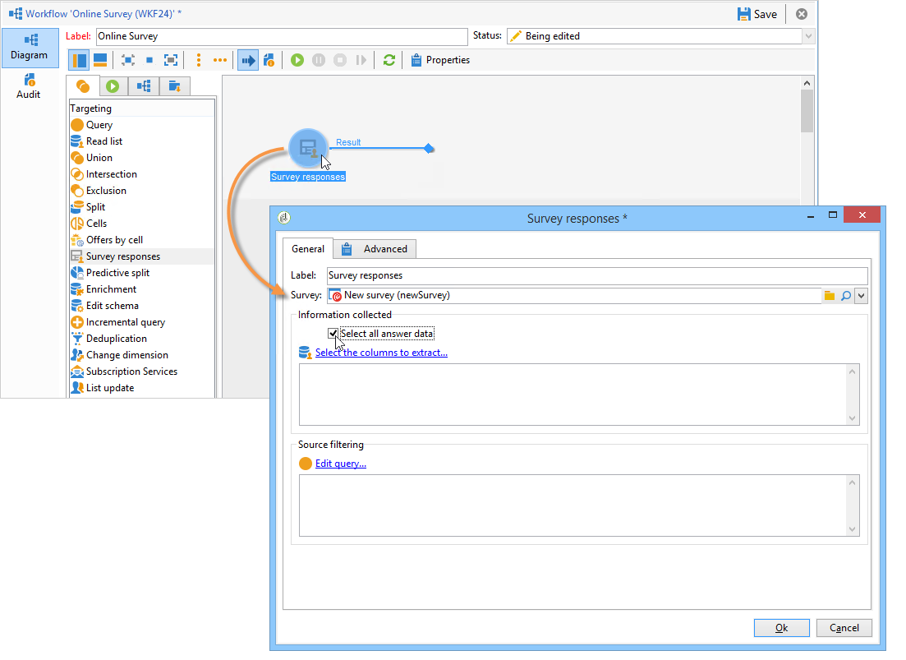
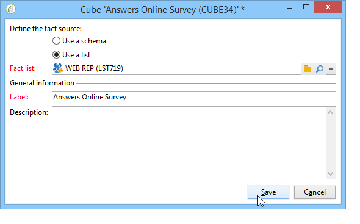
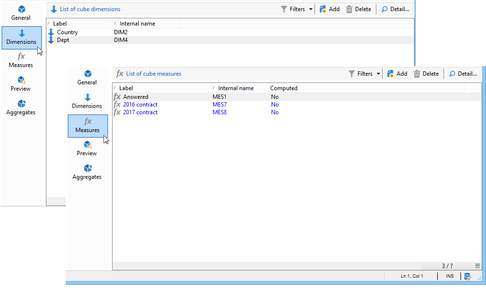
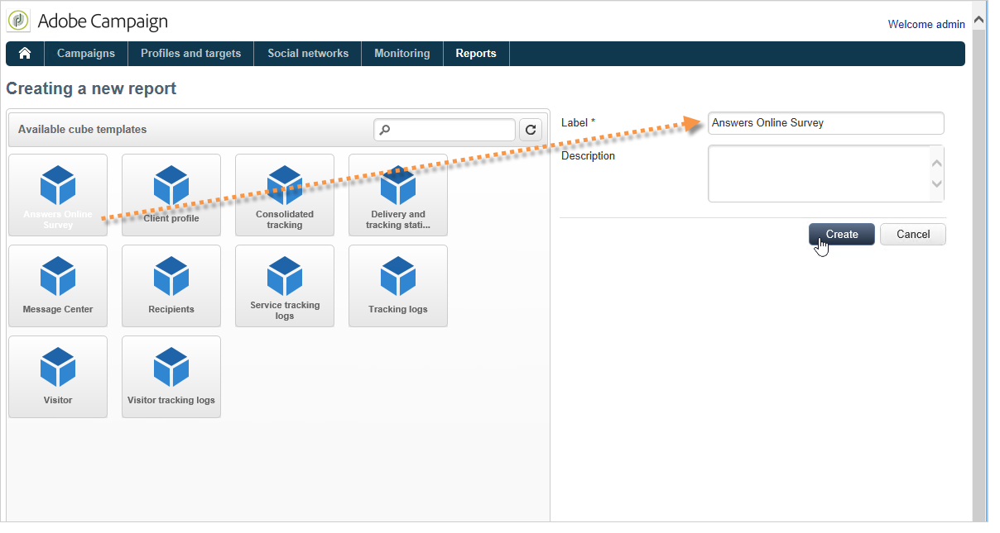
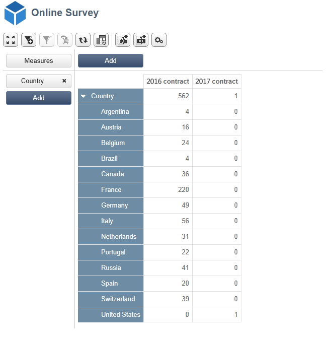

# Use case: display a report on answers to an online survey{#use-case-displaying-report-on-answers-to-an-online-survey}

Answers to Adobe Campaign surveys can be collected and analyzed using dedicated reports.

In the following example, we want to collect answers to an online survey and display them in a pivot table

Apply the following steps:

1. Creating a workflow to recover answers to the survey and store them in a list.
1. Creating a cube using the data in the list.
1. Creating a report with the pivot table and viewing the breakdown of answers.

Before starting on this use case, you need to have access to a survey and a set of answers that you can analyze.

>[!NOTE]
>
>This use case may only be implemented if you have acquired the **Survey Manager** option. Please check your license agreement.

## Step 1 - Creating the data collection and storage workflow {#step-1---creating-the-data-collection-and-storage-workflow}

To collect the answers to the survey, apply the following steps:

1. Create a workflow and place an **[!UICONTROL Answers to a survey]** activity. For more on using this activity, refer to [this section](../../web/using/publish--track-and-use-collected-data.md#using-the-collected-data).
1. Edit the activity and select the survey whose answers you want to analyze.
1. Enable the **[!UICONTROL Select all the answer data]** option to collect all the information.

   

1. Select the columns to extract (in this case: select: all archived fields. These are the fields that contain the answers.

   

1. Once the answer collection box is configured, position a **[!UICONTROL List update]** type activity to save the data.

   

   In this activity, specify the list to be updated and un-check the **[!UICONTROL Purge and re-use the list if it exists (otherwise add to the list)]** option: answers are added to the existing table. This option will enable you to reference the list in a cube. The schema linked to the list will not be re-generated for each update, which guarantees the integrity of the cube that uses this list.

   

1. Start the workflow to confirm its configuration.

   

   The specified list is created and includes the schema of the answers to the survey.

1. Add a scheduler to automate the daily collection of answers and the list update.

   The **[!UICONTROL List update]** and **[!UICONTROL Scheduler]** activities are detailed in .

## Step 2 - Creating the cube, its measures and its indicators {#step-2---creating-the-cube--its-measures-and-its-indicators}

You may then create the cube and configure its measures: they will be used to create the indicators that will be shown in the report. For more on creating and configuring cubes, refer to [About cubes](../../reporting/using/about-cubes.md).

In this example, the cube is based on the data in the list fed by the workflow created previously.

Define the dimensions and the measures to be displayed in the report. Here, we want to display the contract date and the country of the respondent.

The **[!UICONTROL Preview]** tab lets you control the rendering of the report.

## Step 3 - Creating the report and configuring the data layout within the table {#step-3---creating-the-report-and-configuring-the-data-layout-within-the-table}

You may then create a report based on this cube and process the data and information.

Adapt the information to display based on your needs.

