# Use cases{#use-cases}


## Analyzing a population {#analyzing-a-population}

The following example lets you explore the population targeted by a set of newsletters by using the descriptive analysis wizard.

Implementation steps are detailed below, while an exhaustive list of options and descriptions are available in the other sections of this chapter.

### Identifying the population to analyze {#identifying-the-population-to-analyze}

In this example, we want to explore the target population of the deliveries included in the **Newsletters** folder.

To do this, select the concerned deliveries, then right-click and select **[!UICONTROL Action > Explore the target...]**.


### Selecting a type of analysis {#selecting-a-type-of-analysis}

In the first step of the assistant, you can select the descriptive analysis template to use. By default, Adobe Campaign offers two templates: **[!UICONTROL Qualitative distribution]** and **[!UICONTROL Quantitative distribution]**. For more on this refer to the [Configuring the qualitative distribution template](../../reporting/using/using-the-descriptive-analysis-wizard.md#configuring-the-qualitative-distribution-template) section. The various renderings are presented in the [About descriptive analysis](../../reporting/using/about-descriptive-analysis.md) section.

For this example, select the **[!UICONTROL Qualitative distribution]** template and choose a display with a chart and table (array). Give the report a name ("Descriptive analysis") and click **[!UICONTROL Next]**.

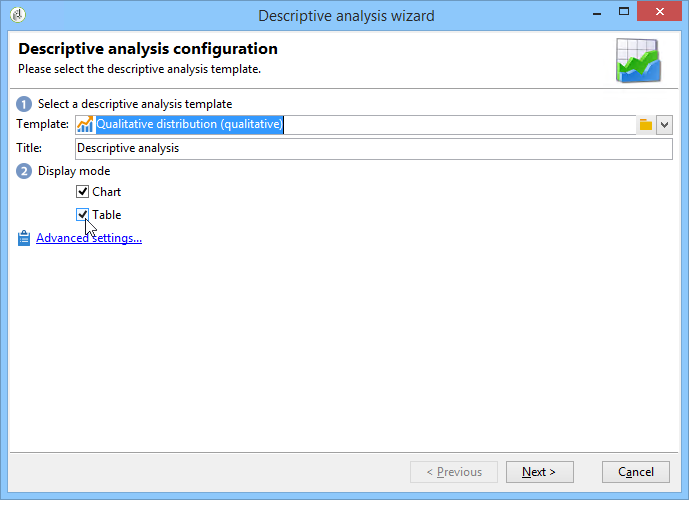

### Selecting the variables to display {#selecting-the-variables-to-display}

The next step lets you select the data to display in the table.

Click the **[!UICONTROL Add...]** link to select the variable that contains the data to display. Here we want to display the cities of our delivery recipients on one line:

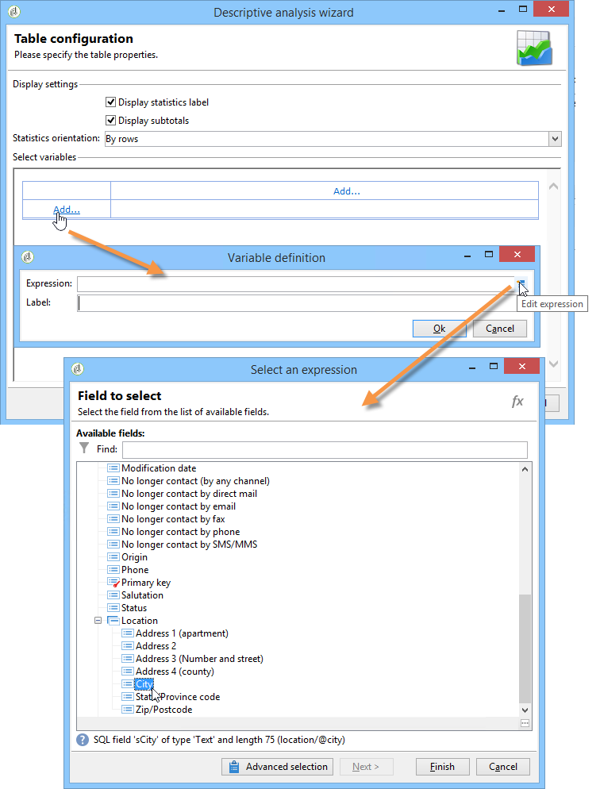

The columns will display the number of purchases per company. In this example, amounts are aggregated in the **Web purchases** field.

Here, we want to define result binning to clarify their display. To do this, select the **[!UICONTROL Manual]** binning option and set the calculation classes for the segments to display:


Then, click **[!UICONTROL Ok]** to approve the configuration.

Once the lines and columns have been defined, you can change, move or delete them using the tool bar. 

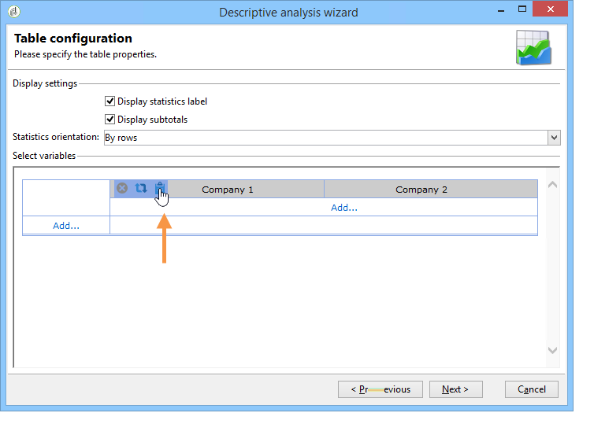

### Defining the display format {#defining-the-display-format}

The next step of the wizard lets you select the type of chart you want to generate.

In this case, choose the histogram.

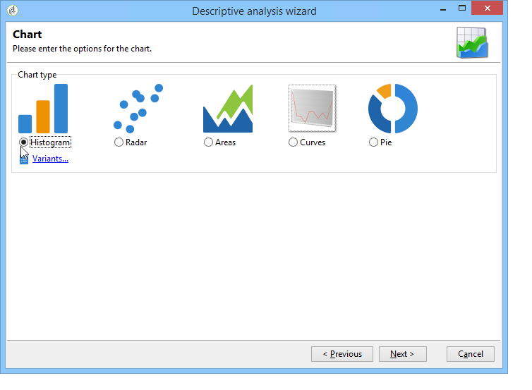

Possible configurations of the different graphics are detailed in the [Analysis report chart options](../../reporting/using/processing-a-report.md#analysis-report-chart-options) section.

### Configuring the statistic to calculate {#configuring-the-statistic-to-calculate}

Then specify the calculations to be applied to the collected data. By default, the descriptive analysis wizard carries out a simple count of the values.

This window lets you define the list of statistics to be calculated.

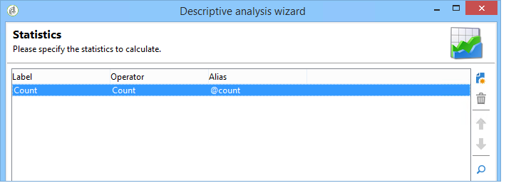

To create a new statistic, click the **[!UICONTROL Add]** button. For more on this, refer to [Statistics calculation](../../reporting/using/using-the-descriptive-analysis-wizard.md#statistics-calculation).

### Viewing and using the report {#viewing-and-using-the-report}

The last step of the wizard displays the table and the chart.

You can store, export or print data using the tool bar above the table. For more on this, refer to [Processing a report](../../reporting/using/processing-a-report.md).

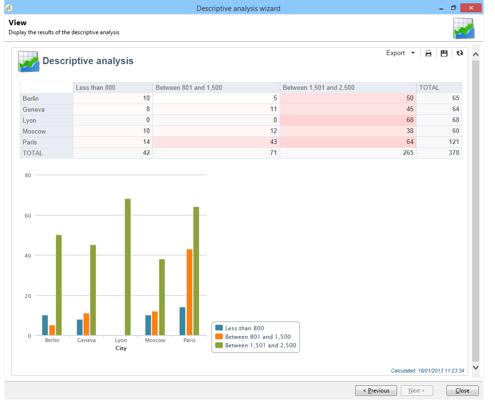

## Qualitative data analysis {#qualitative-data-analysis}

### Example of a chart display {#example-of-a-chart-display}

**Target**: generate an analysis report on the location of prospects or customers.

1. Open the descriptive analysis wizard and select **[!UICONTROL Chart]** only.

   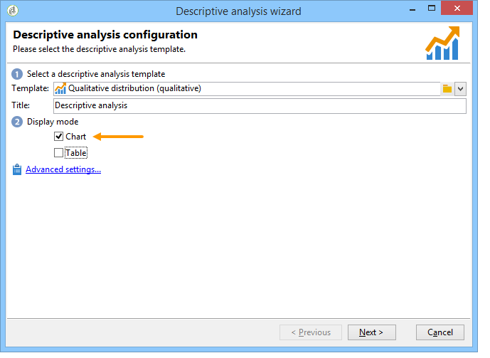

   Click **[!UICONTROL Next]** to approve this step.

1. Then select the **[!UICONTROL 2 variables]** option and specify that the **[!UICONTROL First variable (abscissa)]** will refer to recipient status (prospects/customers) and the second variable will refer to the country.
1. Select **[!UICONTROL Cylinders]** as a type.

   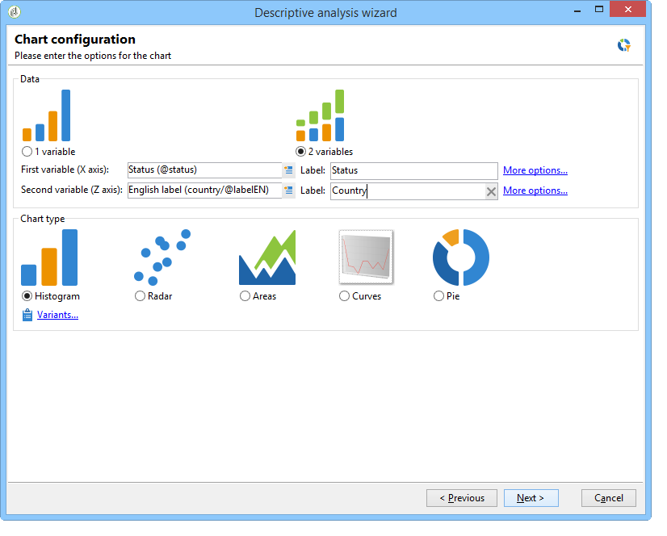

1. Click **[!UICONTROL Next]** and leave the default **[!UICONTROL Simple count]** statistic.
1. Click **[!UICONTROL Next]** to display the report.

   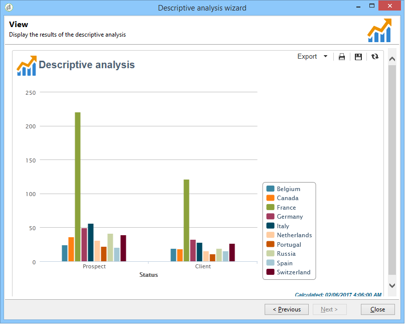

   Hover over a bar to see the exact number of customers or prospects for this country. 

1. Enable or disable the display of one of the countries based on the legend.

   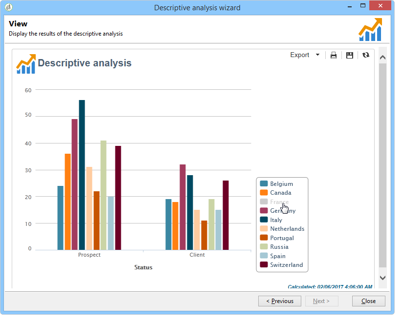

### Example of a table display {#example-of-a-table-display}

**Target**: analyze company email domains.

1. Open the descriptive analysis wizard and select the **[!UICONTROL Array]** display mode only.

   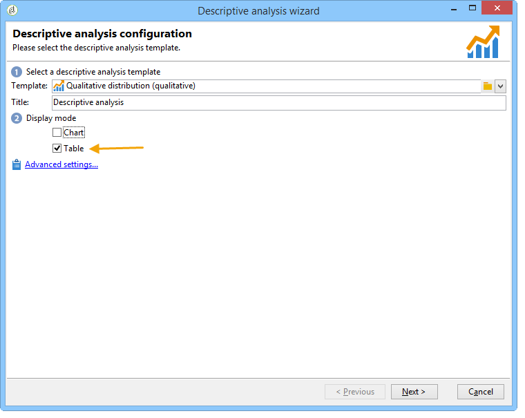

   Click the **[!UICONTROL Next]** button to approve this step.

1. Select the **[!UICONTROL Company]** variable as a column and the **[!UICONTROL Email domain]** variable as a row.
1. Keep the **[!UICONTROL By rows]** option for statistics orientation: the statistic calculation will be displayed to the right of the **[!UICONTROL Email domain]** variable.

   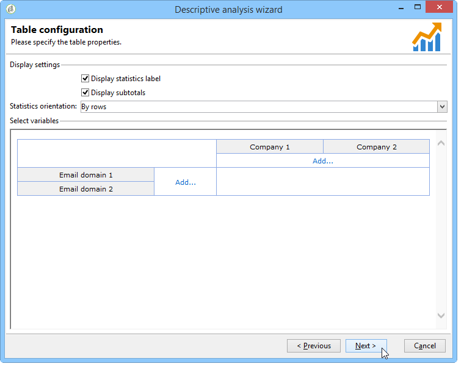

   Click **[!UICONTROL Next]** to approve this step.

1. Then enter the statistics to be calculated: keep the default count and create a new statistic. To do this, click **[!UICONTROL Add]** and select **[!UICONTROL Total percentage distribution]** as the operator. 

   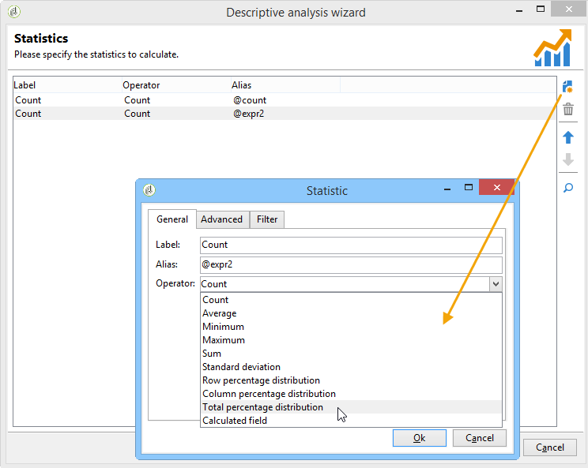

1. Enter a label for the statistic so that there will not be a blank field when the report is displayed.

   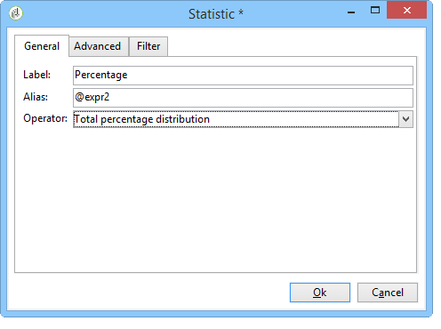

1. Click **[!UICONTROL Next]** to display the report.

   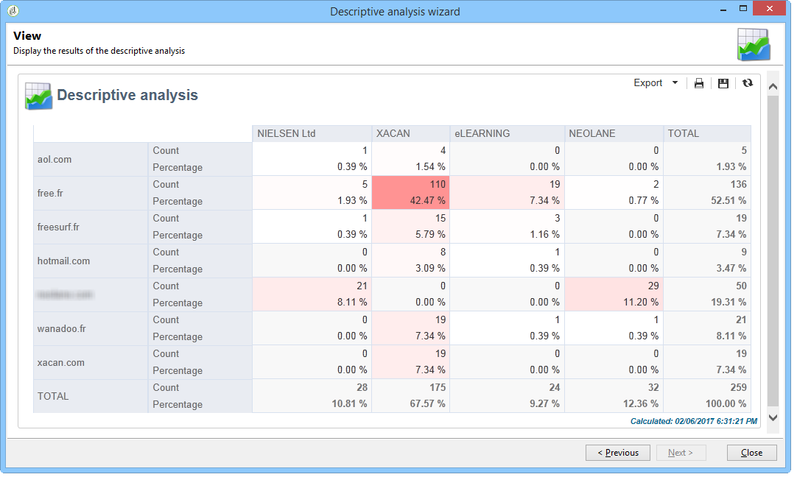

1. Once the analysis report has been generated, you can adapt the display to suit your needs without changing the configuration. For instance, you can switch the axes: right-click the domain names and select **[!UICONTROL Turn]** on the shortcut menu.

   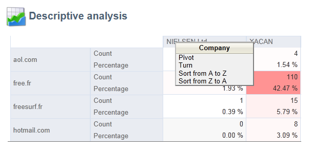

   The table displays the information as follows:

   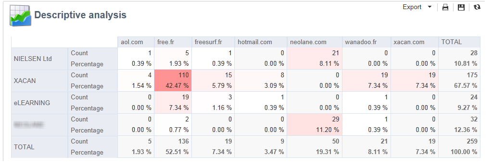

## Quantitative data analysis {#quantitative-data-analysis}

**Target**: to generate a quantitative analysis report on recipient age

1. Open the descriptive analysis wizard and select **[!UICONTROL Quantitative distribution]** from the drop-down list.

   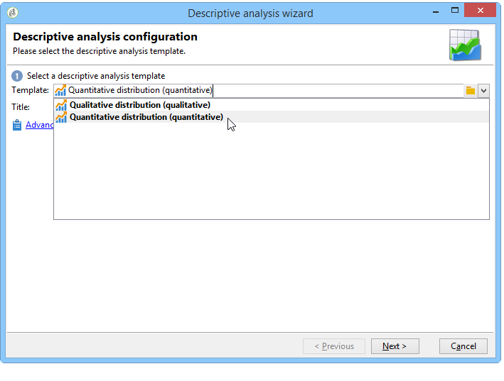

   Click the **[!UICONTROL Next]** button to approve this step.

1. Select the **[!UICONTROL Age]** variable and enter its label. Specify whether or not it's an integer, then click **[!UICONTROL Next]**.

   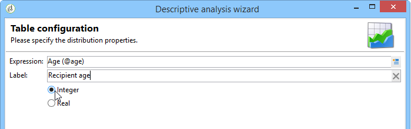

1. Delete the **[!UICONTROL Deciles]**, **[!UICONTROL Distribution]** and **[!UICONTROL Sum]** statistics: they're not needed here.

   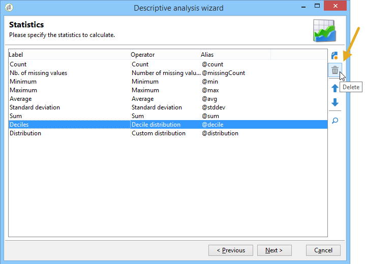

1. Click **[!UICONTROL Next]** to display the report.

   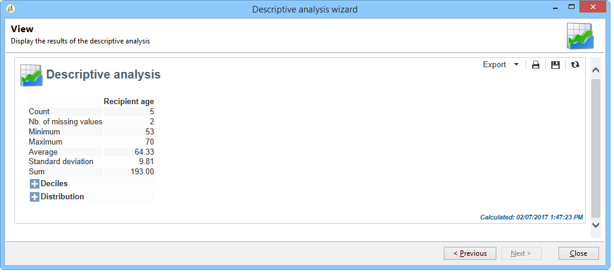

## Analyzing a transition target in a workflow {#analyzing-a-transition-target-in-a-workflow}

**Target**: to generate reports on the population of a targeting workflow

1. Open the desired targeting workflow.
1. Right-click a transition that points to the recipient table.
1. Select **[!UICONTROL Analyze target]** in the drop-down menu to open the descriptive analysis window.

   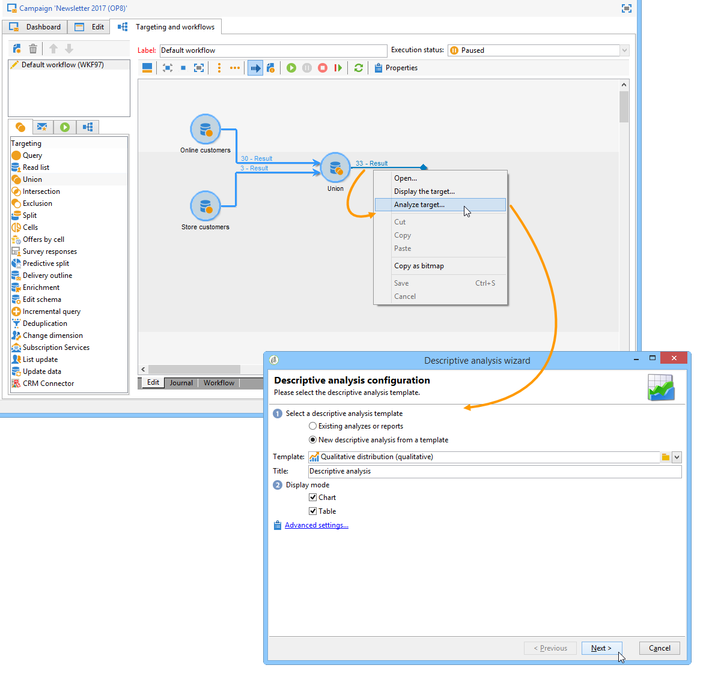

1. At this point you can either select the **[!UICONTROL Existing analyses and reports]** option and use reports created previously (refer to [Re-using existing reports and analyses](../../reporting/using/processing-a-report.md#re-using-existing-reports-and-analyses)), or create a new descriptive analysis. To do this, leave the **[!UICONTROL New descriptive analysis from a template]** option selected by default.

   The rest of the configuration is the same as for all descriptive analyses.

### Target analyze recommendations {#target-analyze-recommendations}

The analysis of a population in a workflow requires the population to still be present in the transition. If the workflow is launched, the result concerning the population might be purged from the transition. To run an analysis, you can either:

* Detach the transition from its destination activity and start the workflow to make it active. Once the transition starts to flash, launch the wizard in the usual way.

  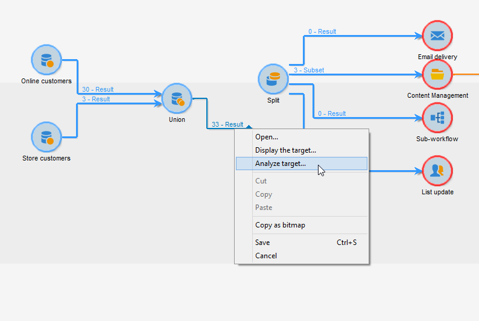

* Modify the properties of the workflow by selecting the **[!UICONTROL Keep the result of interim populations between two executions]** option. This lets you launch an analysis of the transition of your choice, even if the workflow has finished.

  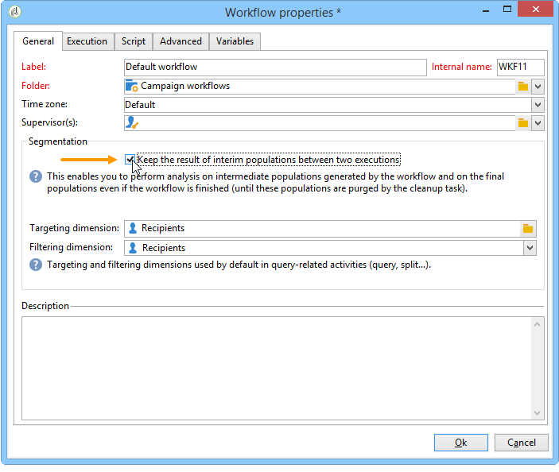

  If the population was purged from the transition, an error message asks you to select the concerned option before launching the descriptive analysis wizard.

  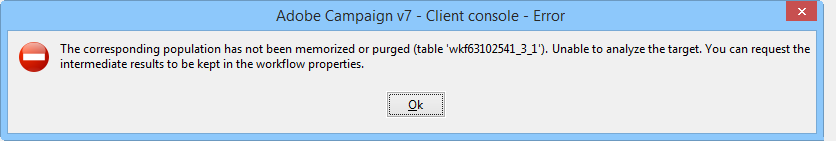

>[!CAUTION]
>
>The **[!UICONTROL Keep the result of interim populations between two executions]** option must only be used in development phases, but never for an environment in production.   
>The interim populations are automatically purged once their retention deadline has been reached. This deadline is specified in the workflow properties **[!UICONTROL Execution]** tab.

## Analyzing recipient tracking logs {#analyzing-recipient-tracking-logs}

The descriptive analysis wizard can generate reports on other work tables. This means that you can analyze delivery logs by creating a dedicated report.

In this example, we want to analyze the reactivity rate of newsletter recipients.

To do this, apply the following steps:

1. Open the descriptive analysis wizard via the **[!UICONTROL Tools > Descriptive analysis]** menu and change the default work table. Select **[!UICONTROL Recipient tracking log]** and add a filter to exclude Proofs and include newsletters.

   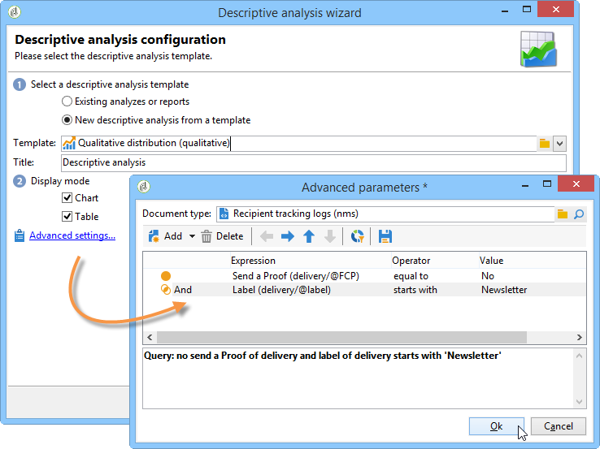

   Select a table display and click **[!UICONTROL Next]**.

1. In the next window, specify that the analysis concerns deliveries.

   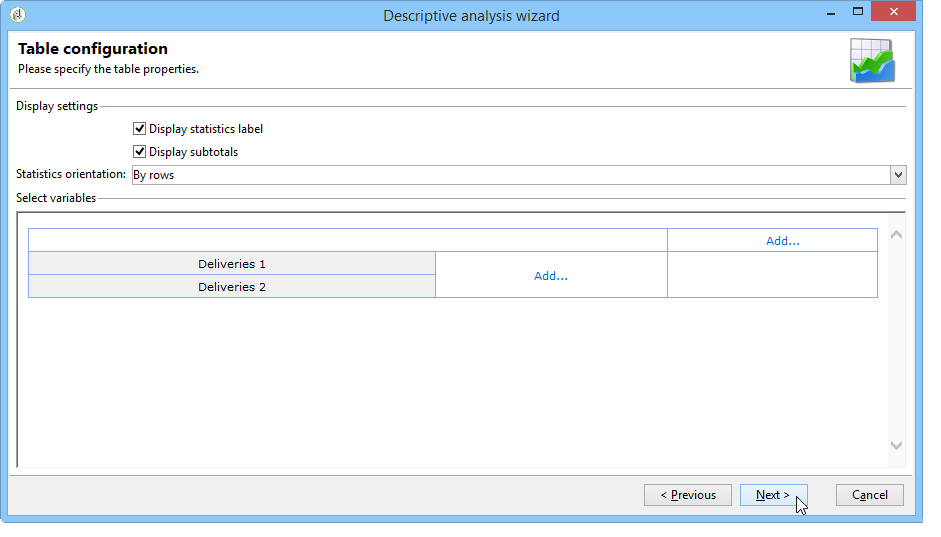

   Here, delivery labels will be displayed in the first column.

1. Delete the default count and create three statistics to configure the statistics to be displayed in the table.

   Here, for each Newsletter, the table will show: the number of opens, the number of clicks, the reactivity rate (as a percentage).

1. Add a statistic for counting the number of clicks: define the relevant filter in the **[!UICONTROL Filter]** tab.

   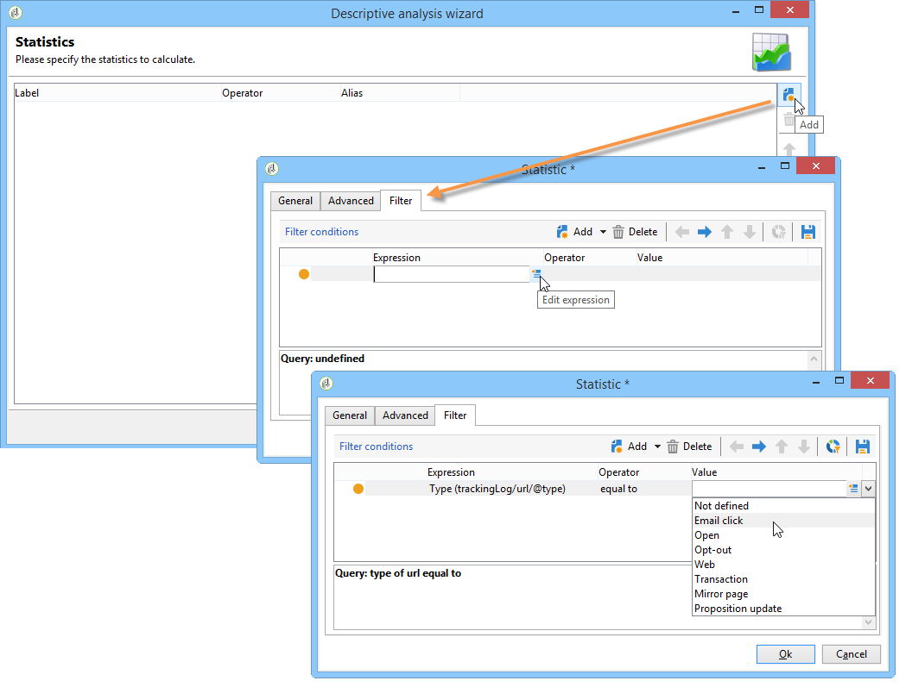

1. Then click the **[!UICONTROL General]** tab to rename the statistics label and alias:

   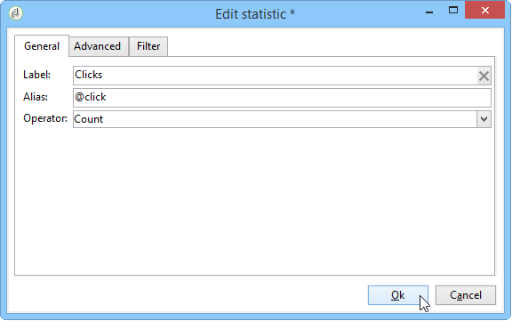

1. Add a second statistic for counting the number of opens:

   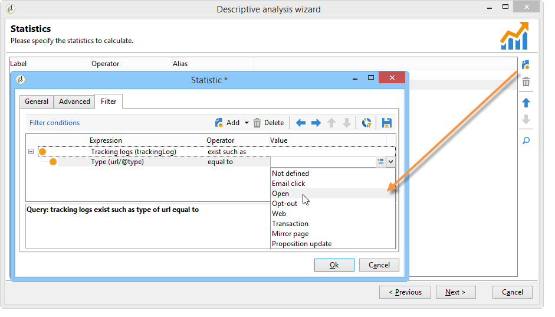

1. Then click the **[!UICONTROL General]** tab to rename the statistics label and its alias:

   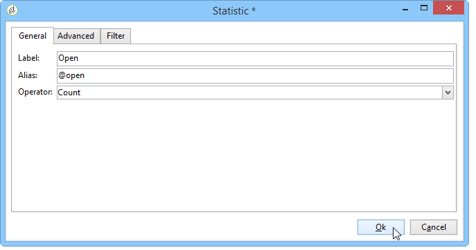

1. Add the third statistic and select the **[!UICONTROL Calculated field]** operator to measure the reactivity rate.

   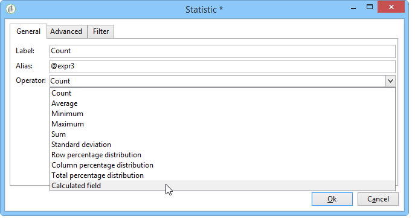

   Go to the **[!UICONTROL User function]** field and enter the following formula:

   ```
   @clic / @open * 100
   ```

   Adapt the statistics label as shown below:

   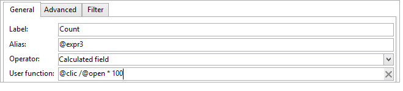

   Finally, specify whether the values are shown as a percentage: to do this, uncheck the **[!UICONTROL Default formatting]** option in the **[!UICONTROL Advanced]** tab and select **[!UICONTROL Percentage]** without a decimal point.

   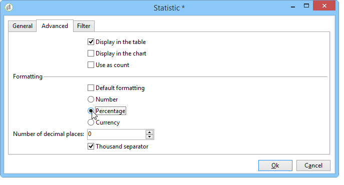

1. Click **[!UICONTROL Next]** to display the report.

   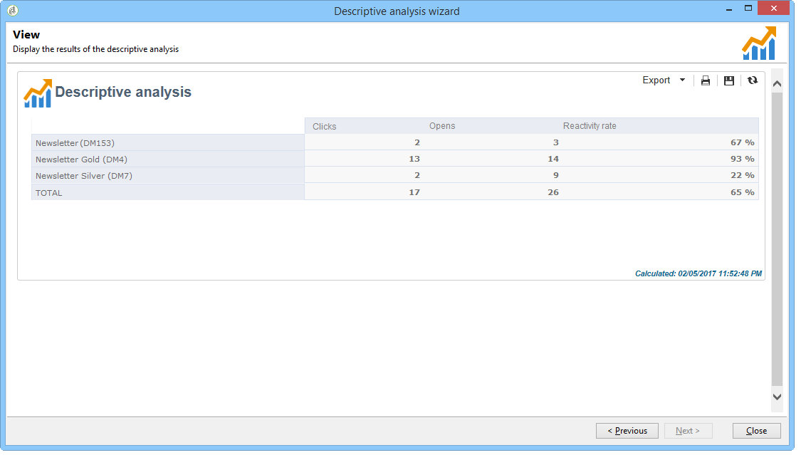

## Analyzing delivery exclusion logs {#analyzing-delivery-exclusion-logs}

If the analysis concerns a delivery, you can analyze the excluded population. To do this, select the deliveries to be analyzed and right-click to access the **[!UICONTROL Action > Explore exclusions]** menu.

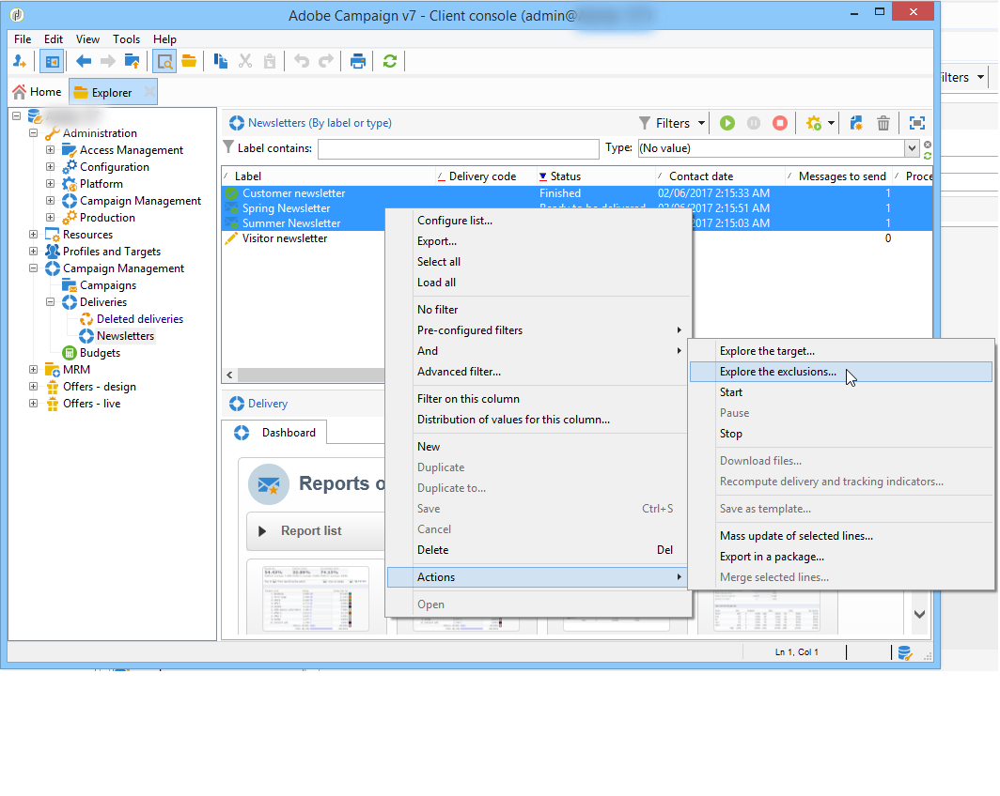

This will take you to the descriptive analysis wizard and the analysis will concern the recipient exclusion logs.

For example, you could display the domains of all excluded addresses and sort them by exclusion date.

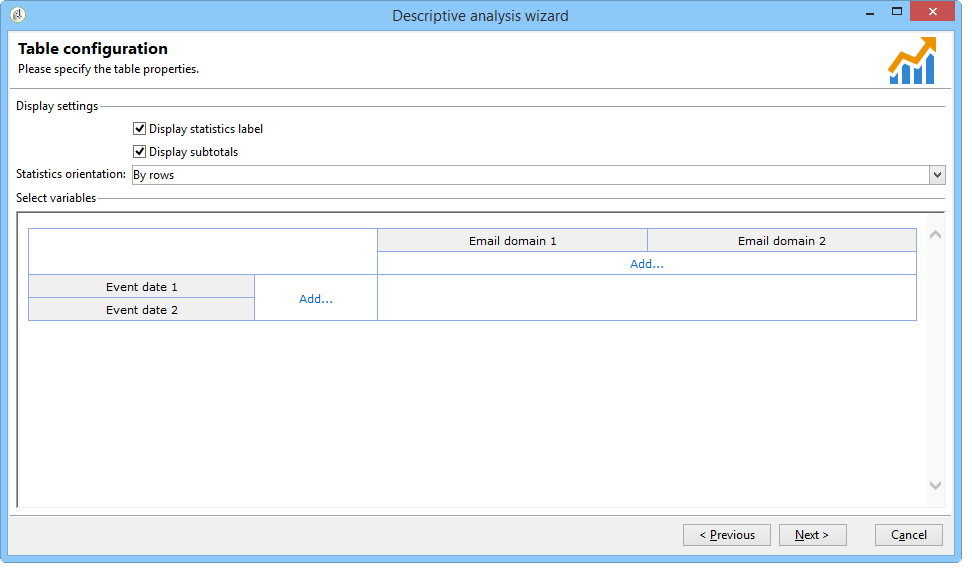

This would generate the following type of report:


