# Using cubes to explore data{#using-cubes-to-explore-data}

Marketing Analytics makes it easier to create reports and to identify and select data from the database via cubes. This enables you to:

* Create reports based on cubes. The process is detailed here: [Exploring the data in a report](#exploring-the-data-in-a-report).
* Collect the data in the database and group it into lists, for instance to identify and build targets and deliveries. For more on this, refer to [Building a target population](#building-a-target-population).
* Insert a pivot table into a report, reference an existing cube in it. For more on this, refer to [Inserting a pivot table into a report](#inserting-a-pivot-table-into-a-report).

>[!NOTE]
>
>Marketing Analytics is necessary to create or modify cubes. For more on this, refer to [About cubes](../../reporting/using/about-cubes.md).

## Exploring the data in a report {#exploring-the-data-in-a-report}

### Step 1 - Creating a report based on a cube {#step-1---creating-a-report-based-on-a-cube}

To create a report based on a cube, click the **[!UICONTROL Create]** button in the **[!UICONTROL Reports]** tab and select the cube you want to use.

The process is detailed here: [Creating a report based on a cube](../../reporting/using/creating-indicators.md#creating-a-report-based-on-a-cube).

### Step 2 - Selecting lines and columns {#step-2---selecting-lines-and-columns}

The default display shows the first two dimensions of the cube (age and city, in this case).

The **[!UICONTROL Add]** buttons on each axis enable you to add dimensions. 

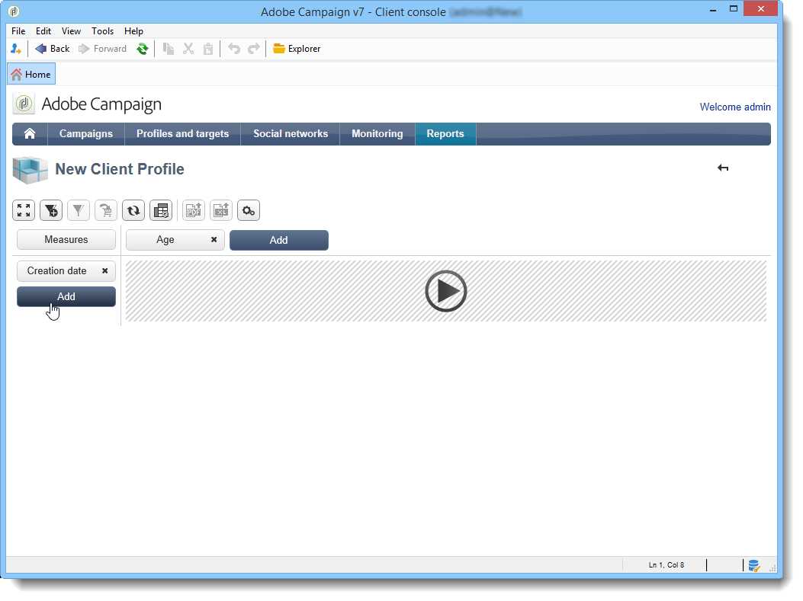

1. Select the dimensions you want to display in the lines and columns of the table. To do this, drag and drop the available dimensions as shown below:
1. Select the dimensions that you want to add to the table from the list:

   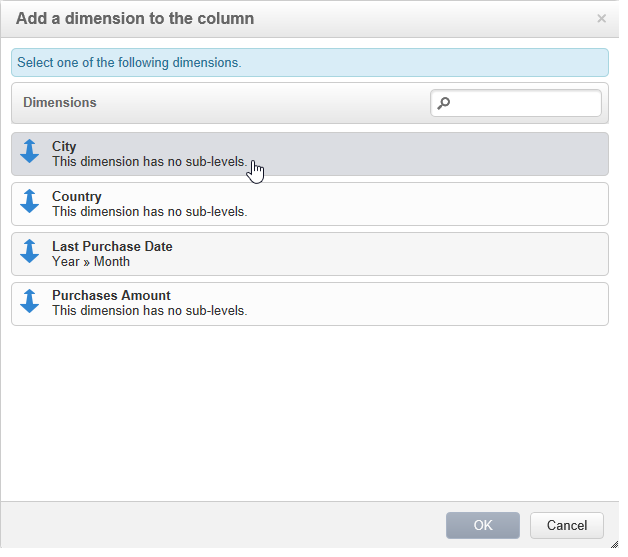

1. Then select the parameters of this dimension. 

   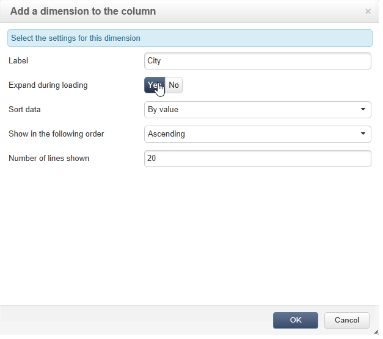

   The parameters depend on the data type of the selected dimension.

   For instance, for dates, several levels can be available. For more on this, refer to [Displaying measures](../../reporting/using/concepts-and-methodology.md#displaying-measures).

   The following options are offered in this case:

   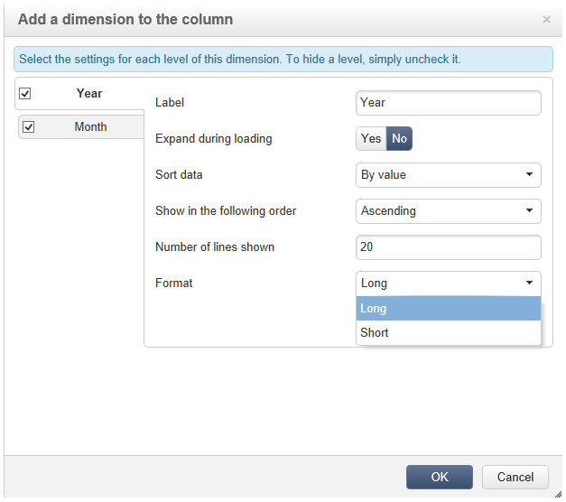

   You can either:

    * Expand data during loading: the values will be displayed by default each time the report is updated (default value: no).
    * Display the total at the end of the line: when the data is displayed in columns, an additional option lets you display the total at the end of the line: a column is added to the table (default value: yes).
    * Apply a sort: the values of the column can be sorted according to value, label, or based on a measure (default value: by value).
    * Display the values in ascending (a-z, 0-9) or descending (z-a, 9-0) order.
    * Change the number of columns to be displayed upon loading (by default: 200).

1. Click **[!UICONTROL Ok]** to confirm: the dimension is added to the existing dimensions.

   The yellow banner above the table shows that you have made changes: click the **[!UICONTROL Save]** button to save them.

   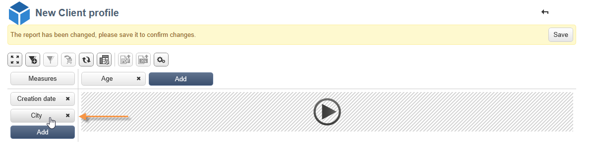

### Step 3 - Configuring the measures to display {#step-3---configuring-the-measures-to-display}

Once the lines and columns are in place, indicate the measures you want to display as well as their display mode.

By default, only one measure is displayed. To add or configure measures:

1. Click the **[!UICONTROL Measures]** button. 

   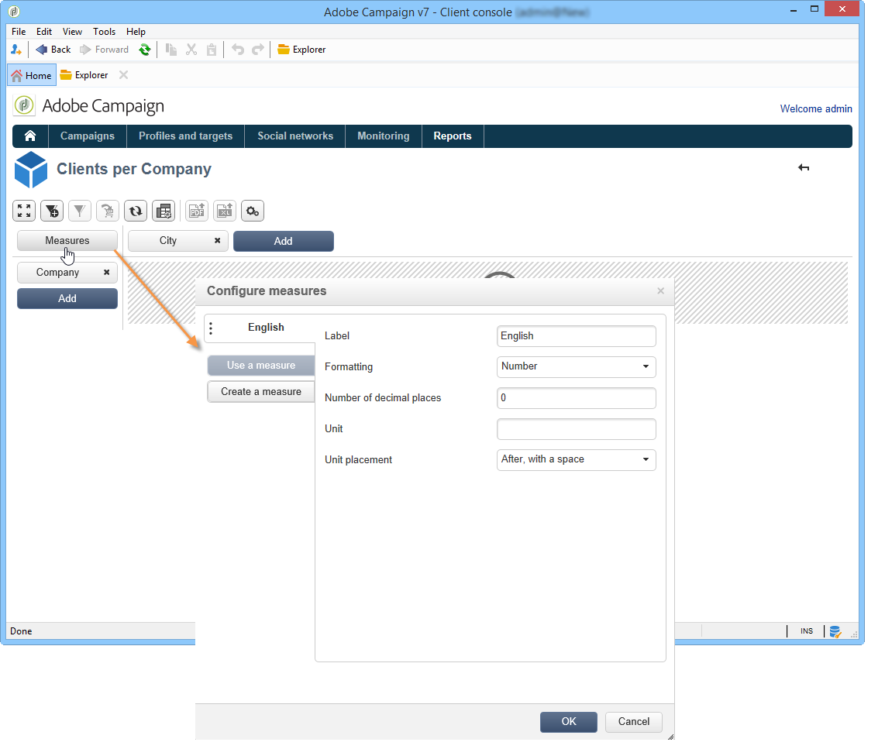

1. The **[!UICONTROL Use a measure]** button enables you to select one of the existing measures.

   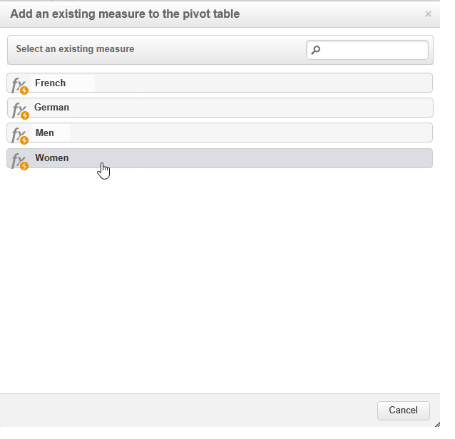

   Select the information you want to display and the type of formatting. The list of options depends on the type of measure which has been configured.

   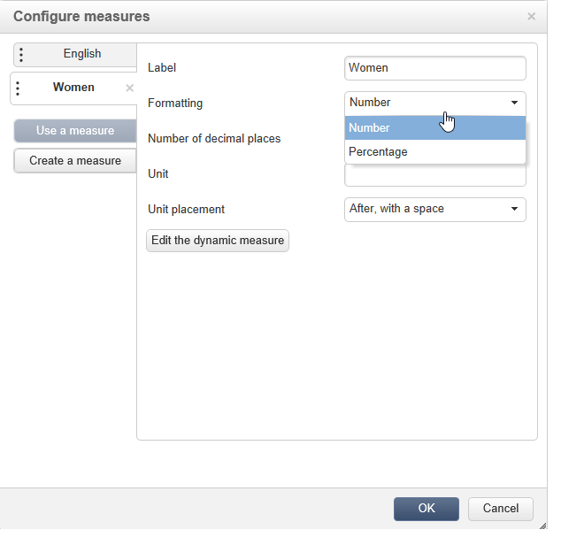

   Overall measure configuration is also available via the **[!UICONTROL Edit the configuration of the pivot table]** icon in the header.

   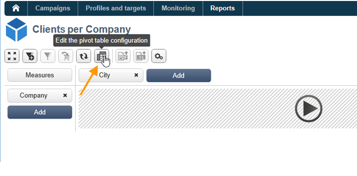

   You can then choose whether or not to display measure labels. For more on this, refer to [Configuring the display](../../reporting/using/concepts-and-methodology.md#configuring-the-display).

1. It's possible to build new measures using existing ones. To do this, click **[!UICONTROL Create a measure]** and configure it.

   

   The following types of measures are available:

    * Combination of measures: this type of measure enables you to build the new measure using existing ones:

      The available operators are: sum, difference, multiplication and rate.
    
    * Proportion: this type of measure enables you to calculate the number of records measured for a given dimension. You can calculate the proportionality based on a dimension or sub-dimension.
    * Variation: this measure lets you calculate the variation in values of a level.
    * Standard deviation: this type of measure lets you calculate deviations within each group of cells compared to the average of the values. For instance, you could compare the purchase volume for all existing segments.

   The created measure is added to the report.

   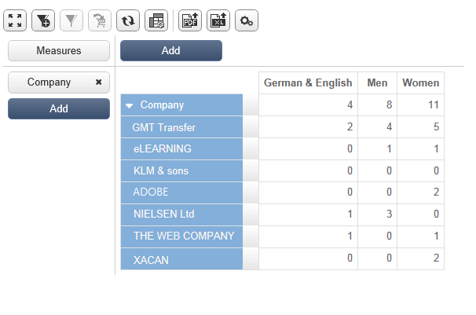

   Once you have created a measure, you can edit it and, if necessary, change its configuration. To do this, click the **[!UICONTROL Measures]** button, then go to the tab of the measure you want to edit.

   Then click **[!UICONTROL Edit the dynamic measure]** to access the settings menu.

## Building a target population {#building-a-target-population}

Reports build using cubes enable you to collect data from the table and save it in a list.

To do this, add them to a cart and process its content.

To group a population into a list, apply the following steps:

1. Click the cells that contain the population to be collected to select them, then click the **[!UICONTROL Add to cart]** icon.

   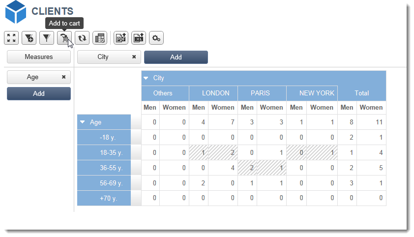

   To this as many times as necessary to collect various profiles

1. Click the **[!UICONTROL Show cart]** button to view its content before running the export.

   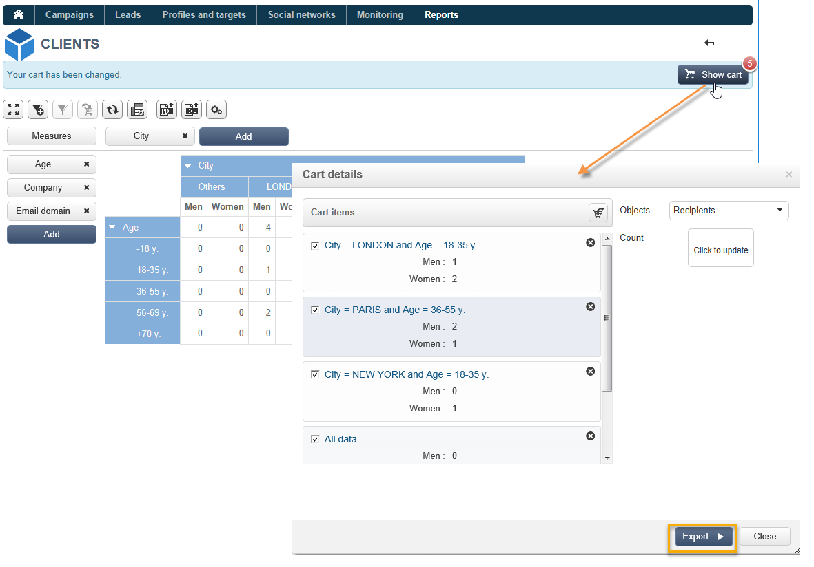

1. The **[!UICONTROL Export]** button lets you group the items in the cart into a list.

   You need to specify the name of the list and the type of export to carry out.

   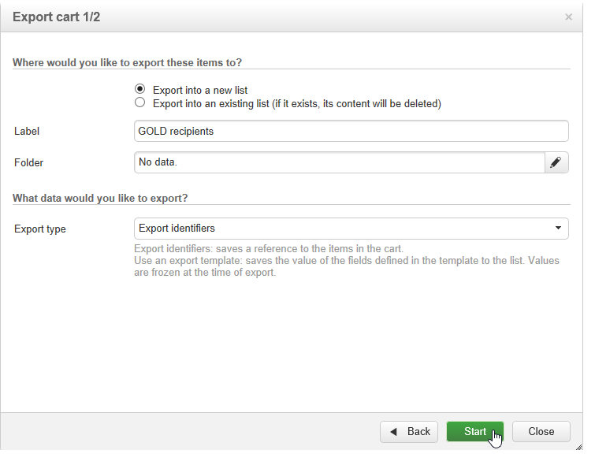

   Click **[!UICONTROL Start]** to run the export.

1. Once the export is complete, a message confirms its execution and the number of records that have been processed.

   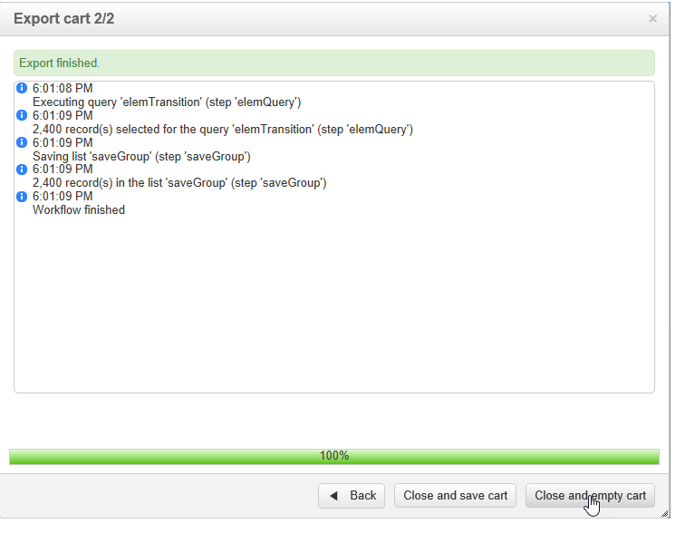

   You can either save the content of the cart or empty it.

   The relevant list is accessed via the **[!UICONTROL Profiles and targets]** tab.

   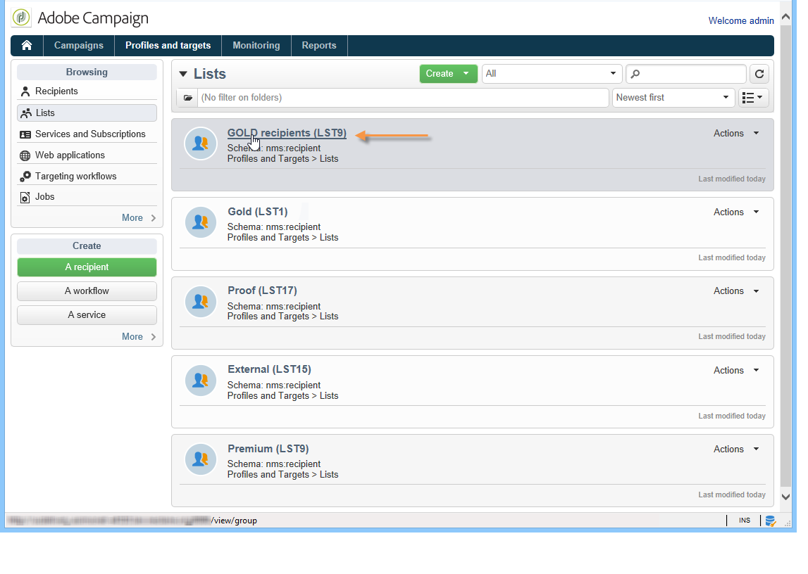

## Inserting a pivot table into a report {#inserting-a-pivot-table-into-a-report}

To create a table and explore the data in a cube, apply the following steps:

1. Create a new report with a single page and insert a pivot table into it. For more on this, refer to [this page](../../reporting/using/creating-a-table.md#creating-a-breakdown-or-pivot-table).

   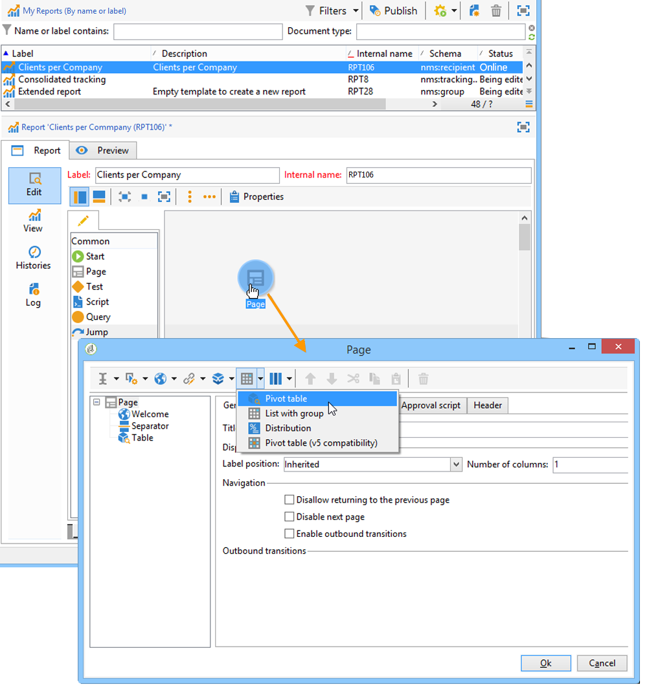

1. In the **[!UICONTROL Data]** tab of the page, select a cube to process the dimensions it contains and display calculated measures.

   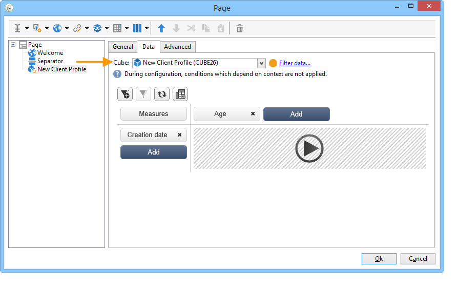

   This lets you build the report to be displayed. For more on this, refer to [Step 2 - Selecting lines and columns](#step-2---selecting-lines-and-columns).
