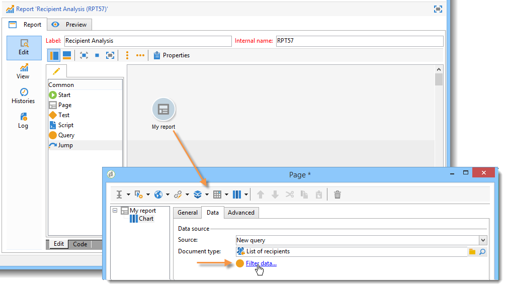
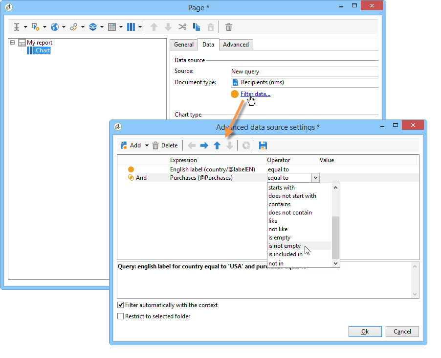
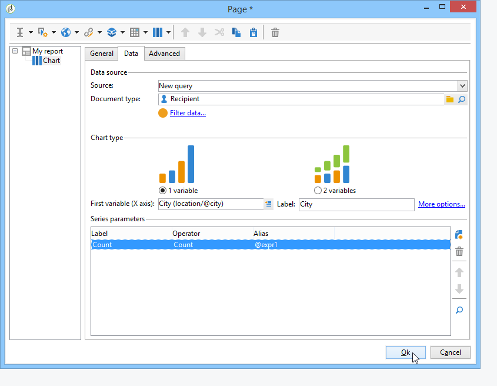
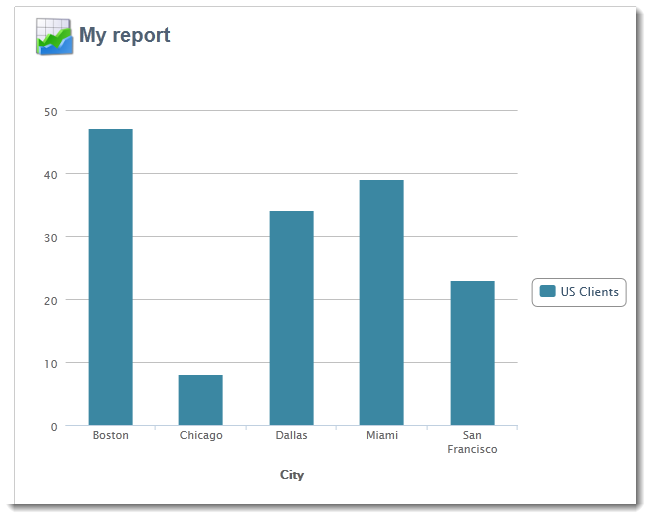
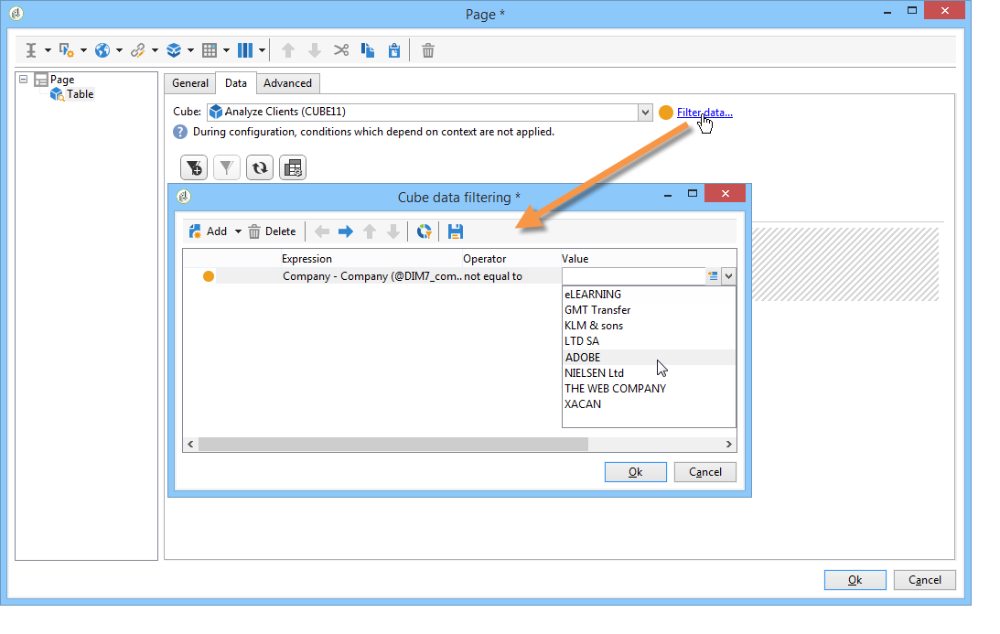
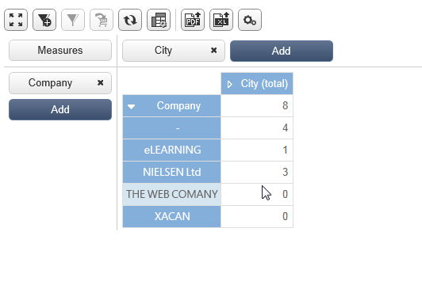
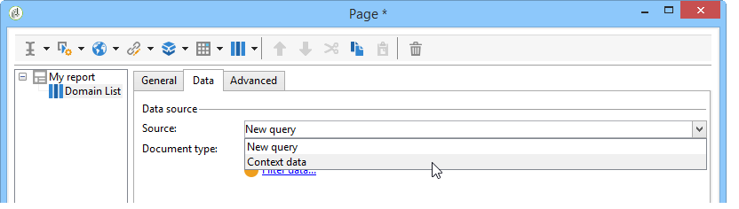
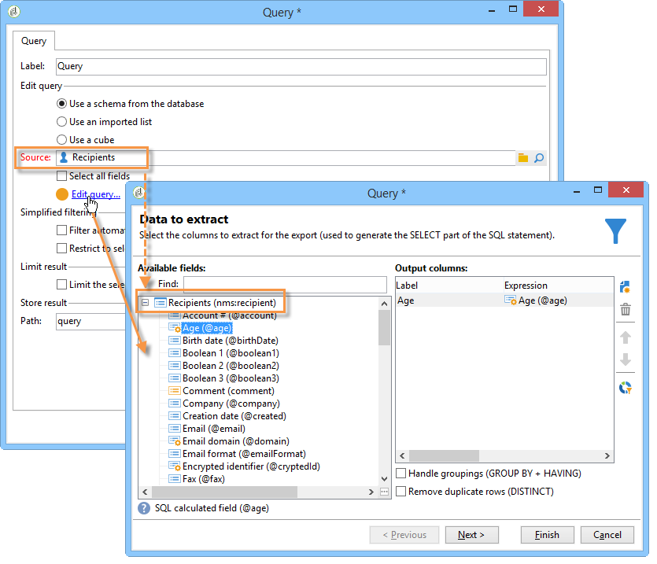
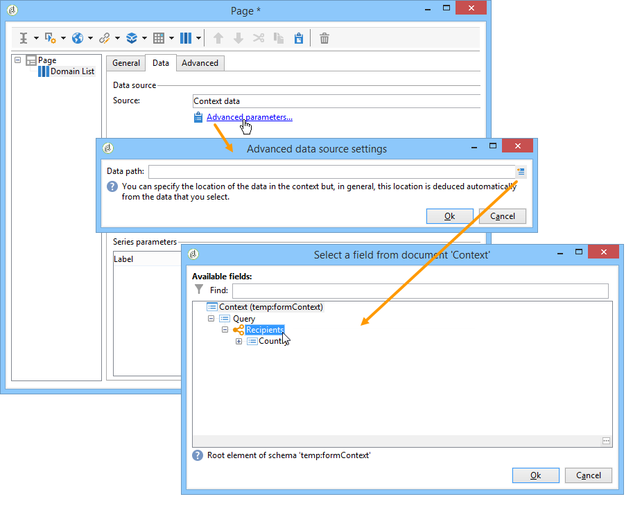
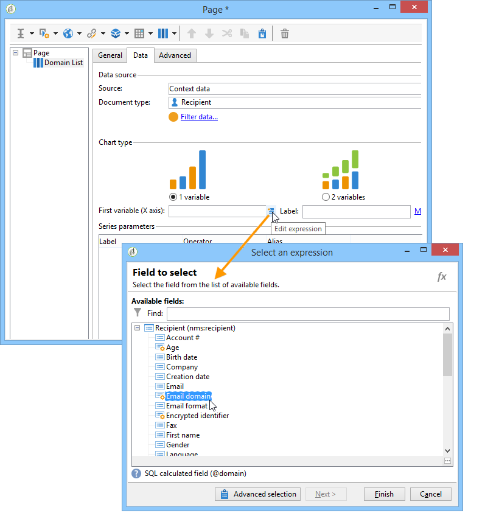

# Using the context{#using-the-context}

When you want to represent data in the form of **[!UICONTROL tables]** or **[!UICONTROL charts]**, it can be taken from two sources: a new query (refer to [Defining a direct filter on data](#defining-a-direct-filter-on-data)) or the report context (refer to [Using context data](#using-context-data)).

## Defining a direct filter on data {#defining-a-direct-filter-on-data}

### Filtering data {#filtering-data}

Using a **[!UICONTROL Query]** type activity isn't mandatory when building a report. Data can be filtered directly in the tables and charts that make up the report.

This enables you to select the data to display in the report directly via the **[!UICONTROL Page]** activity of the report.

To do this, click the **[!UICONTROL Filter data...]** link in the **[!UICONTROL Data]** tab: this link lets you access the expressions editor to define a query on the data to be analyzed.

### Example: use a filter in a chart {#example--use-a-filter-in-a-chart}

In the following example, we want the chart to show only recipient profiles who live in France and who made a purchase during the year.

To define this filter, place a page in the chart and edit it. Click the **[!UICONTROL Filter data]** link and create the filter that matches the data you want to display. For more on building queries in Adobe Campaign, refer to [this section](../../platform/using/about-queries-in-campaign.md).

Here, we want to display the breakdown by city of selected recipients.

The rendering will look like this: 

### Example: use a filter in a pivot table {#example--use-a-filter-in-a-pivot-table}

In this example, the filter lets you display only non-Parisian customers in the pivot table, without using another query beforehand.

Apply the following steps:

1. Place a page in the chart and edit it.
1. Create a pivot table.
1. Go to the **[!UICONTROL Data]** tab and select the cube to be used.
1. Click the **[!UICONTROL Filter data...]** link and define the following query to remove Adobe from the list of companies.

   

Only recipients that meet the filtering criteria will appear in the report.

## Using context data {#using-context-data}

To represent data in the form of a **[!UICONTROL table]** or a **[!UICONTROL chart]**, the data can come from the report context.

In the page that contains the table or the chart, the **[!UICONTROL Data]** tab lets you select the data source. 

* The **[!UICONTROL New query]** option lets you build a query to collect data. For more on this, refer to [Defining a direct filter on data](#defining-a-direct-filter-on-data).
* The **[!UICONTROL Context data]** option lets you use the input data: the context of the report coincides with the information contained in the inbound transition of the page that contains the chart or the table. This context may, for instance, contain data collected via a **[!UICONTROL Query]** activity placed before the **[!UICONTROL Page]** activity and for which you need to specify the table and the fields that the report concerns.

For instance, in a query box, build the following query for the recipients:

Then indicate the source of the data in your report, in this case: **[!UICONTROL Data from the context]**.

The data location is inferred automatically. If necessary, you can force the data path.

When you select the data which the statistics will concern, the available fields coincide with the data specified in the query.

