# Using the descriptive analysis wizard{#using-the-descriptive-analysis-wizard}

To create a descriptive analysis report, use the dedicated wizard. Configuration depends on the data to be analyzed and on the desired rendering.

## Analyzing data in the database {#analyzing-data-in-the-database}

The descriptive analysis wizard can be launched via the **[!UICONTROL Tools > Descriptive analysis]** menu: in this case, the analysis concerns recipients by default (**nms:recipient**). It applies to all the data in the Adobe Campaign database.

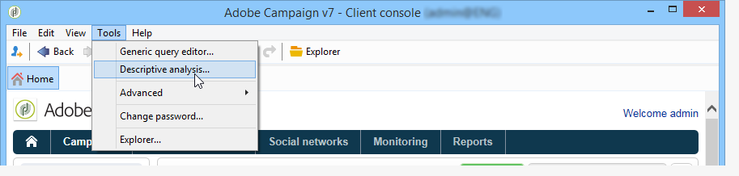

To analyze a table other than the standard recipients one (**nms:recipient**), click the **[!UICONTROL Advanced settings...]** link in the last stage of the wizard and select the table that matches your settings, in this case **cus:individual**:

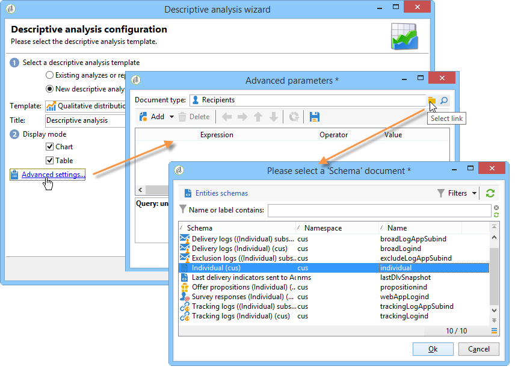

If you want to produce statistics on part of the data, you can define a filter: to do this, click the **[!UICONTROL Advanced settings...]** link and define the filter to apply, as shown below:

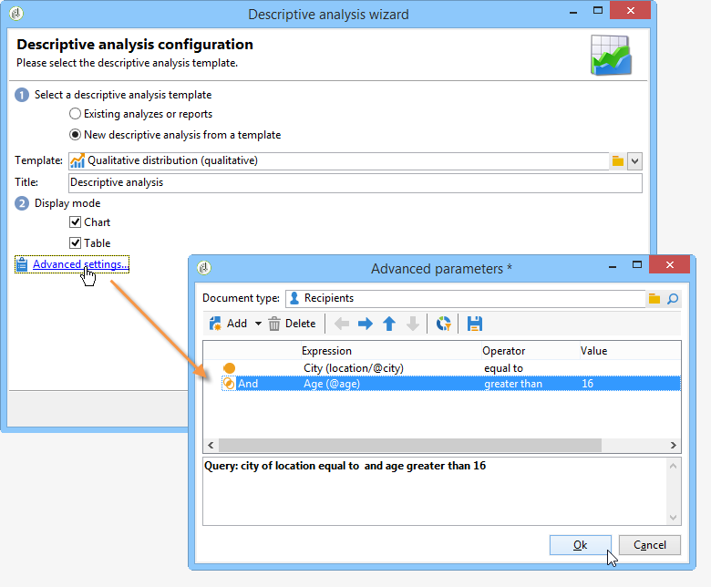

The analysis will only concern database recipients aged 16 and over and living in London.

## Analyzing a set of data {#analyzing-a-set-of-data}

You can use the descriptive analysis wizard via a different context: a list, a workflow transition, one or more deliveries, a selection of recipients, etc.

It is accessible via several nodes of the Adobe Campaign tree that point to the recipient table.

Open the descriptive analysis wizard by selecting items and right-clicking. Only the selected data will be analyzed.

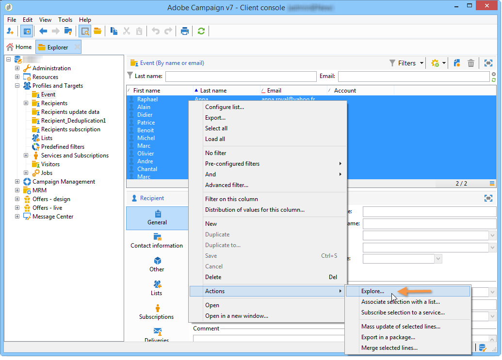

* For a set of **recipients**, select the recipients to be analyzed, then right-click and select **[!UICONTROL Actions > Explore...]**, as shown above. If a filter is applied to the list of recipients, only its content will be analyzed.

  To select all the recipients in the folder or the current filter, use the CTRL+A shortcut. This means that even recipients not shown will be selected.

  For an example of the descriptive analysis of recipients, refer to: [Qualitative data analysis](../../reporting/using/use-cases.md#qualitative-data-analysis).

* In the context of a **workflow**, place the cursor on a transition that points towards the recipients table, right-click and select **[!UICONTROL Analyze target]**. For more on this, refer to the example in [Analyzing a transition target in a workflow](../../reporting/using/use-cases.md#analyzing-a-transition-target-in-a-workflow).
* For **lists**, select one or more lists and apply the same process as for recipients.
* In the context of a **delivery**, select the deliveries whose target you want to analyze, right-click and select **[!UICONTROL Actions > Explore the target]**, as shown below:

  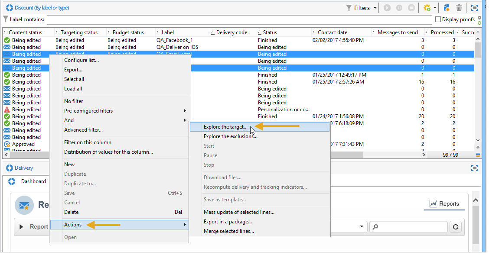

  Examples of descriptive analyses for deliveries are provided here: [Analyzing a population](../../reporting/using/use-cases.md#analyzing-a-population) and here: [Analyzing recipient tracking logs](../../reporting/using/use-cases.md#analyzing-recipient-tracking-logs).

## Configuring the qualitative distribution template {#configuring-the-qualitative-distribution-template}

The **[!UICONTROL Qualitative distribution]** template lets you create statistics on all types of data (e.g. company name, email domain).

Configuration options available for a report created via the **[!UICONTROL Qualitative distribution]** template are detailed in [Displaying data in the table](#displaying-data-in-the-table). A full example is detailed in [Analyzing a population](../../reporting/using/use-cases.md#analyzing-a-population).

When you use the descriptive analysis wizard to analyze your data, the available options depend on the chosen settings. These are detailed below.

### Data binning {#data-binning}

When you select the variables to display, you can define data binning, in other words configure grouping criteria for the selected data. 

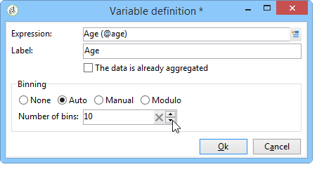

>[!NOTE]
>
>When the field concerned by the calculation is computed using an aggregate, check **[!UICONTROL The data is already aggregated]** to improve performances.

The options will differ depending on the content of the field:

* **[!UICONTROL None]** : this option lets you display all the values available for the variable, without binning.

  >[!CAUTION]
  >
  >This option should be used with care: it can have a major impact on the report and on machine performance.

* **[!UICONTROL Auto]** : this option lets you display the n most frequently represented values. They are calculated automatically and each represent a percentage of the variables compared to the number of bins. For numerical values, Adobe Campaign automatically generates n classes to sort the data into.
* **[!UICONTROL Manual]** : this option operates like the **[!UICONTROL Auto]** option, except that you can set these values manually. To do this, click the **[!UICONTROL Add]** button to the right of the value table.

  Values can be initialized automatically by Adobe Campaign before personalization: to do this, enter the number of bins you want to generate and click the **[!UICONTROL Initialize with]** link, as shown below:

  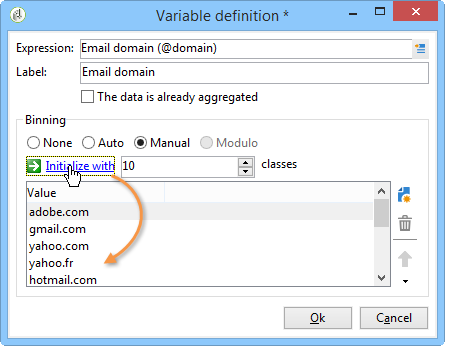

  Then adapt your content to suit your needs:

  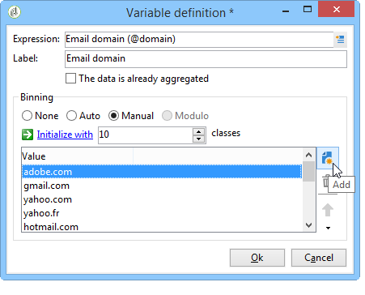

  Depending on the desired level of precision, fields containing dates can be grouped by time, day, month, year, etc.

  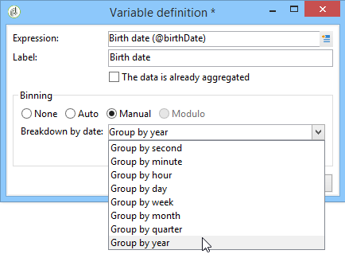

* **[!UICONTROL Modulo]** : lets you create groups of values in case of numerical values. For example, a modulo with a value of 10 lets you create an interval of values that change ten by ten.

  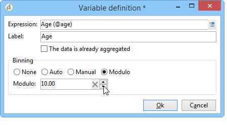

  This example lets you view the breakdown of recipients by age group.

  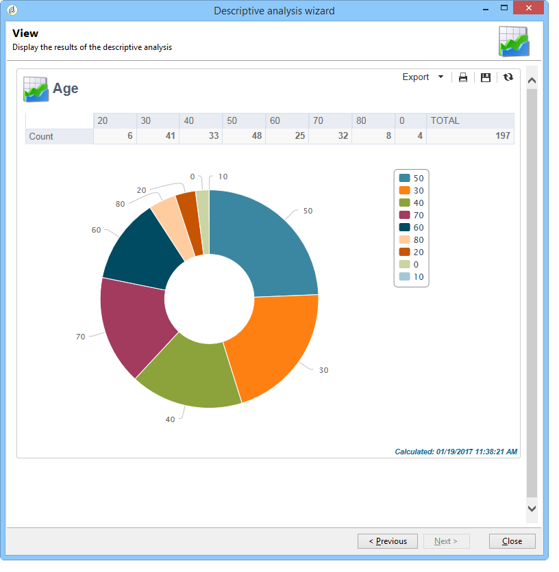

### Displaying data in the table {#displaying-data-in-the-table}

Use the toolbar to personalize the display of variables in the table: delete a column, display data in lines rather than columns, move a column to the left or right, view or alter value calculation.

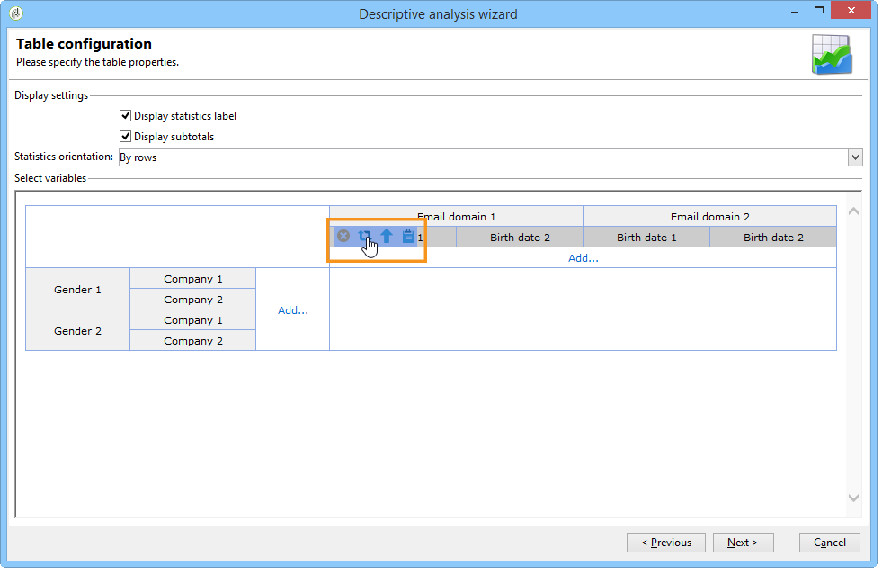

The upper section of the window lets you select the display settings.

You can display or hide the name of the statistics and the sub-totals and choose the orientation of the statistics. For more on this, refer to [Analysis report display settings](../../reporting/using/processing-a-report.md#analysis-report-display-settings).

### Displaying data in the chart {#displaying-data-in-the-chart}

In the first step of the descriptive analysis wizard, you can choose to display the data in chart form only, without a table. In this case, variable selection must be done when configuring the graphic. You must first select the number of variables to display and select the fields from the relevant database. 

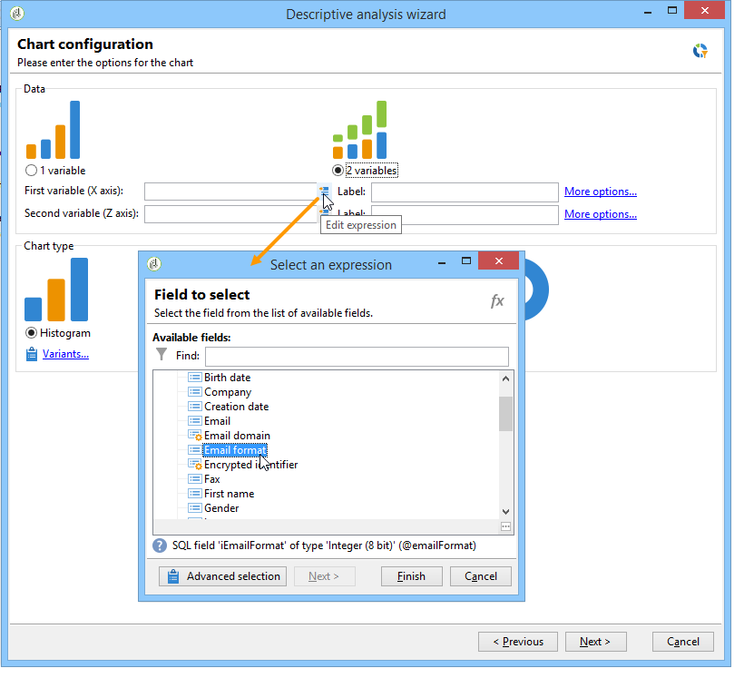

Then select the desired chart type.

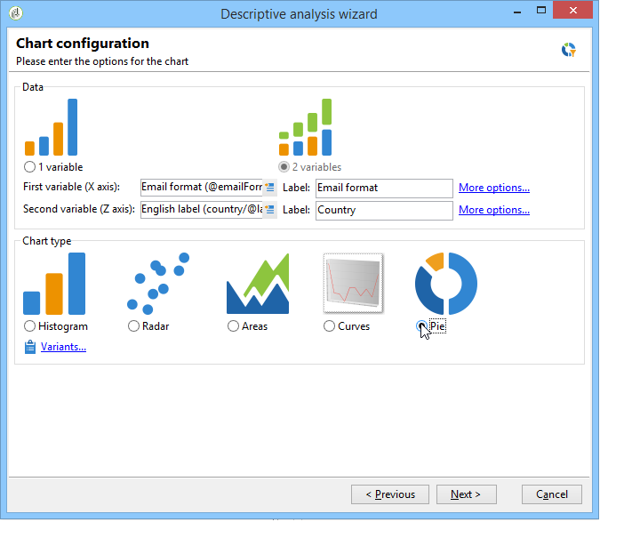

>[!NOTE]
>
>You can display the variables in a chart and a table at the same time. To do this, enter the variables in the **[!UICONTROL Table configuration]** window. Click **[!UICONTROL Next]** and select the type of chart in the chart configuration window. If sub-dimensions are defined in the table, they are not displayed in the chart.

Click the **[!UICONTROL Variants]** link to modify the chart properties. 

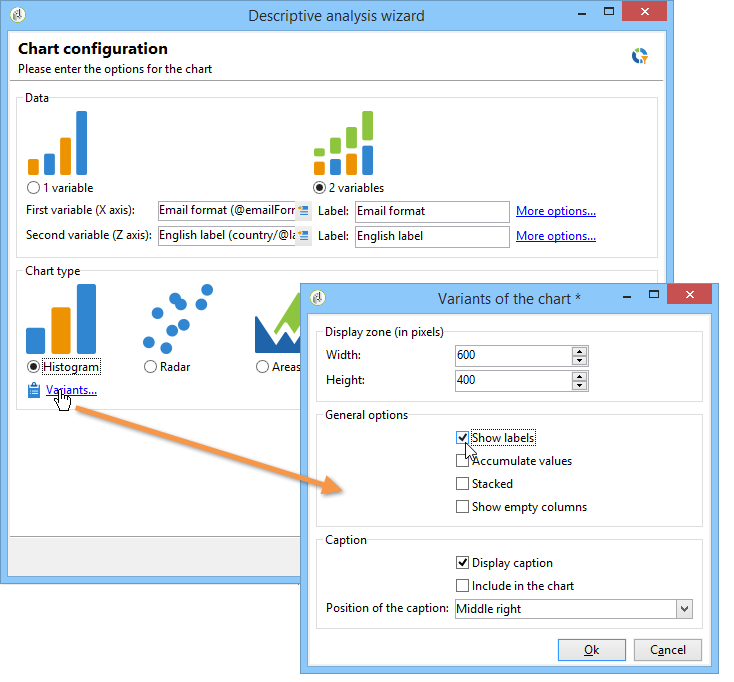

The options offered depend on the type of chart selected. For more information, refer to [this page](../../reporting/using/creating-a-chart.md#chart-types-and-variants).

### Statistics calculation {#statistics-calculation}

The descriptive analysis wizard lets you calculate several types of statistics on the data. By default, only one simple count is configured.

Click **[!UICONTROL Add]** to create a new statistic.

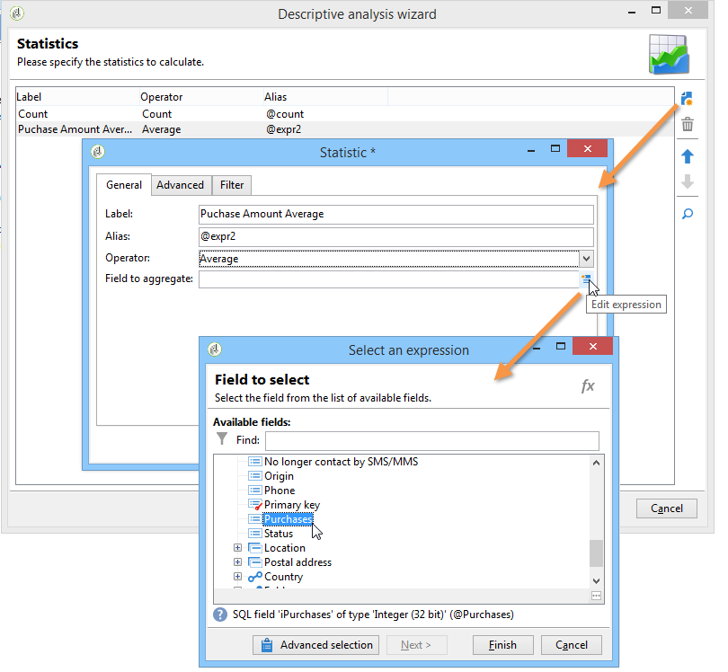

The following operations are possible:

* **[!UICONTROL Count]** to count all non-null values of the field to be aggregated, including duplicate values (of the aggregate field),
* **[!UICONTROL Average]** to calculate the average of the values in a numerical field,
* **[!UICONTROL Minimum]** to calculate the minimum of the values in a numerical field,
* **[!UICONTROL Maximum]** to calculate the maximum of the values in a numerical field,
* **[!UICONTROL Sum]** to calculate the sum of the values in a numerical field,
* **[!UICONTROL Standard deviation]** to calculate how the returned values are scattered around the average,
* **[!UICONTROL Row percentage distribution]** to calculate the ratio of the value in a column and the value in a row (available for tables only),
* **[!UICONTROL Column percentage distribution]** to calculate the ratio of the value in a row to the value in a column (available for tables only),
* **[!UICONTROL Total percentage distribution]** to calculate the distribution of recipients concerned by the values,

  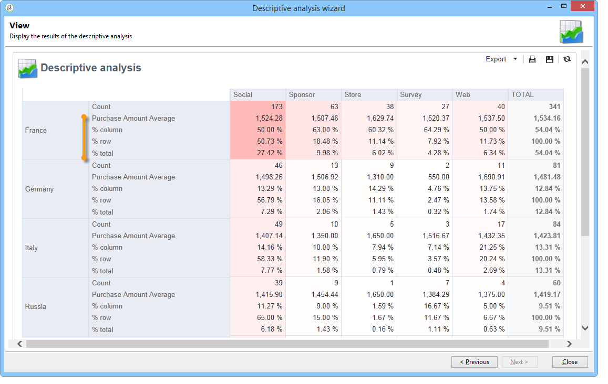

* **[!UICONTROL Calculated field]** to create a personalized operator (available for tables only). The **[!UICONTROL User function]** field lets you enter the calculation to be applied to the data.

  Example: Calculating the average purchase amount per customer based on country and origin

  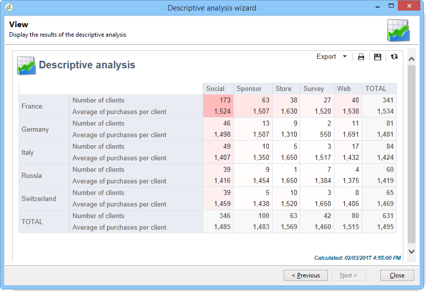

  To display the above information in a table, you need to create a calculated field for storing the average purchase amount per customer.

  To do this:

    1. Calculate the purchase total.
    
       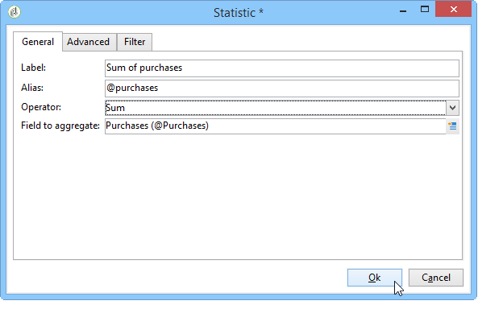

    1. This statistic won't be displayed in the table. You need to uncheck the **[!UICONTROL Display in the table]** option of the **[!UICONTROL Advanced]** tab. 
    
       

    1. Create a new **[!UICONTROL Calculated field]** type statistic and enter the following formula in the **[!UICONTROL User function]** field: **@purchases/@count**.
    
       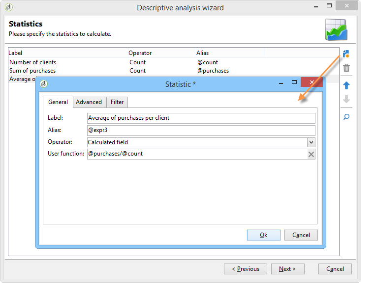

### Displaying the report {#displaying-the-report}

The last step of the wizard lets you display the report, i.e. the table or the chart as they have been configured.

When the report contains a table, the computation result cell is colored. The higher the result, the more intense the color.

It's possible to change the layout of results. To do this, right-click the concerned variable and select the input from the shortcut menu.

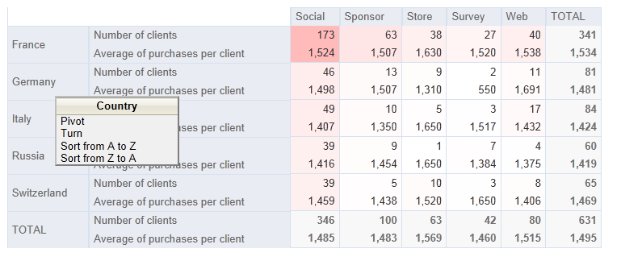

When the report includes a chart, the labels of the legend let you filter the displayed information: click a label to enable/disable display in the chart.

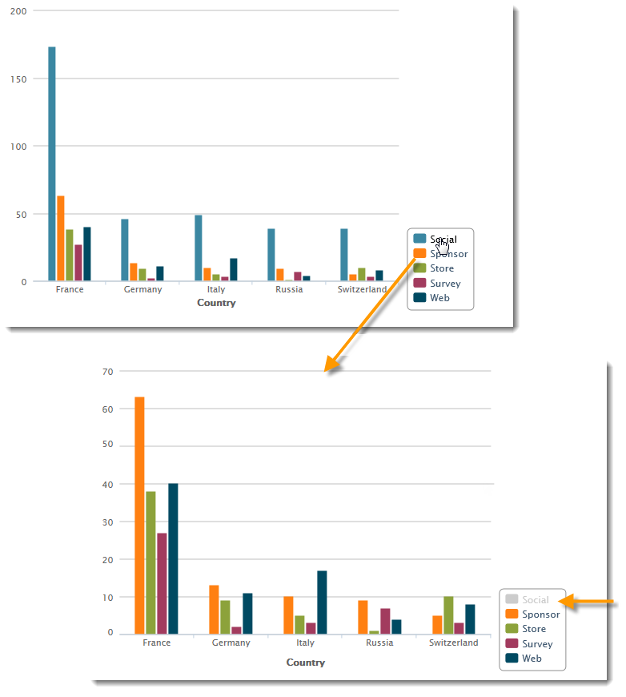

## Configuring the quantitative distribution template {#configuring-the-quantitative-distribution-template}

To generate a descriptive analysis yourself, select the **New descriptive analysis from a template** option if it isn't set by default.

The **[!UICONTROL Quantitative distribution]** template that lets you generate statistics on data which can be measured or counted (e.g. invoice amount, age of recipients).

The configuration mode of an analysis report created via the **[!UICONTROL Quantitative distribution]** template is detailed in an implementation example [Quantitative data analysis](../../reporting/using/use-cases.md#quantitative-data-analysis).

The options available when using the descriptive analysis wizard to create a quantitative report are detailed below.

Start by selecting the variable which the calculations concern:

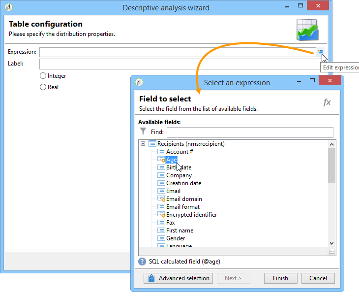

By default, Adobe Campaign offers a series of statistics to be calculated for the selected data. You can change this list, add to it or delete statistics depending on your needs.

The following operations are possible:

* **[!UICONTROL Count]** to count all non-null values of the field to be aggregated, including duplicate values (of the aggregate field),
* **[!UICONTROL Average]** to calculate the average of the values in a numerical field,
* **[!UICONTROL Minimum]** to calculate the minimum of the values in a numerical field,
* **[!UICONTROL Maximum]** to calculate the maximum of the values in a numerical field.
* **[!UICONTROL Sum]** to calculate the sum of the values in a numerical field,
* **[!UICONTROL Standard deviation]** to calculate how the values returned are distributed around the average.
* **[!UICONTROL Number of missing values]** to calculate the number of numeric fields without defined values.
* **[!UICONTROL Decile distribution]** to distribute the values returned such that each represents 1/10th of the values in a numeric field.
* **[!UICONTROL Custom distribution]** to distribute the values returned based on user-defined thresholds.

  The **[!UICONTROL Detail...]** button lets you edit a statistic and, if needed, personalize its calculation or its display:

  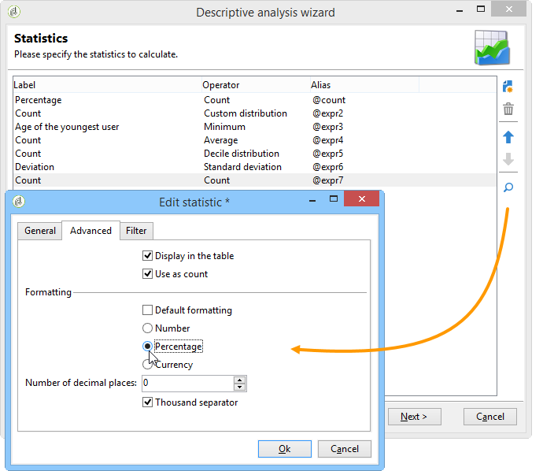

  The last step of the wizard shows the quantitative analysis report.

  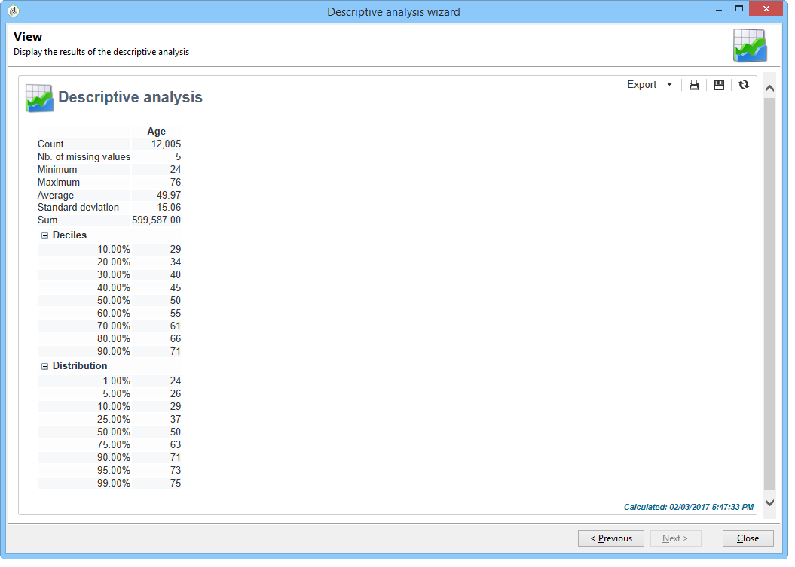

  To make changes to the report, refer to [Processing a report](../../reporting/using/processing-a-report.md).
