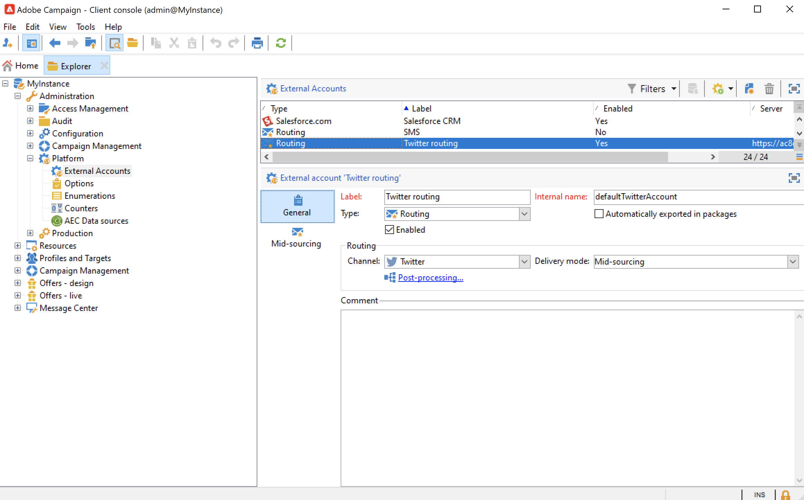

# About social marketing{#about-social-marketing}

The **Managing social networks** (Social Marketing) application designed for managing social networks lets you interact with customers and prospects via Twitter.

Learn key steps to integrate Campaign and Twitter in [Campaign v8 documentation](https://experienceleague.adobe.com/docs/campaign/campaign-v8/connect/ac-tw.html){target="_blank"}.

As an on-premise or hybrid customer, your Twitter External account must be configured and enabled. For hybrid configurations, the **Mid-sourcing** tab must also be set with an active connection to the mid-sourcing platform.

