# Configuring publishing on Twitter{#configuring-publishing-on-twitter}

In order for Adobe Campaign to be able to send tweets to your Twitter accounts, you need to delegate write access to Adobe Campaign for these accounts. To do this, apply the following configuration steps:

* Create a Twitter account.
* Create a test Twitter account for sending proofs.
* Create one Twitter application per Twitter account.
* For each Twitter application, create a new **[!UICONTROL Twitter]** type service.

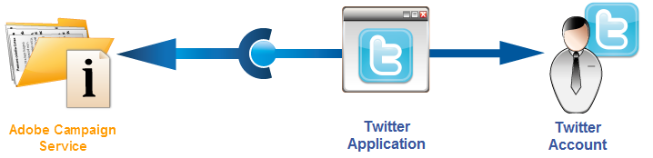

## Prerequisites {#prerequisites}

Start by creating one or more Twitter accounts to send your tweets to.

To create a Twitter account, go to [https://twitter.com](https://twitter.com).

## Creating a test account on Twitter {#creating-a-test-account-on-twitter}

We also recommend creating a private Twitter account which can be used for sending tweet proofs (for more on this, refer to [Sending the proof](../../social/using/publishing-on-twitter.md#sending-the-proof)):

* Create a new Twitter account.
* Click the menu in the top right-hand corner and select **[!UICONTROL Settings]**.
* Select the **[!UICONTROL Security and privacy]** tab, and check the **[!UICONTROL Protect my Tweets]** box. 
* Click the **[!UICONTROL Save Changes]** button at the bottom of the page.

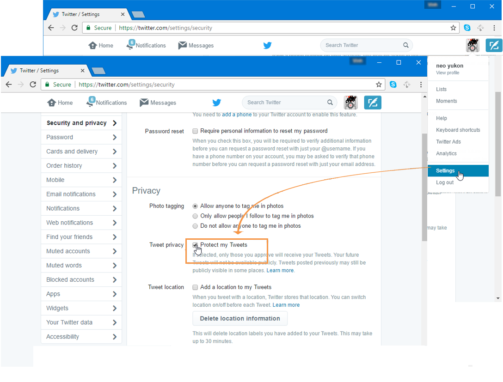

## Creating an application on Twitter {#creating-an-application-on-twitter}

In order for Adobe Campaign to be able to send tweets to your Twitter accounts, you need to create one Twitter application per Twitter account. To do this, apply the following steps:

1. Log on to your Twitter account.
1. Enter the following address in your internet browser: [https://apps.twitter.com/](https://apps.twitter.com/).
1. Then click the **[!UICONTROL Create New App]** button on the right.

   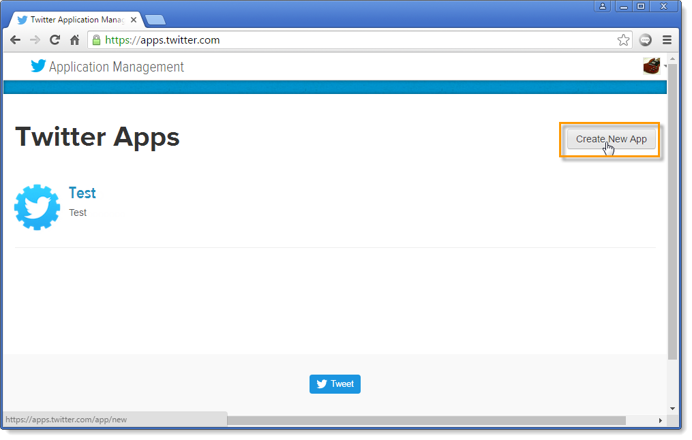

1. Let the wizard guide you through the process.

   In order for this application to allow Adobe Campaign to send tweets to your account, go to the **[!UICONTROL Permissions]** tab of the application and select **[!UICONTROL Read and Write]** for the **[!UICONTROL Access]** section. In the **[!UICONTROL Settings]** tab, you also need to leave the **[!UICONTROL Callback URL]** field empty.

   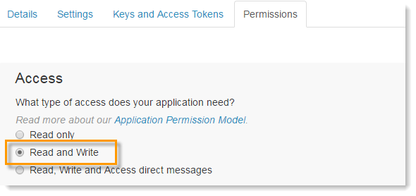

## Delegating write access to Adobe Campaign {#delegating-write-access-to-adobe-campaign}

For each Twitter application, you need to create a different **[!UICONTROL Twitter]** type service which will include the application settings.

This step requires simultaneous access to your Adobe Campaign console and an Internet browser logged on to your Twitter account:

* **Twitter**: select the application created previously ([https://dev.twitter.com/apps](https://dev.twitter.com/apps)), and click the **[!UICONTROL Keys and Access Tokens]** tab.

  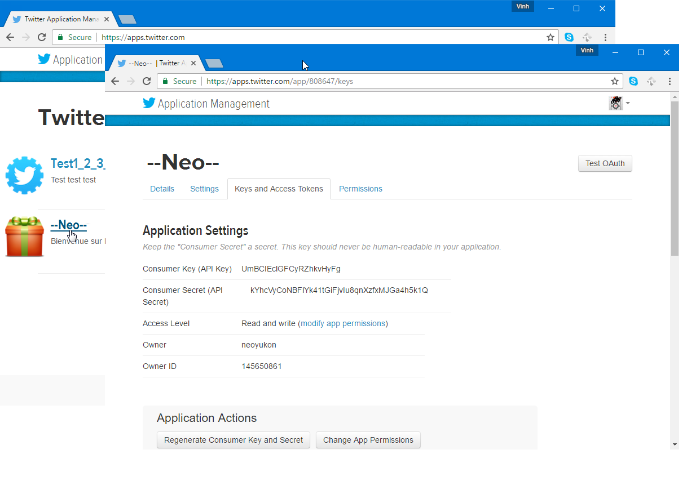

* **Adobe Campaign**: go to the **[!UICONTROL Profiles and targets]** tab, click the **[!UICONTROL Services and Subscriptions]** link and click the **[!UICONTROL Create]** button.

  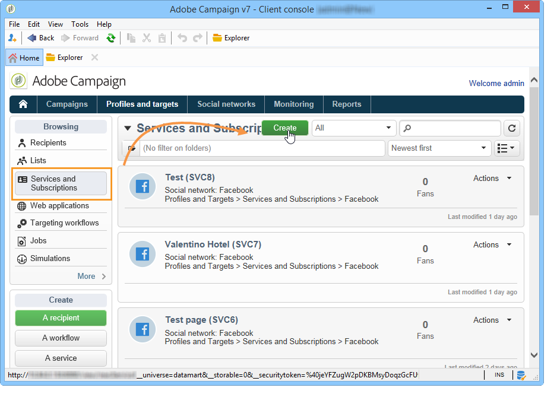

1. Select the **[!UICONTROL Twitter]** type.

   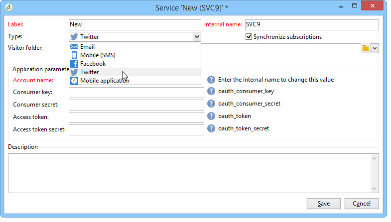

   >[!NOTE]
   >
   >The **[!UICONTROL Synchronize subscriptions]** option is enabled by default. When the box is checked, the Twitter account synchronization workflow (refer to [Synchronizing Twitter accounts](#synchronizing-twitter-accounts)) recovers the list of Twitter followers so that you may send them direct messages (refer to [Sending direct messages to subscribers](../../social/using/publishing-on-twitter.md#sending-direct-messages-to-subscribers)). If you do not want to recover the list of followers, uncheck this box.

1. Enter the label and internal name of the service.

   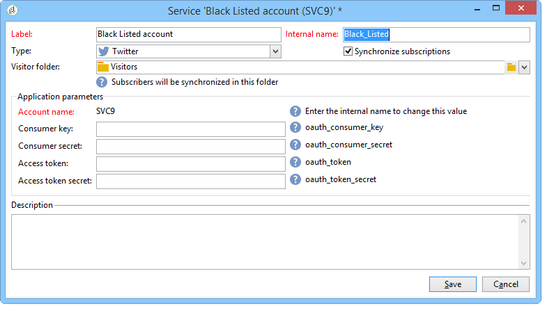

   >[!IMPORTANT]
   >
   >The **[!UICONTROL Internal name]** of the service must be identical to the name of the Twitter account. To make sure there are no entry errors, apply the following steps below.

    * Click the **[!UICONTROL Save]** button.
    * In the overview of services, click the Twitter type service which you have just created.
    * Select the **[!UICONTROL Twitter page]** tab. The Twitter account should be displayed. 
    
      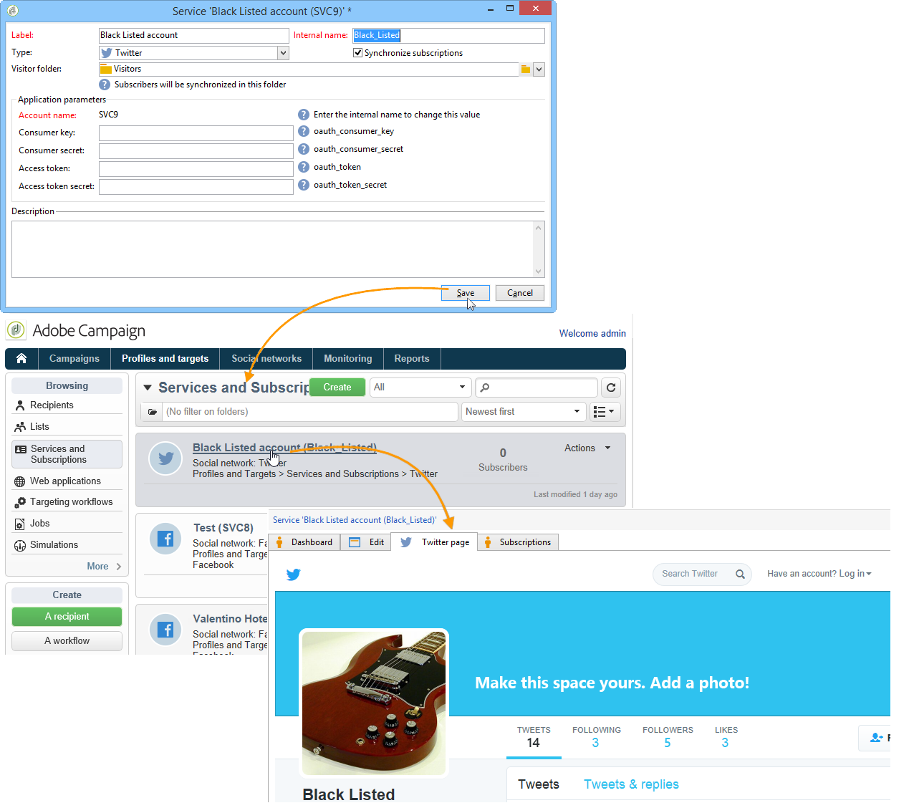

1. In the **[!UICONTROL Visitor folder]** field, select the visitor folder which the followers will be created in. For more on this, refer to [Operating principle](../../social/using/publishing-on-twitter.md#operating-principle). By default, followers will be created at the root of the **[!UICONTROL Visitors]** folder.

   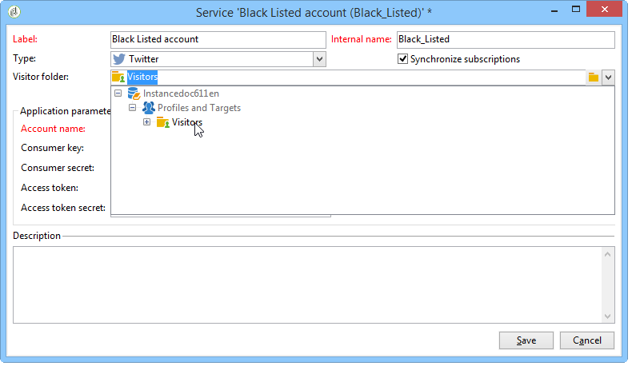

1. On Twitter, copy the content of the **[!UICONTROL Consumer Key (API Key)]** and **[!UICONTROL Consumer Secret (API Secret)]** fields and paste it into the **[!UICONTROL Consumer key]** and **[!UICONTROL Consumer secret]** fields of the console.

   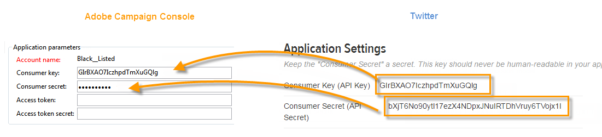

1. On Twitter, copy the content of the **[!UICONTROL Access Token]** and **[!UICONTROL Access Token Secret]** fields and paste it into the **[!UICONTROL Access token]** and **[!UICONTROL Access token secret]** fields of the console.

   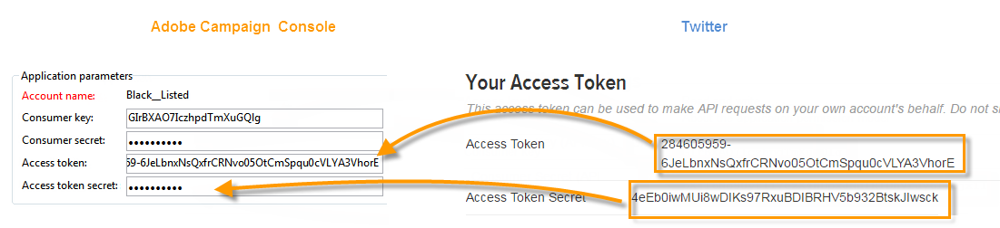

1. In the Adobe Campaign console, click **[!UICONTROL Save]**. Delegation of write access to Adobe Campaign is now complete.

   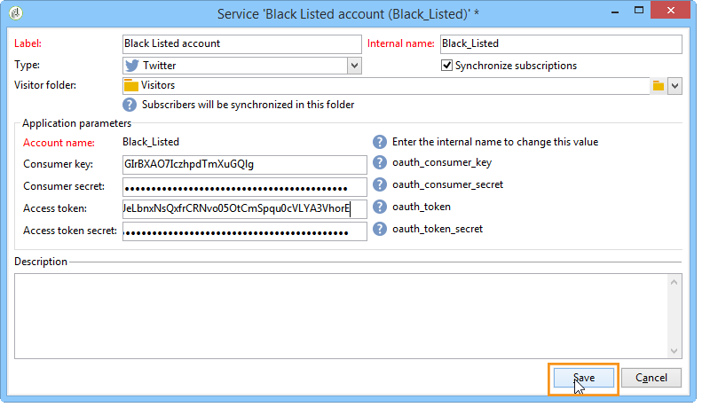

>[!NOTE]
>
>You must create one **[!UICONTROL Twitter]** type service per Twitter application.

The **[!UICONTROL Twitter account Synchronization]** workflow synchronizes Twitter accounts in Adobe Campaign. For more on this, refer to [Synchronizing Facebook pages](../../social/using/publishing-on-facebook-walls.md#synchronizing-facebook-pages).

## Synchronizing Twitter accounts {#synchronizing-twitter-accounts}

>[!IMPORTANT]
>
>In order for the workflow to recover the list of Twitter subscribers, the **[!UICONTROL Twitter account synchronization]** box must be checked in the editing section of the service linked to the account. For more on this, refer to [Delegating write access to Adobe Campaign](#delegating-write-access-to-adobe-campaign).

The **[!UICONTROL Twitter account synchronization]** workflow, which is accessed via the **[!UICONTROL Administration > Production > Technical workflows > Managing social networks]** node, lets you synchronize Twitter accounts configured previously with Adobe Campaign. By default, this workflow is triggered every Thursday at 7:30AM.

>[!NOTE]
>
>It is possible to start the workflow at any time by running anticipated task processing. You can also edit the scheduler to change the workflow triggering frequency. For more on the scheduler, refer to [this section](../../workflow/using/scheduler.md).

You may now send tweets to your Twitter accounts and direct messages to your followers. For more on this, refer to: [Publishing on Twitter](../../social/using/publishing-on-twitter.md).
