# Creating a Facebook application{#creating-a-facebook-application}

Thanks to web applications, Social Marketing lets you display personalized content in your Facebook applications, making it easier to acquire prospects via this social network. For more examples of Facebook type web applications, refer to [Examples of Facebook apps](../../social/using/examples-of-facebook-apps.md).

>[!NOTE]
>
>It is also possible to integrate Adobe Campaign with a Facebook application developed by a partner. In this case, there is no need to use the Adobe Campaign web application to acquire Facebook profiles. For more on this, refer to [Configuring external accounts](#configuring-external-accounts).

Apply the following configuration steps:

1. Create one or more Facebook applications. For more on this, refer to: [Creating a Facebook application](../../social/using/publishing-on-facebook-walls.md#creating-a-facebook-application).
1. Enter the **[!UICONTROL terms of service]** and **[!UICONTROL Privacy policy]** links to be displayed on the Facebook permission request screen. For more on this, refer to: [Entering the Terms of service and Privacy policy links](#entering-the-terms-of-service-and-privacy-policy-links). 
1. For each Facebook application, create a **[!UICONTROL Facebook Connect]** type external account. For more on this, refer to: [Configuring external accounts](#configuring-external-accounts).
1. For each Facebook application, create a Facebook type web application in Adobe Campaign. For more on this, refer to: [Creating a Facebook type web application](#creating-a-facebook-type-web-application).
1. Configure your Facebook applications so that they are displayed as tabs on your Facebook page. For more on this, refer to: [Configuring Facebook tabs](#configuring-facebook-tabs).

## Configuring external accounts {#configuring-external-accounts}

For each Facebook application, you need to create a **[!UICONTROL Facebook Connect]** type external account.

This step requires access to both your Adobe Campaign console and an Internet browser logged on to the Facebook account which you use for page administration:

* **Facebook**: select the previously created application ( [https://developers.facebook.com/apps](https://developers.facebook.com/apps)), and select the **[!UICONTROL Settings]** > **[!UICONTROL Basic]** tab.

  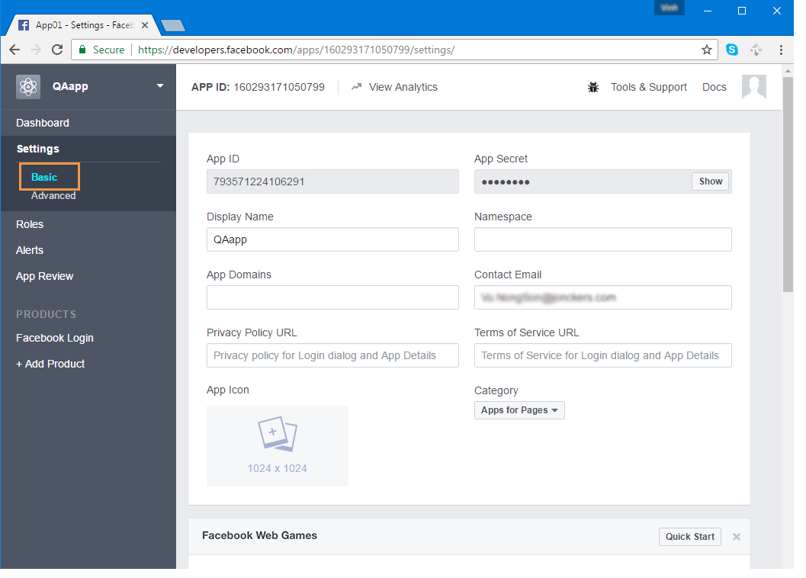

  >[!NOTE]
  >
  >If the **[!UICONTROL Facebook Web Games]** section does not appear, click the **[!UICONTROL Add Platform]** button, at the bottom of the page, and select **[!UICONTROL Facebook Web Games]**.

* **Adobe Campaign**: go to the **[!UICONTROL Administration > Platform > External accounts]** node of the tree and click **[!UICONTROL New]**.

  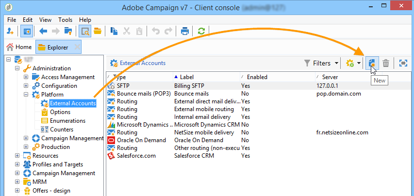

1. Enter a label and an internal name and select the **[!UICONTROL Facebook Connect]** type.

   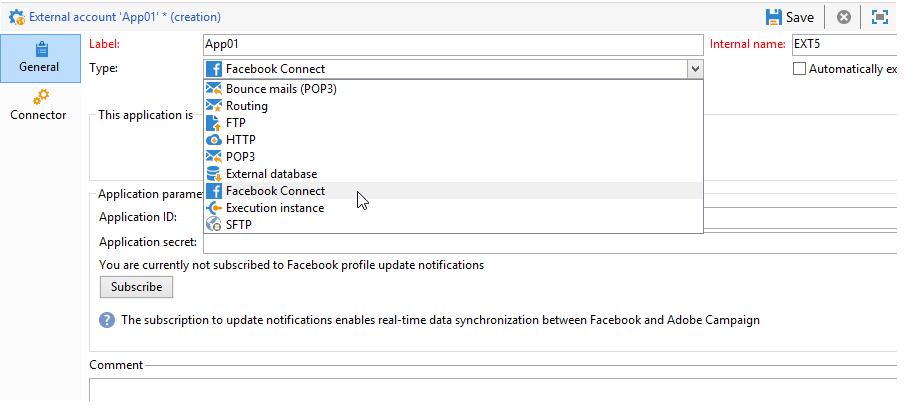

1. Select a hosting mode for the application: **[!UICONTROL hosted by a partner]** or **[!UICONTROL hosted by this instance]**.

   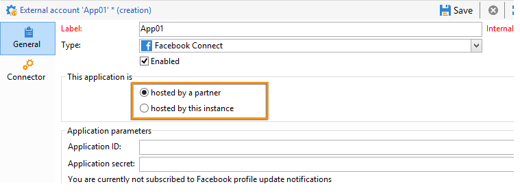

   **Application hosted by a partner**

   It is possible to integrate Adobe Campaign with a Facebook application developed by a partner. In this case, there is no need to use the Adobe Campaign web applications to acquire Facebook profiles. When the Facebook user installs the application, a key (access token) is generated. The partner forwards this access token to Adobe Campaign by calling up a web service. Adobe Campaign then uses this token to log on to the Facebook database and collect the data shared by the user via the application.

   >[!NOTE]
   >
   >The parameters of the web service are detailed in the WSDL file available here: **`https://<Instance name>/nl/jsp/schemawsdl.jsp?schema=nms:visitor`**

   To integrate the third-party application into Adobe Campaign, you need to copy the content of the **[!UICONTROL App ID]** and **[!UICONTROL App Secret]** Facebook fields and paste it into the **[!UICONTROL Application ID]** and **[!UICONTROL Application secret]** fields of the console.

   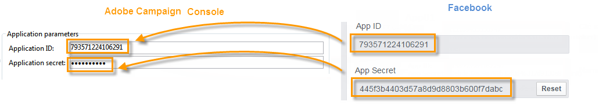

   **Application hosted by this instance**

   If you want to host the application on this instance (if you don't have a third-party application), you need to use the Adobe Campaign web applications to acquire Facebook profiles. For more on this, refer to [Examples of Facebook apps](../../social/using/examples-of-facebook-apps.md).

   In the Adobe Campaign console, copy the address contained in the **[!UICONTROL Secure Canvas URL]** field and paste it into the **[!UICONTROL Facebook Web games (https)]** field on Facebook (in the **[!UICONTROL Facebook Web Games]** section). 

   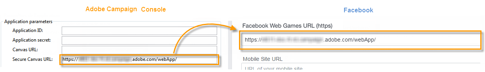

   >[!IMPORTANT]
   >
   >You must not use the unsecure URL under any circumstances.

   On Facebook, copy the content of the **[!UICONTROL App ID]** and **[!UICONTROL App Secret]** fields and paste it into the **[!UICONTROL Application ID]** and **[!UICONTROL Application secret]** fields in the console.

   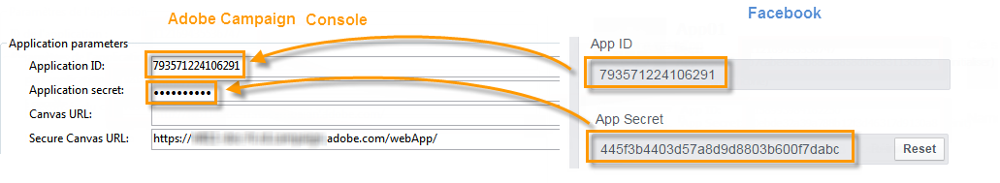

1. On Facebook, click the **[!UICONTROL Save Changes]** button at the bottom of the page.
1. In the Adobe Campaign console, click the **[!UICONTROL Subscribe]** button to enable Adobe Campaign to recover the data in real time each time a fan checks in via this application. For more on this, refer to: [Examples of Facebook apps](../../social/using/examples-of-facebook-apps.md).

   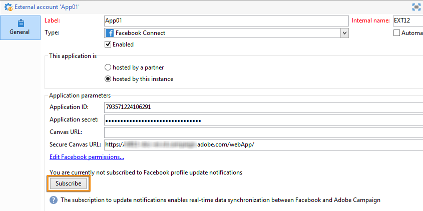

## Entering the Terms of service and Privacy policy links {#entering-the-terms-of-service-and-privacy-policy-links}

We strongly recommend adding the **[!UICONTROL Terms of service]** and **[!UICONTROL Privacy policy]** links, to be displayed on the Facebook permission request screen.

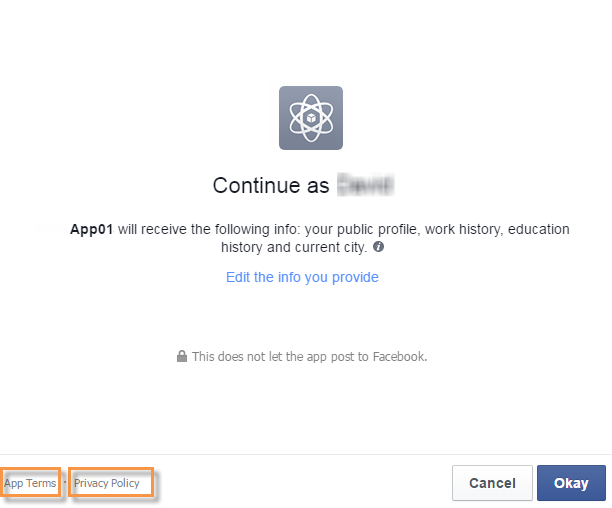

The configuration stages are as follows:

1. Enter the following address: [https://developers.facebook.com/apps](https://developers.facebook.com/apps), then select the Facebook application.
1. Select the **[!UICONTROL Settings > Basic]** tab and enter the **[!UICONTROL Privacy Policy URL]** and **[!UICONTROL Terms of Service URL]** fields.

   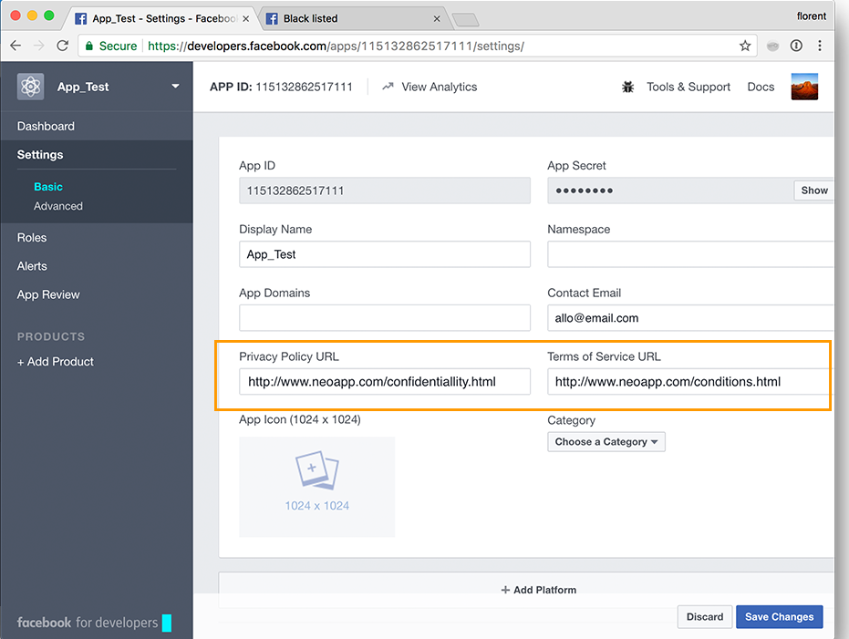

## Creating a Facebook type web application {#creating-a-facebook-type-web-application}

The Adobe Campaign Facebook application lets you display personalized content in your Facebook application. For each Facebook application, you need to create a web application in Adobe Campaign. To create a Facebook web application, proceed as follows:

1. Go to the **[!UICONTROL Social networks]** tab, click the **[!UICONTROL Applications]** link, then the **[!UICONTROL Create]** button.

   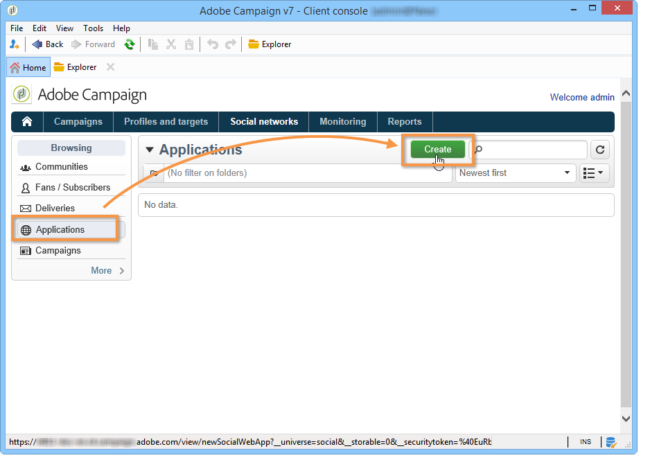

1. Select a Facebook web application template from the list and enter the label.

   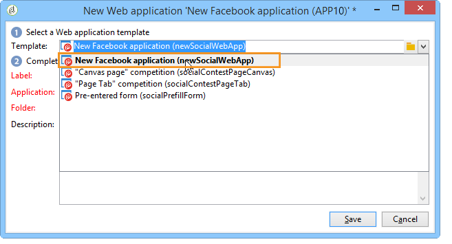

   >[!NOTE]
   >
   >There are four Facebook web application templates offered by default:
   >
   >* **[!UICONTROL New Facebook application]**: select this template if you want to start from a blank application.
   >* **[!UICONTROL Pre-entered form]**: Facebook application with a form and a "Facebook login" button which allows users to autofill the form's fields using the data from their profile. This allows the users to complete the form more quickly and for brands to obtain better quality information.
   >* **[!UICONTROL "Canvas page" competition]**: Facebook application that is displayed across the screen for a better visual experience for the users.
   >* **[!UICONTROL "Page Tab" competition]**: Facebook application fully integrated into the brand page tabs.

1. In the **[!UICONTROL Application]** field, enter the external account linked to the Facebook application. For more on this, refer to: [Configuring external accounts](#configuring-external-accounts).

   

1. Select the **[!UICONTROL Edit]** tab, then edit the web application. For more on this, refer to: [Examples of Facebook apps](../../social/using/examples-of-facebook-apps.md).

   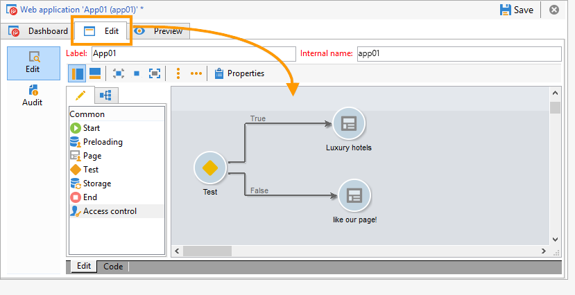

1. Once the web application is complete, select the **[!UICONTROL Dashboard]** tab, then click **[!UICONTROL Publish]** to publish online.

   

## Configuring Facebook tabs {#configuring-facebook-tabs}

You can configure your Facebook applications to be displayed as tabs on your Facebook page. To do this, apply the following steps:

1. Select the Facebook application ([https://developers.facebook.com/apps](https://developers.facebook.com/apps)), and select the **[!UICONTROL Settings > Basic]** tab.

   

1. At the bottom of the page, click the **[!UICONTROL Add Platform]** button, and select **[!UICONTROL Page Tab]**.

   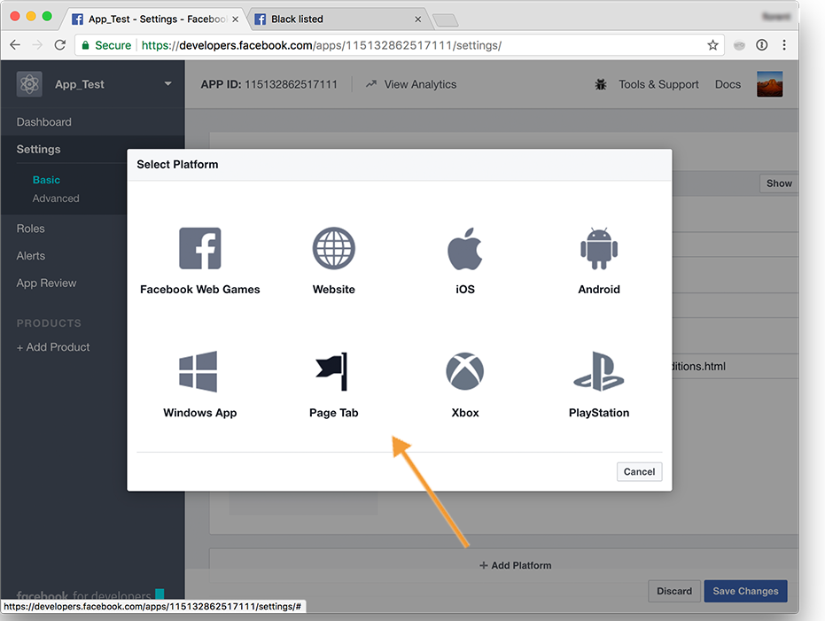

1. In the **[!UICONTROL Page Tab Name]** field of the **[!UICONTROL Page Tab]** section, enter the label as you want it to appear on the Facebook page.

   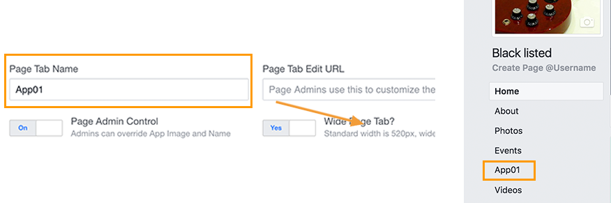

1. In the **[!UICONTROL Secure Page Tab URL]** field, enter the public URL of the web application, which is accessible via the **[!UICONTROL Dashboard]** tab of the web application. For more on creating Facebook type web applications, refer to [Creating a Facebook type web application](#creating-a-facebook-type-web-application).

   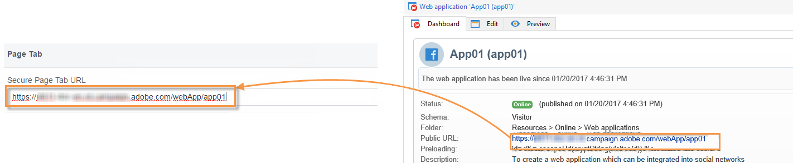

1. On the **[!UICONTROL Dashboard]** of the web application, click the **[!UICONTROL Add a page tab]** link.

   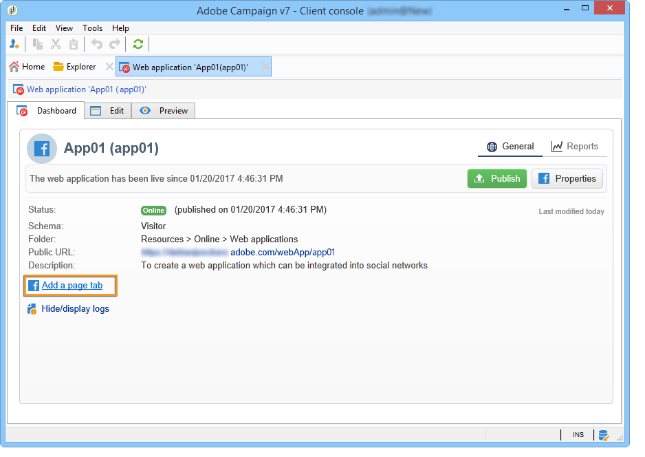

1. Select the Facebook page you want to add the tab to and click **[!UICONTROL Add Page Tab]**.

   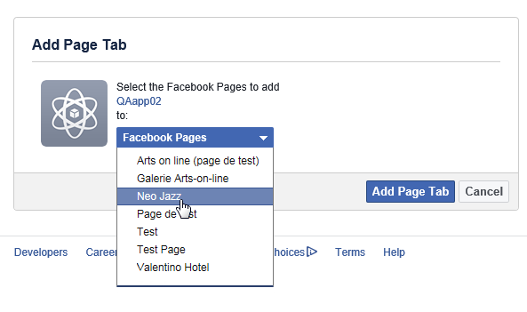
