# Examples of Facebook apps{#examples-of-facebook-apps}

When a user clicks the tab of a Facebook application, it is displayed in a space which is 810 pixels wide. Adobe Campaign uses a Facebook type web application to let you define and personalize the content displayed in the Facebook application, therefore making it easier to acquire profiles.

>[!NOTE]
>
>It is also possible to integrate Adobe Campaign with a Facebook application developed by a partner. In this case, there is no need to use the Adobe Campaign web application to acquire Facebook profiles. For more on this, refer to [Configuring external accounts](../../social/using/creating-a-facebook-application.md#configuring-external-accounts).

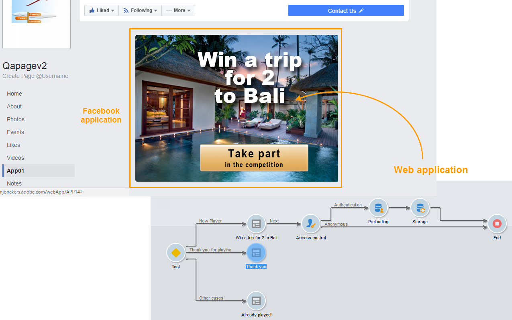

>[!IMPORTANT]
>
>Please comply with the configuration steps described in [Creating a Facebook application](../../social/using/creating-a-facebook-application.md).

>[!NOTE]
>
>This section details the elements linked to Facebook type web applications. All elements shared with standard web applications are detailed in [this section](../../web/using/about-web-applications.md).

The examples of Facebook type web applications detailed here are:

* How to create a Facebook application in 7 steps. Refer to [Quick start: creating a Facebook application in 7 steps](#quick-start--creating-a-facebook-application-in-7-steps).
* How to forward settings to a Facebook application. Refer to [How to forward settings to a Facebook application?](#how-to-forward-settings-to-a-facebook-application-).
* How to acquire fan data. Refer to [How to acquire fan data?](#how-to-acquire-fan-data-).

>[!IMPORTANT]
>
>These simple use cases are provided as examples to illustrate the functionalities of Facebook type web applications.

## Recommendations {#recommendations}

The following limitations are linked directly to Facebook:

* You must build all your web applications in HTTPS.
* A Facebook application displayed via a tab has a width of 810 pixels.

## Quick start: creating a Facebook application in 7 steps {#quick-start--creating-a-facebook-application-in-7-steps}

This example provides a step by step process of how to display an Adobe Campaign built application in Facebook. In this case, we want to create an application that lets you display the **Welcome** message when the user clicks the application tab (**App01**).

To create this application, apply the following steps:

1. Create an application on Facebook ( [https://developers.facebook.com/apps](https://developers.facebook.com/apps)). For more on this, refer to: [Creating a Facebook application](../../social/using/publishing-on-facebook-walls.md#creating-a-facebook-application).

   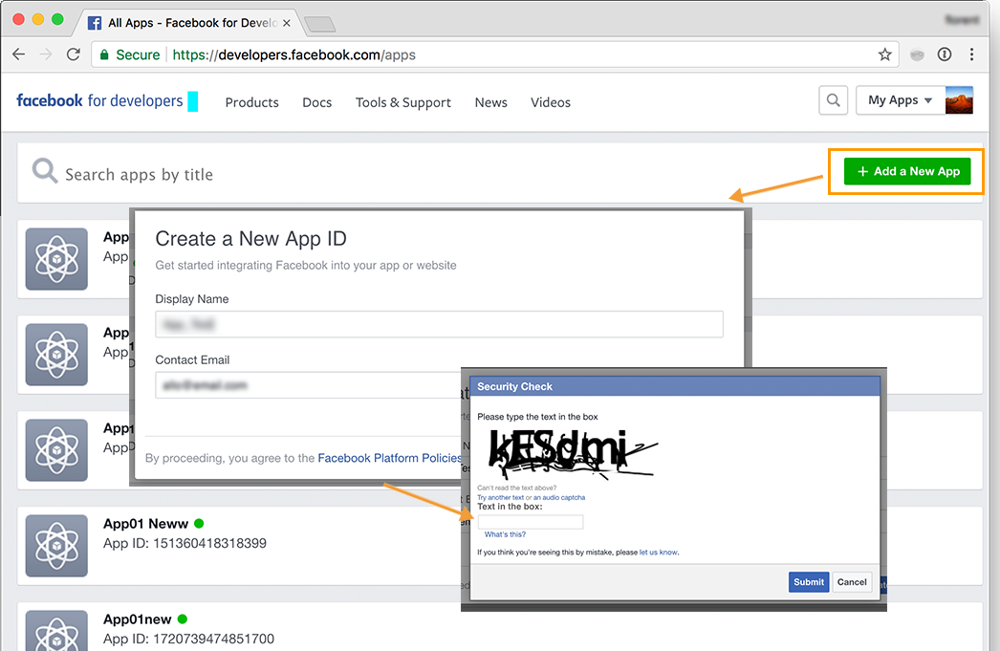

1. Create a **[!UICONTROL Facebook Connect]** type external account and enter the parameters of the Facebook application. For more on this, refer to: [Configuring external accounts](../../social/using/creating-a-facebook-application.md#configuring-external-accounts).

   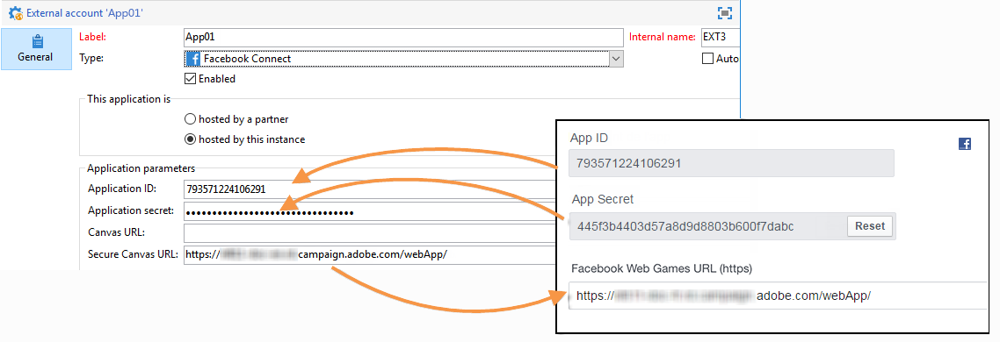

1. Enter the **[!UICONTROL Terms of service]** and **[!UICONTROL Privacy policy]** links to be displayed on the Facebook permission request screen. For more on this, refer to: [Entering the Terms of service and Privacy policy links](../../social/using/creating-a-facebook-application.md#entering-the-terms-of-service-and-privacy-policy-links). 

   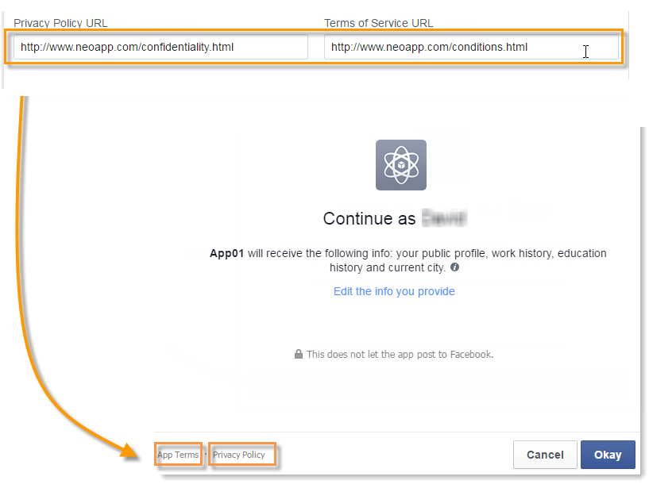

1. Create a Facebook type web application in Adobe Campaign. For more on this, refer to: [Creating a Facebook type web application](../../social/using/creating-a-facebook-application.md#creating-a-facebook-type-web-application).

   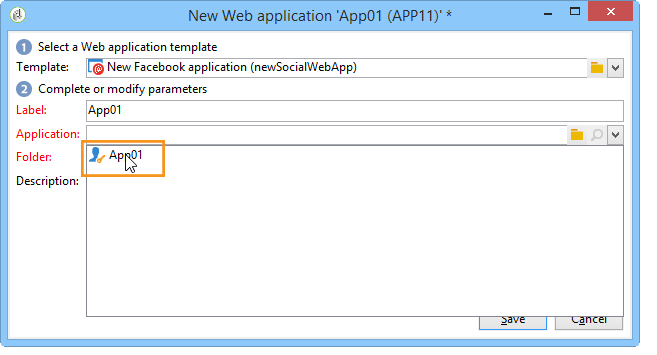

1. Edit your web application. In this example, we have added a **[!UICONTROL Page]** activity and defined a title for it.

   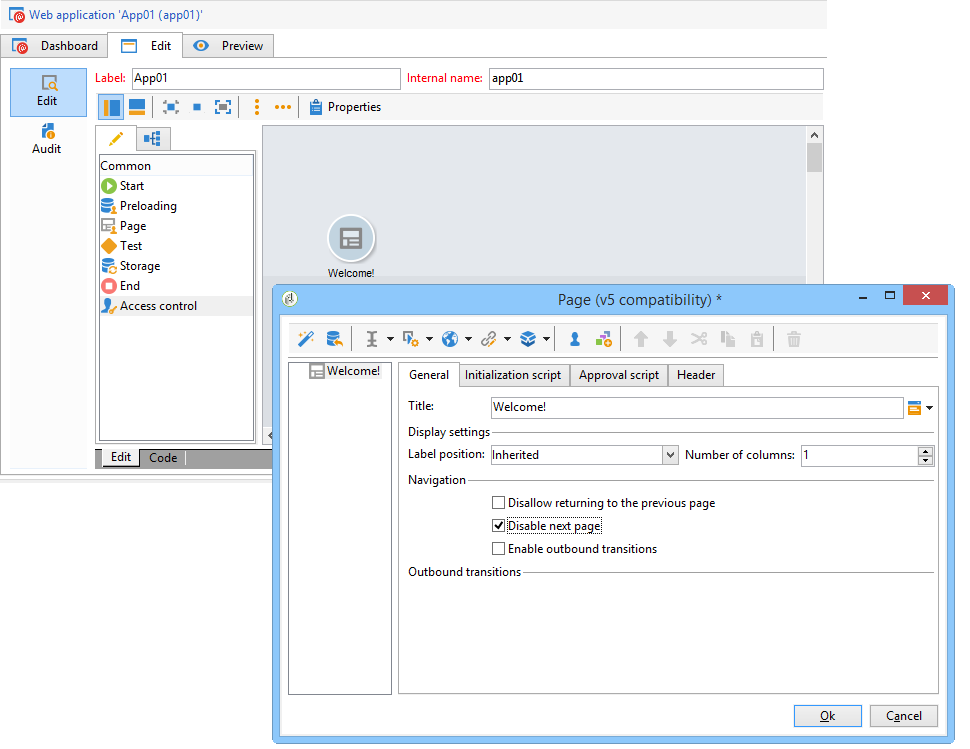

1. Deploy your application.

   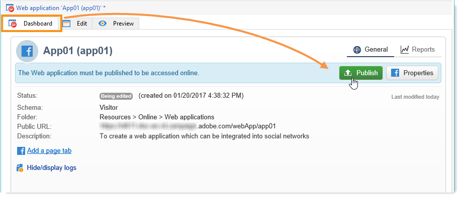

1. Configure your Facebook application so that it shows up as a tab on your Facebook page. For more on this, refer to: [Configuring Facebook tabs](../../social/using/creating-a-facebook-application.md#configuring-facebook-tabs).

   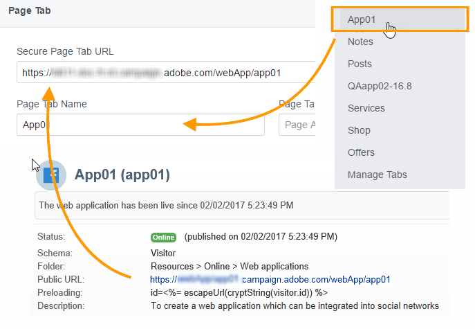

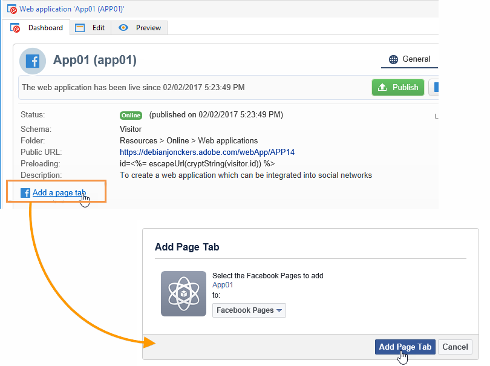

Check that the tab of the **App01** application shows up on your Facebook page. Clicking it should call up a **Welcome** message.

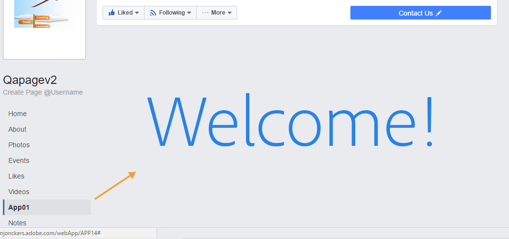

## How to forward settings to a Facebook application? {#how-to-forward-settings-to-a-facebook-application-}

>[!IMPORTANT]
>
>Comply with the configuration steps detailed in [Creating a Facebook application](../../social/using/creating-a-facebook-application.md).

In example 1, we personalized the display of the Facebook page according to the value in the **[!UICONTROL Fan of the page]** field. It is also possible to process the **[!UICONTROL Application settings]** field. This field lets you recover data contained in a link generated by Adobe Campaign, via Facebook.

Let's take the example of a company which decides to send an email campaign. In the delivery, a link points towards the Facebook application. This link is personalized thanks to the **[!UICONTROL app_data]** parameter added at the end of the URL. The value of this parameter could be an indicator which reflects customer significance. In our example, the values of the **[!UICONTROL app_data]** parameter are **[!UICONTROL big]** (significant customer) and **[!UICONTROL small]** (less significant customer).

Once it is personalized, the URL looks like this:

* `http://<path of the Facebook application>&app_data=big` (for a significant customer)
* `http://<path of the Facebook application>&app_data=small` (for a less significant customer)

Among the anonymous data forwarded to Adobe Campaign by Facebook, the value of the **[!UICONTROL Application parameters]** field is collected, thus enabling Adobe Campaign to personalize application display based on this parameter.

If the user is a significant customer (the value of the **[!UICONTROL app_data]** parameter is **[!UICONTROL big]**), the following image is displayed:

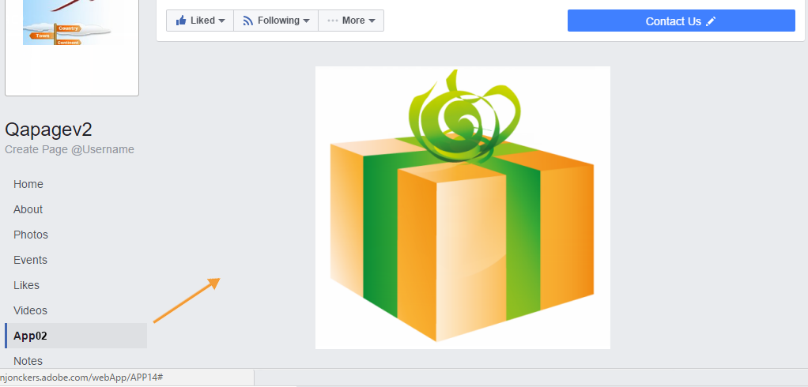

If the user is a less significant customer (the value of the **[!UICONTROL app_data]** parameter is **[!UICONTROL small]**), the following image is displayed:

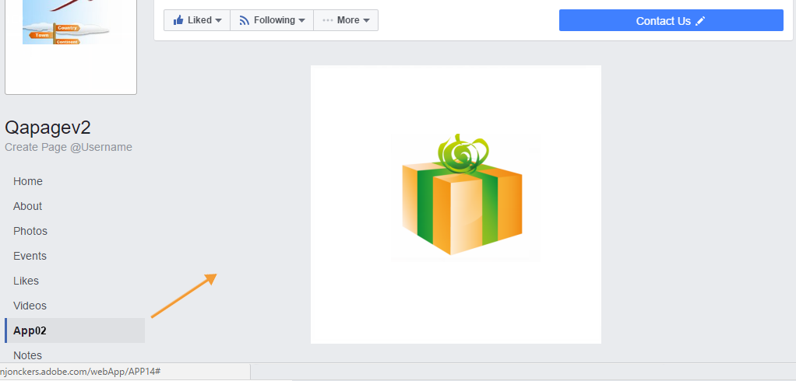

To recreate this use case, we have created a web application made up of the following elements:

* A **[!UICONTROL Test]** activity based on the **[!UICONTROL Application parameter]** field.
* two pages which contain the images to display according to the value of the **[!UICONTROL Application parameter]** field.

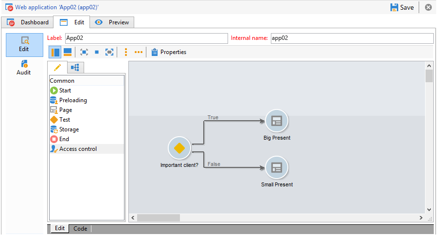

## How to acquire fan data? {#how-to-acquire-fan-data-}

>[!IMPORTANT]
>
>Comply with the configuration steps detailed in [Creating a Facebook application](../../social/using/creating-a-facebook-application.md).

This example shows you how to get in touch with Facebook users and offer for them to share their profile information. Let's take the example of a company which wants to acquire prospects and organizes a competition on their Facebook page to attract them.

Whenever a user clicks the **[!UICONTROL App03]** tab, we ask them if they want to take part in the competition.

If they decide to take part in the competition, we offer for them to share their profile information. 

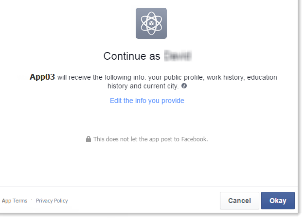

If they agree to share their information, the following screen is displayed.

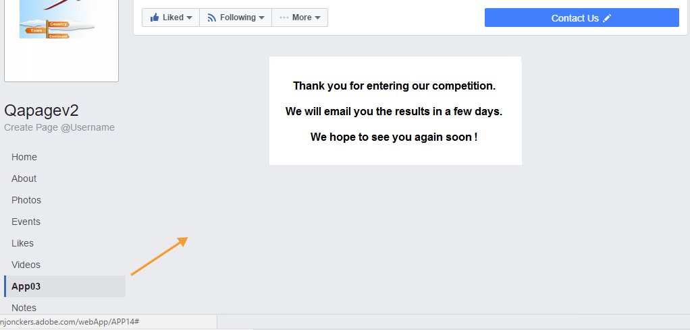

To build this use case, we have created a web application which includes the following elements:

* a **[!UICONTROL Test]** activity
* three pages
* an **[!UICONTROL Access control]** activity
* a **[!UICONTROL Pre-loading]** activity
* a **[!UICONTROL Save]** activity
* an **[!UICONTROL End]** activity

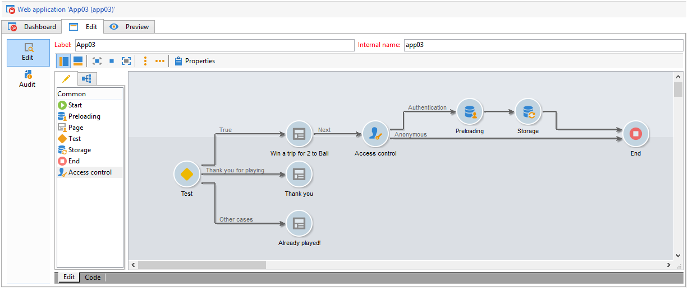

### Test activity {#test-activity}

The **[!UICONTROL Test]** activity is based on the **[!UICONTROL ID]** and **[!UICONTROL Application parameters]** field.

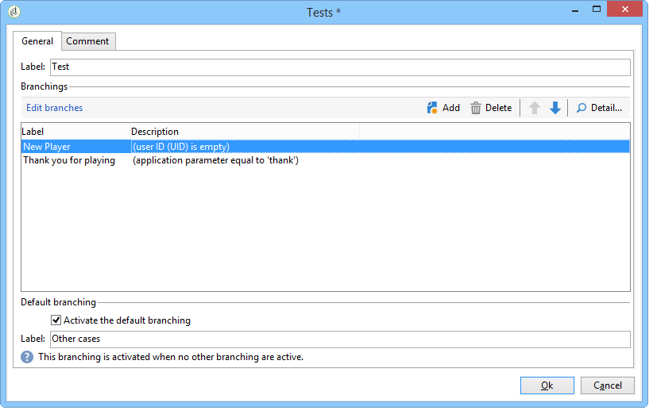

It is made up of three branches:

* **[!UICONTROL identifier (UID) is empty]** : the identifier is only forwarded by Facebook if the user has already agreed to share their information. The first branch of the **[!UICONTROL Test]** activity lets you make the competition available only to users who have never entered, i.e. those with an empty ID.
* **[!UICONTROL application parameter equals 'thanks']** : to sidestep a display error linked to Facebook, the web application end page points towards the URL of the Facebook application which the **[!UICONTROL app_data]** parameter is added to using the **[!UICONTROL thanks]** value (for more on this, refer to: [End activity](#end-activity)). The second branch lets you find out whether the user comes from the **[!UICONTROL End]** activity of the first branch (and has just entered the competition) to display a thank you message. For more on using additional URL parameters, refer to: [How to forward settings to a Facebook application?](#how-to-forward-settings-to-a-facebook-application-).
* **[!UICONTROL Default branch]** : if the user has already entered the competition (ID already entered) at a previous date (application parameter different from **[!UICONTROL thanks]**), we will display a page saying that they have already entered.

### Competition page {#competition-page}

To sidestep the display error linked to Facebook, you also need to select **[!UICONTROL Parent window]** or **[!UICONTROL In the top window]** in the **[!UICONTROL Window]** field of the competition page.

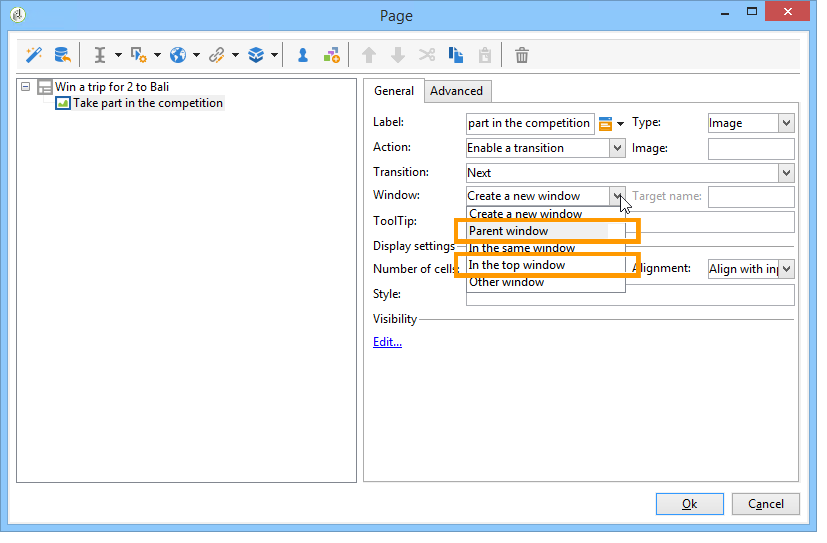

### Access control activity {#access-control-activity}

The **[!UICONTROL Access control]** activity lets you display the Facebook permission request page when the user enters the competition. If they agree to share their information, it is recovered during pre-loading. For more on this, refer to: [Pre-loading activity](#pre-loading-activity).

If you previously entered the external account when creating the web application (refer to [Creating a Facebook type web application](../../social/using/creating-a-facebook-application.md#creating-a-facebook-type-web-application)) you don't need to edit the activity. If not, go to the **[!UICONTROL Application]** field and select the external account linked to the Facebook application. 

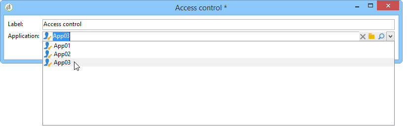

### Pre-loading activity {#pre-loading-activity}

Select the data source to be used for pre-loading:

* **[!UICONTROL Marketing database]** : this option lets you preload data via the Adobe Campaign database.
* **[!UICONTROL Facebook]** : this option lets you pre-load data using Facebook.

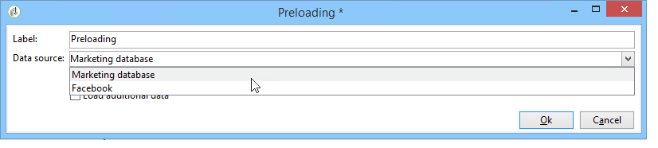

**Marketing database**

This option lets you recover the data of a profile which exists in the visitors table. Verification is carried out based on the external Facebook ID recovered when the user clicks on the Facebook application tab. If you add a form after the **[!UICONTROL Pre-loading]** activity, the fields which contain information in the database are pre-loaded. 

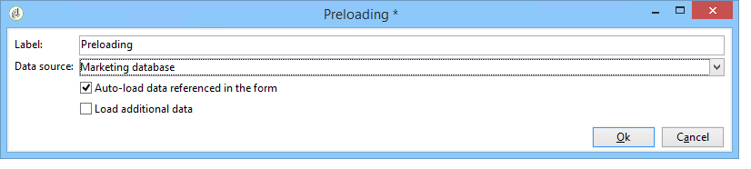

>[!NOTE]
>
>For more on pre-loading data via the Adobe Campaign database, refer to [this section](../../web/using/publishing-a-web-form.md#pre-loading-the-form-data).

**Facebook**

This option lets you define the Facebook profile information to collect, among that which the user has agreed to share, in view of saving it.

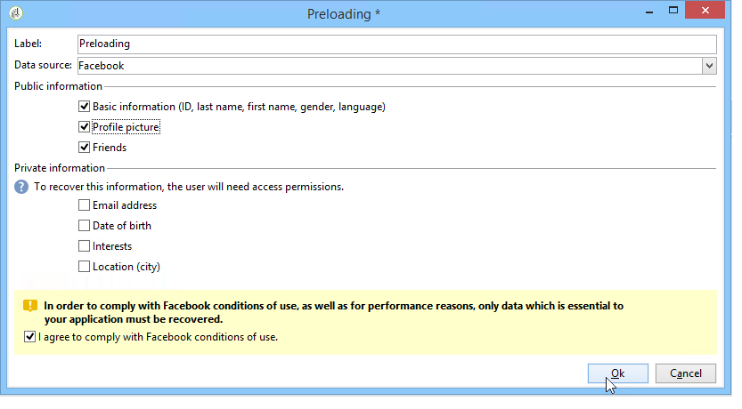

The **[!UICONTROL Database information]** option lets you collect the following data:

* **[!UICONTROL External ID]**: user ID
* **[!UICONTROL Gender]**: user's gender 
* **[!UICONTROL Verified]** : this field specifies whether or not the user has a verified Facebook account.
* **[!UICONTROL Full name]**: user's full name
* **[!UICONTROL First name]**: user's first name
* **[!UICONTROL Last name]**: user's last name
* **[!UICONTROL Language]**: user's language

You can also decide to collect the profile photo, the list of friends, email address, date of birth, interests and location by checking the appropriate boxes.

Before you click **[!UICONTROL Ok]**, check the **[!UICONTROL I agree to comply with Facebook conditions of use]** box.

>[!NOTE]
>
>If you check one or more boxes in the **[!UICONTROL Private information]** section, the Facebook permission request screen will automatically display the access request for this data.
>
>In order for you to collect the selected information, the user must agree to share it.
>
>If you want both types of pre-loading (via Adobe Campaign and via Facebook) add two pre-loading boxes one after the other.

### Save activity {#save-activity}

The **[!UICONTROL Save]** activity lets you store the information collected during the previous stages in the visitors' table.

If the profile already exists in the visitors' table, their data is updated with the new data collected.

If the profile doesn't exist in the database and the Facebook user's email address has been collected, a visitor will be created in the visitors' table.

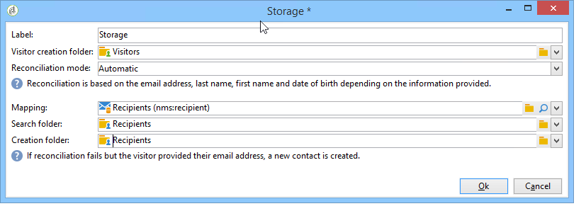

1. In the **[!UICONTROL Visitor creation folder]** field, select the folder which the profile will be created in. In case of a Facebook type web application, the default creation folder is **[!UICONTROL Visitors]**.
1. In the **[!UICONTROL Reconciliation mode]** field, select the reconciliation mode you want to use:

    * **[!UICONTROL Automatic]** : Reconciliation is carried out based on email, last name, first name and date of birth.
    * **[!UICONTROL Manual]** : Please select one or more reconciliation keys.
    * **[!UICONTROL None]** : No reconciliation will take place.

1. In the **[!UICONTROL Mapping]** field, select the schema which you want to carry out the reconciliation on.

   >[!IMPORTANT]
   >
   >Make sure the fields of the **[!UICONTROL Social networks]** tab are correctly entered in the delivery mapping. Delivery mappings are accessed via the **[!UICONTROL Administration > Campaign management > Target mappings]** node.

1. You can select a search folder for reconciliation and a creation folder for new profiles. If the fields are empty, profiles are searched for and created in the default folder of the mapping schema.

### End activity {#end-activity}

To sidestep the display error linked to Facebook, you need to check the **[!UICONTROL Use an external URL]** box and enter the URL of the Facebook application, followed by the **[!UICONTROL app_data]** parameter and a value. This value will be used in the **[!UICONTROL Test]** activity to detect whether or not the user has just entered the competition, and to display a thank you message if applicable. For more on this, refer to: [Test activity](#test-activity).

In our example, the value used is **thanks**.

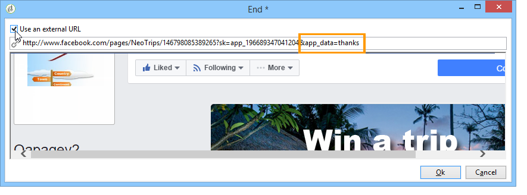

### Details screen of a visitor {#details-screen-of-a-visitor}

Just like for Twitter followers (refer to: [Operating principle](../../social/using/publishing-on-twitter.md#operating-principle)), recovered Facebook profiles are stored in the visitors' table. To display the list of visitors, go to the **[!UICONTROL Profiles and Targets > Visitors]** node.

Each Facebook prospect who agrees to share their profile information is added to the list of visitors. If the **[!UICONTROL Friends]** box is checked in the **[!UICONTROL Pre-load]** activity (refer to: [Pre-loading activity](#pre-loading-activity)), friends are also added.

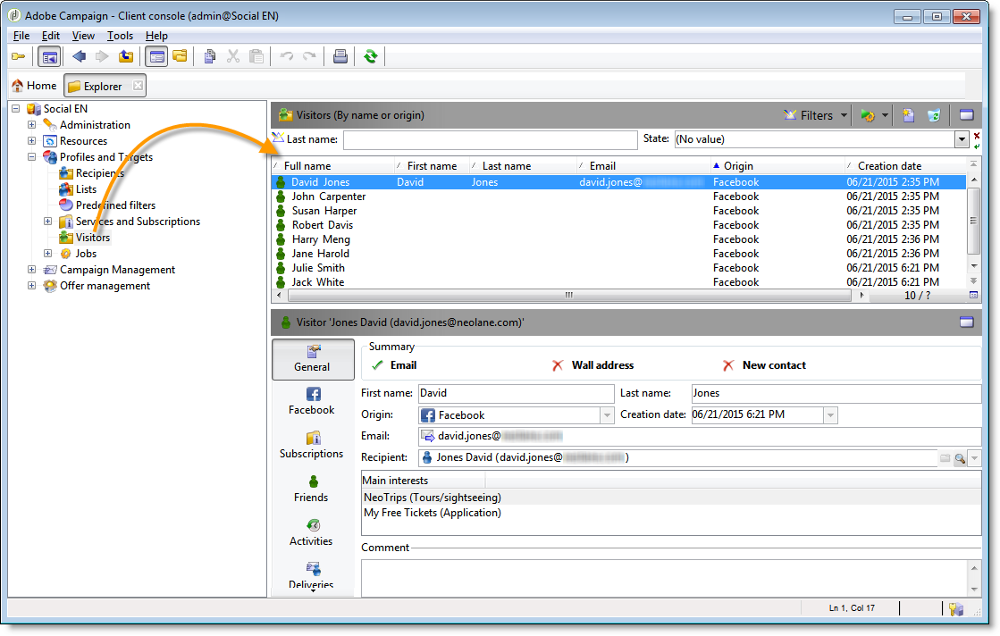

In the **[!UICONTROL Summary]** section of the visitor detail window, there are two possible states for the **[!UICONTROL New Contact]** indicator:

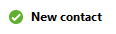

If a green check mark is displayed, this means the visitor wasn't reconciled with any recipients. In this case, a new profile is created in the list of recipients. 

A red cross means that the visitor was reconciled with a recipient. You can click the magnifier to the right of the **[!UICONTROL Recipient]** field to display the matching recipient. 

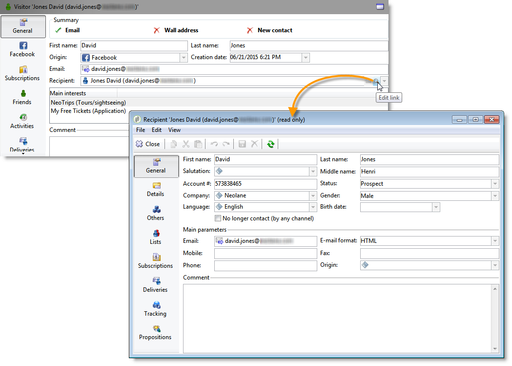

Go to the detail window of a recipient to display the matching visitor, if applicable. Select the **[!UICONTROL Others]** tab, then double-click the name of the visitor in the **[!UICONTROL Web identities]** section.

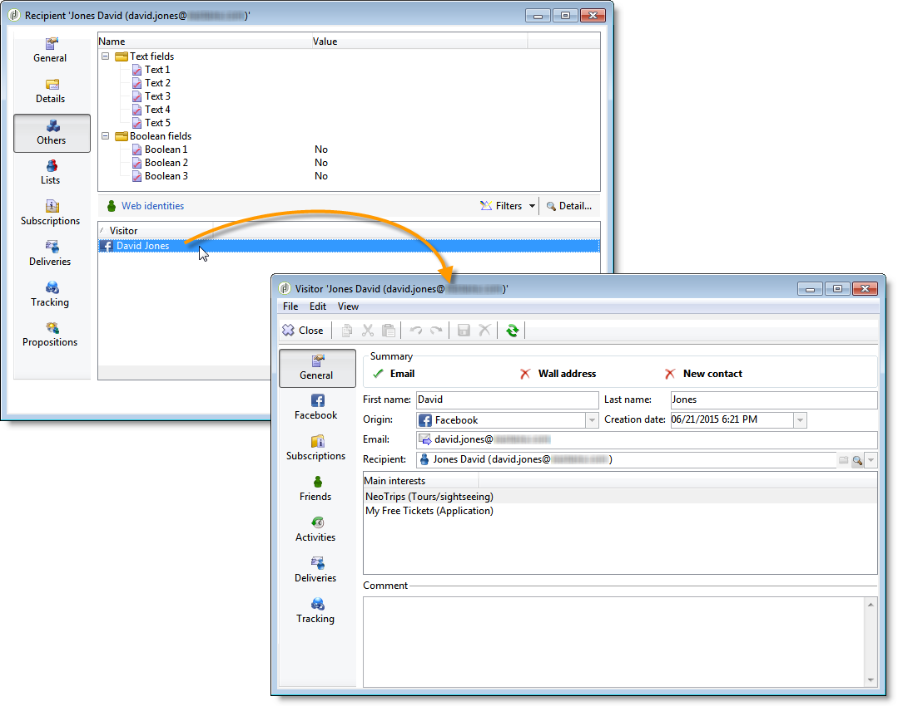

The **[!UICONTROL Activities]** screen of a visitor's details page contains the following information:

* "Open Graph" type fan activities: music played, videos watched, articles read and inferral of the applications installed (Deezer, Spotify, Dailymotion, Yahoo News, etc.)

  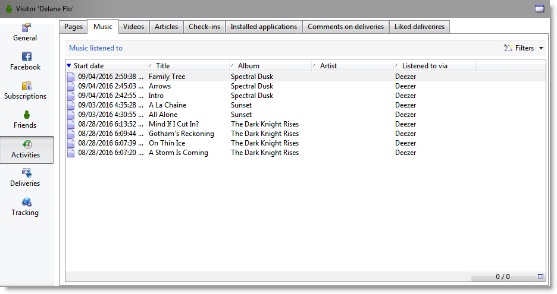

* "Likes" and comments added by the fan following deliveries sent by Adobe Campaign
* pages liked by the fan
* check-ins by the fan 

  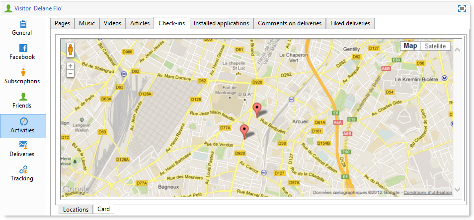

  >[!NOTE]
  >
  >In order for Adobe Campaign to collect a fan's check-ins, you need to click the **[!UICONTROL Subscribe]** button on the service configuration screen. For more on this, refer to [Configuring external accounts](../../social/using/creating-a-facebook-application.md#configuring-external-accounts).

## How to pre-load the fields of a form using Facebook profile data {#how-to-pre-load-the-fields-of-a-form-using-facebook-profile-data}

The **[!UICONTROL Social Marketing]** application also enables you to add a button to a form, for pre-loading fields using Facebook profile information. This option, which is available in all web application templates (**[!UICONTROL Page]** type activities) is detailed in [this section](../../web/using/static-elements-in-a-web-form.md#inserting-html-content).

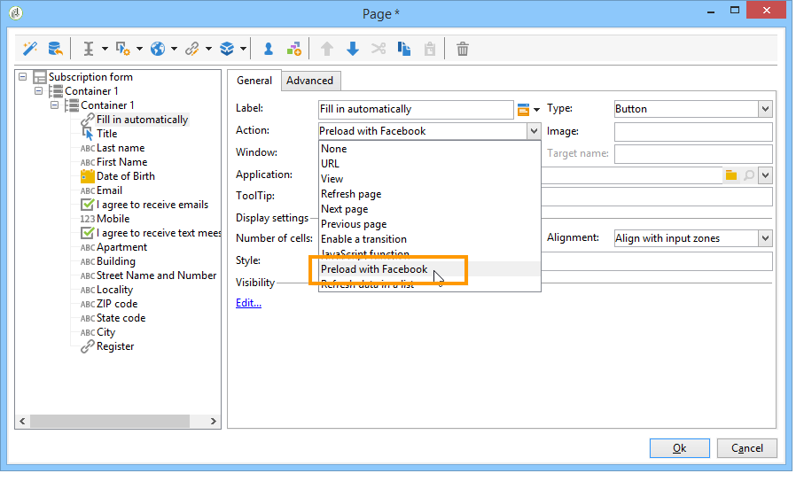

>[!NOTE]
>
>Before you start using this function, you need to create a Facebook application and a **[!UICONTROL Facebook Connect]** type external account. For more on this, refer to [Configuring external accounts](../../social/using/creating-a-facebook-application.md#configuring-external-accounts).
