# Publishing on Facebook walls{#publishing-on-facebook-walls}

In order for Adobe Campaign to be able to send publications to Facebook walls, you need to delegate the write access for these pages to Adobe Campaign. This involves the following configuration steps:

1. Create a Facebook account with one or more pages.
1. Create a test Facebook page for sending proofs.
1. Create a Facebook application.
1. Enter the Facebook application settings into Adobe Campaign, in the **[!UICONTROL Facebook routing]** external account.

## Prerequisites {#prerequisites}

Start by creating a Facebook account and several pages: these will be used for sending publications.

* To create a Facebook account, use the [https://www.facebook.com](https://www.facebook.com) link.
* To create a Facebook page, use the [https://www.facebook.com/pages/create](https://www.facebook.com/pages/create) link.

  We recommend using the same Facebook account to administer all your pages. This way you will only need one Facebook application and one external account to write on all pages of the account.

  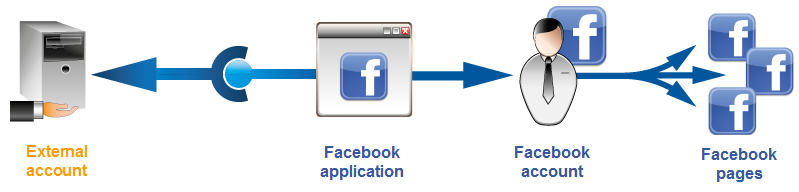

## Creating a test Facebook page {#creating-a-test-facebook-page}

We recommend creating a private Facebook page for delivering publication proofs (for more on this, refer to [Sending the proof](../../social/using/publishing-on-facebook.md#sending-the-proof).

1. Log on to the Facebook account which you use to administer your pages.
1. Create a new Facebook page.
1. Click the **[!UICONTROL Settings]** button in the top right-hand corner.
1. In the **[!UICONTROL General]** tab, modify the page's visibility parameters: check the **[!UICONTROL Page unpublished]** box.
1. Click the **[!UICONTROL Save Changes]** button.

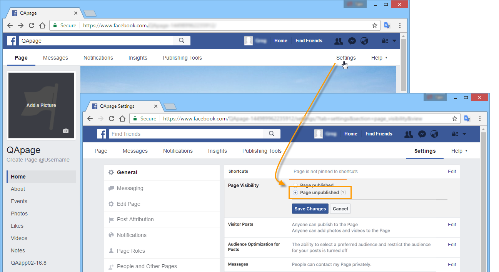

## Creating a Facebook application {#creating-a-facebook-application}

In order for Adobe Campaign to be able to publish on the walls of your pages, you need to create a Facebook application. To do this, apply the following steps:

1. Log on to the Facebook account which you use to administer pages. 
1. Enter the following address in your browser: [https://developers.facebook.com/apps](https://developers.facebook.com/apps).

   >[!IMPORTANT]
   >
   >Depending on the type of account you have, one or more authorizations may be necessary.
   >
   >To create a Facebook application, you will need a **verified** Facebook account.

1. Click the **[!UICONTROL Add a New App]** button in the top right-hand corner of the page. Enter an app name and a contact email, then pass the security check.

   

1. Under **[!UICONTROL Settings > Basic]**, click on **[!UICONTROL Add a platform]** and select the **[!UICONTROL Facebook Web Games]** type.

   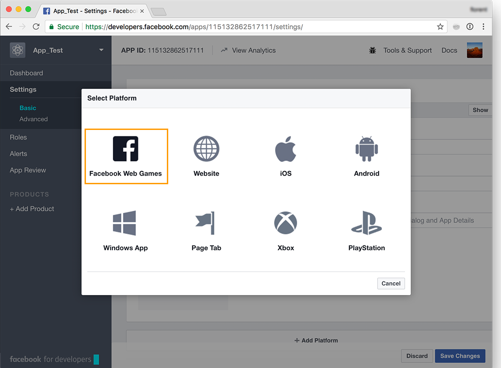

1. In the **[!UICONTROL Products]** section, in the left menu, check that you see the **[!UICONTROL Facebook Login]** product. If not, add a new product and select **[!UICONTROL Facebook Login]**.

   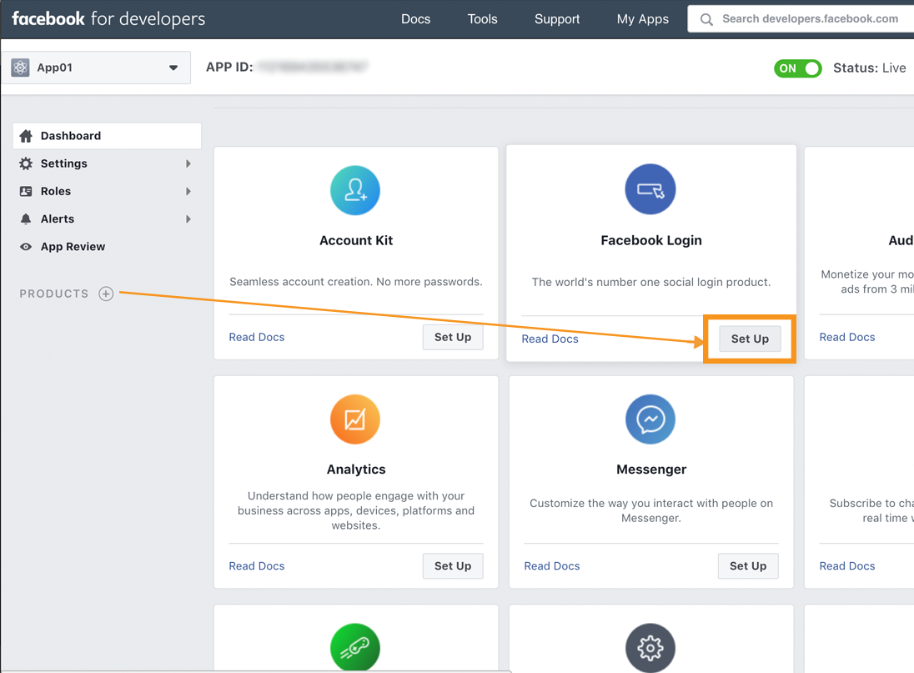

1. Once the application is created, select the **[!UICONTROL App Review]** tab and publish the application.

   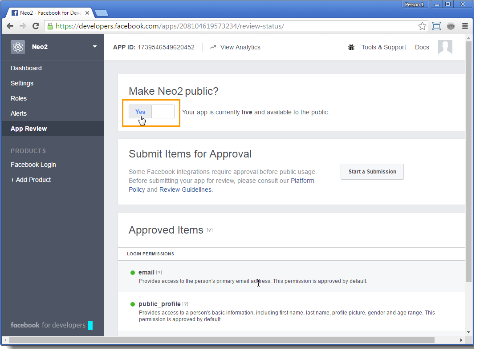

## Delegating write access to Adobe Campaign {#delegating-write-access-to-adobe-campaign}

To delegate write access to Adobe Campaign for posting on the walls of your pages, you need to enter the parameters of the previously created Facebook application.

This step requires access to both your Adobe Campaign console and an Internet browser logged on to the Facebook account which you use for page administration:

>[!IMPORTANT]
>
>The Adobe Campaign operator must have administration rights to carry out this configuration.

* **Facebook**: select the previously created application ( [https://developers.facebook.com/apps](https://developers.facebook.com/apps)), and select the **[!UICONTROL Settings > Basic]** tab.

  

  >[!NOTE]
  >
  >If the **[!UICONTROL Facebook Web Games]** section does not appear, click the **[!UICONTROL Add Platform]** button, at the bottom of the page, and select **[!UICONTROL Facebook Web Games]**.

* **Adobe Campaign**: go to the **[!UICONTROL Administration > Platform > External Accounts]** node of the tree, select the **[!UICONTROL Facebook routing]** external account and click the **[!UICONTROL Connector]** tab.

  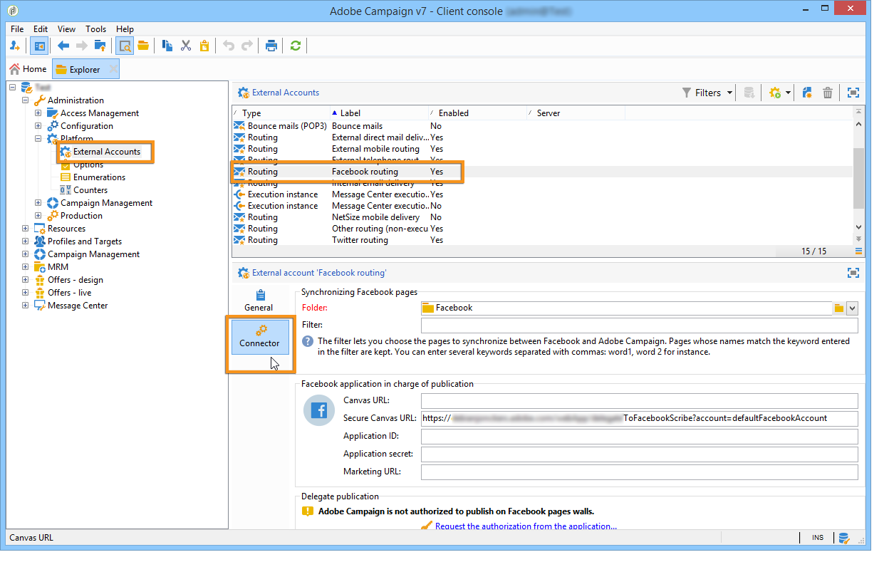

1. In the Adobe Campaign console, copy the address contained in the **[!UICONTROL Secure Canvas URL]** field and paste it into the **[!UICONTROL Secure Web Games URL (https)]** field on Facebook (in the **[!UICONTROL Facebook Web Games]** section). 

   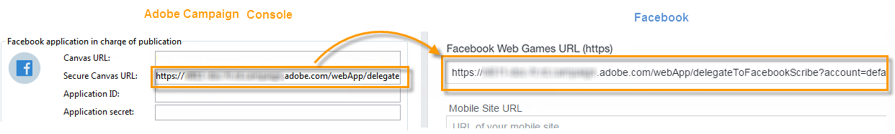

   >[!IMPORTANT]
   >
   >You must not use the unsecure URL under any circumstances.

   Copy and paste this URL also under **[!UICONTROL Products]** > **[!UICONTROL Facebook Login]** > **[!UICONTROL Settings]** > **[!UICONTROL Valid OAuth Redirect URIs]**. To check the validity of the URL, save the application, copy and paste the URL in the **[!UICONTROL Redirect URI to Check]** field and click on **[!UICONTROL Check URI]**.

   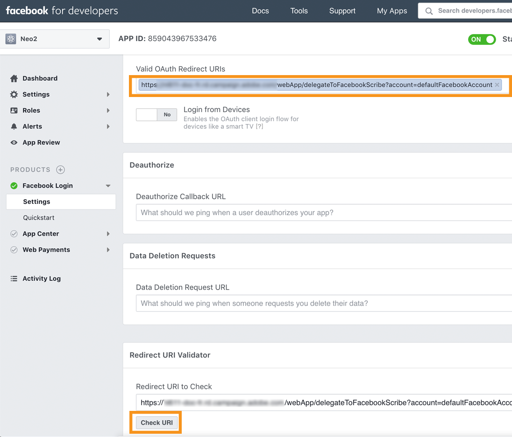

1. On Facebook, copy the content of the **[!UICONTROL App ID]** and **[!UICONTROL App Secret]** fields and paste it into the matching fields of the console.

   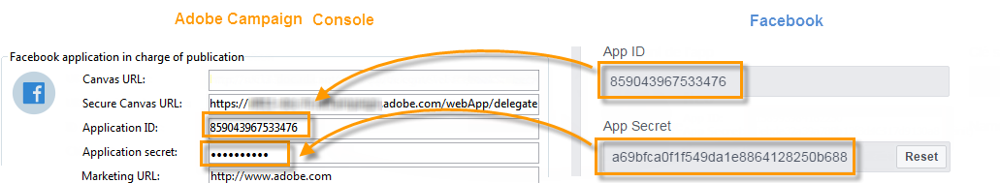

1. On Facebook, click the **[!UICONTROL Save Changes]** button at the bottom of the page. 
1. Go to the Adobe Campaign console, save the external account.

   >[!NOTE]
   >
   >The **[!UICONTROL Marketing URL]** field is optional.

1. In the Adobe Campaign console, click the **[!UICONTROL Request the authorization from the application]** link at the bottom of the **[!UICONTROL Connector]** tab. The **[!UICONTROL Synchronize Facebook pages]** workflow is triggered automatically and collects all Facebook pages managed by the administrator. For more on this, refer to [Synchronizing Facebook pages](#synchronizing-facebook-pages).

   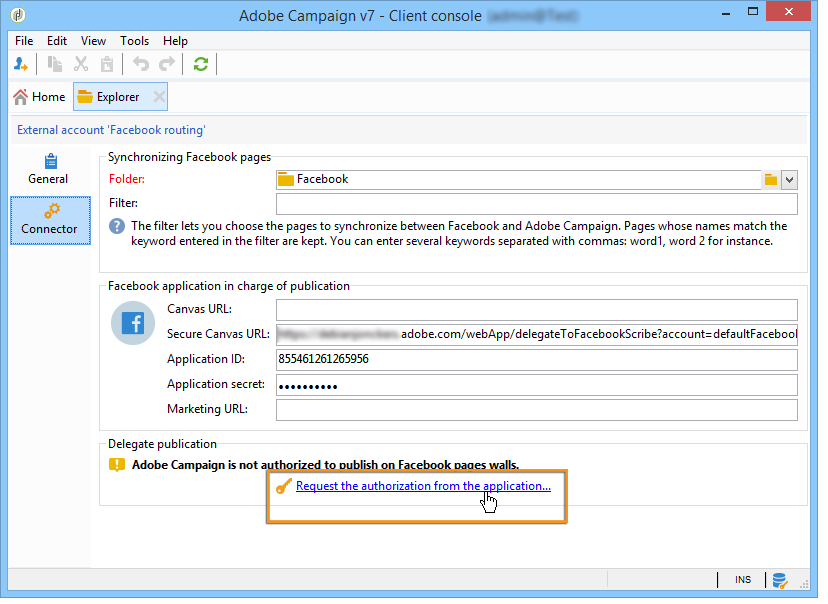

   >[!NOTE]
   >
   >By default, the pages are added to the **[!UICONTROL Facebook]** service folder, available via the **[!UICONTROL Profiles and Targets > Services and Subscriptions]** node. The **[!UICONTROL Folder]** field of the **[!UICONTROL Connector]** tab lets you change the service folder which the Facebook pages are created in after synchronization. You can also select the Facebook pages you want to synchronize in Adobe Campaign thanks to the **[!UICONTROL Filter]** field. If you leave this field empty, all Facebook pages managed by the administrator will be synchronized.

1. A dialog box is displayed with the various Facebook permission settings. These enable Adobe Campaign to send publications to the Facebook account pages.

   Accept the various permission requests.

   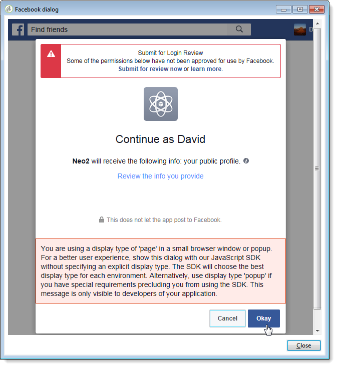

1. Adobe Campaign has been given the right to publish on the walls of the Facebook account's pages. 

   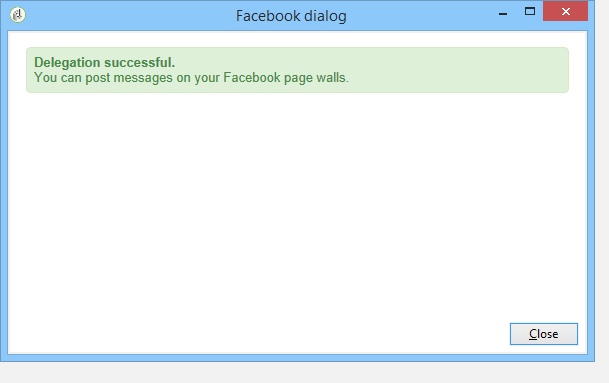

>[!NOTE]
>
>If the Facebook account administers several pages, simply configure one external account to write on any page of the Facebook account. For each new Facebook account, you will need to create a new **[!UICONTROL Routing]** type external account.

The **[!UICONTROL Synchronization of Facebook pages]** workflow synchronizes all pages administered by the Facebook account, to let you post on their wall directly via Adobe Campaign. For more on this, refer to [Synchronizing Facebook pages](#synchronizing-facebook-pages).

## Synchronizing Facebook pages {#synchronizing-facebook-pages}

The **[!UICONTROL Synchronization of Facebook pages]** workflow, which is accessed via the **[!UICONTROL Administration > Production > Technical workflows > Managing social networks]** node, lets you synchronize (in Adobe Campaign) the pages of the Facebook account configured previously. By default, this workflow is configured to run once a day or whenever an administrator clicks the **[!UICONTROL Request an authorization from the application]** link in the service configuration screen (refer to [Delegating write access to Adobe Campaign](#delegating-write-access-to-adobe-campaign)).

Once synchronization is complete, the collected pages appear in the service folder entered in the external account (refer to [Delegating write access to Adobe Campaign](#delegating-write-access-to-adobe-campaign)). By default, pages are added to the root of the **[!UICONTROL Facebook]** service folder which is available via the **[!UICONTROL Profiles and Targets > Services and subscriptions]** menu.

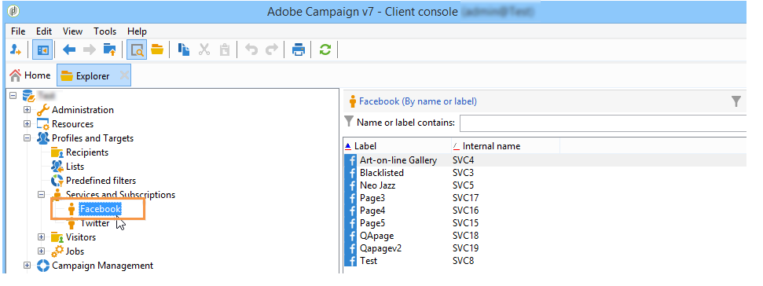

You may now publish on the walls of your Facebook pages directly via Adobe Campaign. For more on this, refer to [Publishing on Facebook](#publishing-on-facebook-walls).
