# Publishing on Facebook{#publishing-on-facebook}

Once configuration is complete, Social Marketing lets you post publications on the walls of your Facebook pages.

## Limitations {#limitations}

The following limitations are inherent to Facebook.

* Messages may not exceed 1,000 characters.
* HTML is not supported.

## Creating the delivery {#creating-the-delivery}

Create a new delivery using the **[!UICONTROL Publish to a brand page]** delivery template.

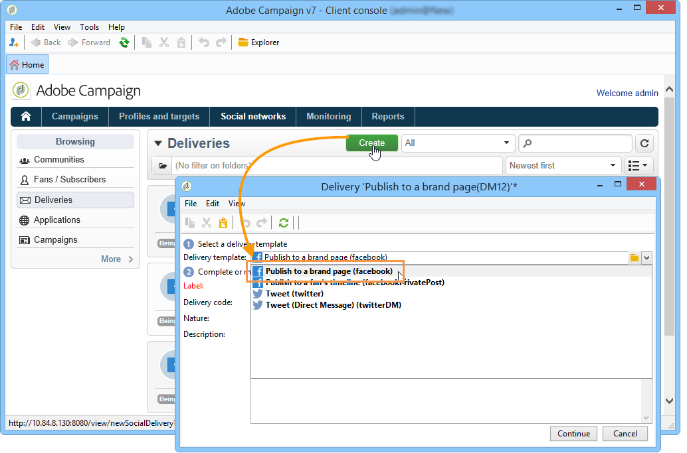

## Selecting the main target {#selecting-the-main-target}

You need to select the page(s) which you want to post your publication on.

1. Click the **[!UICONTROL To]** link.

   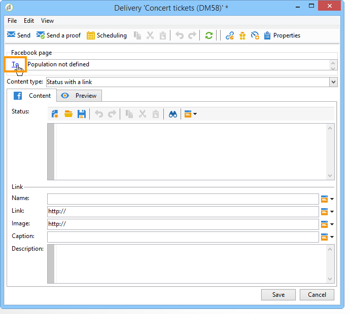

1. Click the **[!UICONTROL Add]** button.

   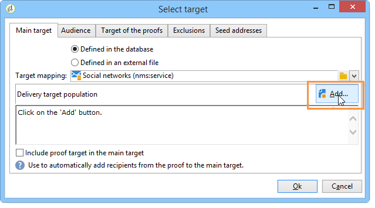

1. Select **[!UICONTROL A Facebook page]**.

   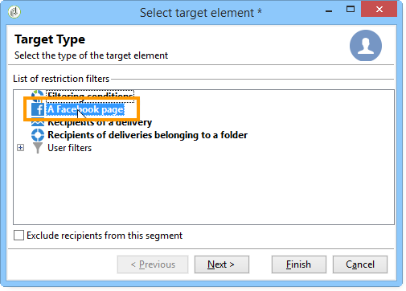

1. In the **[!UICONTROL Folder]** field, select the service folder which contains the Facebook page. By default, pages are stored in the root of the **[!UICONTROL Facebook]** service folder. Then select the Facebook page which you want to post on. 

   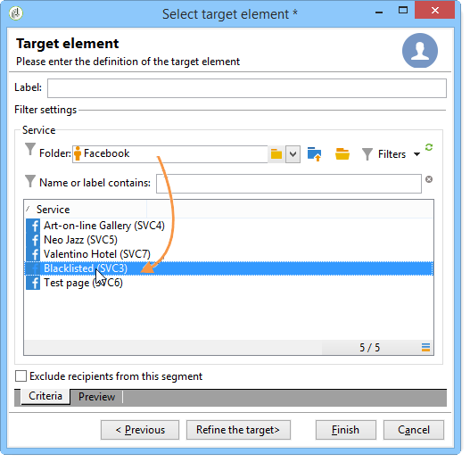

## Selecting the proof target {#selecting-the-proof-target}

The **[!UICONTROL Target of the proofs]** tab lets you define the Facebook page which you want to use for testing deliveries before sending them out. We recommend creating a dedicated private Facebook page for this purpose. For more on creating a private Facebook page, refer to [Creating a test Facebook page](../../social/using/publishing-on-facebook-walls.md#creating-a-test-facebook-page). To select the proof target, apply the same steps as for the main target: [Selecting the main target](#selecting-the-main-target).

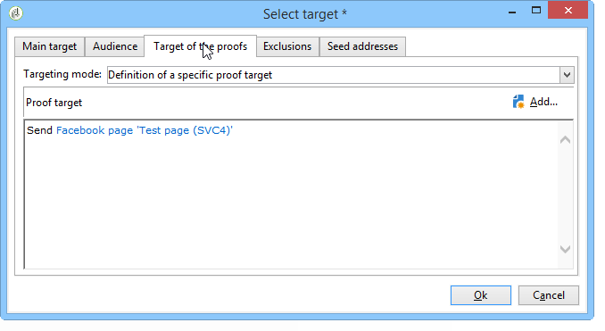

>[!NOTE]
>
>If you are using the same Facebook test page for all deliveries, you can save the proof target in the **[!UICONTROL Publish to a brand page]** delivery template, which is accessed via the **[!UICONTROL Resources > Templates > Delivery templates]** node. The proof target will be entered by default for each new delivery.

## Defining the audience {#defining-the-audience}

If you want to use local segments to refine the type of public authorized to view the publication, we recommend that you create one Facebook page per segment (for instance: Adobe Campaign Paris, Adobe Campaign London, etc.).

However it is also possible to use the audience filters used by Facebook. The **[!UICONTROL Audience]** tab of the **[!UICONTROL Select target window]** offers four filters:

* **[!UICONTROL Country]** 
* **[!UICONTROL Regions]** 
* **[!UICONTROL Cities]** 
* **[!UICONTROL Languages]**

>[!IMPORTANT]
>
>Use this function with care. In delivery reports, the **[!UICONTROL Number of fans]** indicator will not take these Facebook filters into account.
>
>Facebook may change the list of audience filters as well as their values.

## Defining message content {#defining-message-content}

Select the type of publication using the **[!UICONTROL Content type]** drop-down menu.

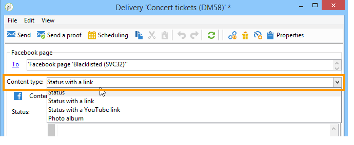

The following types of deliveries are available:

* a **[!UICONTROL Status]** 
* a **[!UICONTROL Status with a link]** 
* a **[!UICONTROL Status with a YouTube link]** 
* a **[!UICONTROL Photo album]**

### Publishing a status {#publishing-a-status}

A status type delivery can only contain text, as in the example below:

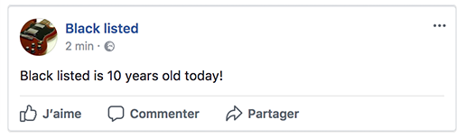

Enter the publication status in the input zone.

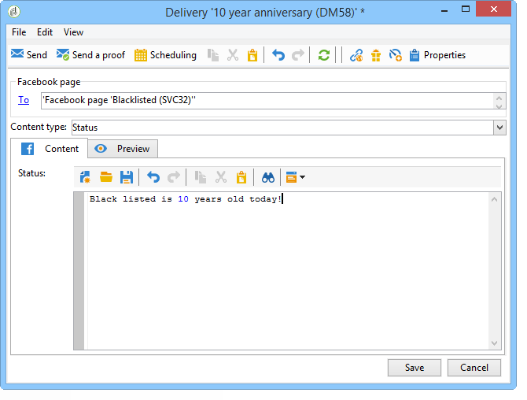

### Publishing a status with a link {#publishing-a-status-with-a-link}

A status type delivery with a link may contain text, images and a link. The following section details the symmetry between the fields of the delivery editing screen and the final publication on Facebook:

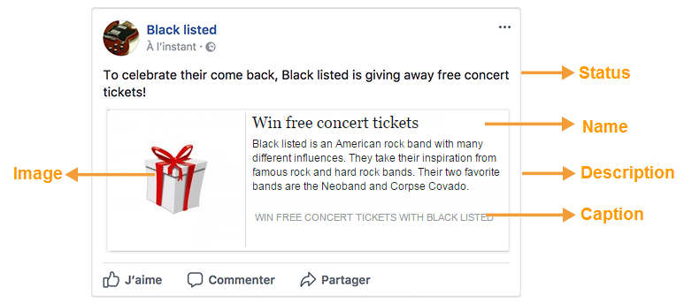

Enter the various fields:

>[!IMPORTANT]
>
>All URLs must start with **"http://"** or **"https://"**.

1. In the **[!UICONTROL Status]** field, enter the text which will be displayed under the name of the page. 
1. In the **[!UICONTROL Name]** field, enter the publication title.
1. In the **[!UICONTROL Link]** field, enter the URL that the publication points to.

   >[!NOTE]
   >
   >If you want to add the **[!UICONTROL Link]** field to the URL of a Facebook application to promote it, we recommend that you adapt it to smartphone display criteria:
   >
   >1. Select the Facebook application [https://developers.facebook.com/apps](https://developers.facebook.com/apps), and select the **[!UICONTROL Settings > Basic]** tab.
   >1. Enter the **[!UICONTROL Namespace]** field.
   >1. Enter the **[!UICONTROL Mobile Site URL]** field: when a user clicks the publication link on their smartphone, they will automatically be redirected by Facebook to the URL defined in this field.
   >1. Create your web application so that the Facebook display is personalized as a function of the device used (smartphone or PC).
   >1. Go to the **[!UICONTROL Link]** field of the publication via the Adobe Campaign console, enter the URL of the **[!UICONTROL Canvas page]** field.

1. In the **[!UICONTROL Image]** field, enter the URL of the image which will be displayed to the left of the publication.

   >[!IMPORTANT]
   >
   >The image has to be hosted on a public internet site in order for Facebook to be able to upload it.

1. In the **[!UICONTROL Caption]** field, enter the text that will appear at the end of the publication.
1. Go to the **[!UICONTROL Description]** field and enter the text to be displayed under the title.

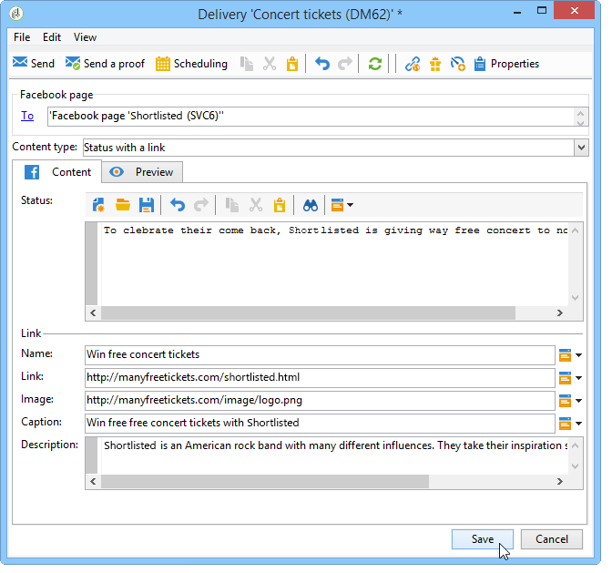

### Publishing a status with a YouTube link {#publishing-a-status-with-a-youtube-link}

This type of content lets you publish a link to a YouTube video. Just like a status with a regular link, you can define a status, a name, a caption, a description and an additional link. The image is added by Facebook automatically. Symmetries between the fields of the delivery editing screen and the final publication on Facebook are detailed below:

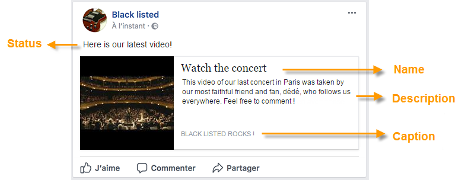

Enter the various fields:

>[!IMPORTANT]
>
>All URLs must start with **"http://"** or **"https://"**.

1. In the **[!UICONTROL Status]** field, enter the text which will be displayed under the name of the page. 
1. In the **[!UICONTROL Name]** field, enter the publication title.
1. In the **[!UICONTROL Video code]** field, enter the code of the YouTube video. For instance, for the 'https://www.youtube.com/watch?v=abc123456' link, the video code will be 'abc123456'.
1. In the **[!UICONTROL Caption]** field, enter the text that will appear at the end of the publication.
1. Go to the **[!UICONTROL Description]** field and enter the text to be displayed under the title.

### Publishing a photo album {#publishing-a-photo-album}

This type of content enables you to publish a photo album. You can add a name and a description for the album as well as a caption for each photo. Symmetries between the fields of the delivery editing screen and the final publication on Facebook are detailed below:

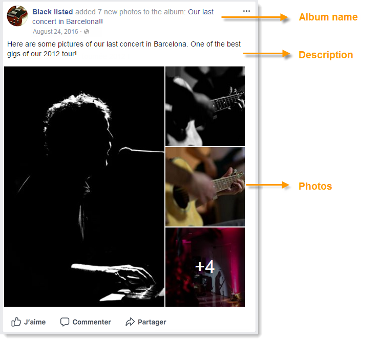

Enter the various fields:

1. Start by entering the **[!UICONTROL Album name]**.
1. Then enter the **[!UICONTROL Description]** to be displayed above the photos.
1. To add a photo, click the **[!UICONTROL Add]** button, select the photo and click **[!UICONTROL Open]**.
1. A caption can be added to each photo.

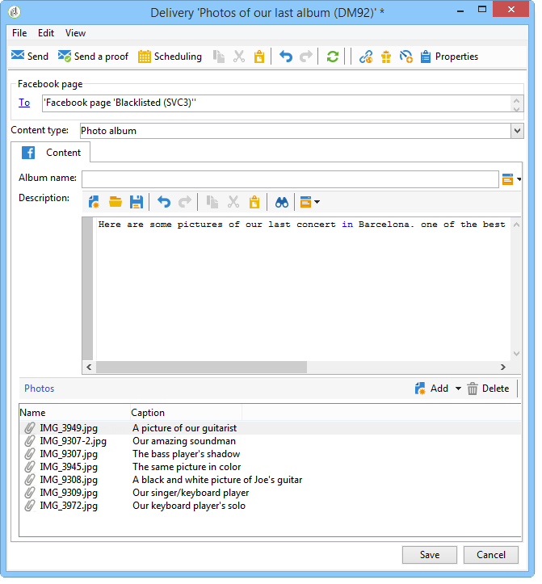

## Previewing {#previewing}

The **[!UICONTROL Preview]** tab lets you view the rendering of the publication.

1. Click the **[!UICONTROL Preview]** tab.
1. Click the **[!UICONTROL Test personalization]** drop-down menu and select **[!UICONTROL Service]**.
1. In the **[!UICONTROL Folder]** field, select the service folder which contains your Facebook pages. By default, pages are stored at the root of the **[!UICONTROL Facebook]** service folder.
1. Select the Facebook page which you want to test the preview on.

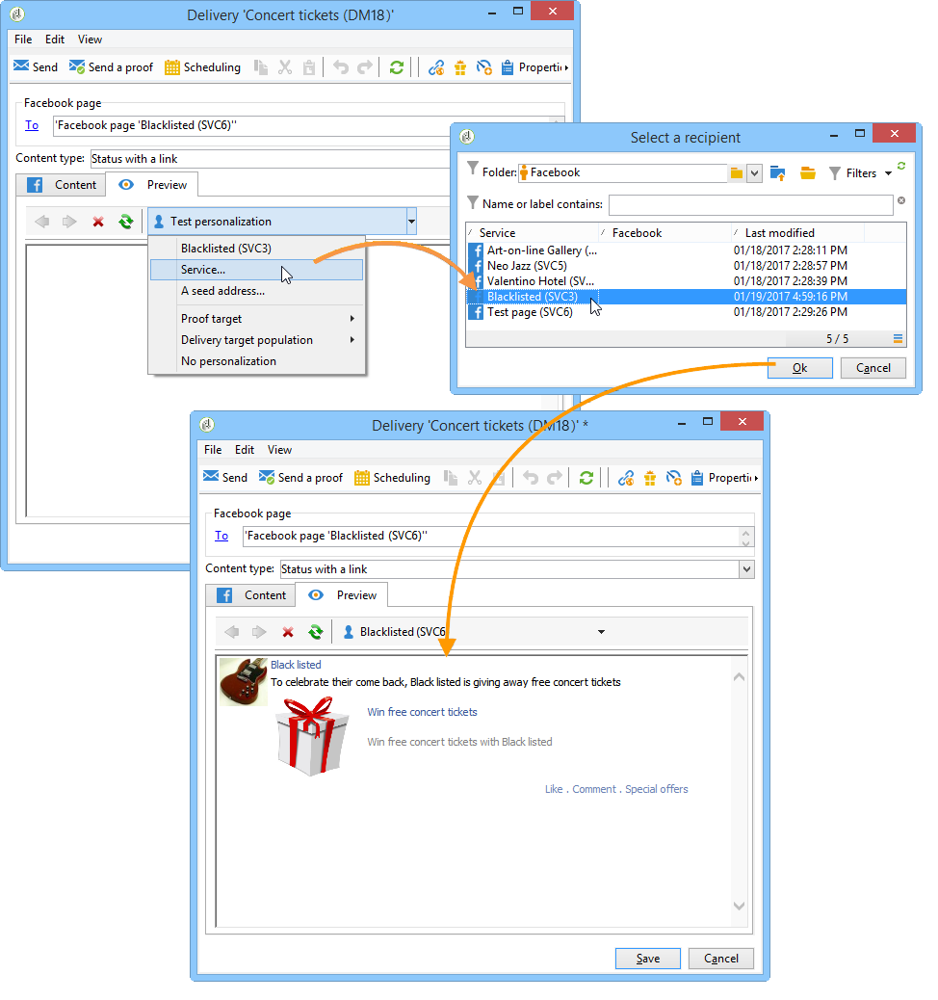

>[!NOTE]
>
>The preview may differ slightly from the final Facebook publication. We highly recommend sending a proof before final delivery for an exact rendering of the publication. Refer to [Sending the proof](#sending-the-proof).

## Configuring tracking {#configuring-tracking}

Tracking can be viewed in the delivery reports and in the **[!UICONTROL Edit > Tracking]** tab of the delivery and the service.

Clicks on the URL contained in the delivery are measured by Adobe Campaign. The number of clicks on the **[!UICONTROL Like]** button, the number of comments and the number of fans are measured by Facebook.

Tracking configuration is the same as for an email delivery. For more on this, refer to [this section](../../delivery/using/about-delivery-monitoring.md).

>[!NOTE]
>
>In the **[!UICONTROL Publish to a brand page]** delivery template, tracking is enabled by default.

## Sending the proof {#sending-the-proof}

We highly recommend sending a proof of your publication before the final delivery to view the exact rendering of the publication on a private Facebook test page. For more on creating a private Facebook test page, refer to [Creating a test Facebook page](../../social/using/publishing-on-facebook-walls.md#creating-a-test-facebook-page). The steps for selecting the target proof are detailed in [Selecting the proof target](#selecting-the-proof-target).

Proof delivery is identical to email deliveries. Refer to [this section](../../delivery/using/steps-validating-the-delivery.md#sending-a-proof).

## Sending the message {#sending-the-message}

1. Once the content is approved, click the **[!UICONTROL Send]** button.
1. Select **[!UICONTROL Deliver as soon as possible]** and click the **[!UICONTROL Analyze]** button.

   >[!NOTE]
   >
   >The **[!UICONTROL Postpone the delivery]** option lets you postpone delivery to a later date.

   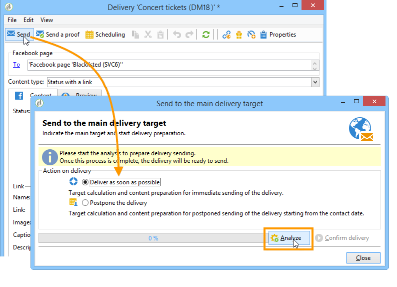

1. Once the analysis is complete, check the result.
1. Click **[!UICONTROL Confirm delivery]**, then click **[!UICONTROL Yes]**.

   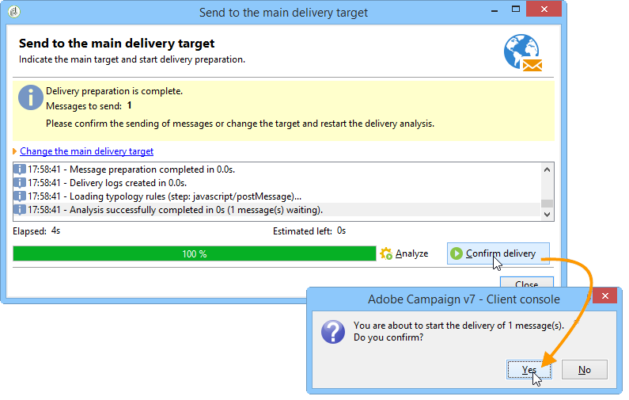
