# Publishing on Twitter{#publishing-on-twitter}

## Publishing on your Twitter accounts {#publishing-on-your-twitter-accounts}

Once configuration is complete, Social Marketing lets you send tweets to your Twitter accounts.

### Limitations {#limitations}

The following limitations are constraints which are inherent to Twitter.

* The message may not exceed 140 characters.
* HTML format isn't supported.

### Creating the delivery {#creating-the-delivery}

Create a new delivery based on the **[!UICONTROL Tweet (twitter)]** delivery template.

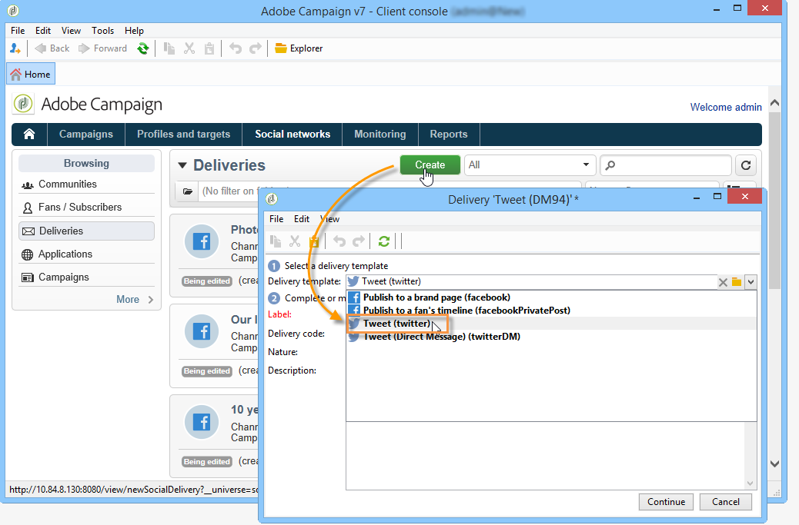

### Selecting the main target {#selecting-the-main-target}

Select the account(s) which you want to send tweets to.

1. Click the **[!UICONTROL To]** link.

   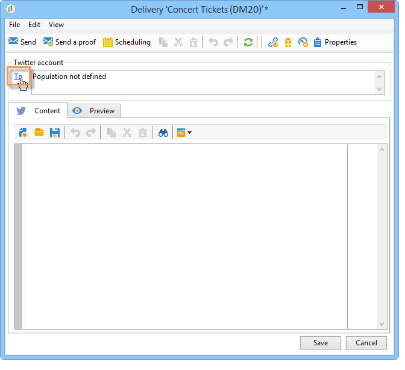

1. Click the **[!UICONTROL Add]** button.

   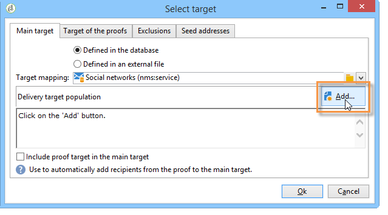

1. Select **[!UICONTROL A Twitter account]**.

   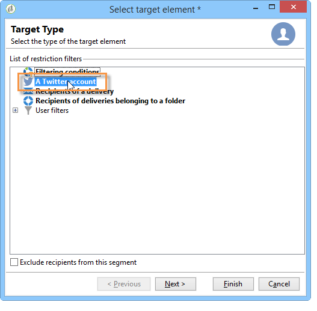

1. In the **[!UICONTROL Folder]** field, select the service folder which contains the Twitter account. Then select the Twitter account which you want to send your tweet to. 

   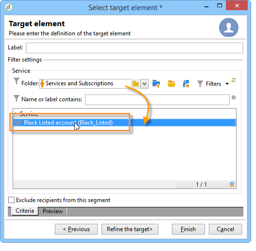

### Selecting the target of the proof {#selecting-the-target-of-the-proof}

The **[!UICONTROL Target of the proofs]** tab lets you define the Twitter account to use for test deliveries before the final delivery. We therefore recommend that you create a private Twitter account dedicated to sending proofs. For more on how to create a private Twitter account, refer to [Creating a test account on Twitter](../../social/using/configuring-publishing-on-twitter.md#creating-a-test-account-on-twitter). The steps for selecting the proof target are the same as for selecting the main target. Refer to [Creating a test account on Twitter](../../social/using/configuring-publishing-on-twitter.md#creating-a-test-account-on-twitter).

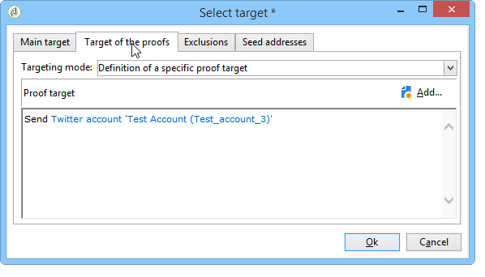

>[!NOTE]
>
>If you are using the same Twitter test account for all your deliveries, you can save the proof target in the **[!UICONTROL Tweet]** delivery template, accessed via the **[!UICONTROL Resources > Templates > Delivery templates]** node. The proof target will then be entered by default for each new delivery.

### Defining the message content {#defining-the-message-content}

Type the content of your tweet in the **[!UICONTROL Content]** tab.

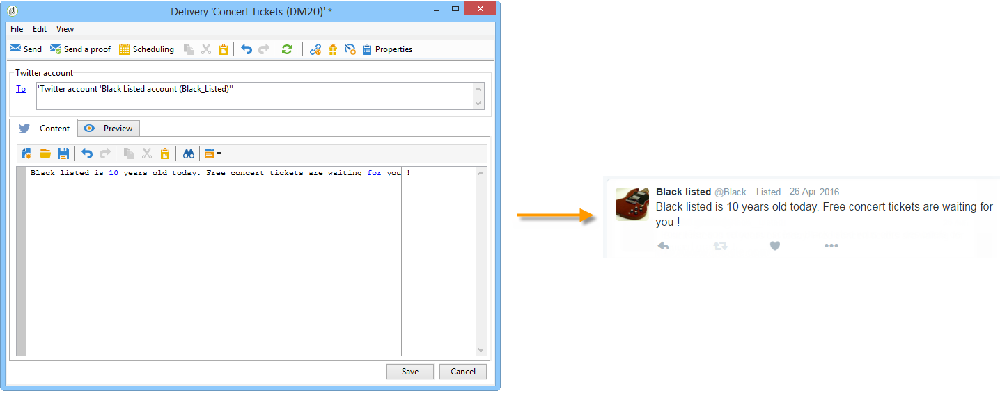

### Viewing the preview {#viewing-the-preview}

The **[!UICONTROL Preview]** tab lets you view a rendering of the tweet.

1. Click the **[!UICONTROL Preview]** tab.
1. Click the **[!UICONTROL Test personalization]** drop-down menu and select **[!UICONTROL Service]**.
1. In the **[!UICONTROL Folder]** field, select the service folder which contains your Twitter account. 
1. Choose the Twitter account which you want to test the preview with.

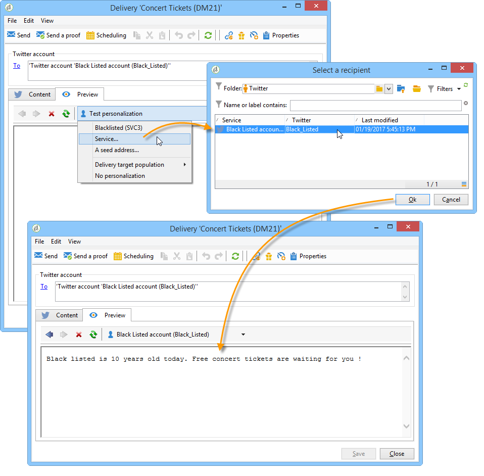

>[!NOTE]
>
>The preview may differ slightly from the final tweet. We highly recommend sending a proof before final delivery to view an exact rendering of the tweet. Refer to [Sending the proof](#sending-the-proof).

### Configuring tracking {#configuring-tracking}

Tracking can be viewed in the delivery reports and in the **[!UICONTROL Edit > Tracking]** tab of the delivery and the service.

Tracking configuration is the same as for an email delivery. For more on this, refer to [this section](../../delivery/using/about-delivery-monitoring.md).

>[!NOTE]
>
>In the **[!UICONTROL Tweet]** delivery template, tracking is enabled by default.

>[!IMPORTANT]
>
>We can't tell the difference between robots who analyze tweets and users who are actually clicking.

### Sending the proof {#sending-the-proof}

We highly recommend sending a proof of your publication before the final delivery to get an exact rendering of the publication on a private Twitter test page. For more on creating a private Twitter account, refer to [Creating a test account on Twitter](../../social/using/configuring-publishing-on-twitter.md#creating-a-test-account-on-twitter). The steps for selecting the proof target are detailed in [Selecting the target of the proof](#selecting-the-target-of-the-proof).

Proof delivery is identical to email deliveries. Refer to [this section](../../delivery/using/steps-validating-the-delivery.md#sending-a-proof).

### Sending the message {#sending-the-message}

1. Once the content is approved, click the **[!UICONTROL Send]** button.
1. Select **[!UICONTROL Deliver as soon as possible]** and click the **[!UICONTROL Analyze]** button.

   >[!NOTE]
   >
   >The **[!UICONTROL Postpone the delivery]** option lets you postpone delivery to a later date.

   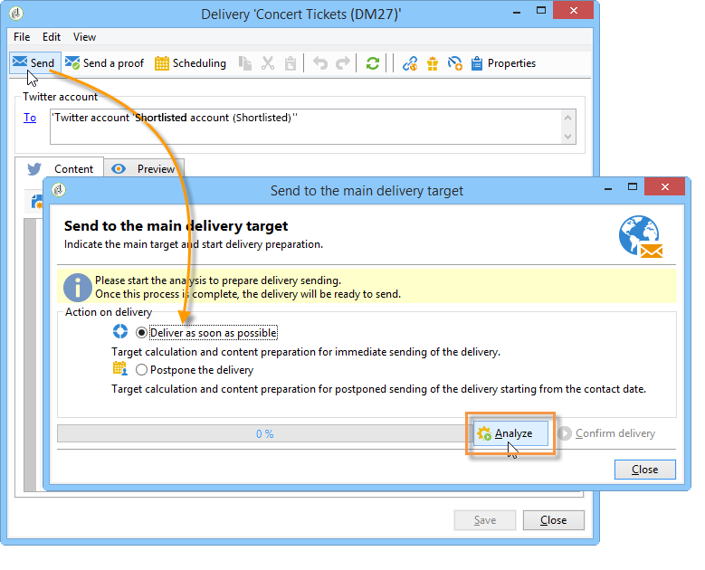

1. Once the analysis is finished, check the result. 
1. Click **[!UICONTROL Confirm delivery]**, then click **[!UICONTROL Yes]**.

## Sending direct messages to subscribers {#sending-direct-messages-to-subscribers}

### Operating principle {#operating-principle}

The **[!UICONTROL Synchronize Twitter accounts]** workflow (refer to [Synchronizing Twitter accounts](../../social/using/configuring-publishing-on-twitter.md#synchronizing-twitter-accounts)) recovers the list of Twitter subscribers so that you can send them direct messages. The recovered followers are stored in a specific table: the visitors table. To display the list of Twitter followers, go to the **[!UICONTROL Profiles and Targets > Visitors]** node.

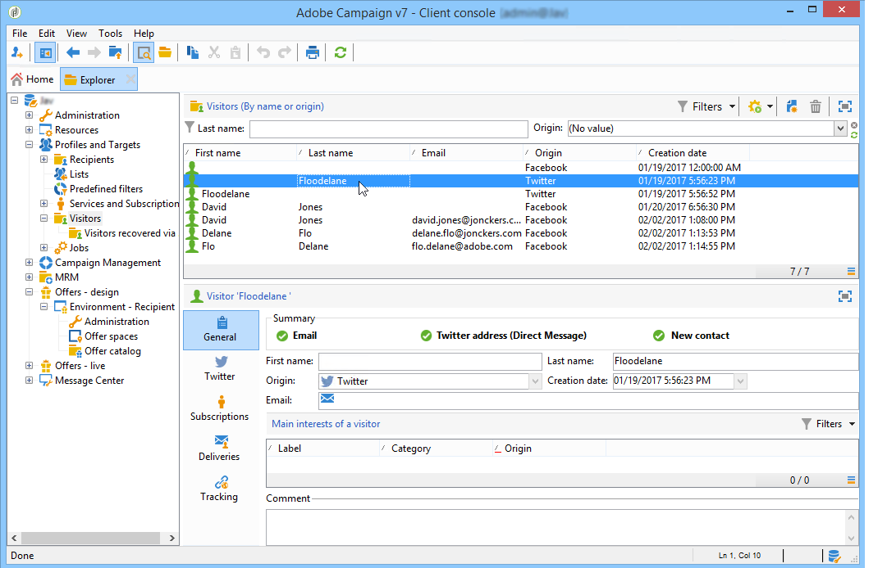

>[!IMPORTANT]
>
>In order for the workflow to recover the list of Twitter followers, the **[!UICONTROL Synchronize Twitter accounts]** box must be checked in the Edit screen of the service linked to the account. For more on this, refer to: [Delegating write access to Adobe Campaign](../../social/using/configuring-publishing-on-twitter.md#delegating-write-access-to-adobe-campaign).

For each follower, Adobe Campaign recovers the following information:

* **[!UICONTROL Origin]**: name of the social network (**Twitter** in this case)
* **[!UICONTROL External ID]**: user identifier
* **[!UICONTROL User name]**: account name of the user
* **[!UICONTROL Full name]**: name of the user
* **[!UICONTROL Language]**: user language
* **[!UICONTROL Number of friends]**: number of followers
* **[!UICONTROL Time zone]**: user time zone
* **[!UICONTROL Verified]**: this field indicates whether the user has a verified Twitter account

### Limitations {#limitations-1}

The following limitations are constraints which are inherent to Twitter.

* The message may not exceed 140 characters.
* HTML is not supported.
* You cannot send more than 250 direct messages per day. To avoid exceeding this threshold, you can deliver in several waves. Deliveries in waves are configured like email deliveries. For more on this, refer to [this section](../../delivery/using/steps-sending-the-delivery.md#sending-using-multiple-waves).

### Creating the delivery {#creating-the-delivery-}

Create a new delivery based on the **[!UICONTROL Tweet (Direct Message)]** delivery template.

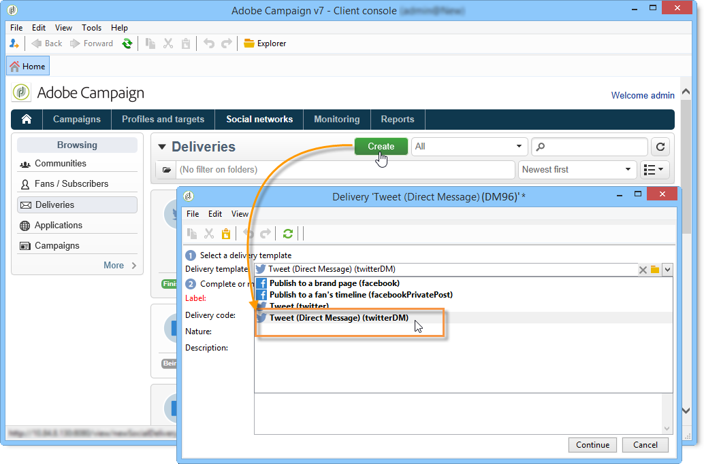

### Selecting the main target {#selecting-the-main-target-1}

Select the followers whom you want to send your direct message to.

1. Click the **[!UICONTROL To]** link.

   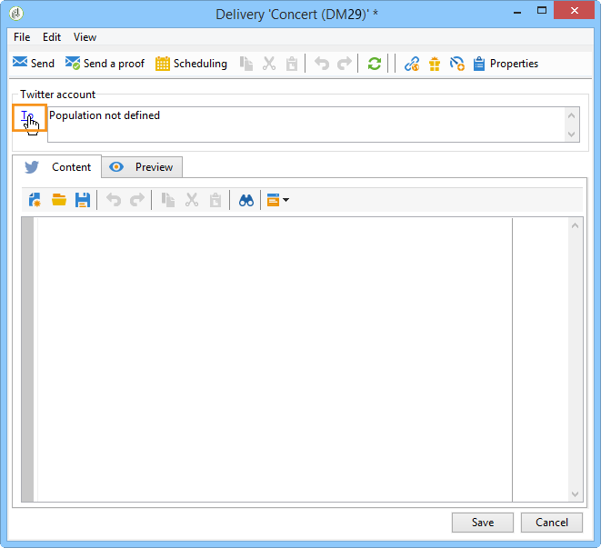

1. Click the **[!UICONTROL Add]** button.

   

1. Select a type of targeting. 

   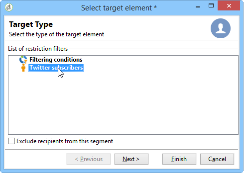

    * Select **[!UICONTROL Twitter subscribers]** to send a direct message to all account followers.

      >[!IMPORTANT]
      >
      >You cannot send more than 250 messages per day. If your Twitter account has more than 250 followers, we highly recommend delivering in waves. This involves the same process as email deliveries. Refer to [this section](../../delivery/using/steps-sending-the-delivery.md#sending-using-multiple-waves).

    * Select **[!UICONTROL Filter conditions]** to define a query and view its result. This option is the same as for email deliveries. Refer to [this section](../../platform/using/defining-filter-conditions.md) for more information. 
    
      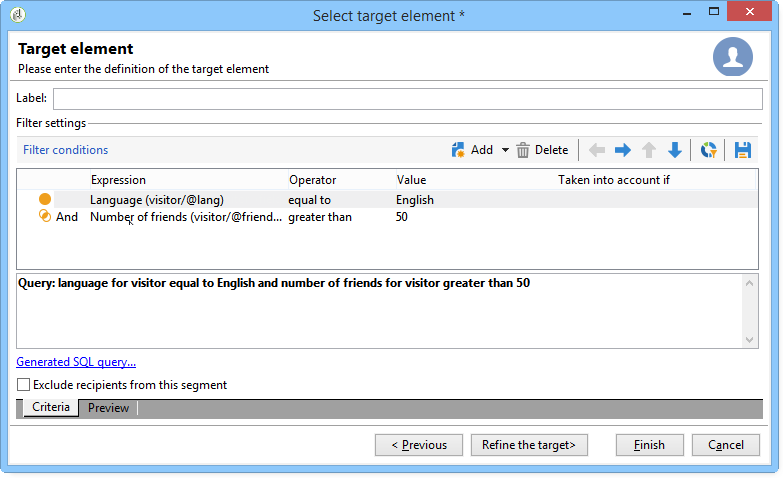

### Selecting the target of the proof {#selecting-the-target-of-the-proof-1}

The **[!UICONTROL Target of the proofs]** tab lets you select the follower who will receive the proof of your direct message. The selection process is the same as for the main target. Refer to [Selecting the main target](#selecting-the-main-target).

>[!NOTE]
>
>If you want to send all your direct message proofs to the same Twitter follower, you can save the proof target in the **[!UICONTROL Tweet (Direct Message)]** delivery template, accessed via the **[!UICONTROL Resources > Templates > Delivery templates]** node. The proof target will then be entered by default for each new delivery.

### Defining message content {#defining-message-content-}

Enter the content of the tweet in the **[!UICONTROL Content]** tab.

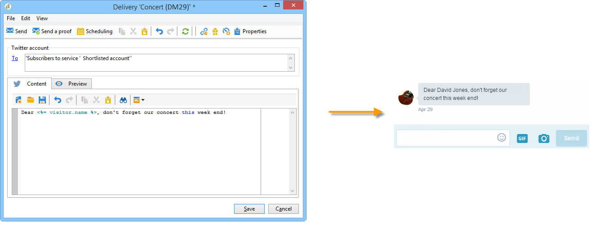

Personalization fields can be used the same way as for email deliveries, for instance to add the follower's name in the body of the message. Content personalization is detailed in [this section](../../delivery/using/about-personalization.md).

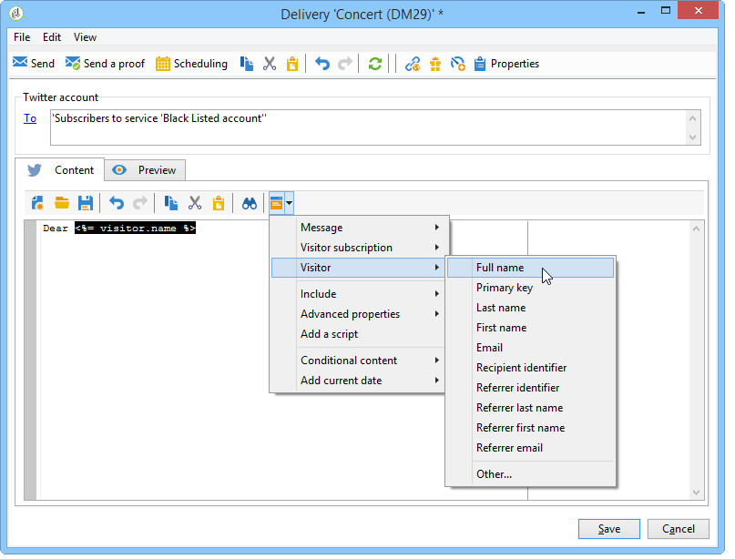

The following steps are the same as for sending a tweet to a Twitter account. Refer to [Publishing on your Twitter accounts](#publishing-on-your-twitter-accounts).
