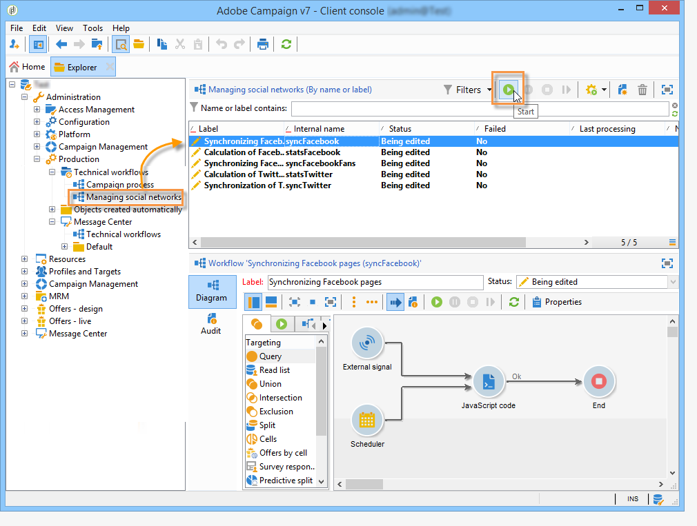
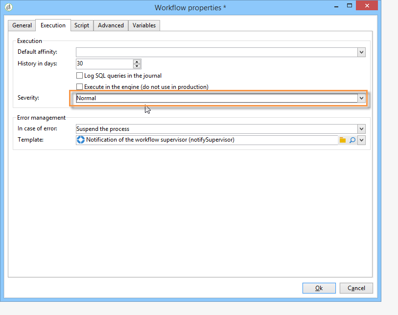

# Starting workflows{#starting-workflows}

The **[!UICONTROL Managing social networks]** workflows, which are accessed via the **[!UICONTROL Administration > Production > Technical workflows > Managing social networks]** node let you synchronize Adobe Campaign with Twitter and Facebook.

The first time you use Social Marketing, these workflows are stopped by default. Start them by clicking the **[!UICONTROL Start]** button in the toolbar.

If there is one social network which you do not want to use, we recommend not starting the matching workflows. To avoid receiving a warning saying that production workflows are stopped, select the severity level **[!UICONTROL Normal]** in the **[!UICONTROL Execution]** tab of the concerned workflows' properties.

