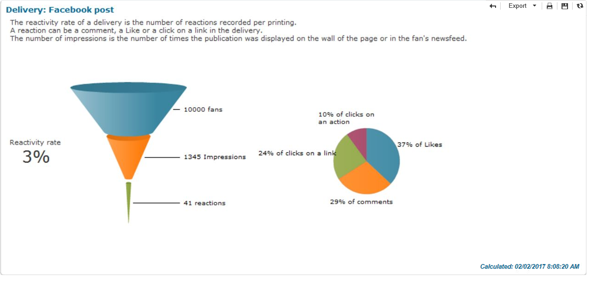
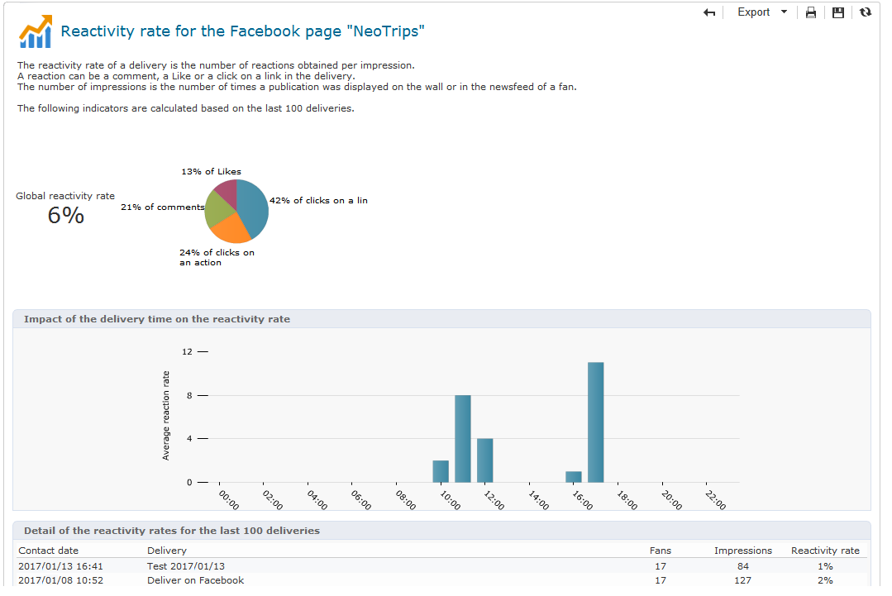
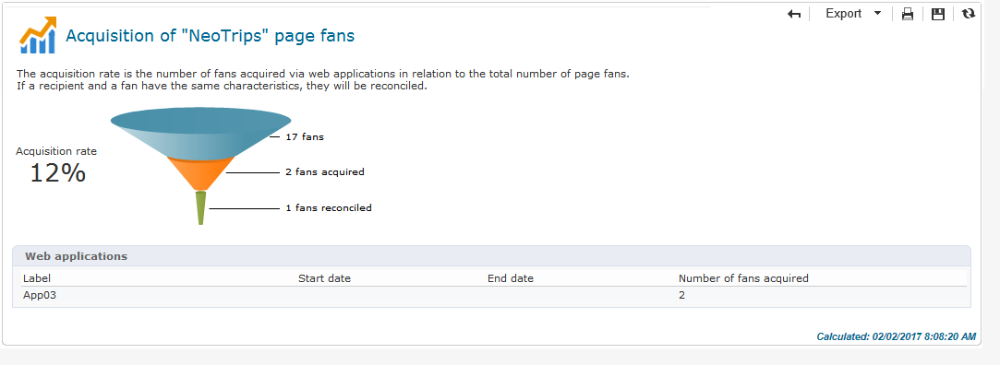

# Tracking{#tracking}

Social Marketing provides reports which enable you to measure the reactivity rate of Facebook and Twitter deliveries and to analyze the acquisition of Facebook profiles. The following reports are available:

* The **[!UICONTROL Reactivity rate]** report, available via the **[!UICONTROL Summary]** tab of a Facebook or Twitter delivery.

  

* The **[!UICONTROL Reactivity rate]** report, available via the **[!UICONTROL Dashboard]** tab of a Twitter or Facebook service.

  

* The **[!UICONTROL Fan acquisition]** report, available via the **[!UICONTROL Dashboard]** tab of a Facebook service.

  
