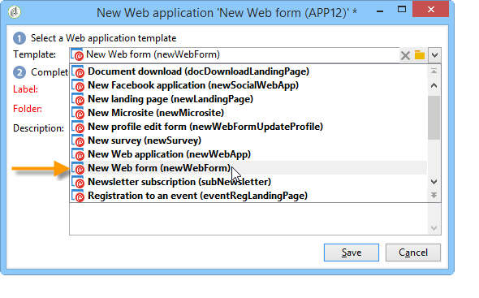
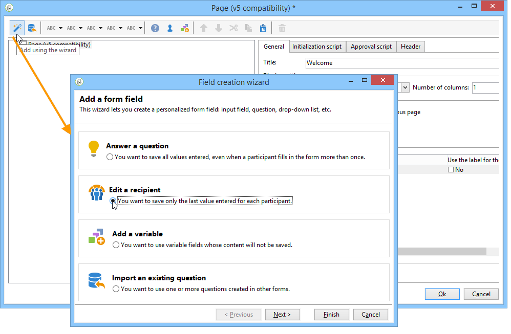
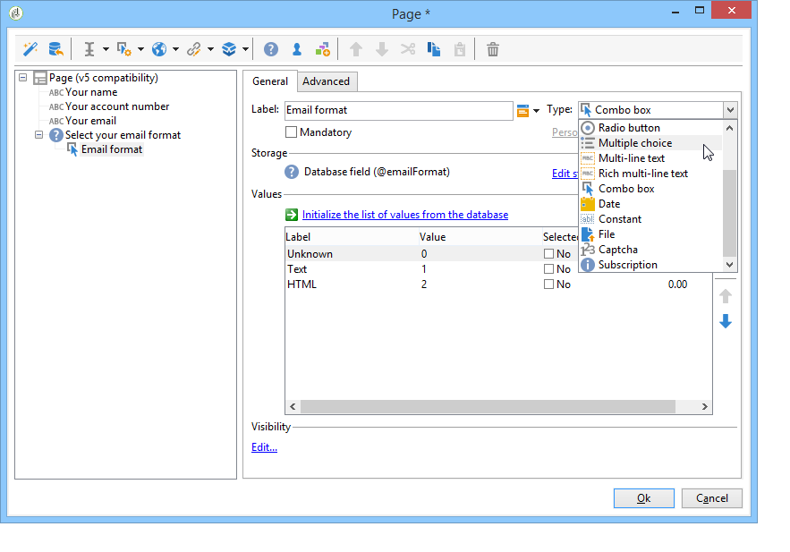
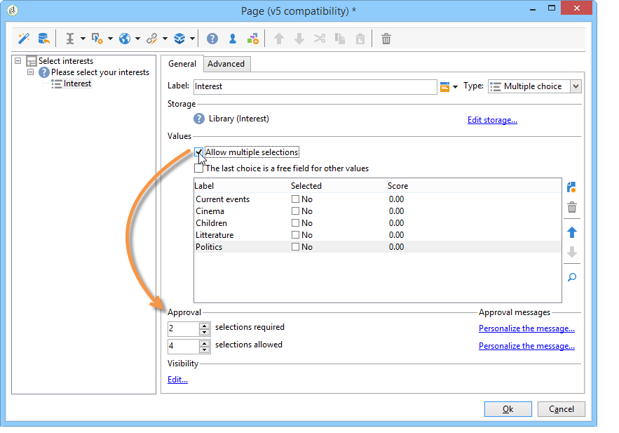
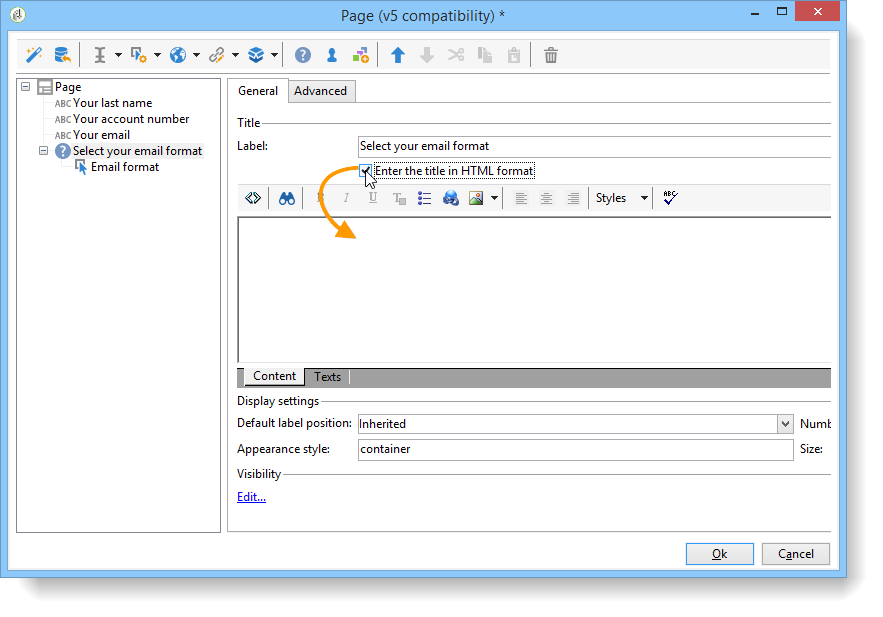
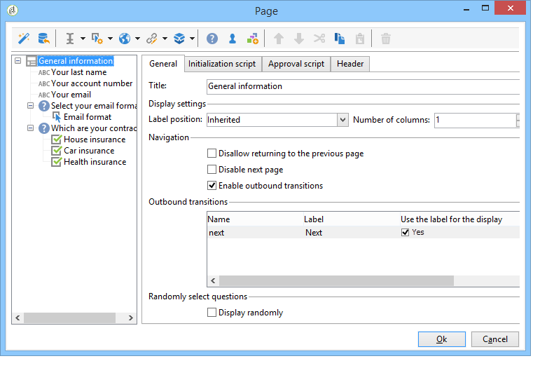
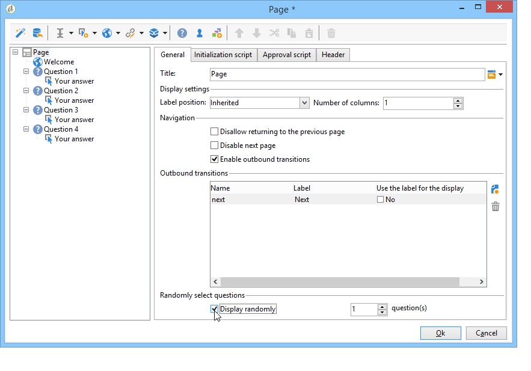
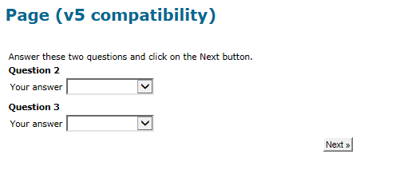

# Design a survey{#building-a-survey}

## Create a new survey {#creating-a-new-survey}

This chapter details the designing of a **Survey** type form using Adobe Campaign, as well as the available options and configurations. Adobe Campaign lets you make this survey available to users and collect and archive answers in the database.

Web forms are accessed via the **[!UICONTROL Resources > Online > Web applications]** node of the tree. To create a survey, click the **[!UICONTROL New]** button above the list of applications, or right-click the list and choose **[!UICONTROL New]**.

Select the survey template (**[!UICONTROL newSurvey]** by default).

The pages of the form are created using a special editor that lets you define and configure (text) input fields, selection fields (lists, checkboxes, etc.) and static elements (images, HTML content, etc.). They can be collected in "containers" and laid out according to requirements. [Learn more](#adding-questions)).

>[!NOTE]
>
>For more on how to define content and create screen layouts for a Web form, refer to [this document](../../web/using/about-web-forms.md).

## Add fields {#adding-fields}

The fields in a form enable users to enter information and select options. For each page in the form, they are created via the first button in the toolbar using the **[!UICONTROL Add using the wizard]** menu. 

>[!NOTE]
>
>You can also use a right-click and insert an input zone. By default, the zone is inserted at the end of the selected tree. Use the arrows in the toolbar to move it.

### Types of fields {#types-of-fields}

When you add a field to a survey you need to select its type. The following options are available:

1. **[!UICONTROL Answer a question]**: this option lets you declare a new field (known as 'archived field') to store answers. In this case, all values collected are saved, even when a participant fills in the form more than once. This storage mode is only available in **Surveys**. [Learn more](../../surveys/using/managing-answers.md#storing-collected-answers).
1. **[!UICONTROL Edit a recipient]**: this option lets you select a field in the database. In this case, user answers will be stored in this field. For each participant, only the last value saved is kept, and added to the profile data.
1. **[!UICONTROL Add a variable]**: this option lets you create a setup so that information is not stored in the database. Local variables can be declared upstream. You can also add them directly when creating the field.
1. **[!UICONTROL Import an existing question]**: this option lets you import existing questions created in other surveys.

   >[!NOTE]
   >
   >Storage modes and field imports are detailed in [this section](../../surveys/using/managing-answers.md#storing-collected-answers).

The nature of the field to add (drop-down list, text field, checkboxes, etc.) adapts to the storage mode selected. You can change it using the **[!UICONTROL Type]** field of the **[!UICONTROL General]** tab, but make sure to remain consistent with the data type.

The various types of available fields are detailed in [this section](../../web/using/about-web-forms.md).

## Survey-specific elements {#survey-specific-elements}

Online surveys are based on Web applications capabilities. Survey-specific capabilities are detailed below.

### Multiple choice {#multiple-choice}

For **[!UICONTROL Multiple choice]** type controls, you can define a minimum and maximum number of selections. For example, this option enables you to force the selection to at least **2** values and at most **4** values from the available options:

If the number of selections is too big or too small, the appropriate message is displayed.

>[!NOTE]
>
>In this case, the options are selected using checkboxes. When only one option is possible, radio buttons are used.

The corresponding configuration is as follows:

In addition, the storage location for this input field must be a **[!UICONTROL Multiple values]** type **archived field**: 

>[!CAUTION]
>
>* This functionality is only available for **Survey** type forms. 
>* This option isn't compatible with random question display. [Learn more](#adding-questions).

### Add questions {#adding-questions}

There are two types of containers: standard and question. Standard containers are used to configure page layout and conditional display in a page. [Learn more](../../web/using/about-web-forms.md).

Use a **Question** container to add a question to the page and to insert the possible answers below in the hierarchy. User responses to questions placed in this type of container can be analyzed in reports.

>[!CAUTION]
>
>Never insert a **Question** container below another **Question** container in the hierarchy.

The label of the question is entered in the label field. In this case, the style from the form's style sheet will be applied. Select the **[!UICONTROL Enter the title in HTML format]** option to personalize it. This will give you access to the HTML editor.

>[!NOTE]
>
>Refer to [this document](../../web/using/about-web-forms.md) for more on using the HTML editor.

For example:

In the example above, the rendering will be as follows:

>[!NOTE]
>
>Every question has a **Question** type container.

You can enable the random drawing of questions by Adobe Campaign. It is then possible to specify the number of questions to be displayed in the page, in the field located at the bottom of the configuration window.

The rendering will look like this:

When the page is refreshed, the questions displayed are not the same.

>[!CAUTION]
>
>When you display a question randomly (**[!UICONTROL Display randomly]** option checked on the page), be careful not to use multiple choice questions for which one or more selections are mandatory.
