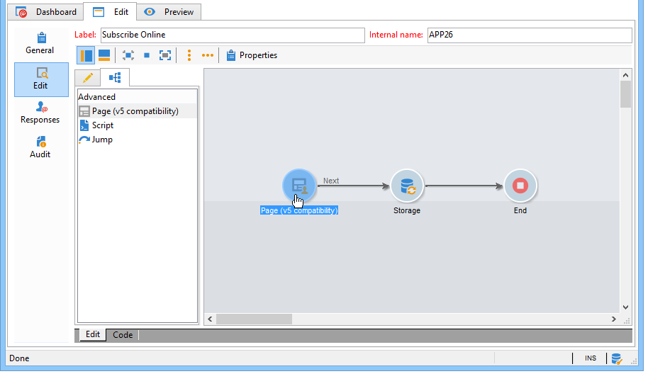

# Key steps to create a survey{#getting-started-with-surveys}

Here is a quick overview of the main steps to create a simple survey, using the following built-in template:

These steps are:

1. [Step 1 - Create a survey](#step-1---creating-a-survey),
1. [Step 2 - Select the template](#step-2---selecting-the-template),
1. [Step 3 - Build the survey](#step-3---building-the-survey),
1. [Step 4 - Create the page content](#step-4---creating-the-page-content),
1. [Step 5 - Store the survey data](#step-5---storing-the-survey-data-),
1. [Step 6 - Publish the pages](#step-6---publishing-the-pages),
1. [Step 7 - Share your online survey](#step-7---sharing-your-online-survey).

## Step 1 - Create a survey {#step-1---creating-a-survey}

To create a new survey, go to the **[!UICONTROL Campaigns]** or **[!UICONTROL Profiles and targets]** tab and click the **[!UICONTROL Web Applications]** menu. Click the **[!UICONTROL Create]** button above the list of forms.

## Step 2 - Select the template {#step-2---selecting-the-template}

Select a survey template, then give the survey a name. This name will not be seen by end users, but it allows the survey to be identified within Adobe Campaign. Click **[!UICONTROL Save]** to add the survey to the list of Web applications.

## Step 3 - Build the survey {#step-3---building-the-survey}

Surveys are built in a diagram where the following elements are positioned: the page(s) where the content will be created, the data preloading and saving steps, and the testing phases. Scripts and queries can also be inserted.

To build the chart, click the **[!UICONTROL Edit]** form of the survey.

A survey must contain **at least** the following three components: a page, a storage box, and an end page.

* To create a page, select the **[!UICONTROL Page]** object in the left-hand section of the editor and deposit it in the middle section, as shown below:

  

* Next, select the **[!UICONTROL Storage]** object and place it on the output transition of the page.
* Finally, select the **[!UICONTROL End]** object and place it on the end of the output transition of the storage box to obtain the following diagram:

  

## Step 4 - Create the page content {#step-4---creating-the-page-content}

In the following example, we are using a **[!UICONTROL Page (v5 compatibility)]** type page. This type of page is accessed via the advanced menu of the **[!UICONTROL Edit]** tab.

* **Add input fields**

  To create the content of the page, you must edit it: to do this, double-click the **[!UICONTROL Page]** object. Click the first icon in the toolbar to open the field creation wizard. To create an entry field for the user name to be stored in the matching field of the recipient's profile, select **[!UICONTROL Edit a recipient]**.

  

  Click the **[!UICONTROL Next]** button to select the field for data storage in the database. In this case, the 'Last name' field.

  

  Click **[!UICONTROL Finish]** to confirm field creation.

  By default, when the information is stored in a field that already exists in the database, the field takes on the name of the selected field, i.e. 'Last name' in this example. You can modify this label as shown below:

  

  Now create an entry field for the user account number. Repeat the operation and select the 'account No.' field.

  Apply the same procedure to add a field for the user to enter an email address.

* **Create a question**
  
  To create a question, right-click the last element in the tree, and select **[!UICONTROL Containers > Question]** , or click the **[!UICONTROL Containers]** icon and select **[!UICONTROL Question]**.

  

  Enter the label of the question and insert the answer field(s) as a sub-branch of the question. To do this, the node linked to the question must be selected when you create the answer field. Add a **[!UICONTROL drop-down listx]** using the **[!UICONTROL Selection controls]** icon or by right-clicking, as shown below:

  

  Select a storage space: select an enumeration field to retrieve the values automatically (the email format in this case). 

  

  In the **[!UICONTROL General]** tab, click the **[!UICONTROL Initialize the list of values from the database]** link: the table of values is entered automatically.

  

  Click **[!UICONTROL OK]** to close the editor, and **[!UICONTROL Save]** to save changes.

  >[!NOTE]
  >
  >For each field or question, you can adapt the page layout to suit your needs, thanks to the options in the **[!UICONTROL Advanced]** tab. The layout of survey screens is detailed in the [this section](../../web/using/about-web-forms.md).

  In the detail screen, click the **[!UICONTROL Preview]** tab to view the rendering of the survey you have just created.

  

## Step 5 - Store the survey data {#step-5---storing-the-survey-data-}

The storage box lets you save the user responses in the database. You must select a reconciliation key to identify the profiles already in the database.

To do this, edit the box and select the field that will be used as a reconciliation key when the data is stored.

In the example below, when saving (confirmation) takes place, if a profile is saved in the database with the same account number as the one input in the form, the profile will be updated. If the profile does not exist, it will be created.

Click **[!UICONTROL OK]** to confirm, then click **[!UICONTROL Save]** to save the survey

## Step 6 - Publish the pages {#step-6---publishing-the-pages}

For users to be able to access the HTML pages, the application must be made available. It must no longer be at the editing stage, but in production. To put a survey in production, you must publish it. To do this:

* Click the **[!UICONTROL Publish]** button located above the survey dashboard.
* Click **[!UICONTROL Start]** to launch publication and close the wizard.

  

  The status of the survey changes to: **Online**.

  

## Step 7 - Share your online survey {#step-7---sharing-your-online-survey}

Once it is in production, the survey is accessible on the server and you can deliver it. The URL for accessing the survey is displayed on the dashboard. 

To deliver the survey, you can send a message containing an access link to the target population, or place the survey access URL on a web page, for example.

You can then monitor user responses via reports and logs. See [Response tracking](../../surveys/using/publish--track-and-use-collected-data.md#response-tracking).

>[!CAUTION]
>
>The public URL includes the internal name of the survey. When the internal name is modified, the URL is updated automatically: all links to the survey must also be updated.
>
>If deliveries containing the link to the form have already been sent, this link will no longer work.
