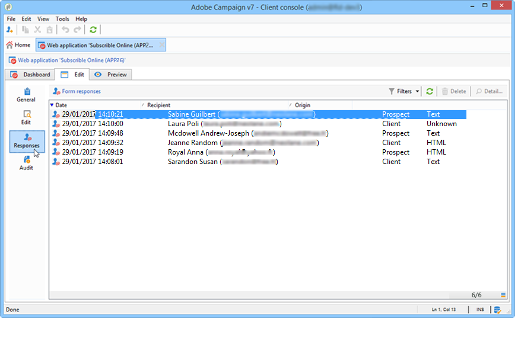

# Publish, track and use collected data{#publish-track-and-use-collected-data}

 

Once the form has been created, configured and published, you can share the link with your audience it and track the responses.

>[!NOTE]
>
>The life cycle of a survey in Adobe Campaign as well as its publishing and delivery modes are similar to those of Web forms: these are detailed in [this section](../../web/using/about-web-forms.md).

## Survey dashboard {#survey-dashboard}

Each survey has its own dashboard which lets you view its status, description, public URL and availability schedule. It also lets you view the available reports. [Learn more](#reports-on-surveys).

The survey's public URL is shown on the dashboard:


## Response tracking {#response-tracking}

You can track the responses to the survey in logs and reports.

### Survey logs {#survey-logs}

For each survey delivered, you can track the responses in the **[!UICONTROL Logs]** tab. This tab displays the list of users who have completed the survey and their origin:



Double-click a line to display the survey form as filled in by the respondent. You can browse the survey in full and access the answers in full. These can be exported in an external file. For more on this, refer to [Exporting answers](#exporting-answers).

The origin is indicated in the survey URL by adding the following characters:

```
?origin=xxx
```

while the survey is being edited, its URL contains the parameter **[!UICONTROL __uuid]**, which indicates that it is in a test phase and not yet online. When you access the survey via this URL, the records created are not taken into account in the tracking (reports). The origin is forced to the value **[!UICONTROL Adobe Campaign]**.

For more on URL parameters, refer to [this page](../../web/using/defining-web-forms-properties.md#form-url-parameters).

### Reports on surveys {#reports-on-surveys}

The dashboard tab lets you access survey reports. Click a report name to view it.


The structure of the survey is visible in the **[!UICONTROL Documentation]** report.

Two other reports on Web surveys are available in the **[!UICONTROL Reports]** tab of the surveys: **[!UICONTROL General]** and **[!UICONTROL Breakdown of responses]**.

* General

  This report contains general information on the survey: how the number of responses changes over time and the distribution by origin and language.

  Example of a general report:

  

* Breakdown of responses

  This report shows the breakdown of responses for each question. This breakdown is only available for answers given to fields stored in **[!UICONTROL Question]** type containers. It is valid only for selection controls (no breakdown on text fields, for example).

  

## Exporting answers {#exporting-answers}

Answers to a survey can be exported in an external file to be processed later. There are two ways of doing this:

1. Exporting report data

   To export report data, click the **[!UICONTROL Export]** button and choose the export format.

   For more on exporting report data, refer to [this section](../../reporting/using/about-reports-creation-in-campaign.md).

1. Exporting answers

   To export answers, click the **[!UICONTROL Responses]** tab of the survey and right-click. Select **[!UICONTROL Export...]**.

   

   Then enter the information you want to export and the storage file.

   You can configure the content and format of the output file in the export assistant.

   This lets you:

    * add columns to the output file and recover the information on the recipient (which is stored in the database),
    * format the exported data,
    * select the encoding format for the information in the file.

   If the survey you want to export contains several **[!UICONTROL Multi-line text]** or **[!UICONTROL HTML text]** fields, it has to be exported in **[!UICONTROL XML]** format. To do this, select this format in the drop-down list of the **[!UICONTROL Output format]** field, as shown below:

   

   Click **[!UICONTROL Start]** to run the export.

   >[!NOTE]
   >
   >Data exports and the stages of their configuration are detailed in [this section](../../platform/using/about-generic-imports-exports.md).

## Using the collected data {#using-the-collected-data}

The information collected via online surveys can be recovered within the framework of a targeting workflow. To do this, use the **[!UICONTROL Survey responses]** box.

In the following example, we want to make a Web offer specially for the five recipients with at least two children and with the highest scores at an online survey. The answers to this survey are:


In the targeting workflow, the **[!UICONTROL Survey responses]** will be configured as follows:


Start by selecting the concerned survey, then the data to extract in the central section of the window. In this case we need to extract at least the score column since it will be used in the split box to recover the five highest scores.

Indicate the filtering conditions for answers by clicking the **[!UICONTROL Edit query...]** link.


Start the targeting workflow. The query recovers 8 recipients. 


Right-click the output transition of the collection box to view them.


Then place a split box in the workflow to recover the 5 recipients with the highest score.

Edit the split box to configure it:

* Start by selecting the adequate schema in the **[!UICONTROL General]** tab, then configure the sub-set: 

  

* Go to the **[!UICONTROL Sub-sets]** tab and select the **[!UICONTROL Limit the selected records]** option, then click the **[!UICONTROL Edit...]** link.

  

* Select the **[!UICONTROL Keep only the first records after sorting]** option and select the sort column. Check the **[!UICONTROL Descending sort]** option.

  

* Click the **[!UICONTROL Next]** button and limit the number of records to 5.

  

* Click **[!UICONTROL Finish]** then restart the workflow to approve targeting.

## Standardizing data {#standardizing-data}

It's possible to set up standardization processes in Adobe Campaign for data collected using aliases. This lets you standardize the data stored in the database: to do this, define aliases in the itemized lists which contain the relevant information. Learn more how to **work with enumerations** in [Adobe Campaign v8 (console) documentation](https://experienceleague.adobe.com/en/docs/campaign/campaign-v8/config/settings/enumerations){target=_blank}.