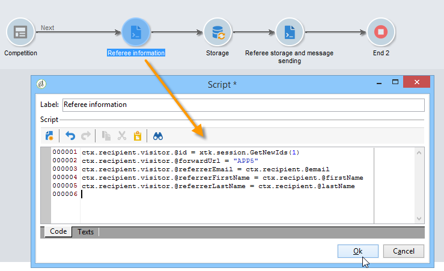

# Use case: create a referral form{#use-case-creating-a-refer-a-friend-form}

In this example, we want to offer a competition to the recipients in the database. The Web form will have a section for entering answers and another to refer a friend by entering their email address.


The identification and competition blocks are created using the processes described previously.

To configure and create the referral block, apply the following steps:

1. Create a competition Web form with questions and a field for entering a friend's contact information as shown below:

   

   The **Your message** field lets you enter a message for the referee. The referrer must also enter their **Last name**, **First name** and **Email**.

   The information entered in the fields is stored in a specific table known as the visitor table.

   >[!NOTE]
   >
   >As long as the recipient hasn't given their consent, you cannot store them with the recipients in the database. They will be stored temporarily in the **visitor** table (**nms:visitor**) designed for viral marketing campaigns. This table is purged on a regular basis thanks to **cleansing** operations.
   >
   >In this example, we want to target recipients to suggest they take part in the competition recommended by their referrer. However in this message we also want to offer them a subscription to one of our information services. If they subscribe, they can be stored in the database.

   

   The content of the fields which concern the referee will be used in the profile creation script and in the message sent to them.

1. Start by creating a script to link the referrer to the referee.

   It contains the following instructions:

   

   ```
   ctx.recipient.visitor.@id = xtk.session.GetNewIds(1)
   ctx.recipient.visitor.@forwardUrl = "APP5"
   ctx.recipient.visitor.@referrerEmail = ctx.recipient.@email
   ctx.recipient.visitor.@referrerFirstName = ctx.recipient.@firstName
   ctx.recipient.visitor.@referrerLastName = ctx.recipient.@lastName
   ```

   The last name, first name and email address entered in the page identification block are identified as the last name, first name and email address of the referrer. These fields will be re-injected into the body of the message sent to the referee.

   The APP5 value matches the internal name of the Web form: this information lets you find out the referee's origin, i.e. link the visitor to the Web form based on which they were created.

1. The storage box lets you gather information and store it in the database.

   

1. Then create the delivery template linked to the information service created during step 1. It will be selected in the **[!UICONTROL Choose scenario]** field of the information service.

   The delivery template used to create the referral offer message contains the following information:

   

   This template has the following characteristics:

    * Select the visitor table as the target mapping.
    
      

    * The referee's contact information as well as the information on the referrer are taken from the visitor table. It is inserted using the personalization button.
    
      

    * This template contains a link to the competition form and the subscription link for the referee to subscribe to the newsletter.

      The subscription link is inserted via a personalization block. By default, it lets you subscribe profiles to the **newsletter** service. This personalization block can be changed to suit your need, for example to subscribe the recipient to a different service.
    
    * The internal name ('referrer' here) will be used in the message delivery script as shown below.

   >[!NOTE]
   >
   >Refer to [this page](../../delivery/using/about-templates.md) for more information on delivery templates.

1. Create the second script for delivering the subscription messages.

   

   ```
   // Updtate visitor to have a link to the referrer recipient
   ctx.recipient.visitor.@referrerId = ctx.recipient.@id
   ctx.recipient.visitor.@xtkschema = "nms:visitor"
   ctx.recipient.visitor.@_operation = "update" 
   ctx.recipient.visitor.@_key = "@id" 
   xtk.session.Write(ctx.recipient.visitor)
   
   // Send email to friend
   nms.delivery.QueueNotification("referrer",
   <delivery>
   <targets>
     <deliveryTarget>
       <targetPart type='query' exclusion='false' ignoreDeleteStatus='false'>
         <where>
           <condition expr={'@id IN ('+ ctx.recipient.visitor.@id +')' }/>
         </where>
       </targetPart>
      </deliveryTarget>
     </targets>
    </delivery>)
   ```

1. Publish the competition form and send an invitation to the recipients of the initial target. When one of them invites a friend, a delivery based on the **Referral offer** template is created.

   

   The referee is added to the visitor folder in the **[!UICONTROL Administration > Visitors node]**:

   

   Their profile contains the information entered by their referrer. It is stored based on the configurations entered in the form script. If they decide to subscribe to the newsletter, they will be saved in the recipient table.
