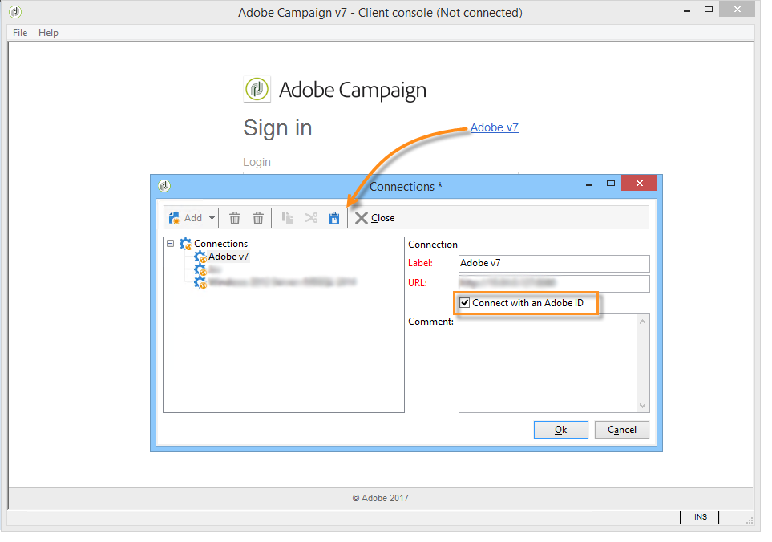
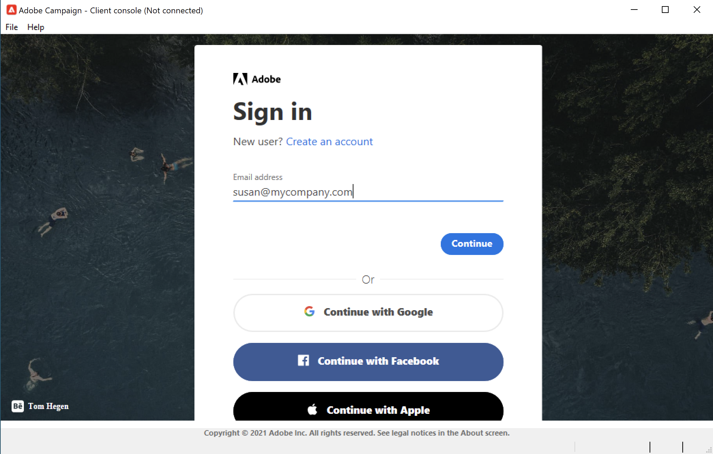
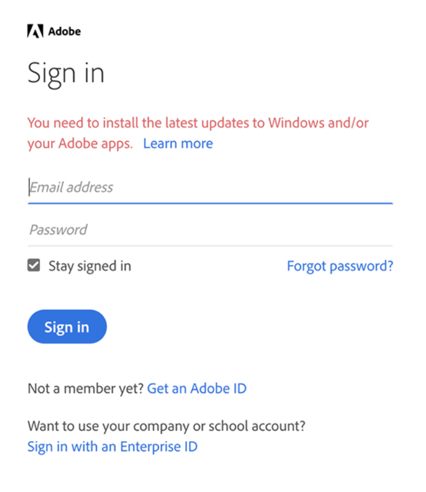
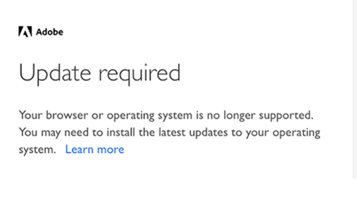

# How to update your environment to connect to Adobe Campaign with IMS {#acc-ims-faq}
 
On June 30, 2021 changes will be made to [Adobe Identity Management System](https://helpx.adobe.com/enterprise/using/identity.html) (IMS) login capabilities that could impact your ability to continue to use Adobe Campaign. Learn how to ensure you continue to use Adobe Campaign Classic v7 without interruption. 

## What changed?

Adobe Identity Management Service (IMS) will stop supporting old Internet Explorer versions from **June 30, 2021**. [Learn more](https://helpx.adobe.com/x-productkb/global/update-operating-system-and-browser.html). 

Adobe wants to preserve IMS functionality for all customers past June 30, 2021. IMS is part of the security framework which allows users to login to the Client Console, thus Adobe Campaign. 

To preserve this functionality, customers must update the Client Console on each users’ machine, and ensure the latest update of your [Windows version](../rn/using/compatibility-matrix.md#ClientConsoleoperatingsystems), with **Internet Explorer 11** built-in, is installed on each users’ machine. 

## Are you impacted?

If you are connecting to Campaign [via an Adobe ID](../integrations/using/about-adobe-id.md), through Adobe Identity Management Service (IMS), and running an older version of Campaign than the ones listed below, you are impacted.

If you already updgraded but using an old version of Microsoft Internet Explorer, you must upgrade to Internet Explorer 11.

## How to update?

* As a hosted customer, Adobe already upgraded your instance(s) to the newer version.

* As an on-premise/hybrid customer, you need to upgrade to one of the newer versions listed above to benefit from the new Client Console and ensure a seamless transition **before June 30, 2021**.

    Upgrade to one of the new versions listed below is mandatory:

    * Gold Standard 11. [Learn more](../rn/using/gold-standard.md)
    * Campaign 21.1.3 release. [Learn more](../rn/using/latest-release.md)
    * Campaign 20.2.4 release. [Learn more](../rn/using/release--20-2.md)
    * Campaign 20.1.4 release. [Learn more](../rn/using/release--20-1.md)
    * Campaign 19.2.4 release. [Learn more](../rn/using/release--19-2.md)
    * Campaign 19.1.8 release. [Learn more](../rn/using/release--19-1.md)

    These releases come with a new connection protocol. Upgrade is mandatory for both Campaign server and Client Console: once all instances are upgraded, the Client Console needs to be upgraded to this version as well to be able to connect to Campaign after **June 30, 2021**.

In addition, ensure the latest update of your [Windows version](../rn/using/compatibility-matrix.md#ClientConsoleoperatingsystems), with **Internet Explorer 11** built-in, is installed on each users’ machine. 

## FAQ

**How can I check my Campaign version?**

Learn how to check your version [in this section](../platform/using/launching-adobe-campaign.md#getting-your-campaign-version).

**How can I check if I use IMS?** 

To check your connection mode, you can:

* Launch Campaign Client Console and access your instance connection settings. If the **Connect with an Adobe ID** option is selected, you are using Adobe IMS.

    

or

* Launch Campaign Client Console, and check your connection window. If you are connecting with an Adobe ID, as shown in the screen below, you are using IMS.

    
    
**Connection Warning Message**

The following warning message is visible to users if they need to update their Client Console or use an old version of Microsoft Internet Explorer: **You need to install the latest updated to Windows and/or your Adobe apps.**

If you see such a warning, ensure that you install the latest updates of the operating system you are using. [Learn more](https://helpx.adobe.com/x-productkb/global/update-operating-system-and-browser.html)

**After June 30, 2021**, you will see the following message, and will no longer be able to connect to Adobe Campaign:

>[!NOTE]
>
>For any questions about these changes, contact [Adobe Customer Care](https://helpx.adobe.com/enterprise/admin-guide.html/enterprise/using/support-for-experience-cloud.ug.html).
>

## Useful links

* [Upgrade your environment](../production/using/build-upgrade.md)
* [Build upgrade FAQ](../platform/using/faq-build-upgrade.md)
* [Make the new Client Console available to users](../installation/using/client-console-availability-for-windows.md)
* [Install Campaign Client Console](../installation/using/installing-the-client-console.md)
* [Access Adobe Software Distribution](https://experienceleague.adobe.com/docs/experience-cloud/software-distribution/home.html?lang=en)
* [Download Campaign Classic build](https://experience.adobe.com/#/downloads/content/software-distribution/en/campaign.html)