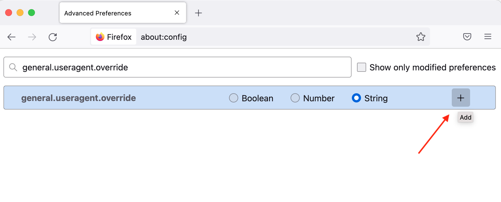
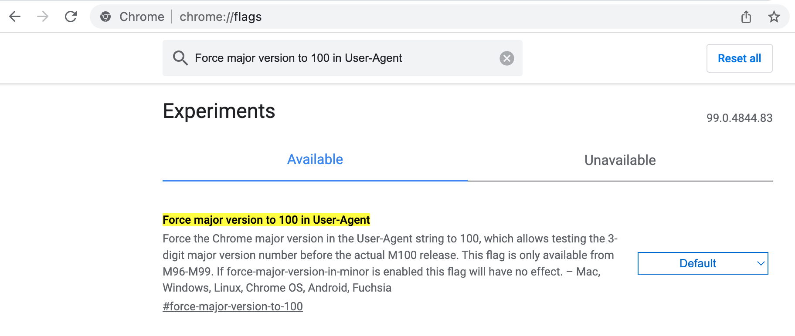
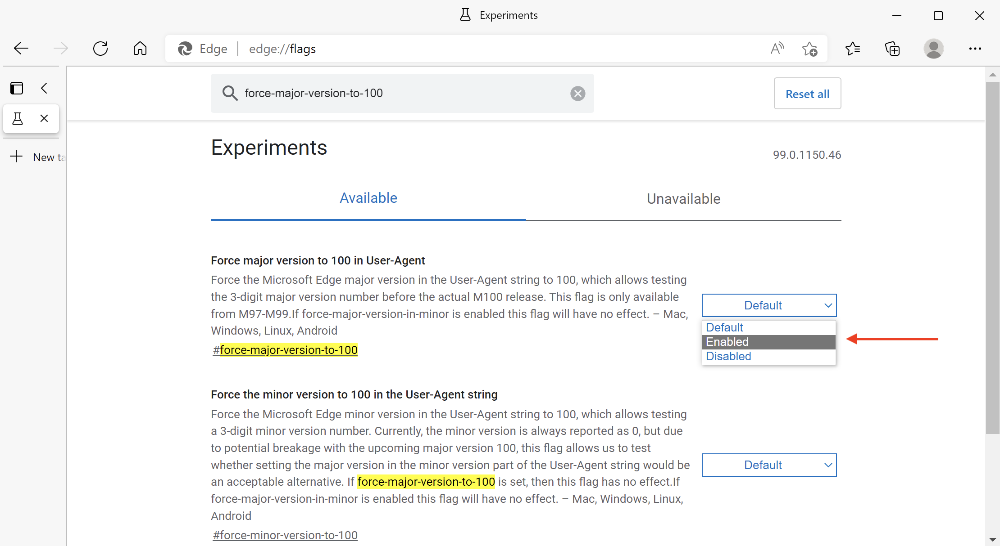

# 3-digit browser version impacts on Campaign web components {#version-100}

Google and Mozilla are warning that Chrome and Firefox may break some websites due to their upcoming 3-digit versions.

Chrome v100 is set for release on **March 29, 2022**, and Firefox v100 on **May 3, 2022**.

Microsoft released Edge v100 earlier in March 2022.

The change in the version number from 2 to 3 digits may cause some problems when visiting websites that are not prepared for this change. Some web pages may stop displaying correctly in the these new browser versions.

The compatibility of major websites has been tested ahead of time. If there are issues with sites that cannot be fixed before these versions are released, companies have backup plans ready to ensure the sites are not affected.

Potential problems or loss of functionality on web site originate from the user agent string that browsers send to websites you are visiting: the user agent is a string sent by the browser to the website to let the site know which browser and version you are using, and associated technology. When your browser sends a request to a website, it identifies itself with the user agent string before it retrieves the content you requested. The data in the user agent string help the website to deliver the content in a format that suits your browser. The version of the user agent is incremented to match the browser version number. Moving from 2 to 3-digits can cause issues.

## Are you impacted?{#version-100-impact}

Adobe recommends you to test your Campaign web applications, including web forms and surveys, to make sure they will still work fine with these new browser versions. 

This recommendation applies to all web applications, and especially if you have included JavaScript code. 

You must check with all browsers, mobile and desktop.

## How to test?{#version-100-test}

You can configure your browsers to report the version as 100 right now, then report and correct any issues you come across.

With these settings, the browser sends the new user agent string to websites, indicating that the browser is v100. If you run into any issues with your web forms, you should create a bug for the browser editor. Consider rebuilding these web forms before these updates are broadly available.

### Test with Firefox 100{#test-firefox-100}

To test your web pages with Mozilla Firefox 100, you can simulate the upcoming user agent change on your web apps by manually changing your user agent string.

1. Open Firefox, enter `about:config` in the address bar, and press enter.
1. Search for `general.useragent.override`.
1. Select 'String' and then click on the plus (+) sign.
    
     

1. Enter the following text in the field: 

    ```
    Mozilla/5.0 (Windows NT 10.0; rv:100.0) Gecko/20100101 Firefox/100.0
    ```

1. Click on the blue checkmark button to save the setting.
1. Close and relaunch the browser.

To change your user agent back to its default, simply go back into `about:config` and search for `general.useragent.override` setting again.  When it appears, click on the trash icon to delete the setting, and relaunch the browser.

### Test with Chrome 100{#test-chrome-100}

To test the Google Chrome 100 user agent on your own web apps, you can enable this test using the following steps:

1. Open Chrome, enter `chrome://flags` in the address bar, and press enter.
1. Search `Force major version to 100 in User-Agent` in the search field, and enable it as shown below.

     

1. Restart the browser.
1. Close the `chrome://flags` tab.

To change user agent back to its default, simply follow this process and change the flag's setting to `Default` and restart the browser.


### Test with Microsoft Edge 100{#test-ms-edge-100}

Starting with v97, site owners can emulate this version by enabling the experiment flag  `#force-major-version-to-100` in `edge://flags`.

1. Open Microsoft Edge, enter `edge://flags` in the address bar, and press enter.
1. Search for `force-major-version-to-100` field, and enable it as shown below.
    
     

1. Restart the browser.
1. Close the `edge://flags` tab.

To change user agent back to its default, simply follow this process and change the flag's setting to `Default` and restart the browser.
