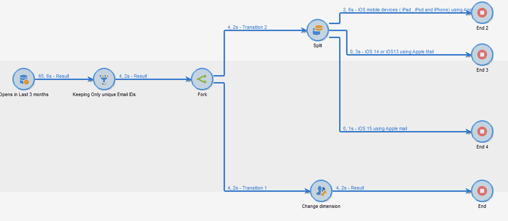

# Mail Privacy Protection in Apple's Mail app


## What changed?

In 2021, Apple introduced new privacy protection capabilities for their native Mail app. This app now includes Apple's Mail Privacy Protection feature. Basically, senders cannot use tracking pixels anymore to collect information about recipients who have chosen to turn on Apple's Mail Privacy Protection feature. [Read more](https://experienceleague.adobe.com/docs/deliverability-learn/deliverability-best-practice-guide/technotes/apple-mail-privacy-faq.html){target="_blank"}.

## How are my campaigns affected?

Adobe Campaign provides capability to use tracking pixels to track email opens. You can use this capability not only for targeting and campaigns, but also for metrics. For example, you can use email open rates to measure campaign effectiveness and user engagement. In short, segmentation, targeting, and metrics might be affected in your campaigns. [Read more](https://experienceleague.adobe.com/docs/deliverability-learn/deliverability-best-practice-guide/technotes/apple-mail-privacy-faq.html#in-addition-to-measuring-opens%2C-what-else-is-impacted%3F){target="_blank"}.

## What actions should I take?

Apple's new feature is the shape of things to come in the industry in terms of email privacy protection. We strongly recommend that you follow Adobe's recommendations.

### Assess the impact on your campaign triggers

Assess how these changes affect your current campaign triggers. Identify the workflows in which email opens are used as a criterion for segmentation, targeting, or retargeting. Read the [tips and tricks](#find-email-open-tracking).

### Preserve your data

Preserve your data and consolidate your current knowledge on devices. You can base key performance indicators (KPIs) on the user agent. For example, you can build KPIs around profiles of persons who use iOS and Apple's Mail app. Read the [tips and tricks](#preserve-tracking-data).

### Archive your tracking logs beyond the retention period

Archive your tracking logs beyond the retention period of Adobe Campaign:

1. Check the duration of the retention period in your campaign instance.
1. Double-check your active target mappings.

   Determine whether you use custom profiles tables in addition to the out-of-the-box profiles table (`nmsRecipient`).

1. Export your tracking logs from Adobe Campaign.

   Include the logs that contain data about the user agent and the operating system.

### Assess the current trend in open rates

Determine which proportion of your audience uses Apple's Mail app on an iOS device. 
Using this assessment, you can identify potential anomalous gaps and their cause. You can determine whether a gap is due to campaign performance issues or to Apple's privacy protection functionality. Read the [tips and tricks](#measure-ios-footprint).

### Reassess your campaign strategy and performance metrics

Above all, we strongly recommend that you proactively reassess your campaign strategy and your campaign performance metrics.

You can refocus on more reliable metrics, for example, click-throughs, product views, and purchases.

We recommend that you explore currently available data and assess the correlation between open rates and other metrics. If these metrics are consistently correlated, then you can improve your triggers with a good level of confidence.

## Tips and tricks

### Measure the overall iOS footprint {#measure-ios-footprint}

To gather insights from Adobe Campaign data, you can use out-of-the-box reports:

* **[!UICONTROL Operating Systems]** report

    To identify the proportion of visitors per operating system and per version, use this report. [Read more](../../reporting/using/global-reports.md#operating-systems).

    You can view the breakdown of visitors per operating system in relation to the total number of visitors.

    

    For each operating system, you can view the breakdown of visitors per operating system version.

    

* **[!UICONTROL Breakdown of opens]** report

    To identify the proportion of email opens per operating system, use this report. [Read more](../../reporting/using/global-reports.md#breakdown-of-opens).

    

### Determine how email open tracking is used {#find-email-open-tracking}

You can identify the workflows in which email opens are used as a criterion for segmentation, targeting, and retargeting.

To do this, you can use the **[!UICONTROL type]** attribute of the tracked link URL (**[!UICONTROL url/@type]**). For email opens, this attribute is set to **[!UICONTROL Open]**. This attribute is available from the query editor, the **[!UICONTROL Query]** activity in a workflow, and predefined filters. You can use this attribute as a targeting criterion for marketing campaigns.


In this example, a marketer wants to send a reward offer to the recipients who opened a specific delivery email within the last seven days and made a purchase over the past month. In workflow queries, you can use email opens in various ways:

* You can use email opens as a targeting criterion in a query.

    You can specify, as a filtering condition, that the URL type of the tracking logs of a specific delivery must be set to **[!UICONTROL Open]**.

    

* You can use a predefined filter. [Learn more](../../workflow/using/creating-a-filter.md).

    

    You can use this predefined filter in query activities in workflows.

    

    >[!NOTE]
    >
    >From a workflow, you cannot view the targeting criteria of a predefined filter.

To retrieve the list of workflows in which email opens are used as a targeting criterion, you must query the `xtk:workflow` schema. The content of the workflow is stored in the **[!UICONTROL XML memo (data)]** field in XML format.


You can specify that the workflows must include this content:

`expr="[url/@type] = 2"`

This targeting criterion means that the type of the tracked URL must be set to **[!UICONTROL Open]**.


#### Example of implementation and sample package

You can use this example of implementation to identify the workflows in which email opens are used as a targeting criterion and to send a notification to the campaign operator of your choice.

You can use this implementation for these purposes:

* You can measure the potential impact of switching from email opens to another KPI in your targeting workflows. If you do not use email opens, then no further action is required.
* When you reassess your implementation, you can use this example to avoid skipping workflows.

This example shows a custom implementation in a single technical workflow.


>[!IMPORTANT]
>
>The package is provided only as example and is not supported by Adobe as a product feature.
>
>You might need to adapt the sample code to your campaign implementation.
>
>The end user is the sole responsible for installing and using this sample package.
>
>We strongly recommend that you test and validate this package in a non-production environment.

Download the [sample package](assets/PKG_Search_workflows_using_Opens_in_queries_V1.xml) and install it. [Learn more](../../platform/using/working-with-data-packages.md#importing-packages).

After you have installed the package, you can access the workflow from the folder that contains the out-of-the-box technical workflows in your instance:

`/Administration/Production/Technical workflows/nmsTechnicalWorkflow`

From the user interface, choose **[!UICONTROL Administration]** > **[!UICONTROL Production]** > **[!UICONTROL Technical workflows]**.


The workflow comprises these main steps:

1. List the workflows in which email opens are used as a targeting criterion.
1. List the predefined filters in which email opens are used as a targeting criterion.
1. List the workflows in which these predefined filters are used.
1. Merge the two lists of workflows into one list.
1. Send an email notification to the specified operator.

The workflow comprises these detailed steps:

1. The initial activity is a query activity in the `xtk:workflow` schema. This activity is used to find, in the according instance, the explicit workflow queries that include email opens as a targeting criterion.

    

    

    

    A list of workflows is returned as a result.

    

    Because this information is reused, the name of the working table is stored in a global workflow instance variable.

    

1. A second query is used to find the predefined filters that include email opens.

    

    

    

    A list of predefined filters is returned as a result.

    

1. This list of predefined filters is used to find the workflows in which these filters are used.
1. Both lists of workflows are merged into one list.

    For this purpose, JavaScript code is used.

    

    ```javascript
    const queryPredFilter = xtk.queryDef.create(
      <queryDef schema={vars.targetSchema} operation="select">
         <select>
           <node alias="@id" expr="@id" />
           <node alias="@name" expr="@name"  />
         </select>
         <where/>
      </queryDef>
        ).ExecuteQuery()

    var qDef =
      <queryDef schema="xtk:workflow" operation="select">
        <select>
          <node expr="@id"/>
          <node expr="@internalName"/>
          <node expr="@label"/>
        </select>
        <where>
          <condition boolOperator="OR" expr={"data like '%expr=[url/@type] = 2%'" }/>
        </where>
      </queryDef>

    for each (var filter in queryPredFilter) {       
        
       //logInfo (filter.@name);
       var condition;
       condition =<condition boolOperator="OR" expr={"data like '%" + filter.@name + "%'" }/>
       qDef.where.appendChild(condition);   

    }

    var queryWorkflowList = xtk.queryDef.create(qDef);
    var workflowList = queryWorkflowList.ExecuteQuery();
    
    var sWorkflowList = "";
    var iCount = 0
    for each (var workflow in workflowList) {       

       //logInfo ("Workflow ID: " + workflow.@id + " in " + instance.vars.mainTargetSchema);

       iWorkflowId = workflow.@id;
       iWorkflowName = workflow.@internaName;
       iWorkflowLabel = workflow.@label;

        xtk.session.Write(
              <{instance.vars.mainTargetSchema.split(':')[1]}
                _operation="insertOrUpdate"       
                _key="@id"
                xtkschema={instance.vars.mainTargetSchema}
                id={iWorkflowId}
                internaName={iWorkflowName}
                label={iWorkflowLabel}
              />
        )
    }
    ```

1. Duplicate workflows are removed from the merged list.

    

1. A test is performed to check that the list is not empty.

    

    If the list is not empty, then it is inserted in an HTML table for email notifications.

    

    ```js
    const queryWorkflow = xtk.queryDef.create(
        <queryDef schema={vars.targetSchema} operation="select">
            <select>
                <node alias="@id" expr="@id" />
                <node alias="@internalName" expr="@internalName"  />
                <node alias="@label" expr="@label"  />
            </select>
            <where/>
        </queryDef>
    ).ExecuteQuery()
    
    var sWorkflowList = '<table border="0" >';
    
    sWorkflowList = sWorkflowList + "<tr><th>Worklow Id</th><th>Name</th><th>Label</th></tr>";
    
    for each (var workflow in queryWorkflow) {       
        
       sWorkflowList = sWorkflowList + "<tr>" +
                        "<td>" + workflow.@id + "</td>" +
                        "<td>" + workflow.@internalName + "</td>" +
                        "<td>" + workflow.@label + "</td>" +
                        "</tr>";
    
    }
    
    sWorkflowList = sWorkflowList + "</table>";
    
    instance.vars.workflowList = sWorkflowList;
    ```

1. The HTML table is added to the notification template.

    ```js
    <%= instance.vars.workflowLIst%>
    ```

    

    The email notifications contain the list of workflows that include email opens as a targeting criterion in queries.

    

### Preserve your current tracking data {#preserve-tracking-data}

#### Which data is affected?

Profile data is enriched with tracking data from actions such as email opens and click-throughs. Tracking also provides, through the user agent when this information is available, key information about the user's devices.

In a nutshell, Adobe Campaign tracking data provides this information: 

* The profile that is associated with the person who opened or clicked through a specific email message
* The open date
* The device that was used, for example, iPhone or Mac
* The operating system and the version, for example, iOS&nbsp;15, macOS&nbsp;12, or Windows&nbsp;10
* The application, such as a mail application or a web browser, and the version, for example, Outlook&nbsp;2019

#### Why should I preserve tracking data?

We strongly recommend that you preserve this data, for multiple reasons: 

* This data is retained by Adobe Campaign for a limited period. The retention period varies, depending on the configuration of your instance.

    Check the setup of your instance. [Read more](../../platform/using/privacy-management.md#data-retention).

* Aside from Apple's recent changes, you can use tracking data to add immense value to drive your audience's engagement.
* Apple might bring further changes to their native Mail app and their Mail Privacy Protection feature. 

For all these reasons, we strongly recommend that you export this data as soon as possible. Otherwise, your tracking data for part of your audience might be negatively affected.

#### How can I preserve tracking data?

To preserve tracking data, you must export it from Adobe Campaign to your information system. [Read more](../../platform/using/get-started-data-import-export.md).

>[!IMPORTANT]
>
>The following example focuses on the out-of-the-box `nms:Recipient` schema, which is the default profile schema. If you use additional custom target mappings that are attached to custom profiles, we recommend that you extend this export strategy to all the custom logs tables. [Read more](../../configuration/using/target-mapping.md).

##### Principle

By default, the `nms:Recipient` schema is linked to three schemas that you must export:

| Schema | Content |
| --- | --- |
| nms:trackingLogRcp | Tracking data, to wit, the user, the time, and the concerned message |
| nms:trackingUrl | Details about the link, including the nature, for example an email open or a click-through |
| nms:userAgent | Information about the device |

The tables are linked in the data model.


Use these relationships to create a single export query.


You can enrich this data with useful information from linked schemas:

| Schema | Content |
| --- | --- |
| nms: Recipient | Details that are related to profiles |
| nms:Delivery | Information about the message to which the user reacted |

You can export the result to an external storage solution that is supported by Adobe Campaign:

* SFTP
* S3
* Azure Blob

##### Implementation

This example shows how you can export tracking data from Adobe Campaign.

1. Create a workflow that starts with a query.

    The initial query is used to retrieve the tracking logs for the last three months. 
    You can use an incremental query to extract only the records that you have not yet exported.

    Add all the required information from the **[!UICONTROL Additional data]** node.

    

1. Add a **[!UICONTROL Data extraction (file)]** activity. Map all the data from the query to an extraction file format.

    

    Choose the file format, for example, TXT or CSV.

    

1. Add the third and last activity for the upload of the file to a supported storage solution.


##### Advanced implementation: breakdown by iOS device

You can use workflows to determine whether a recipient uses Apple's Mail app. You can split tracking logs by device. For example, you can use query filters to break down records by iOS device: 

| Application | Operating system or device | Query filter |
| --- | --- | --- |
| Apple Mail | iOS&nbsp;15 | `operating System (Browser) contains 'iOS 15' and browser (Browser) contains 'ApplewebKit'` |
| Apple Mail | iOS&nbsp;14 or iOS&nbsp;13 | `browser contains 'AppleWebKit' and operating System of browser contains 'iOS 14' or operating System of browser contains 'iOS 13'`|
| Apple Mail | iOS mobile devices: iPad, iPod, and iPhone | `device (Browser) contains iPhone or device (Browser) equal to iPod or device (Browser) equal to iPad and browser (Browser) equal to 'AppleWebKit'` |
| Apple Mail | iPhone , iPad, or iPod | `browser (Browser) equal to 'AppleWebKit' and device (Browser) equal to iPhone or device (Browser) equal to iPod or device (Browser) equal to iPad` |
| Apple Mail | Mac | `browser (Browser) equal to 'AppleWebKit' and operating System (Browser) contains 'Mac'` |
| Safari | macOS | `browser (Browser) equal to 'Safari' and device (Browser) equal to PC and operating System (Browser) contains 'Mac'` |
| Safari | Mobile devices | `browser (Browser) equal to 'Safari' and device (Browser) equal to iPad or device (Browser) equal to iPod or device (Browser) equal to iPhone` |


You can use these rules for various purposes:

* Export and archive data to an external storage solution
* Calculate the KPIs to be attached to profiles
* Create suppression lists
* Reporting

These examples show how you can use workflows to break down records by iOS device:

* The first example workflow comprises these activities:

    1. The initial **[!UICONTROL Query]** activity is used to select all the email opens for the last three months.
    1. A **[!UICONTROL Split]** activity is used to split the selection by email application, browser, operating system, and device.

    1. A **[!UICONTROL Deduplication]** activity follows each **[!UICONTROL Split]** activity. The **[!UICONTROL Deduplication]** activity is used to remove duplicate email addresses.

        The **[!UICONTROL Deduplication]** activity is positioned after the **[!UICONTROL Split]** activity to avoid losing information about recipients who use various devices.

    1. An **[!UICONTROL End]** activity follows each **[!UICONTROL Deduplication]** activity.

    This type of workflow is useful if you store recipients only in the out-of-the-box recipients table for targeting.

  

* The second example workflow comprises these activities:

    1. The initial **[!UICONTROL Query]** activity is used to select all the email opens for the last three months.
    1. A **[!UICONTROL Deduplication]** activity is used to remove duplicate email addresses.
    1. A **[!UICONTROL Fork]** activity is used:

       * In one transition, the **[!UICONTROL Change dimension]** activity is used to find the recipients to whom the tracking log refers.
       * In the other transition, the **[!UICONTROL Split]** activity is used to split the selection by email application, browser, operating system, and device.
    1. An **[!UICONTROL End]** activity follows each transition after the **[!UICONTROL Split]** activity.

    This type of workflow is useful if you store recipients in a table other than the out-of-the-box recipients table.

  

## Useful links

[Apple Mail Privacy Protection FAQ](https://experienceleague.adobe.com/docs/deliverability-learn/deliverability-best-practice-guide/technotes/apple-mail-privacy-faq.html){target="_blank"}
