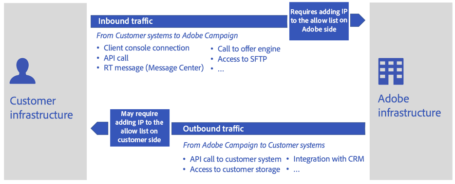

# Migration to Public Cloud FAQ{#dc-faq}

As part of the [Gold Standard Initiative](../../rn/using/gold-standard.md), Adobe decommissions the legacy Data Center. Campaign Classic instances must be transferred to Public Cloud Amazon Web Services (AWS). [Learn more about this initiative](dc-migration.md).

You will find below a set of common questions about this project, the impact on your Campaign environments, and other useful resources.

For any other question, you can reach out to [Adobe Customer Care](https://experienceleague.adobe.com/?support-solution=Campaign#support).

## Infrastructure impacts

 

Global impacts on database and infrastructure are listed below.

* **Is the database going to change? What is the version of the new database? What Operating System will be used?**

    Adobe reserves the right to choose and deploy the most suitable Database management engine to serve Adobe Campaign Service in optimal conditions.
    
    In addition, in order to preserve the best level of security, Adobe will not provide any detailed information related to infrastructure.

* **Is there a risk of data loss?**
    
    The database will be dumped from the legacy datacenter and restored in Public Cloud (AWS). When restarted on the new data center, the application will resume from the exact state it was before shutdown. Users won’t see any difference, except that some scheduled tasks will have been delayed.

* **Are there any differences in the size of the package between the Legacy data center and the Public Cloud?**
    
    We are provisioning in Public Cloud (AWS) with new package definitions based on current database size, disk size etc. For example, if a customer has one Application server in legacy Data Centers, they can can two Application servers in Public Cloud (AWS) based on package definitions.

* **Is the build number or Campaign version going to change?**
    
    As a first step, we are going to keep same Campaign Classic build with migration.
    
    In a further step, we will proceed to upgrade to the latest Campaign Classic GA build. For more on this, refer to the [Build Upgrade FAQ](../../platform/using/faq-build-upgrade.md) and [Campaign Gold Standard Release notes](../../rn/using/gold-standard.md).

* **What is the plan for addressing any post migration issues?**

    Extensive testing would be done before the production systems are migration. However in case of any issues, [Adobe Customer Care](https://experienceleague.adobe.com/?support-solution=Campaign#support) will remain the main point of contact. Adobe has set up a team of experts to provide advanced support, if needed.

## Deliverability impacts

 

Global impacts on IPs, block list, sub-domains and URLs are listed below.

* **How will IP on the allow list be handled? Will the customers need to add new IP addresses to the allow list for incoming traffic from Campaign?**

    The IP address of the Adobe servers will change. So the customers may need to add those new IP addresses in the allow list in their system.
    
    [Click here](#config) for more details about IP on the allow list.

* **How will we handle port added to the allow list for SFTP/FTP access?**
    
    SFTP configuration (public keys + IP on the allow list) will be moved from legacy Data Center to Public Cloud (AWS) as well. No action expected from the customer.

* **Are we changing IPs?**
    
    The IP address of the Adobe servers will change. So the customers may need to add those new IP addresses to the allow list in their system.

    [Click here](#config) for more details about IP on the allow list.

* **How will sub-domain delegation be handled?**
    
    Existing subdomains will be moved from legacy Data Center to Public Cloud (AWS). This part will be handled by Adobe Deliverability team as part of the migration process.
    
    Adobe will guide the customer through the required tests to ensure configuration is up and running on new Public Cloud (AWS) servers after the migration.

* **Will the migration produce new URLs for tracking, resources and web applications?**
    
    No, we will preserve existing URLs.

* **Will there be a change in subdomain from Neolane.net to campaign.adobe.com?**
    
    Both `neolane.net` and `campaign.adobe.com` will be in place post migration. To make it simple: we will redirect neolane.net to new instances in Public Cloud (AWS), so no changes required from customer.

* **What is the plan for IP Warming?**
    
    First of all, Adobe Deliverability will assess the platform’s deliverability status and recommend a plan for the switch to the new IPs 
    
    No warm-up is required after the migration. It might be some exception and, in such case, [Adobe Customer Care](https://experienceleague.adobe.com/?support-solution=Campaign#support) will reach out to customers.
    
    However, the plan is to make this operation transparent for the business, unlike the initial ramp-up that is done during go-live. 
    
    When the migration is complete, the Campaign instance will have entirely different sending IPs. As a matter of ensuring a smooth transition, Adobe will implement a ramp-up of the new sending IPs by progressively switching traffic from the old to the new IPs.

* **Are we moving over URL on the allow list?**
    
    Yes, this is stored in the server configuration file which will be copied from the source over to the new instance.

* **What should be the impact with our delegated sub-domain we use to brand our communication?**
    
    The sub-domain(s) used for marketing communication will remain the same. However, depending on the implementation, actions might will be needed on the client side: 
    * In case of sub-domain delegation to Adobe (default), Adobe will take care of all changes and ensure a seamless transition.
    * In case of CNAME setup (exception), the client will be requested to implement changes. Coordination with Adobe will be needed.

## Configuration and connectivity impacts

 

### Note about IP on the allow list{#config}

Migration to public Cloud will come with new IPs for Adobe Campaign application servers so that changing IP may then have impacts on connectivity between Adobe servers and your Information Systems.

Let’s consider the two cases :

* Inbound traffic: All network activity that is initiated from your systems or any other third party to Adobe Campaign servers. Configuration will be handled by Adobe and then copied from legacy to public Cloud during migration. Then connectivity for inbound traffic will be preserved as is after the migration and no action is expected from Customer side 

* Outbound traffic: All network activity that is initiated by Adobe Campaign servers to your Information System or any other third party (ex: SMS provider). Depending on security policies in place in your organization, IPs changing may require allow list operation from your Information System or any other third party

### Global impacts

Global impacts on configuration, connectivity with other systems and products, APIs and timezone are listed below.

* **Will the migration impact connectivity to external accounts?**
    
    Yes. Third-party integrations, SMS providers for example, should add new Adobe Campaign application servers IP addresses to the allow list.

* **Will the migration impact connectivity to Adobe Analytics using the Genesis connector? What about adding Campaign IP addresses to the allow list on the Adobe Analytics side?**
    
    Adobe Campaign application servers IP addresses will change. This step will be handled by Adobe Customer Care post-migration. 

* **Will the migration impact connectivity with other Adobe solutions (AEM, Target, etc.)?**
    
    Integrations are a combination of IP adresses declared on the allow list and web service account configuration. This will be accounted for and owned by Adobe Customer Care.
    
    There will be IP adresses on the allow list that will be required in the external solution as Application servers IP will change. This information will be provided. Other parts of integration are IMS-based and should work as-is.

* **What about customer that are not attached to Org ID for IMS integration?**

    Customers who don’t have IMS will be provided one: an IMS org ID will be attached to their instance.

* **Are multi-branding configurations impacted by the migration?**
    
    As soon as subdomain and all related configuration are moved/redirected correctly from legacy Data Center to Public Cloud (AWS), we should not expect any impact.

* **Is API connectivity impacted by the migration?**
    
    The IP address of the Adobe servers will change. So the customers may need to add those new IP addresses to the allow list in their system.
    
    [Click here](#config) for more details about IP on allow list.

* **Will we ensure that all JavaScript memory configuration parameters are set correctly after the migration?**
    
    We will copy instance configuration from legacy Data Center to Public Cloud (AWS), so these values will get preserved after migration.

* **Is there any risk to the access to certain file extensions?**
    
    Customer may want to allow font files, outlook meeting files to be loaded in public resources folder. This configuration is done in current `config-<instance>.xml` file. This will be copied over with configuration files.

* **Is the timezone changing on new server? Will customer be able to keep their current timezone?**
    
    It may change according to new servers location. However customer will be able to retain their current timezone.
    
    [Click here](../../workflow/using/managing-time-zones.md) for more detail on timezone management in Adobe Campaign Classic v7.

## Security and permissions

 

With this migration to Public Cloud (AWS), customer environments will be kept up to date with all necessary security requirements. This includes :

* Newest OS and security patches on a periodic bases
* Isolation of infrastructure per customer
* Managed security and audit reviews for supporting cloud infrastructure such as load balancers, network security rules and storage encryption.

Impacts on permissions, certificates and SFTP access are listed below.

* **Are we going to move all certificates to the new servers?**
    
    Yes, all certificates will be moved as part of this migration.

* **Do we need request new STP access keys from customer?**
    
    No, Adobe will copy SFTP access keys as is on new server.

* **How are SFTP permissions handled?**

    We are ensuring new SFTP server, users, directories and files have exactly same permission levels.

* **If SFTP connection could not be established then what is the workaround/plan to keep customer operational?**
    
    The only connectivity issue that may arise is related to the allow list on customer side. Customer should add this test on non production environment to make sure it works before moving to prod.

* **Are there any data center specific allow list configurations that need to move over?**
    
    No, there is no data center specific allow list configuration to manage.

* **Are we ensuring that custom scripts will be successfully executed in the new environment?**

    Customer implementation can use custom scripts (Perl/Shell/Python/Java Script) in workflows to manipulate files and folders for example. 
    
    On the hosted instance, scripts are executed only through the javascript engine. These specific implementations can cause security gaps and postupgrade issues. They are not supported.

* **With IMS integration, will it work as is in new instance or will any additional configuration update is needed?**
    
    As we are keeping same DNS names, it should work as is after migration.

## Migration execution

 

Global impacts during the migration are listed below.

* **Do we need to plan stopping Marketing activity during the migration?**  

    Adobe recommends slowing down and ideally pausing all executions just before the application is shutdown on the legacy Data Center: deliveries and workflows. That will ease the restart on Cloud Server (AWS) as processes will have been given time to pause “gracefully” and save any in-progress execution state. 

* **Do we expect downtime of our Adobe Campaign service?**

    The migration will come with an unavoidable platform downtime. The aim of this plan is to guide towards minimizing this downtime. 

    Data transfer between Data Centers is on the critical path of the downtime. The data is stored in two ways: 

    * By far the most important, the database 
    * Files on the application server (data imports and exports) 

    Reducing the size of the database is of highest importance to speed up the data transfer. Suggestions: 

    * Reduce the retention periods of historical data (delivery logs, tracking logs, etc.) 
    * Delete useless records on other tables (deliveries, recipients, custom tables)

* **What is the estimated downtime for migrating an instance?**
    
    Downtime is entirely dependent on the size of the customer’s database and SFTP file storage sizes. Please reach out to your Customer Care contact to get provided with an estimated duration.

* **What about messages sent from the legacy server. Will links always be accessible?**
    
    While the migration is running, only one service will remain functional: email links redirection. All recipients will be able to reach the landing page when they click in an email. These clicks will however not be tracked, so click rates for the deliveries that were started shortly before the migration will be lower than usual.

* **What about mid-soucing/RT environments?**
    
    MID sourcing and RT are handled as any other hosted piece of infrastructure.

* **What order will migrations be done in?**
    
    Environments will be migrated in the following order:

    1. Development environments
    1. Stage  environments
    1. Production environments
    1. RT environments
    1. Mid-sourcing  environments

* **What is the rollback plan?**
    
    Rollback plan is to switch DNS back and set source database back to read-write from read only. Eventually we will have automation for it.

* **After the migration, do we keep an access to old instances?**
    
    Once the application migration is complete, there is no plan for running any process again on the legacy Data Center. We expect that all data on the legacy Data Center can be erased, except for temporary backup purposes, until the scheduled backup processes have run on Public Cloud (AWS).

* **How many time will be allowed for testing of each instance after migration to Public Cloud?**
    
    Depending on customer complexity Bake time of at least 1 week is required between Stage environment and Production environment migrations.

* **Who will handle adding new IPs to the allow list?**
    
    Adobe Customer Care team will handle ensuring that the customer and any third parties can access the new system by adding the new IPs to the allow list.

## Support and other useful links{#support}

* [Migration to Adobe Managed Services (Public Cloud)](dc-migration.md)
* [Gold Standard Upgrade](../../rn/using/gs-overview.md)
* [Build Upgrade FAQ](../../platform/using/faq-build-upgrade.md)
