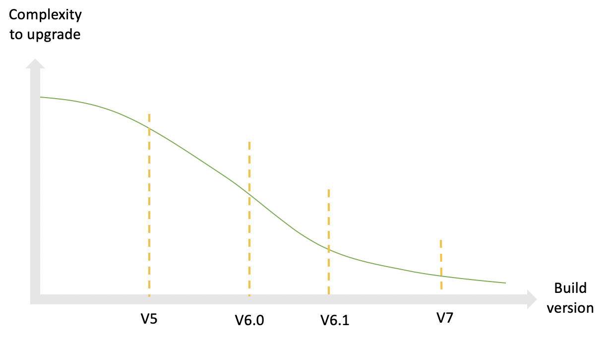
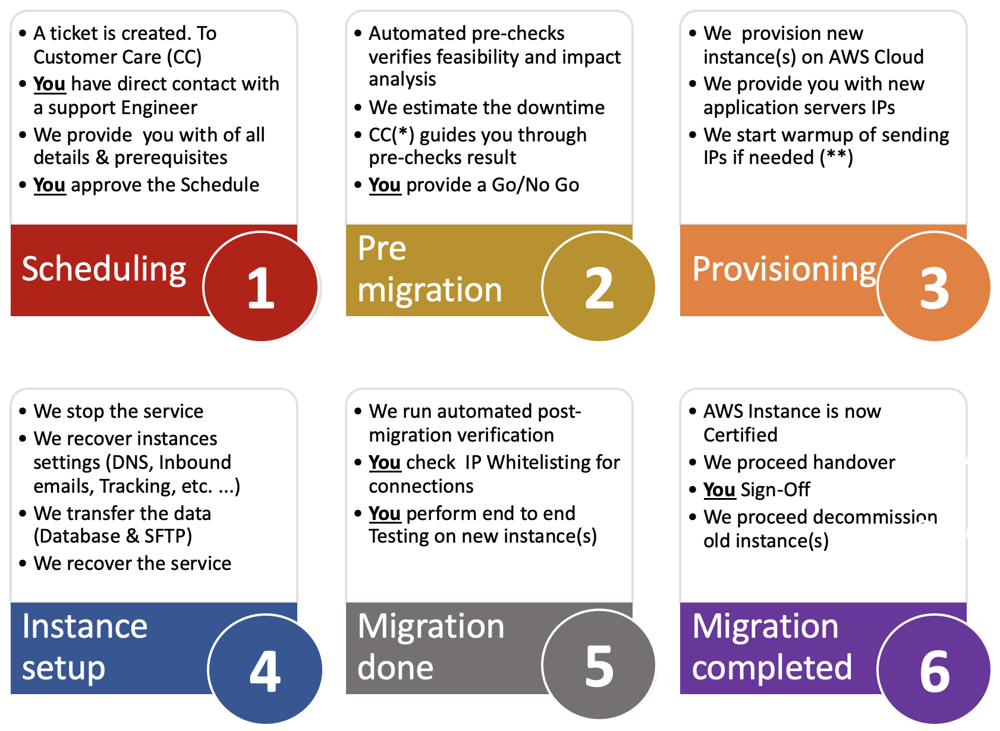

# Overview{#dc-ovv}

## Context

As a valued Adobe Campaign Classic customer, we are committed to providing you the best experience and value. Over the years, we have realized the value and reliability of hosting our customers in the cloud.  As part of our [Yearly Upgrade Initiative](../../rn/using/rn-overview.md#yearly-upgrade), we are moving all of our customers to Adobe Managed Services (Public Cloud on AWS) to provide better and more reliable services.

This program has three main goals: 

* Addressing identified security vulnerabilities by moving infrastructure to a secured and modern environment (AWS).
* Eliminate potentially cumbersome scaling processes,  provide access to our [Enhanced MTAs](../../delivery/using//sending-with-enhanced-mta.md) and improve all maintenance service levels. 
* Prepare your instance for the future of Adobe Campaign Classic, including more automated, regular upgrades that won’t require as many resources, nor as much time.

### Glossary

* **Build Upgrade** - When the Adobe Campaign Classic software is updated to the latest secure build number, yet stays in the same major/minor build Level. For example: Campaign v7 20.2.3 build 9182 to Campaign v7 21.2.5 build 9188. [Learn more](../../platform/using/faq-build-upgrade.md).
* **MID/RT** - Messages execution servers hosted on Adobe Cloud (MID for batch campaigns and RT for Real time unitary messages)
* **Yearly Upgrade Program** - this program provides improved security, improved support, enhanced maintenance and stability. It also makes future upgrades easier and gives access to new capabilities in Campaign.  [Learn more](../../rn/using/rn-overview.md#yearly-upgrade).
* **AWS** - Amazon Web Services (Amazon Public Cloud)
* **SFTP** - Secured File Transfer Protocol. [Learn more](../../platform/using/sftp-server-usage.md).

>[!NOTE]
>Campaign Classic v7 migration to Public Cloud impacts customers using **Adobe Managed Services** only.

## Benefits

**Security**

* Latest security fixes
* Data encryption at rest
* Improved authentication (IMS)

**Infrastructures**

* Agile hardware scalability
* Faster Restoration
* Improved reliability & stability
* Harmonized Operating procedures

**Performances**

* Improved Email capacity
* Bigger Databases
* Proofed Campaign version

**Bring a robust, reliable solution for Adobe Campaign Classic customers**

1. Better production procedures, leading to increased reliability, faster reactivity in case of issue, faster recovery in case of major incident.
1. Higher email sending capacity. Instances hosted in the new data center will get the possibility to benefit from specialized infrastructure for email delivery. That could lead to higher email delivery speed or allow for using less sending IPs.
1. Better hardware scalability. Increasing hardware resources can be done much faster. Technically, that would be in the order of magnitude of 1 hour instead of several days.

**Yearly upgrades makes future upgrades easier**

1. The longer your organization waits to upgrade, the more complex your upgrade becomes and the potential to face vulnerabilities increases (especially when moving from an older version).
1. With Campaign Yearly Upgrade (was Gold Standard initiative), your instance will be modernized and will be ready to receive more automated and regular updates with less manual intervention and less resources.

## About the migration

The migration to Adobe Managed Services (Public Cloud) will happen in 2020/2021 for affected accounts. Adobe will lead and guide your organization through this journey.

To get this effort started, accounts requiring this migration will receive an email communication from Adobe providing a timeline and access to documentation. This will be your notification that your account is scheduled to be migrated.

A migration can be initiated by [opening a new Customer Care support ticket](https://experienceleague.adobe.com/?support-solution=Campaign#support). Use the subject line “Migrate to AWS”.

### Is this migration mandatory?

This migration to the Cloud is **first step to the [yearly upgrade program](../../rn/using/rn-overview.md#yearly-upgrade)** of your Adobe Campaign instances. This migration is mandatory if you are hosted in a Data Center that is not the Public Cloud (AWS).

The Adobe Managed Services cloud is hosted on Amazon Web Services (AWS), a modern, secure, and optimized environment. [Learn more about AWS](https://aws.amazon.com/application-hosting/benefits/).

Adobe plans to decommission the legacy Data Center, Adobe Campaign instances running there must be transferred to the new reference Data Center, AWS. 

This is a critical path forward as your current location may be exposed to **security and performance vulnerabilities**.

In addition, this migration is now a **prerequisite to any future Build upgrade** of your Adobe Campaign. Build upgrade is no more possible on legacy Data Center.

Adobe is committed in securing your data and getting you on track for the future of Adobe Campaign. We need your partnership to make it a joint success!

**We have organized a team** of dedicated Customer Care Reps, Customer Success Managers, Product Managers, Engineers, TechOps Specialists and Product Consultants to assist and ensure the experience is smooth and seamless. We are committed to making sure you have the relevant project and contact information.

We have invested a huge effort in developing technologies that will make this migration fast, seamless and secured.

### Constraints

* The migration will come with an unavoidable platform downtime. The aim of this plan is to guide towards minimizing this downtime.
* IP change for data integrations.
* Deliverability ramp-up of new sending IPs. However, the plan is to make this operation transparent for the business, unlike the initial ramp-up that is done during go-live.

Learn more in Campaign migration to [Public Cloud FAQ](dc-migration-faq.md).

## Migration path to Public Cloud

Adobe handles most of the actions. We need you for validation and sign-off.

## Migration guidelines

### Global approach

**Database**

The database will be dumped from the legacy data center and restored at Public Cloud (AWS). When restarted on the new data center, the application will resume from the exact state it was before shutdown. Users won’t see any difference, except that some scheduled tasks will have been delayed.

**Email sending IPs**

When the migration is complete, the Campaign instance will have entirely different sending IPs. As a matter of ensuring a smooth transition, Adobe will implement a ramp-up of the new sending IPs by progres-sively switching traffic from the old to the new IPs.

**Data integration IPs**

Data integration on the client side might be affected by the change of IPs for data integration. The change might affect both directions, depending if Campaign acts as a server or a client.
Typical cases:

* SFTP, possibly both directions
* HTTP, possibly both directions
* SMPP (connection to SMS provider), Campaign as a client, change of source IP

In general, that means that the client should check possible IP-restrictions set on their firewalls and adapt them accordingly.*

**Campaign Servers**

Existing Campaign servers (containers actually) will be moved to Public Cloud (AWS) in a “lift-and-shift” approach. That is, no new server installation will be needed, but the entire server will be transferred to the new data center. The operation will require no more work than low-level technical reconfiguration.

**Server names**

Under the sub-domain(s) used for marketing communication: will remain the same. However, depending on the implementation, actions might will be needed on the client side:

* In case of sub-domain delegation (normal case), Adobe will take care of all changes and ensure a seamless transition
* In case of CNAME setup (exception), the client will be requested to implement changes. Coordination with Adobe will be needed.

For user access and data integration, the names under neolane.net will remain unchanged.

That means the change will be transparent for users, and data integration implementations, if server names were not replaced by hard-coded IPs.

### Preparation

**Email sending IPs**

First, Adobe Deliverability will assess the platform’s deliverability status and recommend a plan for the switch to the new IPs.

Adobe will provision the same number of IPs on the new data center.

The ramp-up of new IPs can begin as soon as the new IPs are provisioned.

**Application clean-up**
Data transfer between data centers is on the critical path of the downtime.

The data is stored in two ways:

1. By far the most important, the database
1. Files on the application server (data imports and exports)

Reducing the size of the database is of highest importance to speed up the data transfer.

Suggestions:

* Reduce the retention periods of historical data (delivery logs, tracking logs, etc.)
* Delete useless records on other tables (deliveries, recipients, custom tables)

### Execution

**Pause executions**

We recommend slowing down and ideally pausing all executions just before the application is shutdown on the legacy data center: deliveries and workflows. That will ease the restart on Public Cloud (AWS) as processes will have been given time to pause “gracefully” and save any in-progress execution state.

**During the migration**

While the migration happens, only one service will remain functional: email links redirection. In other words, recipients will be able to reach the landing page when they click in an email. These clicks will however not be recorded, so click rates for the deliveries that were started shortly before the migration will be lower than normal.

**Restart**

Once migrated to the new environment, the application will be restarted progressively:

* First console access, so users can check the status without anything actively running yet
* Then, workflows and deliveries

### Post-migration

**Deletion of instances on legacy Data Center**

Once the application migration is complete, there is no plan for running any process again on the legacy data center. We expect that all data on the legacy data center can be erased, except for temporary backup purposes, until the scheduled backup processes have run on Public Cloud (AWS).

**DNS Delegation**

Normally, the domain used for sending email (part on the right of the @ sign in the error address) from Campaign has been delegated to Adobe. The delegation can be changed and implemented towards the AWS DNS servers.

## Support and other useful links{#support}

* [Migration to Adobe Managed Services (Public Cloud) FAQ](dc-migration-faq.md)
* [Campaign Yearly Upgrades](../../rn/using/rn-overview.md)
* [Build Upgrade FAQ](../../platform/using/faq-build-upgrade.md)
