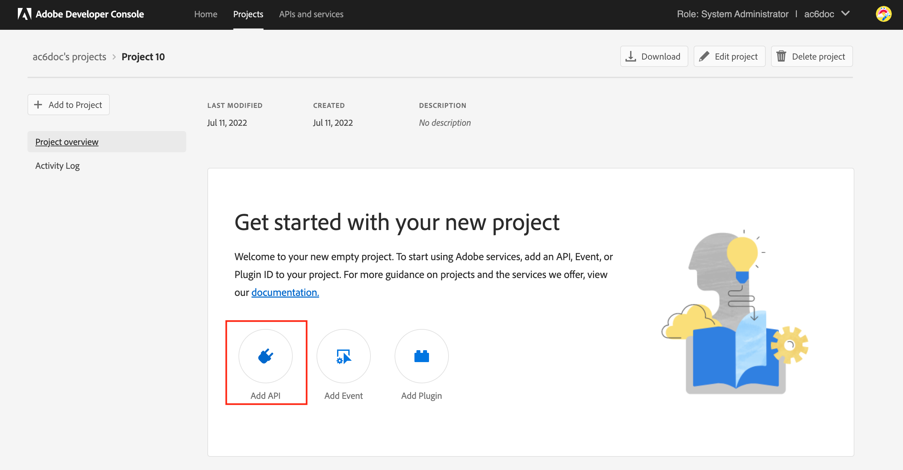
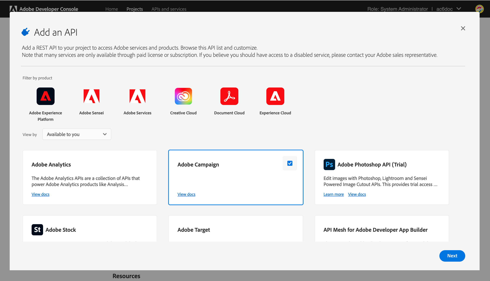
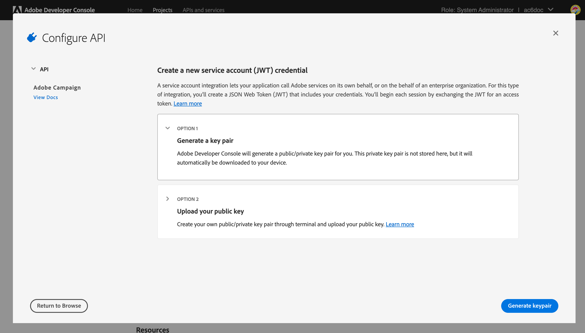
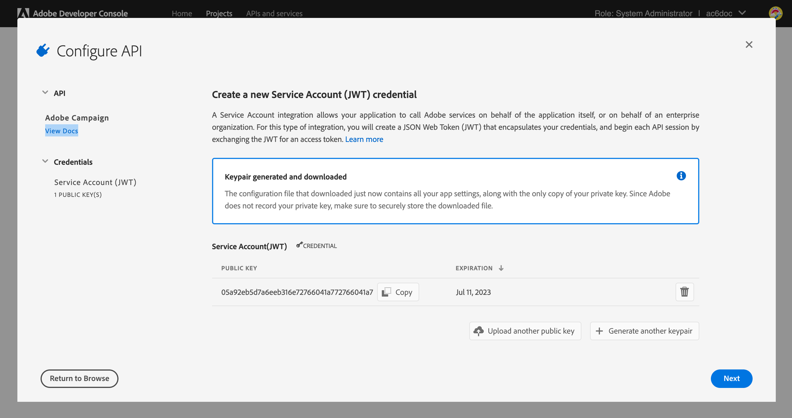
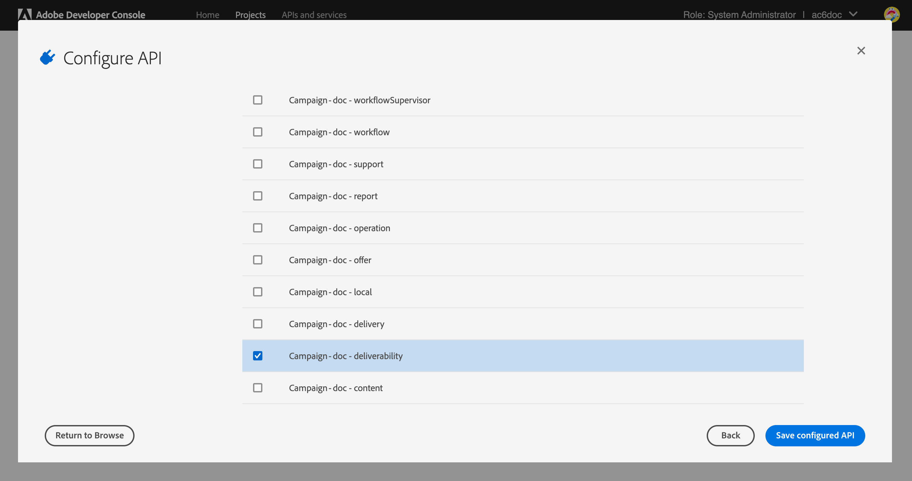
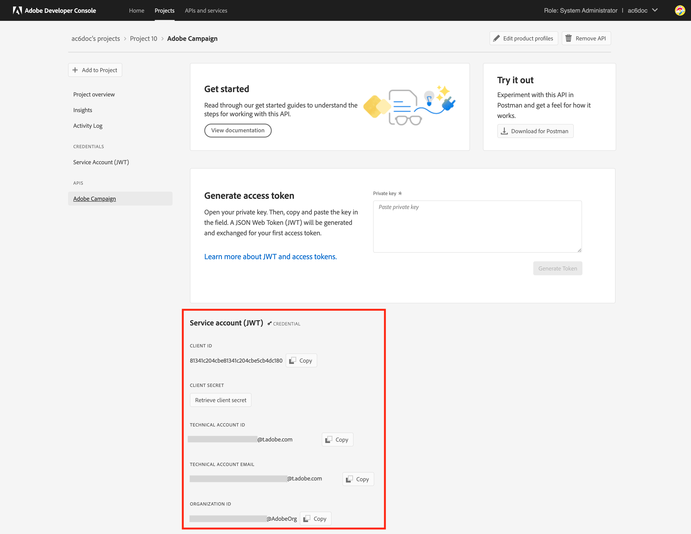

# Update to the new deliverability server {#acc-deliverability}

Starting [v7.2.2 release](../../rn/using/latest-release.md#release-7-2-2), Adobe Campaign relies on a new deliverability server which bring high availability and addresses security compliance issues. Campaign Classic now synchronizes the deliverability rules, broadlogs and suppression address from and to new deliverability server. The old deliverability server will be decomissioned on August 31, 2022. 

As a Campaign Classic customer, you must implement the new deliverability server **before August 31, 2022**.

>[!NOTE]
>
>For more questions about these changes, refer to the [FAQ](#faq), or contact [Adobe Customer Care](https://helpx.adobe.com/enterprise/admin-guide.html/enterprise/using/support-for-experience-cloud.ug.html){_blank}.
>

## What changed?{#acc-deliverability-changes}

Adobe is decommissioning older data centers due to security compliance reasons. Adobe Campaign Classic clients need to migrate to the new deliverability service, hosted on Amazon Web Service (AWS).

This new server guarantees a high availability (99.9)​, and provides secure and authenticated endpoints to enable campaign servers to fetch the required data: rather than connecting to the database for every request, the new deliverability server caches the data to serve the requests where possible. This mechanism improves the response time.​

## Are you impacted?{#acc-deliverability-impacts}

All customers are impacted and must upgrade to [Campaign v7.2.2](../../rn/using/latest-release.md#release-7-2-2) (or more) and implement their environment to benefit from the new deliverability server.

## How to update?{#acc-deliverability-update}

As a **hosted customer**, Adobe will be working with you to upgrade your instance(s) to the newer version, and create the project in Adobe Developer Console.

As an **on-premise/hybrid customer**, you need to upgrade to [Campaign v7.2.2](../../rn/using/latest-release.md#release-7-2-2) (or more) to benefit from the new deliverability server. Once all instances are upgraded, you must [implement the new integration](#implementation-steps) to Adobe deliverability server, and ensure a seamless transition.

## Implementation steps {#implementation-steps}

>[!WARNING]
>
>These steps should only be carried out for Hybrid and On-premise implementations.

As part of the new deliverability server integration, Campaign needs to communicate with Adobe Shared Services via an Identity Management Service (IMS) based authentication. The preferred way is to use the Adobe Developer based Gateway Token (also called Technical Account Token or Adobe IO JWT).

>[!AVAILABILITY]
>
> The Service Account (JWT) credential is being deprecated by Adobe, Campaign integrations with Adobe solutions and apps must now rely on OAuth Server-to-Server credential. </br>
>
> * If you have implemented inbound integrations with Campaign, you must migrate your Technical Account as detailed in [this documentation](https://developer.adobe.com/developer-console/docs/guides/authentication/ServerToServerAuthentication/migration/#_blank). Existing Service Account (JWT) credentials will continue to work until January 27, 2025. In addition, the creation of new Service Account (JWT) credentials in the Developer Console is no longer possible starting June 3, 2024. A new Service Account (JWT) credential cannot be created or added to a project after this date. </br>
>
> * If you have implemented outbound integrations, such as Campaign-Analytics integration or Experience Cloud Triggers integration, they will continue to work until until January 27, 2025. However, before that date, you must upgrade your Campaign environment to v7.4.1 and migrate your Technical Account to oAuth. As the creation of new Service Account (JWT) credentials in the Developer Console is no longer possible starting June 3, 2024, you cannot create a new outbound integration relying on JWT after this date

### Prerequisites{#prerequisites}

Before starting the implementation, check your instance configuration.

1. Open Campaign client console and log on to Adobe Campaign as an Administrator.
1. Browse to **Administration > Platform > Options**.
1. Check that the `DmRendering_cuid` option value is filled. 

    * If the option is filled, you can start the implementation.
    * If no value is filled, contact [Adobe Customer Care](https://helpx.adobe.com/enterprise/admin-guide.html/enterprise/using/support-for-experience-cloud.ug.html){_blank} to get your CUID.

    This option must be filled on all your Campaign instances (MKT, MID, RT, EXEC) with the correct value. As an hybrid customer, reach out to Adobe to have the option set on your MID, RT and EXEC instances.

As an on-premise customer, you must also check that a Campaign **[!UICONTROL Product profile]** is available for your Organization. To perform this, follow the steps below:

1. As an Administrator, connect to [Adobe Admin Console](https://adminconsole.adobe.com/){_blank}.
1. Access the **Product and Services** section and check **Adobe Campaign** is listed.
    If you cannot see **Adobe Campaign** contact [Adobe Customer Care](https://helpx.adobe.com/enterprise/admin-guide.html/enterprise/using/support-for-experience-cloud.ug.html){_blank} to get it added.
1. Click **Adobe Campaign** and select your Organization. 
    **Caution**: If you have more than one organization, make sure to select the correct one. Learn more about Organizations [in this page](https://experienceleague.adobe.com/docs/control-panel/using/faq.html#ims-org-id){_blank}.
    
1. Check that a **[!UICONTROL Product profile]** exists. If not, create it. No permission is required for this **[!UICONTROL Product profile]**. 


>[!CAUTION]
>
>As an on-premise customer, if a firewall is implemented on your side, you must add this url `https://deliverability-service.adobe.io` to your allowlist. [Learn more](../../installation/using/url-permissions.md).


### Step 1: Create/update your Adobe Developer Project {#adobe-io-project}

1. Access [Adobe Developer Console](https://developer.adobe.com/console/home) and log in with the Developer access of your Organization. Make sure you are logged into the correct Organization portal. 
    **Caution**: If you have more than one organization, make sure to select the correct one. Learn more about Organizations [in this page](https://experienceleague.adobe.com/docs/control-panel/using/faq.html#ims-org-id){_blank}.
1. Select **[!UICONTROL Create new project]**.
     

    >[!CAUTION]
    >
    >If you are already using Adobe IO JWT authentication functionality for another integration, such as Analytics connector, or Adobe Triggers, then you must update your project by adding **Campaign API** to that project.

1. Choose **[!UICONTROL Add API]**.
     
1. In the **[!UICONTROL Add an API]** window, select **[!UICONTROL Adobe Campaign]**.
     
1. If your Client ID was empty, select **[!UICONTROL Generate a key pair]** to create a public and private key pair.
     

    The keys will then be automatically downloaded with a default expiry date of 365 days. Once expired, you will need to create a new key pair and update the integration in the configuration file. Using the Option 2, you can choose to manually create and upload your **[!UICONTROL Public key]** with a longer expiry date.
     

    >[!CAUTION]
    >
    >You should save the `config.zip` file when the download prompt comes up since you will not be able to download it again.

1. Click **[!UICONTROL Next]**.
1. Choose any existing **[!UICONTROL Product profile]** or create a new one if needed. No permission is required for this **[!UICONTROL Product profile]**. For more information on **[!UICONTROL Product Profiles]**, refer to [this page](https://helpx.adobe.com/enterprise/using/manage-developers.html){_blank}.
     
    
    Then, click **[!UICONTROL Save configured API]**. 

1. From your project, select **[!UICONTROL Adobe Campaign]** and copy the following information under **[!UICONTROL Service Account (JWT)]**

     

    * **[!UICONTROL Client ID]**
    * **[!UICONTROL Client Secret]**
    * **[!UICONTROL Technical account ID]**
    * **[!UICONTROL Organization ID]**

>[!CAUTION]
>
>Adobe Developer certificate will expire after 12 months. You need to generate a new key pair every year.

### Step 2: Add the project credentials in Adobe Campaign {#add-credentials-campaign}

The private key should be encoded in base64 UTF-8 format. 

To do so:

1. Use the private key generated in the steps above.
1. Encode the private key using the following command: `base64 ./private.key > private.key.base64`. This will save the base64 content to a new file `private.key.base64`.

    >[!NOTE]
    >
    >Extra lines can sometimes be automatically added when copy/pasting the private key. Remember to remove it before encoding your private key.

1. Copy the contents from the file `private.key.base64`.
1. Login via SSH to each container where the Adobe Campaign instance is installed and add the Project credentials in Adobe Campaign by running the following command as `neolane` user. This will insert the **[!UICONTROL Technical Account]** credentials in the instance configuration file.

    ```sql
    nlserver config -instance:<instance name> -setimsjwtauth:Organization_Id/Client_Id/Technical_Account_ID/<Client_Secret>/<Base64_encoded_Private_Key>
    ```

1. You must stop and then restart the server in order for the modification to be taken into account. You can also run a `config -reload` command.

### Step 3: Validate your configuration

To check that the integration is successful, follow the steps below:

1. Open the client console and log on to Adobe Campaign.
1. Browse to **Administration > Production > Technical workflows**.
1. Restart the **Refresh for deliverability** (deliverabilityUpdate) workflow. This should be performed on all your Campaign instances (MKT, MID, RT, EXEC). As an hybrid customer, reach out to Adobe to have the workflow restarted on your MID, RT and EXEC instances.
1. Check logs: the workflow should execute without errors. 

>[!CAUTION]
>
>After the update, the **Update seed network for Inbox Rendering (updateRenderingSeeds)** workflow must be stopped, as it will no longer apply and will fail.

## Frequently Asked Questions {#faq}

### What is the timeline for the update? 

The transition to the new deliverability server, allowing for the addition of these improved capabilities and reinforcing security, will begin on July '22 for hosted customers (Campaign Managed Services). All hosted customers will be updated by the end of August. 

On-premise and hybrid customers must transition during the same timeframe.

### What happens if I do not upgrade my environment?

Any Campaign instance not upgraded by August 31 will no longer be able to connect with the Campaign Deliverability server. As a consequence, the **Refresh for deliverability** (deliverabilityUpdate) workflow will fail, and this will affect your deliverability. 

If you do not upgrade your environment, email settings will stop being synchronized (MX Management rules, Inbound Email rules, Domain Management rules, and bounce qualification rules). This could affect over time your deliverability. If a significant change is made on these rules, these will have to be applied manually from this point. 

For MKT instances, only [Global Suppression List](../../campaign-opt/using/filtering-rules.md#default-deliverability-exclusion-rules) is affected.
