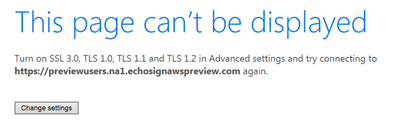

# End of Life for TLS 1.0 and 1.1 support{#eol-tls-support}

Adobe no longer supports user systems and client systems that are not compliant with the Transport Layer Security (TLS) 1.2 protocol. If you continue to use older versions of TLS, you could potentially lose access to all Adobe products and services.

## Why am I seeing this page?

If you see the following message: **This page can't be displayed**, this means that the Adobe apps, web page, or service you are trying to access requires a more secure network connection with your web browser, operating system, or app. It is mandatory to use **TLS 1.2** for secure network communication and data exchange between users systems and Adobe apps and web services.

Adobe has deprecated support for lower versions of TLS (including TLS 1.0 and 1.1). For technical details around the TLS 1.2 protocol, see [Frequently asked questions](#faq).

## What can I do to resume the service?

Modern web browsers support TLS 1.2. Upgrading your browser can enable you to access these apps and services. 

You can download and install one of the following popular browsers:

* [Google Chrome](https://www.google.com/chrome/)
* [Apple Safari](https://www.apple.com/safari/)
* [Firefox](https://www.mozilla.org/en-US/firefox/new/)
* [Microsoft Edge](https://www.microsoft.com/en-us/edge)

If you're using another browser, ensure that it supports TLS 1.2.

Your operating system and application frameworks must also support TLS 1.2. If upgrading your browser does not resolve your problem, ensure that your computer meets the system requirements listed in [Campaign Compatibility Matrix](../../rn/using/compatibility-matrix.md).

## Frequently asked questions{#faq}

* **What is Transport Layer Security (TLS)?**

    [Transport Layer Security](https://en.wikipedia.org/wiki/Transport_Layer_Security) (TLS) is a security protocol that provides privacy and data integrity between two communicating applications. It is deployed widely for web browsers and other applications that require data to be securely exchanged over a network.

    According to the protocol specification, TLS includes two layers, the TLS Record protocol and the TLS Handshake protocol. The Record protocol provides connection security. The Handshake protocol enables the server and client to authenticate each other, and negotiate encryption algorithms and cryptographic keys before data exchange.

* **What is the impact?**

    Adobe's security compliance standards require the deprecation of older protocols as of May 2018, and mandates the use of TLS 1.2 as the up-to-date version. If your system is not TLS 1.2-compliant, access to some Adobe apps and services is restricted.

* **How does TLS affect you?**

    You can only engage with some Adobe apps and services through a secure network connection. TLS helps ensure that the connection between your browser and these apps and web services is secure and reliable.

    As new browsers and operating systems are released, security standards are upgraded to ensure higher levels of privacy and data integrity. However, older versions of these browsers or OS are not updated to include the latest standards.

    As the acceptable level of security rises, these older, less secure browser versions and applications are left behind.

    To be able to connect with secure sites, update your OS and browser versions.

* **Is TLS vulnerable to hackers?**

    There have been documented attacks against TLS 1.0 using an older encryption method and the older versions are more vulnerable than TLS 1.2. For more information, see Attacks against TLS/SSL.

* **Why is Adobe disabling support for TLS 1.0 and 1.1?**

    Adobe has security compliance standards that require disabling support for older protocols. One such standard ensures compliance with the Payment Card Industry (PCI). PCI adaptation server is a set of security standards require organizations that accept, process, store, or transmit credit card information to maintain a secure environment.

    PCI compliance mandates the use of TLS 1.1 or higher as of May 2018.

* **Why is Adobe mandating the use of TLS 1.2 rather than allowing TLS 1.1 or TLS 1.0?**

    Most requests for Adobe apps and web services originate from TLS 1.2-compliant user systems, with low traffic from TLS 1.1 systems.

    Adobe has migrated to TLS 1.2 so its apps and web services are accessed more securely.

* **What is the last date that I can use an older version of TLS?**

    Adobe encourages users to quickly abandon the older versions to avoid exposure to security vulnerabilities. For more information, contact Adobe Customer Care or your customer success manager.

* **What error message appears if I use a browser that is not configured for TLS 1.2?**

    It depends on the browser that you are using. All browsers mentioned in [Campaign Compatibility Matrix](../../rn/using/compatibility-matrix.md) are configured to use TLS 1.2. If you are using a browser or version that does not figure in the list, update your browser.

    Adobe does not control error messages generated by the SSL communications layer. The browser generates these messages before connecting to Adobe apps and services. Here is an example of error that can occur with Internet Explorer 11 on Windows 7:

    

    TLS 1.2 is enabled on Internet Explorer 11 by default, but if it is turned off, you can turn it on. In this case, turn on TLS 1.2 from the advanced settings dialog rather than using other choices. Other errors, such as the following can also occur:

    * Unable to connect to the service
    * Service not available
    * Error in connection
