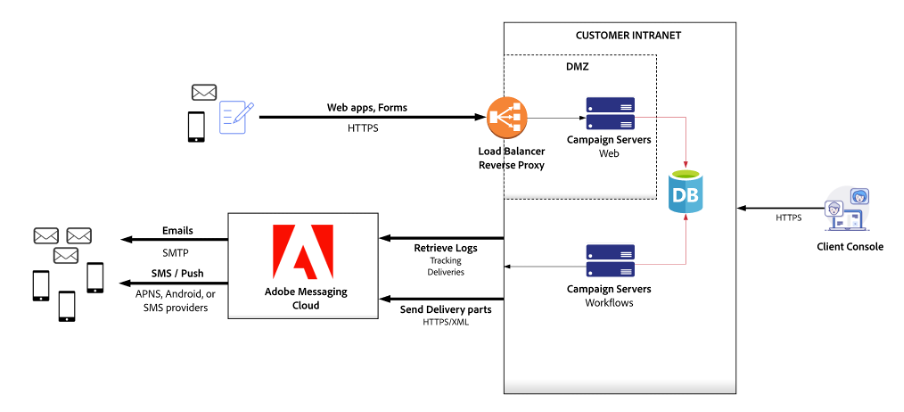
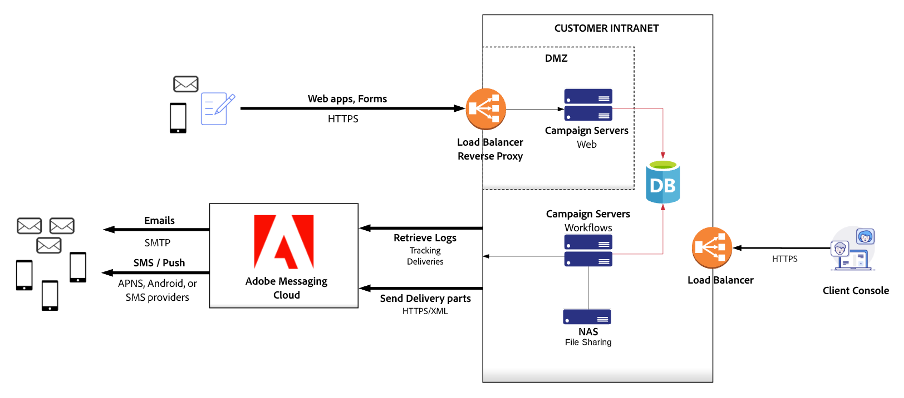
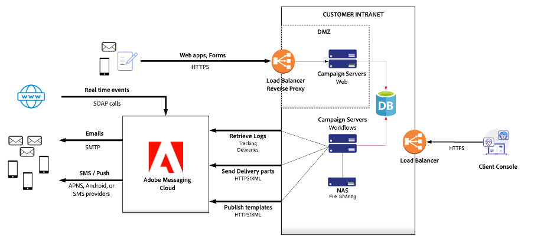

# Hardware sizing recommendations{#hardware-sizing-reco}

## Overview

>[!CAUTION]
>
>This article is provided as a general example guide only. You must engage with your Adobe Campaign Customer Success Manager to measure the exact sizing of your deployment before starting your Campaign project. **Do not** acquire or deploy any infrastructure or hardware until this is done.

This document provides general recommendations for Adobe Campaign Classic v7 deployment at your on-premise data center or virtualized cloud environment. This type of deployment, referred to as **hybrid** or **mid-sourcing**, places the Campaign marketing instance and marketing database under your operational control, while using Adobe Cloud Messaging services to send emails, SMS or SMPP messages, and collect email open, bounce, and click tracking data.

The marketing instance is the portion of the Adobe Campaign architecture that drives all marketing activity, and stores all recipient data and analytic data returned by campaigns. The marketing instance is a set of on-premise servers running Adobe Campaign services, and a relational database.

>[!CAUTION]
>
>The information in this document do not apply if you are using a fully hosted Adobe Campaign instance (deployed in Adobe Cloud Services).

Software compatibility is detailed in the [Compatibility Matrix](../../rn/using/compatibility-matrix.md).

### Scenarios

Deployment diagrams and hardware sizing recommendations are provided for three representative scenarios:

1. [Moderate-Size](#scenario-1) – 5 millions active recipients in the system
1. [Large-Size](#scenario-2) – 20 million active recipients in the system
1. [Enterprise](#scenario-3) – 50 million active recipients, with transactional messaging

### Assumptions

This document also assumes the following types of usage for all three scenarios:

* Large email campaigns are sent twice a week, to approximately 50% of your active recipients
* Direct mailings are generated once per month for each recipient in the system
* SMS messages are sent to approximately 10% of your active recipients each month
* The database schema defining each recipient has been extended with one additional table, containing about 200 bytes of data for each recipient
* Adobe Campaign Interaction module is used to add offers to outgoing email
* Email tracking data is retained in the Campaign system for 90 days

## General guidelines

Campaign is a database-centric application, and database server performance is critical. Running workflows, segmentation, tracking data uploads, inbound Interactions, analytics and other activities all generate database activity. In general, the size and frequency of these operations determine the size of your database servers.

The application servers in your marketing instance require enough CPU and memory to run workflows and respond to SOAP API calls, including requests from Campaign Console users. CPU requirements can be significant for workflows that use outbound interactions with complex offer rules, workflows that execute custom Javascript, and web applications with high traffic levels.

Campaign web applications can also be deployed on the marketing instance App servers, or on separate web server systems. Since web application workloads conflict with critical workflows and Campaign Console users, web applications and inbound interactions can be deployed to separate servers, to ensure that core Campaign functionality runs reliably with good performance.

For security and availability, Adobe recommends separating the traffic of the Internet from the traffic generated by the business users. For that reason, the diagrams contain two groups of servers: the Web server (Internet facing Web1 and Web2), and the App servers (business processes App1 and App2).

It is a legal requirement for commercially email senders to have a functional opt-out web page. Adobe recommends having redundant machine in each group server for fail-over scenarios. It is especially true if Adobe Campaign hosts the opt-out pages.

### Reverse proxies

The Campaign architecture enforces high security by using SSL over HTTP (HTTPS) to communicate between your marketing instance and Adobe Cloud Messaging. Security, reliability, and availability are enforced by using reverse proxies in a “demilitarized zone” (DMZ) subnet to isolate and secure the marketing instance servers and database.

### Load balancer

The load balancer for the App servers is set up in an active/passive configuration, with HTTPS terminated at the proxy. The load balancer for the Web servers is set up in an active/active configuration, with HTTPS terminated at the proxy.

Adobe provides you with the exclusive list of URL paths that can be relayed to the Adobe Campaign server in your deployment environment.

### Architecture

The general architecture is almost identical regardless of the volumes. The security and high availability requirements dictate a minimum of four servers; two servers if no WebApps are used. The difference in the configuration mainly varies in the hardware configuration like CPU core and memory.

## Scenario 1: Moderate-Size Deployment{#scenario-1}

Estimated volume:

| Channel                 | Volume          |
| ----------------------- | ----------------- |
| Active recipients       | 5 millions     |
| Email                   | 4.2 million/month |
| Direct mail             | 1 million/month   |
| Mobile SMS              | 100,000/month     |
| Peak daily email volume | 500               |

For these volumes, a pair of Adobe Campaign application server systems provides all functionality for Adobe Campaign Client users and workflow execution. For 5 millions active recipients and this email volume, application server workloads are not CPU or I/O intensive; most of the stress is on the database.

The Adobe Campaign Web servers are shown in the secure zone.

### Web & Application Servers

This scenario recommends installing Adobe Campaign on four machines, with the following specification:

**3Ghz+ quad-core CPU, 8-GB RAM, RAID 1 or 10, 2 x 80-GB SSD**

These systems create the marketing instance Application Server, which directly supports your Campaign Console users and executes the campaign workflows.

Reverse proxies in a DMZ load balance traffic to the Adobe Campaign Web servers. There is no requirement to install the Adobe Campaign software stack on proxy machines; any reverse proxy software or network equipment can be used.

Subscription opt-in/opt-out and preference center features can be provided by Campaign or by your own website. If you choose to implement this functionality on your website, you must ensure that preference and subscription information is propagated to the Campaign marketing database. It is normally done by creating extraction files which are uploaded by Campaign workflows automatically.

Disk space consumption on Application Servers depends on the retention period of files exchanged with third-party service providers (for example, print vendors for Direct Mail), and on the size and retention of imported flat files, like subscription or preference updates from your website, or extracts from your own CRM or marketing systems.

### Database

Hardware recommendations for the database server are as follows:

**3Ghz+ 4-core CPU, 16-GB RAM, RAID 1 or 10, 128GB SSD minimum**

The memory estimate assumes full caching of approximately 500,000 recipients for a large campaign launch, plus RDBMS buffer space for executing workflows, importing tracking data, and other concurrent activities.

It is estimated that the disk space required on the database to store all Adobe Campaign technical data (campaigns, tracking, working tables, and so on) is approximatively 35 GB based on a retention period of three months. If you choose to retain tracking data for 6 months, database size increases to approximatively 40 GB, and 12-month retention increases database size to approximatively 45 GB. Recipient data consumes about 5 GB for this environment.

>[!CAUTION]
>
>This estimate does not include any additional customer data. If you are planning to replicate additional columns or tables of customer data into the Adobe Campaign database, then you have to estimate the additional disk space requirement for it. Uploaded segments/lists also require more storage, depending on their size, frequency, and retention period.

Also consider that due to the volume of information processed daily, the IOPS of the database server is critical. For example, on a peak day, you can deploy campaigns targeting a total of 500,000 recipients. To execute each campaign, Adobe Campaign inserts 500,000 records into a table containing roughly 12 million records (the delivery log table). To provide acceptable performance during the campaign deployment, Adobe recommends a minimum of 60,000 4-KB Random read/write IOPS for this scenario.

## Scenario 2: Large-Size Deployment{#scenario-2}

Estimated volume:

| Channel                 | Volume          |
| ----------------------- | ----------------- |
| Active recipients       | 20 millions     |
| Email                   | 42 millions/month |
| Direct mail             | 10 millions/month   |
| Mobile SMS              | 1,000,000/month     |
| Peak daily email volume | 5,000,000               |

### Web & Application Servers

In this scenario, Adobe recommends installing Adobe Campaign on four machines, two application servers and two web servers, with the following specification:

**3Ghz+ quad-core CPU, 8-GB RAM, RAID 1 or 10, 80-GB SSD**

The Application servers directly support Campaign Console users and the execution of campaign workflows. This functionality is deployed on two identical servers for high-availability, sharing a Network-Attached Storage (NAS) file system to enable failover.

The Web servers host Campaign web applications supporting the 10-million active recipients in the system.

Refer to [Scenario 1: Moderate-Size Deployment](#scenario-1) for more comments on proxies, preference centers/subscription handling, and disk space usage.

### Database

Hardware recommendations for the database server are as follows:

**3Ghz+ 8-core CPU, 64-GB RAM, RAID 1 or 10, 2 x 320-GB SSD or RAID 10, 640 GB SSD minimum**

The memory estimate assumes full caching of approximately 5,000,000 recipients for a large campaign launch, plus RDBMS buffer space for executing workflows, importing tracking data, and other concurrent activities.

It is estimated that the disk space required on the database to store all Adobe Campaign technical data (campaigns, tracking, working tables, and so on) is approximatively 280 GB based on a retention period of 3 months. If you choose to retain tracking data for 6 months, database size increases to approximatively 450 GB, and 12-month retention increases database size to approximatively 900 GB. Recipient data consumes about 15 GB for this environment.

## Scenario 3: Enterprrise Deployment with Message Center{#scenario-3}

Estimated volume:

| Channel                 | Volume          |
| ----------------------- | ----------------- |
| Active recipients       | 50 millions |
| Email                   | 108 millions/month |
| Direct mail             | 25 millions/month |
| Mobile SMS              | 2,5 millions/month |
| Transactional messages  | 2,5 millions/month |
| Peak daily email volume | 2,5 millions |

The deployment supporting 50 million recipients is essentially the same as shown in [Scenario 2](#scenario-2): Campaign web application traffic is routed to Campaign web servers, so the bursts of web traffic after large campaign launches does not impact Campaign workflows and Client Console users.

This deployment also includes Message Center calls, driven from your own websites and applications.

### Web & Application Servers

In this scenario, Adobe recommends installing Adobe Campaign on four machines, as follows:

* Application servers
    **Two systems, 3Ghz+ quad-core CPU, 8-GB RAM, RAID 1 or 10, 80-GB SSD**

* Web servers
    **Two systems, 3Ghz+ quad-core CPU, 16-GB RAM, RAID 1 or 10, 80-GB SSD**

The Application servers directly support Campaign Console users and the execution of campaign workflows. This functionality is deployed on two identical servers for high-availability, sharing a Network-Attached Storage (NAS) file system to enable failover.

The Web servers host Campaign web applications supporting the 10-million active recipients in the system.

Refer to [Scenario 1: Moderate-Size Deployment](#scenario-1) for more comments on proxies, preference centers/subscription handling, and disk space usage.

### Database

Hardware recommendations for the database server are as follows:

**3Ghz+ 8-core CPU, 96-GB RAM, RAID 1 or 10, 1.5TB SSD minimum**

The memory estimate assumes full caching of approximately 12,500,000 recipients for a large campaign launch, plus RDBMS buffer space for executing workflows, importing tracking data, and other concurrent activities.

It is estimated that the disk space required on the database to store all Adobe Campaign technical data (campaigns, tracking, working tables, and so on) is approximatively 700 GB based on a retention period of 3 months. If you choose to retain tracking data for 6 months, database size increases to about approximatively 1.2TB, and 12-month retention increases database size to approximatively 2TB. Recipient data consumes about 50 GB for this environment. 

## Guidelines for Changing Assumptions

The assumptions made for these scenarios all have a significant impact on the hardware recommendations and deployment architecture. This section discusses guidelines around different assumptions. Contact the Adobe Campaign Consulting team for specific recommendations to meet your requirements.

* **Number of Recipients**
    Active recipients require both storage space and database buffer space, so more recipients generally require more memory and CPU capacity on the database server. Storage increases are relatively small for the recipients themselves, but can ay be significant for the event tracking data kept for email campaigns.

* **Email Campaign Size**
    The frequency of campaign launches has an impact on database server CPU requirements. Combined with direct mailing, inbound Interactions, and other workflows, segmentation operations for email campaigns put a significant load on the database server.

* **Direct Mail Frequency**
    The frequency of direct mailings can impact database server CPU requirements. Combined with campaign launches and other workflows, segmentation operations for direct mailings put a significant load on the database server.

* **SMS Message Volume**
    Like email campaign size, SMS message volume does not place large loads on Campaign servers located on-premise; the load is mostly on Adobe Cloud Messaging servers on the cloud. Segmentation for SMS campaigns, like email and direct mail, can place a significant load on the marketing database. Therefore the frequency of SMS campaign launches and complexity of segmentation are more relevant than the volume of SMS messages.

* **Database Schema Complexity**
    The amount of data for each active recipient requires both storage space and database buffer space, so more recipients generally require more memory and CPU on the database server. Complex schemas also require more tables to be joined for segmentation, so segmentation operations can run much slower, and require more database CPU and memory when data is spread across multiple tables.
    
    Database server memory is estimated by ensuring that the database buffer pool can be large enough to contain all recipient data, plus temporary tables for running workflows, plus a margin for other database operations.

* **Outbound Interaction Usage**
    Rules for Interaction in batch mode are evaluated in workflows that hand over all the calculation complexity to the database. The main factor of effort on the database is the total number of eligible offers computed during one engine call (target size X average number of offers per recipient before keeping the N best offers). The database server CPU speed is the first factor of performance.

* **Inbound Interactions or SOAP API Usage**
    Inbound Interaction rules and offers are evaluated in the marketing database, requiring significant database server resources, especially CPU. Heavy usage of inbound Interactions or SOAP APIs requires separate web servers to separate the work load from running Campaign workflows.

* **Tracking Data Retention Period**
    Increasing the retention of tracking data beyond 90 days requires more database storage, and can slow down the system because inserting new tracking data goes into large tables. Tracking data is not useful for campaign segmentation after 90 days, so the shorter retention period is recommended.
    
    Tracking data should be moved into Adobe Analytics or another analytics system if you require long-term analysis of recipient marketing experience.

## Virtualization

All Campaign servers are good candidates for virtualization. Several issues must be addressed to ensure appropriate availability and performance.

* **Fail-Over Configuration**
    Clustered servers, for example, redundant application servers under a load-balanced proxy, must be deployed on separate hardware to ensure that both VMs do not go down if there is hardware failure.

* **I/O Configuration**
    Any recommended RAID configuration must be maintained for database security, to ensure that loss of a storage device does not cause loss of data.

* **I/O Performance**
    The recommended IOPS rating for database storage must be respected. Cloud services like Amazon EC2 may not provide the required performance, and must be carefully evaluated. For example, Amazon EC2 provisioned SSD volumes are currently rated at 20,000 IOPS each. Learn more in [Amazon documentation](http://docs.aws.amazon.com/AWSEC2/latest/UserGuide/EBSVolumeTypes.html), so a 4-volume RAID configuration would be rated at 80,000 IOPS, which may not be sufficient.

Adobe recommends performance testing for any virtualized deployment of Adobe Campaign before putting the system into production.

## Related topics

* [Campaign Monitoring Processes](../../production/using/monitoring-processes.md)
* [Campaign general architecture](../../installation/using/general-architecture.md)
* [Performances and throughput issues](../../production/using/performance-and-throughput-issues.md)
* [Security and privacy checklist](../../installation/using/get-started-security-privacy.md)
