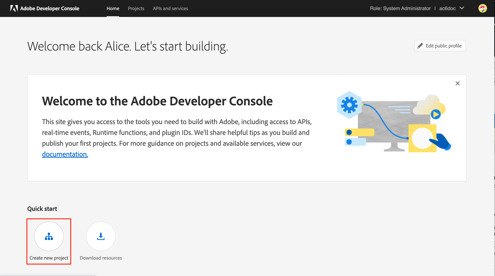

# Migration of Campaign technical operators to Adobe Developer Console {#migrate-tech-users-to-ims}

As part of the effort to reinforce security and authentication process, starting with Campaign v8.5, the authentication process to Campaign v8 is being improved. Technical operators can now use the [Adobe Identity Management System (IMS)](https://helpx.adobe.com/enterprise/using/identity.html){target="_blank"} to connect to Campaign. Learn more about the new server to server authentication process in [Adobe Developer Console documentation](https://developer.adobe.com/developer-console/docs/guides/authentication/ServerToServerAuthentication/){target="_blank"}.

A technical operator is a Campaign user profile which has been explicitly created for API integration. This article details the steps required to migrate a technical operator to a technical account via the Adobe Developer console.


## Are you impacted?{#ims-impacts}

If you are making API calls from a system external to Campaign into either their Campaign Marketing instance or the Real-Time Message Center instance, you must migrate the technical operator(s) to technical account(s) through the Adobe Developer Console as detailed below.

This change is applicable starting Campaign v8.5, and will be **mandatory** starting Campaign v8.6.


## Migration process {#ims-migration-procedure}

Follow the below steps to create technical account(s) within the Adobe Developer Console, and then use those newly created accounts to be able to change the authentication methods for all of your external systems making API calls in Adobe Campaign.

An overview of the steps are:

* Creating a project within the Adobe Developer Console
* Assigning the appropriate API's to the newly created project
* Granting the needed Campaign Product Profiles to the project
* Updating your APIs to use the newly created technical account credentials
* Remove the legacy technical operators from your Campaign instance

### Prerequisites for the migration{#ims-migration-prerequisites}

To be able to create the technical accounts which replace the technical operators, the prerequisite that the proper Campaign Product Profiles exist within the Admin Console for all Campaign instances need to be validated. You can learn more about Product Profiles within the Adobe Console in [Adobe Developer Console documentation](https://developer.adobe.com/developer-console/docs/guides/projects/){target="_blank"}.

For API calls into the Message Center instance(s), a product profile should have been created during the upgrade to Campaign v8.5 or during provisioning of the instance. This product profile is named:

`campaign - <your campaign instance> - messagecenter`

If you have already been using IMS based authentication for user access to Campaign then the product profiles needed for the API calls should already exist within the Admin Console. If you use a custom operator group within Campaign for the API calls to the Marketing instance, you must create that product profile within the Admin Console.

For other cases, you must reach out to your Adobe Transition Manager so that Adobe technical teams can migrate your existing Operator groups and Named rights to the Product Profiles within the Admin Console.


### Step 1 - Create your Campaign Project within the Adobe Developer Console {#ims-migration-step-1}

Integrations are created as part of a **Project** within Adobe Developer Console. Learn more about Projects in [Adobe Developer Console documentation](https://developer.adobe.com/developer-console/docs/guides/projects/){target="_blank"}. 

You can use any project previously created by you or you can create a new project. The steps to create a project are detailed in the [Adobe Developer Console documentation](https://developer.adobe.com/developer-console/docs/guides/getting-started/){target="_blank"}. You can find key steps below

<!--
For this migration, you must add below APIs in your project: **I/O Management API** and **Adobe Campaign**.

-->

To create a new project, click **Create new project** from the main screen in the Adobe Developer Console.

 

You can use the **Edit project** button to rename this project. 


### Step 2 - Add APIs to your project {#ims-migration-step-2}

From the newly created project screen, add in the API's needed to be able to use this project as a Technical Account for your API calls to Adobe Campaign.

To add APIs to your project, follow these steps:

1. Click on **Add API** to select the APIs to add to your project. 
     
1. Select and add the Adobe Campaign API to your Project by checking the box in the upper right corner of Adobe Campaign card which appears when you hover the mouse over the card
     
1. Click **Next** at the bottom of the screen.

### Step 3 - Select the authentication type  {#ims-migration-step-3}

In the **Configure API** screen, select the authentication type needed. **OAuth Server-to-Server** Authentication is required for this project. Ensure it is selected and click **Next** at the bottom of the screen.

 

<!--
Once your project is created in the Adobe Developer Console, add an API that uses Server-to-Server authentication. Learn how to set up the OAuth Server-to-Server credential in [Adobe Developer Console documentation](https://developer.adobe.com/developer-console/docs/guides/authentication/ServerToServerAuthentication/implementation/){target="_blank"}.

When the API has been successfully connected, you can access the newly generated credentials including Client ID and Client Secret, as well as generate an access token.-->

### Step 4 - Select the product profiles {#ims-migration-step-4}

As described in the prerequisites section you must assign the appropriate product profiles to be used by the project. In this step, you must select the product profile or profiles to be used by the technical account being created. 

If this technical account is used to make API calls to the Message Center instance, be sure to select the Adobe create product profile which ends with `messagecenter`. 

For API calls to the Marketing instance(s) select the product profile corresponding to the instance and Operator Group.

Once the needed product profiles have been selected click on **Save configured API** at the bottom of the screen.

<!--
You can now add your Campaign product profile to the project, as detailed below:

1. Open the Adobe Campaign API.
1. Click the **Edit product profiles** button

    

1. Assign all the relevant Product Profiles to the API, for example 'messagecenter', and save your changes.
1. Browse to the **Credential details** tab of your project, and copy the **Technical Account Email** value.-->

### Step 5 - Add the I/O management API to your project {#ims-migration-step-5}


From the project screen, click the **[!UICONTROL + Add to Project]** and choose **[!UICONTROL API]** in the upper left of the screen to be able to add the I/O Management API to this project.

 

In the **Add an API** screen, scroll down to find the **I/O Management API** card. Select it by clicking the checkbox that appears when you hover over the card. Then click **Next** at the bottom of the screen.

 


In the **Configure API** screen, the OAuth Server-to-Server authentication is already existing. Click **Save configured API** at the bottom of the screen.


 

This takes you back to the Project screen within the I/O Management API of the newly created project. Click on the project name in the breadcrumbs at the top of the screen to be taken back to the main Project Details page.


### Step 6 - Verify the project setup {#ims-migration-step-6}

Review your project to ensure it looks similar to the below with the **I/O Management API** and **Adobe Campaign API** visible in the Products and Services section and **OAuth Server-to-Server** in the Credentials section.

 


### Step 7 - Validate your configuration {#ims-migration-step-7}

To try out the connection, follow the steps detailed in the [Adobe Developer Console credentials guide](https://developer.adobe.com/developer-console/docs/guides/authentication/ServerToServerAuthentication/implementation/#generate-access-tokens){target="_blank"} for generating an access token and copy the Sample cURL command provided. You can create a soap call using these credentials to test that you can authenticate and connect to the Adobe Campaign instance(s) correctly. We recommend doing this validation prior to making all of the changes to the third-party API integrations.

### Step 8 - Update the third-party API Integrations {#ims-migration-step-8}

You must now update off of the API Integrations making calls into Adobe Campaign to use the newly created Technical Account. 

For further more details about API integration steps, including a sample code for smooth integration, refer to [Adobe Developer Console authentication documentation](https://developer.adobe.com/developer-console/docs/guides/authentication/ServerToServerAuthentication/){target="_blank"}.

Below are sample SOAP calls showing the before and after migration calls for the third party systems.

Once the migration process is achieved and validated, the Soap Calls are updated as below:


* Before the migration: there was no support for Technical account access token.

    ```sql
    POST /nl/jsp/soaprouter.jsp HTTP/1.1
    Host: localhost:8080
    Content-Type: application/soap+xml;
    SOAPAction: "nms:rtEvent#PushEvent"
    charset=utf-8
    
    <?xml version="1.0" encoding="utf-8"?>  <soapenv:Envelope xmlns:soapenv="http://schemas.xmlsoap.org/soap/envelope/" xmlns:urn="urn:nms:rtEvent">
    <soapenv:Header/>
    <soapenv:Body>
        <urn:PushEvent>
            <urn:sessiontoken>SESSION_TOKEN</urn:sessiontoken>
            <urn:domEvent>
                <!--You may enter ANY elements at this point-->
                <rtEvent type="type" email="name@domain.com"/>
            </urn:domEvent>
        </urn:PushEvent>
    </soapenv:Body>
    </soapenv:Envelope>
    ```

* After the migration: there is support for Technical account access token. The access token is expected to be supplied in `Authorization` header as Bearer token. Usage of session token should be ignored here, as shown in the below soap call sample.

    ```sql
    POST /nl/jsp/soaprouter.jsp HTTP/1.1
    Host: localhost:8080
    Content-Type: application/soap+xml;
    SOAPAction: "nms:rtEvent#PushEvent"
    charset=utf-8
    Authorization: Bearer <IMS_Technical_Token_Token>
    
    <?xml version="1.0" encoding="utf-8"?>  <soapenv:Envelope xmlns:soapenv="http://schemas.xmlsoap.org/soap/envelope/" xmlns:urn="urn:nms:rtEvent">
    <soapenv:Header/>
    <soapenv:Body>
        <urn:PushEvent>
            <urn:sessiontoken></urn:sessiontoken>
            <urn:domEvent>
                <!--You may enter ANY elements at this point-->
                <rtEvent type="type" email="name@domain.com"/>
            </urn:domEvent>
        </urn:PushEvent>
    </soapenv:Body>
    </soapenv:Envelope>
    ```


### Step 9 - (optional) Update the technical account operator within the Campaign Client Console {#ims-migration-step-9}

This step is optional and only available within the Marketing Instance(s), not within any Message Center instance. If specific folder permissions or named rights have been defined for the Technical Operator not via the assigned Operator Group(s). You would now need to update the newly created Technical Account user in the Admin Console to grant the folder permissions or named rights required.

Note that the Technical Account user will NOT exist in Adobe Campaign until at least one API call is made to the Campaign Instance, at which time IMS will create the user within Campaign. If you are unable to locate the technical users within Campaign, ensure you have been able to successfully send an API call as outlined [in Step 7](#ims-migration-step-7).

1. To apply the changes needed for the new Technical Account User, locate them within the Campaign Client Console by email address. This email address was created during the Project Creation and Authentication steps above. 

    You can locate this email address by clicking on the **OAuth Server-to-Server** heading in the **Credentials** section of the Project.

     

    In the Credentials Screen, scroll down to locate the **Technical Account Email **and click the **Copy** button.

     

1. You now need to update the newly created technical operator in Adobe Campaign Client Console. You must apply the existing technical operator folder permissions to the new technical operator.

    To update this operator, follow these steps:

    1. From Campaign Client Console explorer, browse to the **Administration > Access Management > Operators**.
    1. Access the existing technical operator used for APIs.
    1. Browse to the folder permissions, and check rights.
    1. Apply the same permissions to the newly created technical operator. This operator's email is the **Technical Account Email** value copied earlier.
    1. Save your changes.


>[!CAUTION]
>
>The new technical operator must have made at least one API call to be added to Campaign Client Console.
>

### Step 10 - Remove the old technical operator from Adobe Campaign {#ims-migration-step-10}

Once you have migrated all of the third-party systems to use the new Technical Account with IMS Authentication you can delete the old technical operator from the Campaign Client Console. 

You do this by logging into the Campaign Client Console, navigating to **Administration > Access Management > Operators** and locating the old Technical Users and deleting them.
