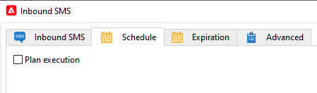

# Inbound SMS workflow activity for Mid-sourcing infrastructure {#inbound-sms-wf}

## Limitations {#limitations}

* This use case only applies to the Marketing instance where you collect inSMS data from the Mid-sourcing instance(s).
* Do not implement this use case on the Mid-sourcing instance.
* Only one custom workflow per external Mid-sourcing account.

## Implementation {#implementation}

1. Add an extension to the `nms:inSMS` schema on your Marketing instance. The extension will add a new attribute to the `nms:inSMS` schema and keep track of the inSMS record primary key coming from the Mid-sourcing instance.

    ``` xml

    <element img="nms:miniatures/mini-sms.png" label="Incoming SMS"
           labelSingular="Incoming SMS" name="inSMS">
    <dbindex name="midInSMSId" unique="false">
      <keyfield xpath="@extAccount-id"/>
      <keyfield xpath="@midInSMSId"/>
    </dbindex>
 
    <attribute label="External Mid SMS ID" name="midInSMSId" type="long"/>
    </element>

    ```

1. To apply the modifications made to the schemas, launch the database update assistant. This assistant is accessible via **Tools** > **Advanced** > **Update database structure**. It checks whether the physical structure of the database matches its logical description and executes the SQL update scripts. [Learn more](../../configuration/using/updating-the-database-structure.md)

1. Stop and backup your workflow containing the **Inbound SMS activity**. 
    
    Backup the corresponding option pointer with the following format `SMS_MO_INDEX_{internal name of the workflow}_{name of the insms workflow activity}_{internal name of the external account to access the mid}`.

    [Learn more on backup](../../production/using/backup.md)

1. (**OPTIONAL**) if you are already using a Scheduler activity, open the workflow and reconfigure it as follows:

    1. Replicate the current settings from the **Schedule** tab of your **Inbound SMS** activity into your external **Scheduler** activity.

    1. Disable the current setting in the **Schedule** tab of **Inbound SMS** activity.

        

1. Update the **Inbound SMS** custom script.

    Replace the below block. Note that this script may vary if you previously customized this code.

    ``` Javascript

    var lastSynchKey = getOption('SMS_MO_INDEX_WKF1105_inSmsUS_smsmidus');
 
    var smsId = application.getNewIds(1);
 
    xtk.session.Write(<inSMS xtkschema="nms:inSMS" _operation="insert"
        id={smsId}
        origin={smsMessage.origin}
        message={smsMessage.message}
        providerId={smsMessage.messageId}/>);

    return 2;
    ```

    With the following new custom script to update inSMS data based on a composite key, combining the primary key of the Mid-sourcing record and the external account ID of the Marketing SMS routing.

    Follow the prerequesites below:

    * Enter the real value for `<EXTERNAL_ACCOUNT_ID>`, e,g, `var iExtAccountId=72733155`.
    * Make sure to keep the following elements in the custom script:
        * `_operation="insertOrUpdate"`
        * `_key="@midInSMSId,@extAccount-id"`
        * `midInSMSId={smsMessage.id}`
        * `inSms.@["extAccount-id"] = iExtAccountId;{}`

    ``` Javascript

    // please enter real external account ID to replace <EXTERNAL ACCOUNT ID>
    var iExtAccountId=<EXTERNAL_ACCOUNT_ID>;
    
    var inSms = <inSMS xtkschema="nms:inSMS" _operation="insertOrUpdate"

                _key="@midInSMSId,@extAccount-id"
                midInSMSId={smsMessage.id}
                message={smsMessage.message}
                origin={smsMessage.origin}
                providerId={smsMessage.providerId}
                alias={smsMessage.alias}
                messageDate = {smsMessage.messageDate}
                receivalDate = {smsMessage.receivalDate}
                deliveryDate = {smsMessage.deliveryDate}
                largeAccount = {smsMessage.largeAccount}
                countryCode = {smsMessage.countryCode}
                operatorCode = {smsMessage.operatorCode}
                linkedSmsId={smsMessage.linkedSmsId}
                separator = {smsMessage.separator}/>

    inSms.@["extAccount-id"] = iExtAccountId;
  
    xtk.session.Write(inSms);
 
    return 2;

    ```

1. Update the Inbound SMS advanced initialization script with the following script.

    The script will reset the primary key pointer to 24 hours prior. The workflow will attempt to reprocess all inSMS data from the Mid-sourcing instance within the previous 24 hours and add any missing data to the Marketing instance.

    ``` Javascript

    // please enter real external account ID to replace <EXTERNAL_ACCOUNT_ID>
    // please enter real pointer option name to replace '<POINTER_OPTION_NAME>'
    // OPTION NAME format: SMS_MO_INDEX_{internal name of the workflow}_inSms_{internal name of the external account to access the mid}
 
    var queryDef = xtk.queryDef.create(
        <queryDef operation="getIfExists" schema="nms:inSMS" lineCount="1">
        <select>
            <node expr="@midInSMSId" alias="@midInSMSId"/>
        </select>
        <where>
            <condition expr="@midInSMSId != 0"/>
            <condition expr={"@created > SubHours(GetDate(), 24)"}/>
            <condition expr={"[@extAccount-id]=<EXTERNAL_ACCOUNT_ID>"}/>
        </where>
        <orderBy>
            <node expr="@midInSMSId"/>
        </orderBy>
        </queryDef>);
     
    var res = parseInt(queryDef.ExecuteQuery().@midInSMSId.toString());
 
    if( !isNaN(res) )
    setOption('<POINTER_OPTION_NAME>', res);

    ```

    >[!WARNING]
    >
    > * If several SMS routing accounts are linked to the same Mid-sourcing instance, only a single workflow per Mid-sourcing instance is permitted.
    > * You can use any external account ID. The role of the foreign key is to maintain data reconciliation integrity in scenarios involving different Mid-sourcing servers where the Mid-sourcing SMS ID might be identical across other Mid-sourcing instances.
    > * If there are multiple inSMS workflows per Mid-sourcing instance, data duplication may occur as the Mid-sourcing SMS ID remains constant while the external account IDs vary.

1. Save and restart the workflow.
