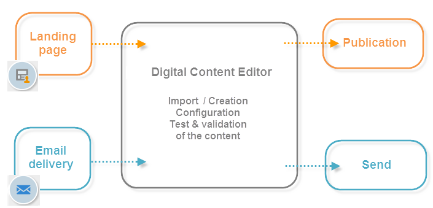

# Get started with Campaign HTML editor{#about-campaign-html-editor}

The **Digital Content Editor (DCE)** is an HTML content editor that lets you easily create content and templates in HTML format within Adobe Campaign.

With the Digital Content Editor, you can insert and format page elements, and map database fields with elements of an HTML page. This editor is available when creating a page for a web application, or when creating deliveries based on a DCE template.

>[!NOTE]
>
>If you need to add server-side JavaScript code, use personalization blocks. [Learn more](../../delivery/using/personalization-blocks.md).

>[!CAUTION]
>
>All external resources need to be referenced with an HTTPS URL.

## Key steps to use the Digital Content Editor {#content-editor-general-operation}

This section presents key steps to edit and upload content edited with the DCE, in the context of a web application and delivery design.

The general operation is as follows: 

To create a simple **web application**, you need to:

1. Create a web application - [Learn more](../../web/using/creating-a-landing-page.md)
1. Select existing content or creating content from a standard template - [Learn more](../../web/using/template-management.md)
1. Edit and configure content - [Learn more](../../web/using/editing-content.md)
1. Publish the Web application - [Learn more](../../web/using/creating-a-landing-page.md#step-3---publishing-content)

>[!NOTE]
>
>A complete implementation sample in the context of a web application is available in  [this section](../../web/using/creating-a-landing-page.md).

To create an **email delivery**, you need to:

1. Create a delivery from a DCE template - [Learn more](../../web/using/use-case--creating-an-email-delivery.md)
1. Select an existing content or create content from a [standard template](../../web/using/template-management.md)
1. Edit and configure online content
1. Send the delivery - [Learn more](../../delivery/using/steps-about-delivery-creation-steps.md)

>[!NOTE]
>
>A complete implementation sample in the context of an email delivery is available in [this use case](../../web/using/use-case--creating-an-email-delivery.md).
