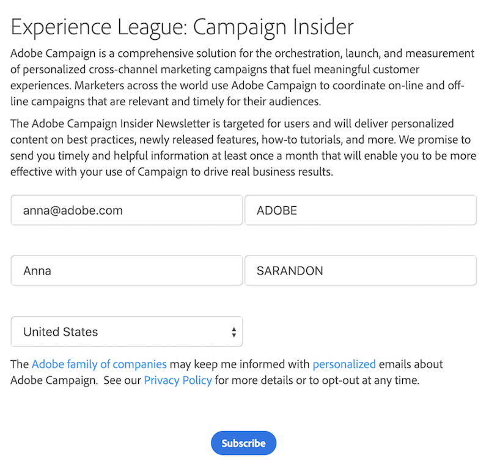
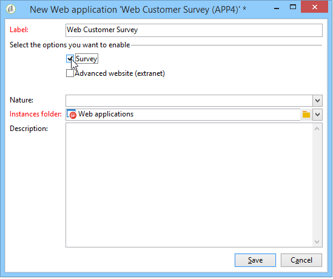

# Get started with web applications{#about-web-applications}

Adobe Campaign lets you create and publish dynamic and interactive Web applications with data from the database and content adapted to the rights of the connected user. 

You can create pages, such as an edit form on an extranet, or notification forms including data from the database with tables, charts, input forms, etc. This functionality lets you design and post Web pages where users can look up or enter information.

This can be a subscription form containing data that has been preloaded with information contained in the Adobe Campaign database, as shown below:

   

This chapter provides an overview of how to manage Web applications.

>[!NOTE]
>
>Refer to the [Security and Privacy checklist](https://helpx.adobe.com/campaign/kb/acc-security.html) to learn how to optimize security for web applications.

>[!CAUTION]
>
>For privacy reasons, we recommend to use HTTPS for all external resources.

## Web application scope {#web-application-scope}

Web applications in Adobe Campaign give access to the following capabilities:

* Multiple-page form creation. For more on this, refer to this [page](about-web-forms.md).
* Multilingual survey management with an integrated translation tool. For more on this, refer to this [page](translating-a-web-application.md).
* Graphical page management interface, multiple-column page layout. For more on this, refer to this [page](designing-a-web-application.md).
* Rendering personalization and field position. For more on this, refer to this [page](editing-content.md#adding-personalization-content).
* Conditional display of survey fields according to answers. For more on this, refer to this [page](form-rendering.md#defining-fields-conditional-display).
* Random display of questions. For more on this, refer to this [page](../../surveys/using/building-a-survey.md#adding-questions).
* Conditional page display. For more on this, refer to this [page](defining-web-forms-page-sequencing.md#conditional-page-display).
* Information check before validation depending on the expected data type (number, e-mail address, date, etc.) and the mandatory fields. For more on this, refer to this [page](form-rendering.md#defining-control-settings).
* E-mail invitations or notification. For more on this, refer to this [page](publishing-a-web-form.md#delivering-a-form-via-email).
* Personalization of error and end messages. For more on this, refer to this [page](defining-web-forms-properties.md#setting-up-an-error-page).
* Use of images, videos, hypertext links, captcha, etc. For more on this, refer to this [page](editing-content.md).
* Monitoring of responses in real time. For more on this, refer to this [page](../../surveys/using/publish--track-and-use-collected-data.md#response-tracking).

The optional **Survey** creation module offers the following additional functionalities:

* Dynamic extension of the database: creation of responses not included in the initial data template. For more on this, refer to this [page](../../surveys/using/managing-answers.md#storing-collected-answers).
* Generating dedicated reports. For more on this, refer to this [page](../../surveys/using/publish--track-and-use-collected-data.md#reports-on-surveys).

Compared to Web applications, surveys have a simplified graphical interface with a reduced number of editing controls.

>[!NOTE]
>
>Surveys are detailed in [this section](../../surveys/using/about-surveys.md).
>
>The overall functionalities of Web forms in Adobe Campaign are detailed in [this section](about-web-forms.md).

## Web application implementation {#web-application-implementation}

To create and post a Web application, you must:

1. Create the content (fields, lists, tables, graphs, etc.).

   You can also view the section which details the available fields for forms: all these fields are also available for Web applications. This information is available in [this page](adding-fields-to-a-web-form.md).

1. As required, you can add preloading, test, and saving steps, and configure the access control system (mainly within the framework of an extranet publication).
1. Publishing the Web application to make it available on an extranet or in Adobe Campaign.

## Web application initial configuration {#web-application-initial-configuration}

Web application are created via the **[!UICONTROL Web Applications]** link in the **[!UICONTROL Campaigns]** and **[!UICONTROL Profiles and targets]** tabs.

Web applications are stored in the **[!UICONTROL Resources > Online > Web Applications]** node of the Adobe Campaign tree. Configurations are broken down in the following folders:

* **[!UICONTROL Administration > Configuration > Form renderings]**: contains the rendering templates for the Web form presentation (applications and surveys). The template enables you to generate the form. It also uses a CSS style sheet. This style sheet can be overloaded at the template level. For more on this, refer to [this page](form-rendering.md#selecting-the-form-rendering-template).
* **[!UICONTROL Resources > Templates > Web application templates]**: contains form templates. To create a form or a Web application, you must start from a template.

## Web application templates {#web-application-templates}

By default, Adobe Campaign provides one template per available Web application.

>[!NOTE]
>
>You can convert an existing Web application into a template. To do this, select the form and right-click. Select **[!UICONTROL Actions > Save as template...]**.

You can create new templates via the **[!UICONTROL Resources > Templates > Web Application templates]** node of the Adobe Campaign tree.

The creation wizard lets you select the options you want to enable, as shown below. 

>[!CAUTION]
>
>The available applications depend on your options and modules. Please check your license agreement.
