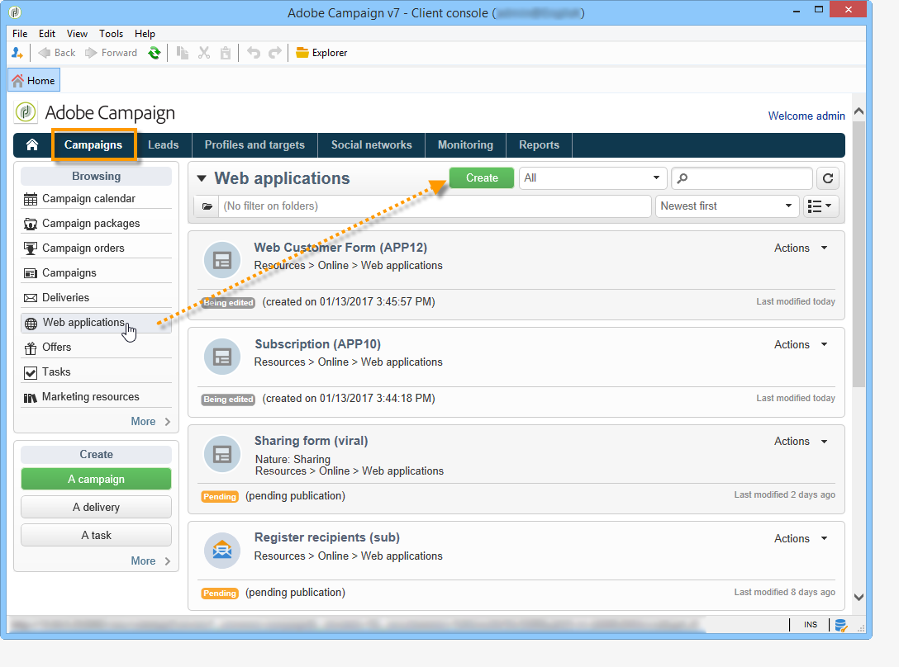
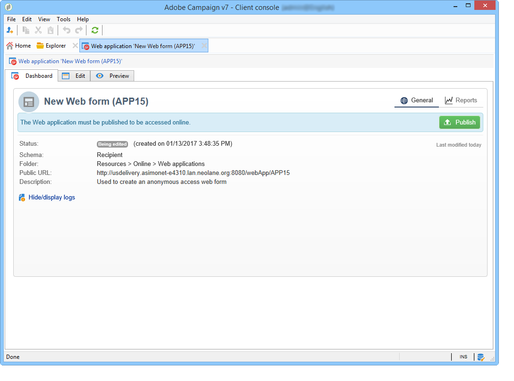
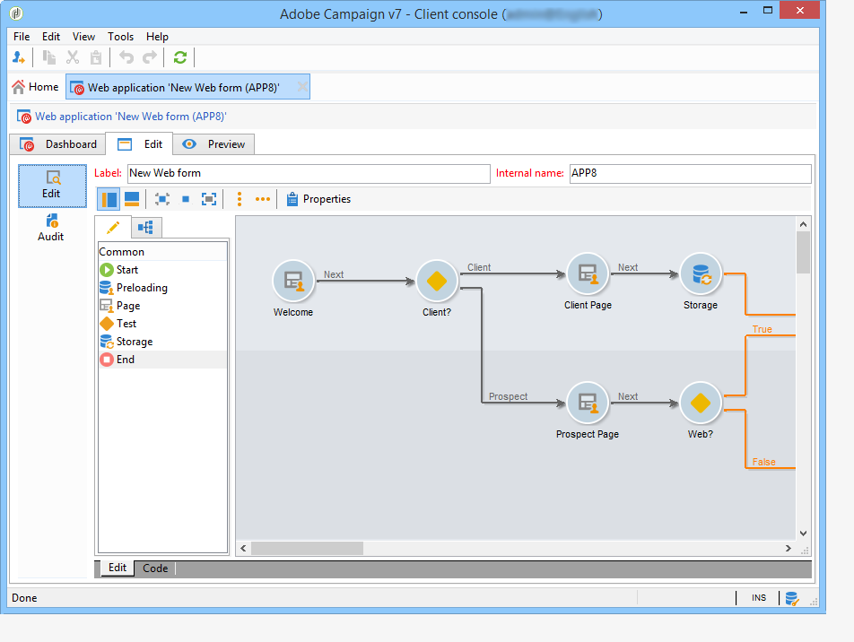
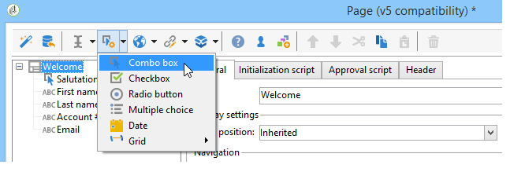
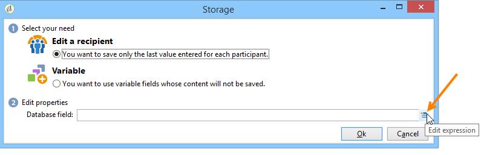
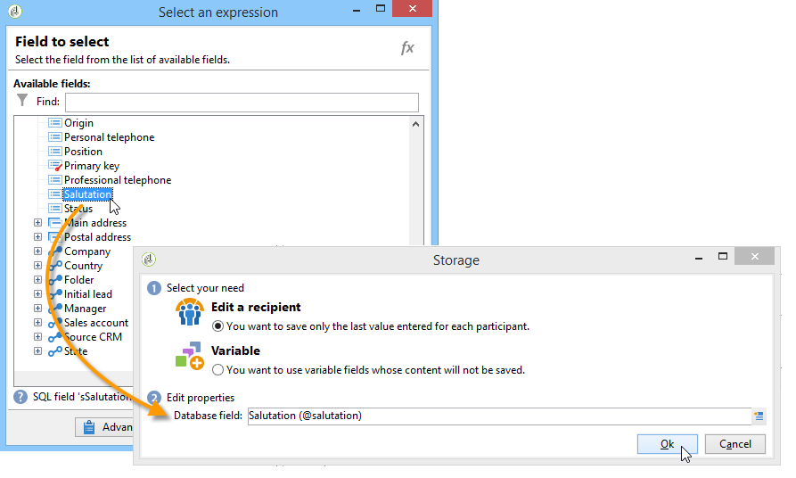

# About web forms{#about-web-forms}

Adobe Campaign integrates a graphical module for defining and publishing Web forms to create pages containing input and selection fields, and which may include data in the database. This lets you design and post Web pages which users can access to view or enter information.

This chapter details the creation and management of Web forms, how to manage fields and pages, as well as storage and saving modes.

>[!CAUTION]
>
>For privacy reasons, we recommend to use HTTPS for all external resources.

## Steps for creating a web form {#steps-for-creating-a-web-form}

This chapter details the steps required for designing a **webForm** type form in Adobe Campaign, as well as the available options and configurations. Adobe Campaign lets you make this Web form available to users as well as collect and archive answers in the database.

>[!CAUTION]
>
>When configuring web applications and webforms, you need a 900 pixel vertical resolution minimum (ex: 1600x900).

Web forms are accessed via the Web Applications menu of the **Campaigns** tab. In the Adobe Campaign tree, they are grouped under the **[!UICONTROL Resources > Online > Web Applications]** node.

To create a Web form, click the **[!UICONTROL Create]** button above the list of Web applications.

Select the Web form template ( **[!UICONTROL newWebForm]** by default).

This will take you to the dashboard of the form. 

The **[!UICONTROL Edit]** tab lets you create your content.

To define the configuration and content of the Web form, apply the following steps:

* Start by creating the required pages and checks: input fields, drop-down lists, HTML content, etc.

  This step is detailed below.

* Define page sequencing and condition the display.

  This step is detailed in [Defining web forms page sequencing](https://helpx.adobe.com/campaign/standard/web/using/defining-web-forms-page-sequencing.html).

* Translate the content if necessary.

  This step is detailed in [Translating a web form](https://helpx.adobe.com/campaign/standard/web/using/translating-a-web-form.html).

## About web forms designing {#about-web-forms-designing}

The pages of the form are created via a specific editor which lets you define and configure input zones (text), selection fields (lists, checkboxes, etc.) and static elements (images, HTLM contents, etc.). They can be grouped into containers and their layout altered to suit your needs (for more on this, refer to [Creating containers](https://helpx.adobe.com/campaign/standard/web/using/defining-web-forms-layout.html#creating-containers)).

The following sections detail how to define content and layout for form screens:

* [Adding fields to a web form](https://helpx.adobe.com/campaign/standard/web/using/adding-fields-to-a-web-form.html),
* [Inserting HTML content](https://helpx.adobe.com/campaign/standard/web/using/static-elements-in-a-web-form.html#inserting-html-content),
* [Static elements in a web form](https://helpx.adobe.com/campaign/standard/web/using/static-elements-in-a-web-form.html),
* [Defining web forms layout](https://helpx.adobe.com/campaign/standard/web/using/defining-web-forms-layout.html).

>[!NOTE]
>
>* During page design, you can view the final rendering in the **[!UICONTROL Preview]** tab. To view changes, save the form first. Any errors are displayed in the **[!UICONTROL Log]** tab.
>* To make sure page display and information storage occur in the appropriate sequence, enable debug mode in the Web form. To do this, go to the **[!UICONTROL Preview]** sub-tab and check the **[!UICONTROL Enable debug mode]** box: all collected information and possible execution errors will be displayed at the bottom of each page.
>

### Using the icons in the toolbar {#using-the-icons-in-the-toolbar}

You can also use the icons in the toolbar or a right-click to insert an input zone. 

In this case, start by selecting the type of field to add and the answer storage mode.

Click **[!UICONTROL Ok]** to approve the selection. 

