# Adding fields to a web form{#adding-fields-to-a-web-form}

In a Web form, fields enable users to enter information and select options. Web forms can offer input fields, selection fields, static and advanced content (captchas, subscriptions, etc.).

When you use the wizard to add fields, the field type is detected automatically based on the selected field or storage variable. You can edit it using the **[!UICONTROL Type]** drop-down box in the **[!UICONTROL General]** tab. 

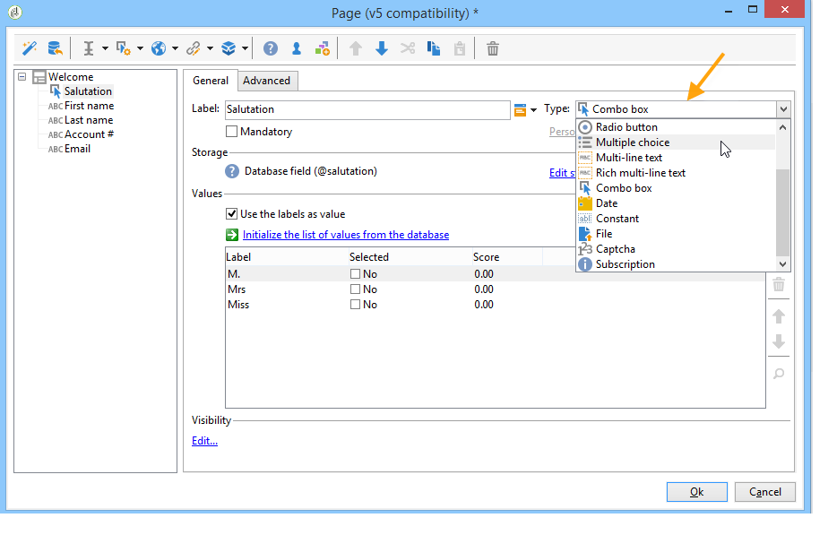

When using the buttons in the toolbar, select the type of field you want to add.

The following types of field are available:

* Text/number input. See [Adding input fields](#adding-input-fields).
* Drop-down list selection. See [Adding drop-down lists](#adding-drop-down-lists).
* Multiple choice via checkboxes. See [Adding checkboxes](#adding-checkboxes).
* Exclusive selection via radio buttons. See [Adding radio buttons](#adding-radio-buttons).
* Vote in an option grid. See [Adding grids](#adding-grids). 
* Numbers and dates. See [Adding dates and numbers](#adding-dates-and-numbers).
* Subscription/unsubscription to an information service. See [Subscription checkboxes](#subscription-checkboxes).
* Captcha validation. See [Inserting a captcha](#inserting-a-captcha).
* Download button. [Uploading a file](#uploading-a-file).
* Hidden constant. See [Inserting a hidden constant](#inserting-a-hidden-constant).

Please specify the response storage mode: update a field in the database (stores only the last value saved) or store in a variable (the answer is not stored). For more on this, refer to [Response storage fields](../../web/using/web-forms-answers.md#response-storage-fields).

>[!NOTE]
>
>By default, the field is inserted at the bottom of the current tree. Use the arrows in the toolbar to move it up or down.

## Field creation wizard {#field-creation-wizard}

For each page of the form, you can add a field via the first button in the toolbar. To do this, go to the **[!UICONTROL Add using the wizard]** menu. 

Select the type of field you want to create: you can choose to add a field in the database, a variable or to import a group of fields created in another form and collected in a container.

Click **[!UICONTROL Next]** and select the storage field or variable, or the container you want to import.

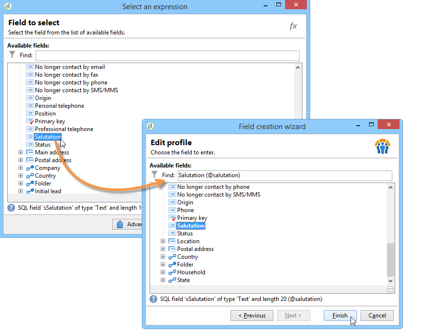

Click **[!UICONTROL Finish]** to insert the selected field into the page.

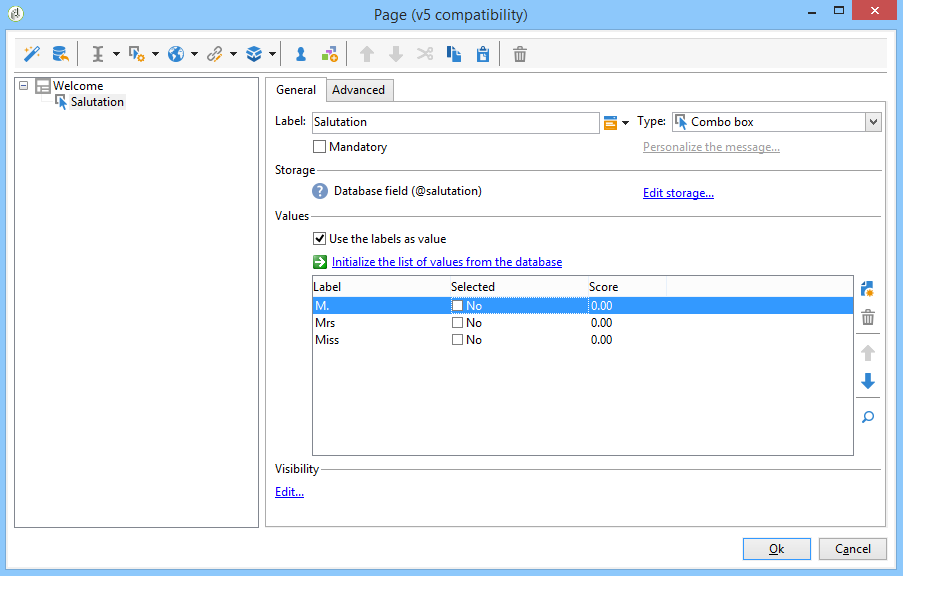

## Adding input fields {#adding-input-fields}

To add an input field, click the **[!UICONTROL Input control]** button and choose the type of field you want to add.

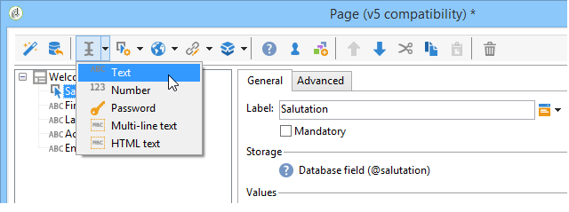

### Types of input fields {#types-of-input-fields}

Five different types of text fields can be inserted into a form page:

* **Text**: lets the user enter a text on one line.

  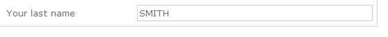

* **Number**: lets the user enter a number on one line. for more on this, refer to [Adding numbers](#adding-numbers).

  When the page is approved, field content is checked to make sure the value entered is compatible with the field. For more on this, refer to [Defining control settings](../../web/using/form-rendering.md#defining-control-settings).

* **Password**: lets the user enter text on a single line. During text entry, the characters are replaced by periods:

  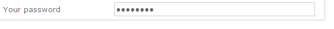

  >[!CAUTION]
  >
  >Passwords are stored unencrypted in the database.

* **Multi-line text**: lets the user enter text on several lines.

  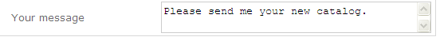

  >[!CAUTION]
  >
  >Multi-line text fields are specific fields that can contain carriage returns. Their storage space must be associated with a field mapped on an XML element, not an XML attribute. For more on the types of data in schemas, refer to the "Schema reference" chapter in [this section](../../configuration/using/about-schema-reference.md).
  >   
  >If you are using the **Survey** module, you can store this type of field in an archived field which will automatically adapt to the format. For more on this, refer to [this section](../../web/using/about-surveys.md).

* **Enriched multi-line text**: lets the user enter text with a layout which will be stored in HTML format.

  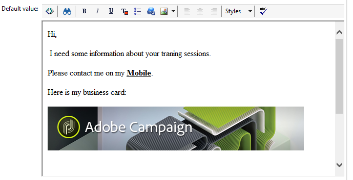

  You can select the type of editor offered to users. To do this, use the drop-down box of the **[!UICONTROL HTML editor]** field in the **[!UICONTROL Advanced]** tab.

  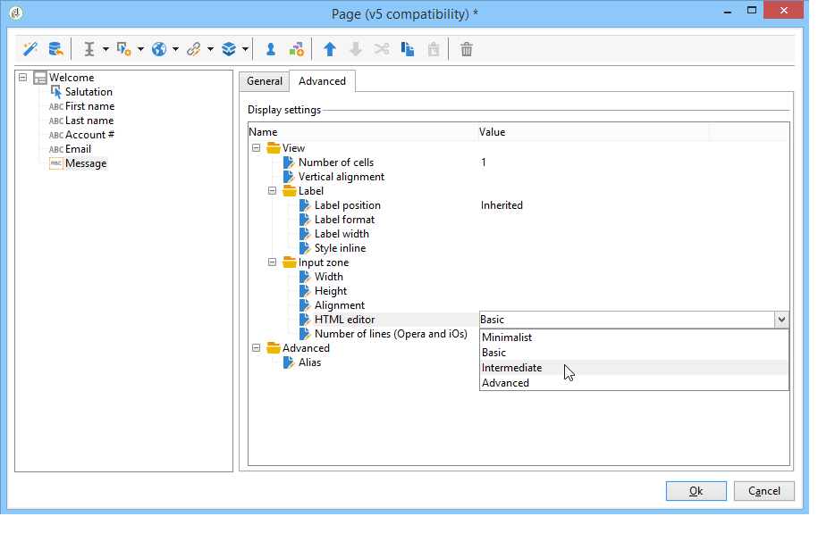

  The number of icons displayed varies depending on the type of editor. For an **[!UICONTROL Advanced]** editor, the rendering will be as follows: 

  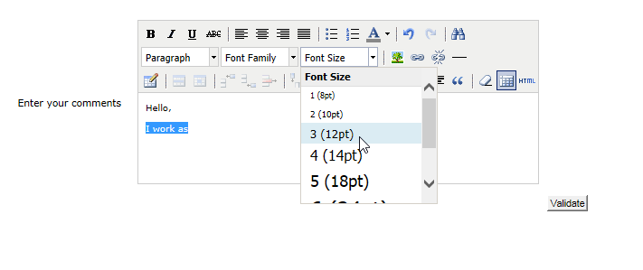

### Configure input fields {#configure-input-fields}

Input fields are all configured based on the same mode, using the following options:

The **[!UICONTROL General]** tab lets you enter the name of the field and attribute a default value to it if necessary.

The answer storage mode can be altered via the **[!UICONTROL Edit storage...]** link. Values can be stored in an existing field of the database; or you can choose not to save information in the database (use a local variable).

>[!NOTE]
>
>Storage modes are detailed in [Response storage fields](../../web/using/web-forms-answers.md#response-storage-fields)

The **[!UICONTROL Advanced]** tab lets you define display parameters for the field (position of labels, alignment, etc.). See [Defining web forms layout](../../web/using/defining-web-forms-layout.md).

## Adding drop-down lists {#adding-drop-down-lists}

You can insert a drop-down list into a survey page. This lets the user select a value from those on offer in a drop-down menu.

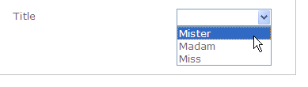

To add a drop-down box to a form page, click the **[!UICONTROL Selection controls > Drop-down list]** button in the toolbar of the page editor.

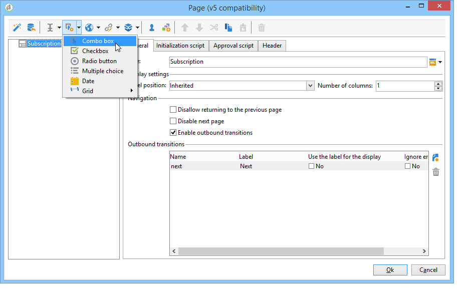

Select the answer storage mode and confirm your choice.

Define the labels and values of the list in the lower section of the **[!UICONTROL General]** tab. If the information is stored in an existing field of the database and it is an enumeration field, you can fill in the values automatically by clicking **[!UICONTROL Initialize the list of values from the database]** , as shown below:

>[!NOTE]
>
>Use the arrows to the right of the list of values to change their sequence.

If the data is stored in a linked table, you can select the field where the values to be suggested in the list are saved. For example, if you select the table of countries, click **[!UICONTROL Initialize the list of values from the database...]** and select the desired field.

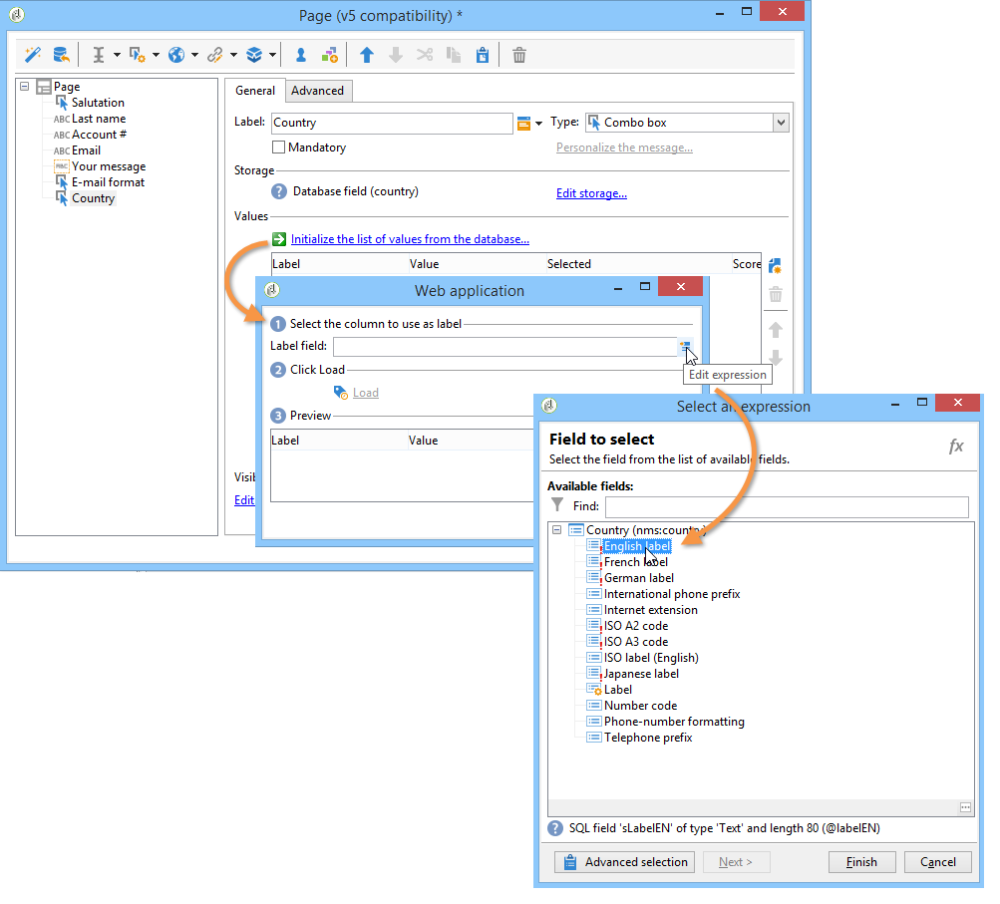

Next, click the **[!UICONTROL Load]** link to retrieve the values:

>[!CAUTION]
>
>Repeat this operation whenever the list is updated to refresh the values on offer.

## Adding checkboxes {#adding-checkboxes}

In order for the user to select an option, you need to use a checkbox. 

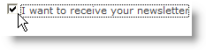

To add a checkbox to a form, click the **[!UICONTROL Selection controls > Checkbox...]** icon in the toolbar of the page editor.

Select the answer storage mode and confirm your choice.

Enter the label of the box in the **[!UICONTROL Label]** field of the **[!UICONTROL General]** tab.

A checkbox lets you assign a value to the storage field (or value) depending on whether or not the box is checked. The **[!UICONTROL Values]** section lets you enter the value to assign if the box is checked (in the **[!UICONTROL Value]** field), and the value to assign if it is not checked (in the **[!UICONTROL Empty value]** field). These values depend on the data storage format.

If the storage field (or variable) is boolean, the value to assign if the box is not checked will be deduced automatically. In this case, only the **[!UICONTROL Value if checked]** field is offered, as shown below:

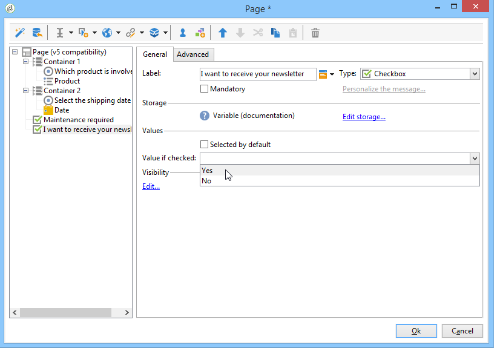

## Example: Assign a value to a field if a box is checked {#example--assign-a-value-to-a-field-if-a-box-is-checked}

We want to insert a checkbox into a form to send a maintenance request, as shown below: 

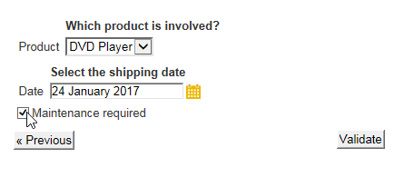

The information will be uploaded to the database and into an existing field (in this case, the **[!UICONTROL Comment]** field):

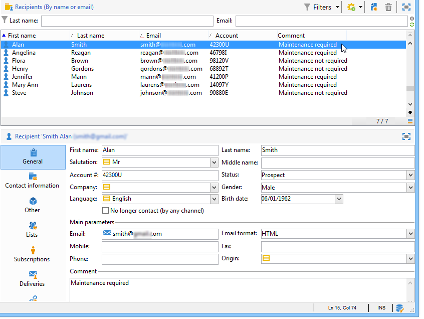

If the "Maintenance required" box is checked, the **[!UICONTROL Comment]** column will contain "Maintenance required". If the box isn't checked, the column will show "Maintenance not required". To obtain this result, apply the following configuration to the checkbox on the form page:

## Adding radio buttons {#adding-radio-buttons}

Radio buttons let you offer the user a series of exclusive options to choose from. These are different values for the same field. 

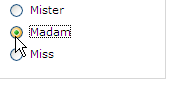

You can create radio buttons individually (unitary buttons) or via a multiple-choice list, but since the point of the radio buttons is to select one option or another, we will always create at least a pair of radio buttons, never just a single button.

>[!CAUTION]
>
>To make selection mandatory, you need to create a multiple choice list.

### Add single buttons {#add-single-buttons}

To add a radio button to a form page, go to the **[!UICONTROL Selection controls > Radio button]** menu in the toolbar of the page editor and choose a storage mode.

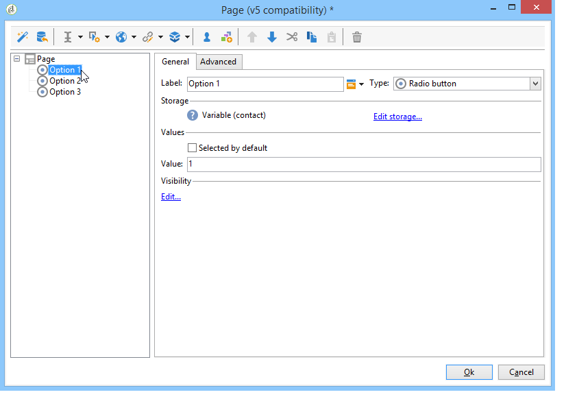

Radio buttons are configured in a similar way to checkboxes (see [Adding checkboxes](#adding-checkboxes)). However, no value is assigned if the option is not selected. In order for several buttons to be interdependent, i.e. selecting one automatically deselects the others, they must be stored in the same field. If they are not stored in the database, the same local variable must be used for temporary storage. See [Response storage fields](../../web/using/web-forms-answers.md#response-storage-fields).

### Add a list of buttons {#add-a-list-of-buttons}

To add radio buttons via a list, go to the **[!UICONTROL Selection controls>Multiple choice]** menu in the toolbar of the page editor.

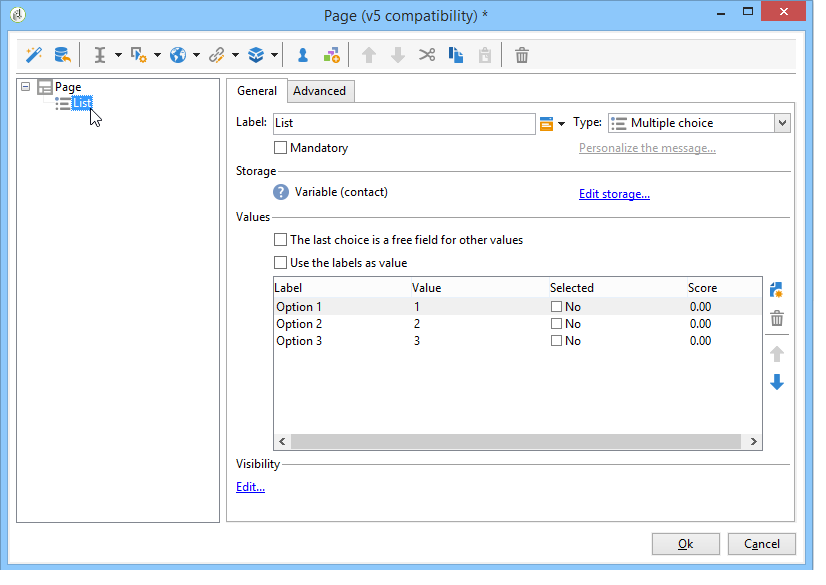

Add as many radio buttons as there are labels. The advantage of this feature is that you can import values from an existing field (in case of an itemized field) and make it for the user to choose one option. However, the layout of buttons is less flexible.

>[!NOTE]
>
>Web forms don't authorize the selection of several values. Multiple selection may only be activated for **Survey** type forms. For more on this, refer to [this section](../../web/using/about-surveys.md).  
>It is possible, however, to insert a **[!UICONTROL Multiple choice]** type field into a Web application; but without authorizing the selection of several values: the options offered can be selected using radio buttons.

## Adding grids {#adding-grids}

Grids are used to design voting pages in Web applications. This lets you offer lists of radio buttons for answering survey or assessment type Web forms, as shown below:

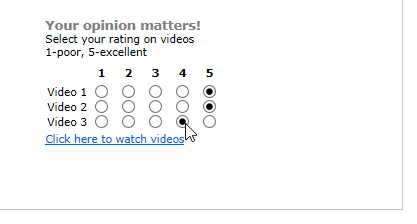

To use this type of element in a form, create a simple grid and add a line for each element to be assessed.

The number of radio buttons in each line of the grid matches the number of values defined in the simple grid.

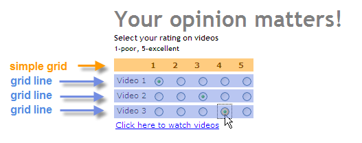

Only one option can be selected per grid line.

>[!NOTE]
>
>In our example, the label of the grid is hidden. To do this, go to the **[!UICONTROL Advanced]** tab, the **[!UICONTROL Label position]** display is defined as **[!UICONTROL Hidden]** . See [Defining the position of labels](../../web/using/defining-web-forms-layout.md#defining-the-position-of-labels).

## Adding dates and numbers {#adding-dates-and-numbers}

The content of the form fields can be formatted to match the data stored in the database or to satisfy a particular requirement. You can create suitable fields for the entry of numbers and dates.

### Adding dates {#adding-dates}

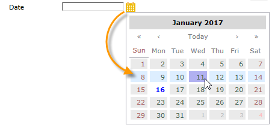

To allow the user to enter a date in a form page, add an input field and select the type **[!UICONTROL Date...]**.

Enter a label for the field and configure the data storage mode.

The lower section of the window lets you select the date and time formats for the values stored in this field.

You can also choose not to display the date (or time).

Dates can be selected via a calendar or drop-down boxes. You can also enter them directly in the field, but they need to match the format specified in the screen above.

>[!NOTE]
>
>By default, dates used in forms are entered via a calendar. For multilingual forms, please check that calendars are available in all the languages used. See [Translating a web form](../../web/using/translating-a-web-form.md).

However in some cases, (for entering dates of birth, for instance) it may be easier to use drop-down lists. 

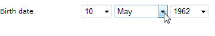

To do this, click the **[!UICONTROL Advanced]** tab and choose the input mode using **[!UICONTROL Drop-down lists]**. 

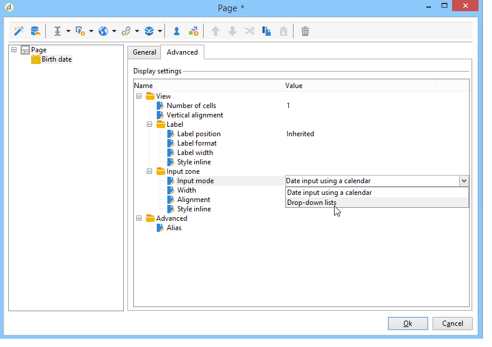

You can then set limits to the values offered in the list.

### Adding numbers {#adding-numbers}

You can create suitable fields for the entry of numbers.

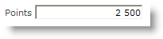

In a numeric field, the user can enter numbers only. Entry control is applied automatically when the page is approved.

Depending on the field in which data is stored in the database, special formatting or certain restrictions may be applied. You can also specify maximum and minimum values. This type of field is configured as follows: 

The default value is the value displayed in the field when the form is published. It can be corrected by the user.

You can add a prefix and/or suffix to the numeric field via the **[!UICONTROL Advanced]** tab, as shown below:

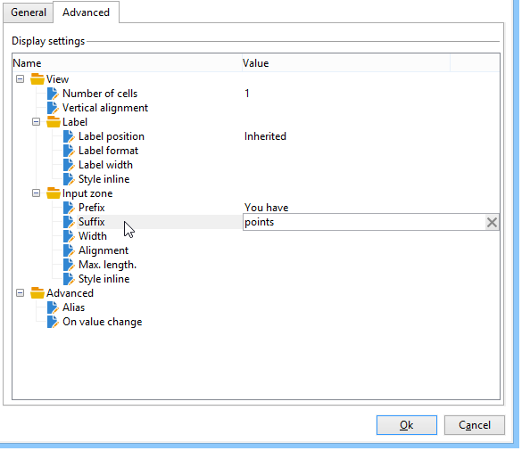

In the form, the rendering will be as follows:

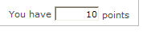

## Subscription checkboxes {#subscription-checkboxes}

You can add controls to allow users to subscribe to or unsubscribe from one or more information services (newsletters, warnings, real-time notifications, etc.). To subscribe, the user checks the corresponding service.

To create a subscription checkbox, click **[!UICONTROL Advanced controls>Subscription]**.

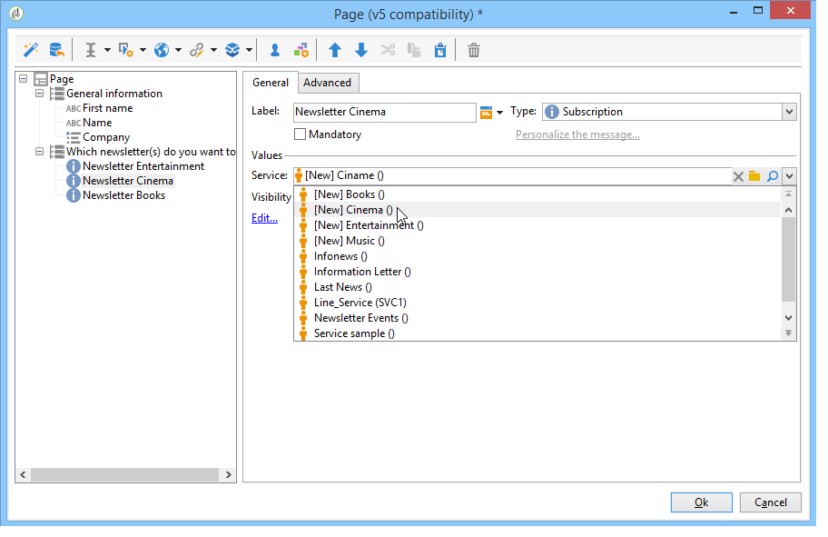

Indicate the label for the checkbox and select the information service concerned using the **[!UICONTROL Service]** drop-down box.

>[!NOTE]
>
>Information services are detailed in [this page](../../delivery/using/managing-subscriptions.md).

The user subscribes to the service by checking the relevant option.

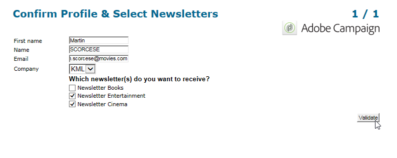

>[!CAUTION]
>
>If the user is already subscribed to an information service and the box linked to this service isn't checked when they approve the form, they will be unsubscribed.

Examples of subscriptions and referrals are available in [this section](../../web/using/about-surveys.md).

## Inserting a captcha {#inserting-a-captcha}

The purpose of **captcha** tests is to prevent fraudulent use of your Web forms.

>[!CAUTION]
>
>If your form contains several pages, the Captcha must always be placed on the last page, just before the storage box, to prevent any circumvention of the security measures.

To insert a Captcha into a form, click the first button on the toolbar and Select **[!UICONTROL Advanced controls>Captcha]**.

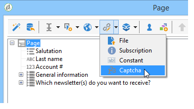

Enter the label of the field. This label will be displayed in front of the Captcha display area. You can change the position of this label in the **[!UICONTROL Advanced]** tab.

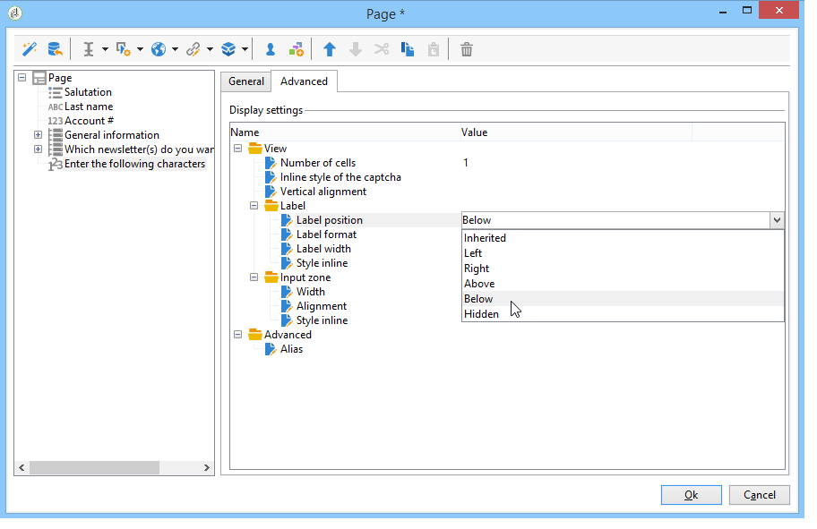

>[!NOTE]
>
>For **[!UICONTROL captcha]** type controls, there is no need to indicate a storage field or variable.

The Captcha is inserted into the page with an input field placed under the visual. These two elements are inseparable and are considered as a single item for the purpose of page layout (they occupy a single cell).

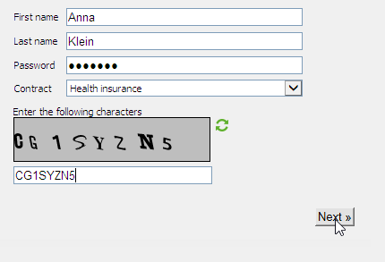

When the page is confirmed, the input field is displayed in red if the content of the Captcha was not entered correctly. 

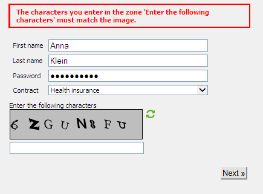

You can create an error message to display. To do that, use the **[!UICONTROL Personalize the message]** link in the **[!UICONTROL General]** tab.

>[!NOTE]
>
>Captchas are always 8 characters long. You cannot modify this value.

## Uploading a file {#uploading-a-file}

You can add an upload field to a page. This functionality can be useful for intranet file sharing, for instance. 

To insert an upload field to a form page, select the **[!UICONTROL Advanced controls > File...]** menu in the toolbar of the page editor.

By default, the uploaded files are stored in resource files accessible via the **[!UICONTROL Resources > Online > Public resources]** menu. You can use a script to change this behavior. This script can use the functions defined in [Campaign JSAPI documentation](https://docs.adobe.com/content/help/en/campaign-classic/technicalresources/api/index.html), including those that concern file manipulation.

You can store the link to these files in a local variable or in a database field. For example, you can extend the recipient schema to add a link to file-based resources.

>[!CAUTION]
>
>* This type of file must be reserved for forms with secure access (using credentials).
>* Adobe Campaign does not control the size or the type of resource uploaded: we therefore highly recommend using upload fields for secure type intranet sites only.
>* If several servers are linked to the instance (load balancing architecture), you need to make sure calls to the Web form arrive on the same server.
>* These implementations require the assistance of the Adobe Campaign Consulting team.
>

## Inserting a hidden constant {#inserting-a-hidden-constant}

When the user validates one of the pages of the form, you can set a specific value to a field of his profile or to a variable. 

This field is not visible to the user, but can be used to enrich the data in the user profile.

To do this, place a **constant** in the page and specify the value and the storage location.

In the following example, the **origin** field of the recipient profile is filled in automatically whenever a user approves this page. The constant is not displayed on the page.

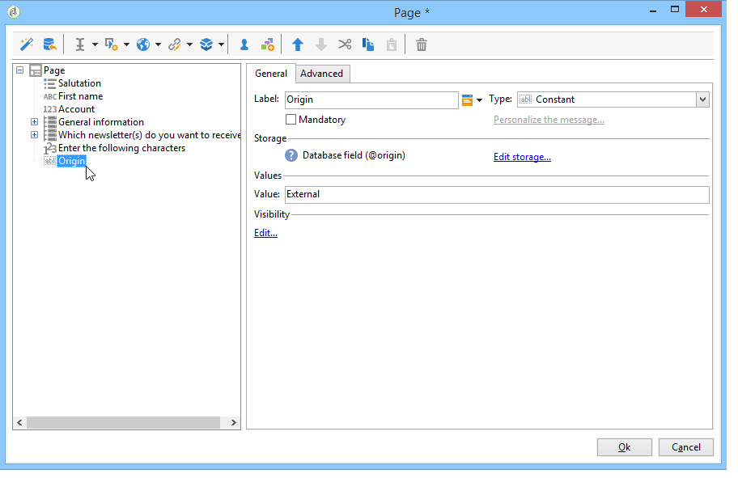
