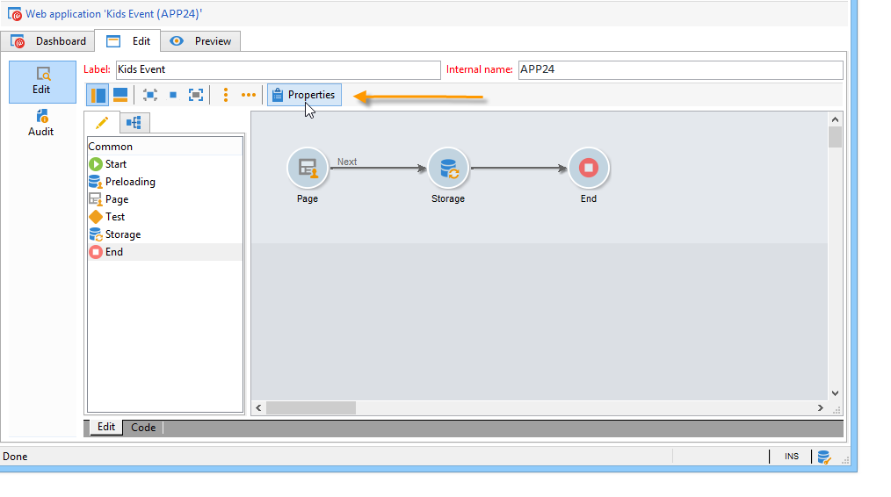

# Configuring surveys{#configuring-surveys}

## Survey properties {#survey-properties}

Online surveys are fully configurable and customizable to satisfy your requirements. The parameters must be entered in the properties window.

The available parameters are detailed in [this section](../../web/using/defining-web-forms-properties.md).

## Survey data storage {#survey-data-storage}

By default, the Web form fields are stored in the recipient table. To use another table, select it in the **[!UICONTROL Document type]** field. The **[!UICONTROL Zoom]** icon lets you view the content of the selected table.

Answers to surveys provided by users which aren't stored in the fields (but in local variables) are stored in the **Answers to surveys** table. You can change the schema used based on the **[!UICONTROL Library]** field. This field is only available for **surveys**.
