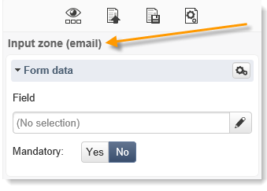
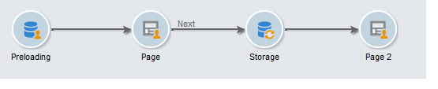

# Content editing best practices{#content-editing-best-practices}

To ensure the editor's optimal operation, we recommend observing the following guidelines:

* Before **importing an HTML page template** in Adobe Campaign, please make sure the template opens and displays correctly in the various browsers.
* If the HTML page contains **JavaScript scripts**, they need to execute **without errors** outside of the editor.
* When building a template, we recommend adding a **'type'** attribute to `<input>` tags. This information will be processed by the editor and help the user to link a field of the database to the field of the form when configuring the Web application.

  Example of HTML code in the template:

  ```
  
  <input id="email" type="email" name="email"/>
     
  ```

  The **'type'** attribute is visible in the interface in the following form:

  

  The official list of 'type' attributes is available [in this website](https://www.w3schools.com/tags/att_input_type.asp).

* Steps to simulating an end page with the DCE:

  

* Make sure that there is only one `<body> </body>` in the page.
* When a CSS or JS file is uploaded, the images contained within the.zip file are not uploaded. The references to these images present in the CSS are therefore not updated.

## Content editor supported formats {#content-editor-supported-formats}

The Digital Content Editor supports the HTML format: you can switch-over to **source** mode at any time.

The Digital Content Editor's import function works as follows with the following supported formats:

* CSS: the images present in the .zip file are not imported. The references to these images in the CSS are not updated.
* JS: the images present in the .zip file are not imported. The refences to these images in the JS are not updated.
* Iframe: the linked pages are not imported.
* Landing pages & Web apps: if a **form** tag is missing, a warning will appear. A `<form> </form>` must always be present in the message body.

The Digital Content Editor also works with the following supported Code-pages:

* iso-8859-1
* iso-8859-2
* utf-7
* utf-8 (recommended when using a BOM)
* iso-8859-15
* us-ascii
* shift jis
* iso-2022-jp
* big-5
* euc-kr
* utf-16

>[!NOTE]
>
>The HTML code page must be defined in a meta tag (HTML 4 or HTML 5) or in the BOM. If no code page is available, open the file in latin1.

## HTML content statuses {#html-content-statuses}

The upper section of the editor displays messages related to the status of the content. The color codes for the messages are as follows:

* **Grey message**: information message, no actions need to be carried out in the editor.
* **Blue message**: information message related to the content being edited.
* **Yellow message**: warning or error message requiring action on behalf of the user.

### List of messages when editing a Web application {#list-of-messages-when-editing-a-web-application}

* The HTML content is functional.
* The Web application has not been published and cannot be accessed online.
* The Web application is online, please publish again to apply any changes.
* The page content isn't functional. It must include an HTML form (`<form>`)
* There is n input zone(s) or buttons to configure.
* To enable the transition to the next page, you need to link the 'Next page' action to a button or a link on the current page.

### List of messages when editing a delivery {#list-of-messages-when-editing-a-delivery}

* The delivery content is functional
* There are n fields or personalization blocks to configure.
* The delivery content is ready, please run the analysis again to apply any changes.
* The delivery is ready to be sent.
