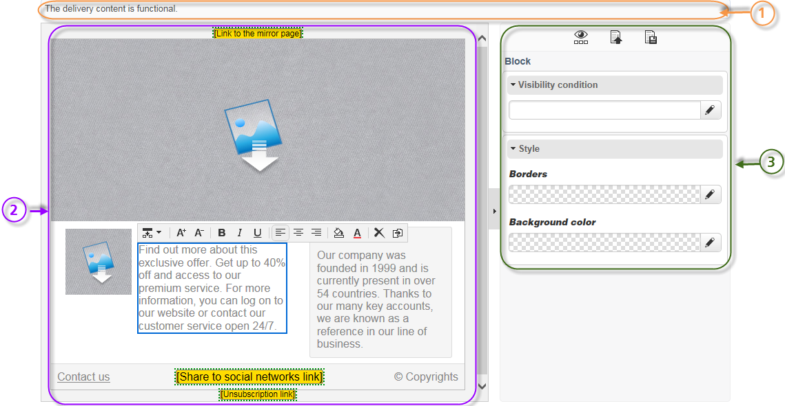
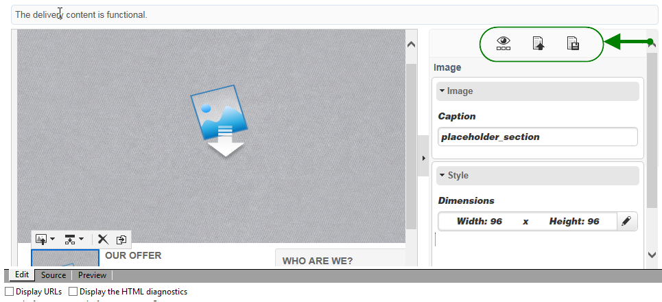
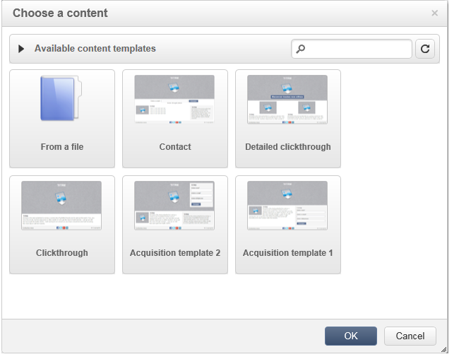
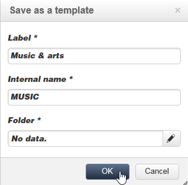
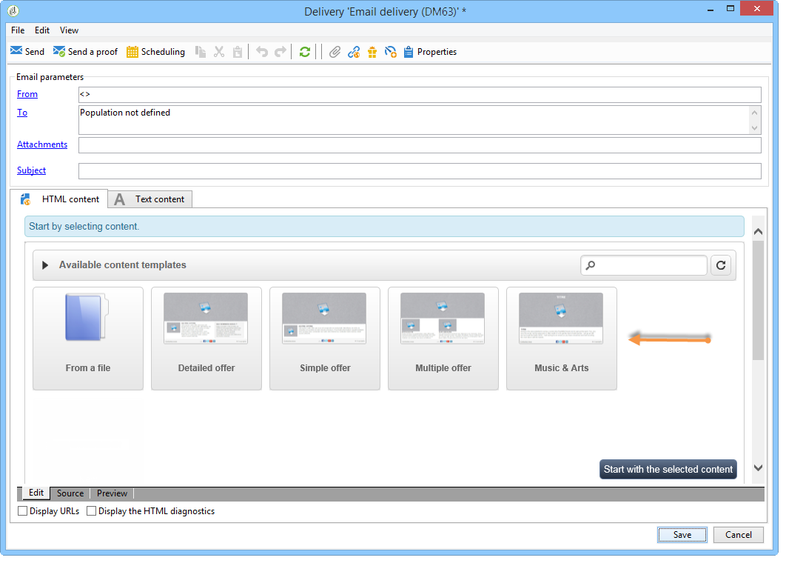
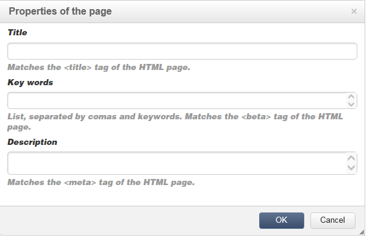
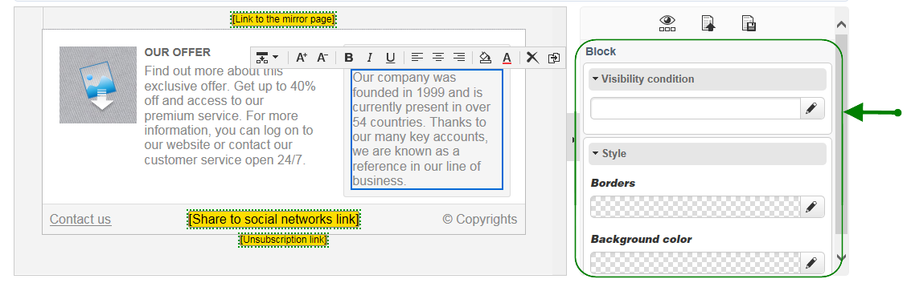

# Content editor interface{#content-editor-interface}

## Editing window {#editing-window}

The DCE editing window is broken down into three different sections. They let you view, modify and check the state of the content.

1. The **top** section is a display area for messages to the user. These messages indicate the status of the Web application status or the delivery being created as well as warnings and error messages related to the content. For more on this, refer to [HTML content statuses](../../web/using/content-editing-best-practices.md#html-content-statuses).
1. The section to the **left** of the window is the area for editing content. From this area, the user can directly interact with the content using the pop-up toolbar: insert a link into an image, change the font, delete a field, etc. For more on this refer to [Editing forms](../../web/using/editing-content.md#editing-forms).
1. The section to the **right** of the window is the control panel area. This area groups the different options for the editor, particularly those related to configuring the page heading and general options for a block: add a border, link a database field with an input zone, access Web page properties, etc. For more on this, refer to the [Global options](#global-options) and [Editing content](../../web/using/editing-content.md) sections.

## Global options {#global-options}

The top right section of the editor lets you access global options allowing you to control the content currently being created.

It has four icons:

* The **Display/Hide blocks** icon lets you display blue frames around the content blocks (corresponding to the `
` HTML tag).

* The **Choose another content** icon lets the user load new content from a template (existing template or out-of-the-box template).

  

  >[!CAUTION]
  >
  >The selected content replaces the current content.

* The **Save as template** icon lets you save the current content as a template. You must enter the label and internal name for the template. Templates are stored in the **[!UICONTROL Resources > Templates > Content templates]** node.

  

  Once saved, the template is available and can be selected when creating new content.

  

* The **Page properties** icon lets you select content information at the top of the HTML page.

  

  >[!NOTE]
  >
  >This information corresponds to the **`<title>`** and **`<meta>`** HTML tags on the page.
  >
  >The key words must be separated by commas. 

## Block options {#block-options}

The section to the right of the editor groups the main options which allow you to act upon the content. To display these options, you must select a block: the nature of these options depends on the block selected.

You can:

* Determine the display for one or several blocks, refer to [Defining a visibility condition](../../web/using/editing-content.md#defining-a-visibility-condition),
* Define the borders and frames, refer to [Adding a border and background](../../web/using/editing-content.md#adding-a-border-and-background),
* Define image attributes (size, caption), refer to [Editing image properties](../../web/using/editing-content.md#editing-image-properties),
* Link the database to a form element (input zone, checkbox), refer to [Changing the data properties for a form](../../web/using/editing-content.md#changing-the-data-properties-for-a-form),
* Make a part of a form mandatory, refer to [Changing the data properties for a form](../../web/using/editing-content.md#changing-the-data-properties-for-a-form),
* Define an action for a button, refer to [Adding an action to a button](../../web/using/editing-content.md#adding-an-action-to-a-button).

## Content toolbar {#content-toolbar}

The toolbar is a **pop-up element** of the DCE interface that presents different functions according to the selected block.

>[!CAUTION]
>
>Certain toolbar functions let you format the HTML content. However, if the page contains a CSS style sheet, the **instructions** from the style sheet may prove to take **priority** over the instructions specified with the toolbar.
