# Creating a landing page{#creating-a-landing-page}

## About landing pages creation {#about-landing-pages-creation}

This use case shows the use of the Digital Editor to create a Landing Page from the Adobe Campaign console.

Before you start configuring the Landing Page in Adobe Campaign, make sure you have **one or more templates** to represent the HTML page(s).

The **main aim** of this use case is to make the Landing Page form fields correspond with the internal fields in Adobe Campaign using the functions in the DCE.

## Creating the landing page {#creating-the-landing-page}

To create a new Landing Page type Web application, use the following steps:

1. Go to the **Campaigns** universe and click the **Web application** link, then click the **Create** button.
1. Select the **New landing page** template and enter a label, then click **Save**.

   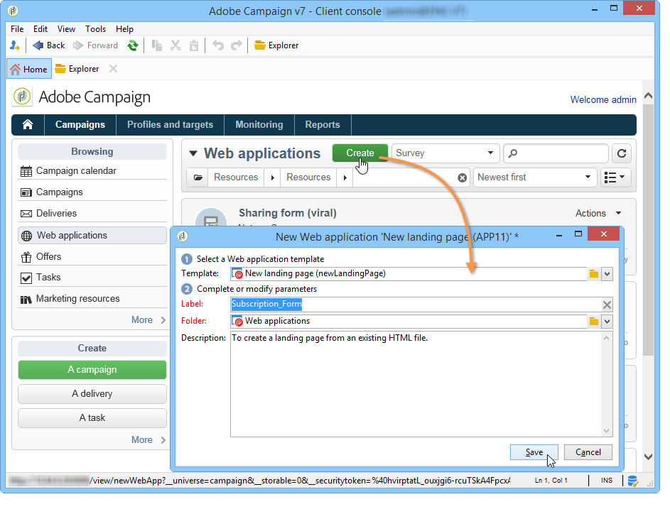

1. Click the **Edit** tab.
1. Delete the **End** activity.
1. Add a **Page** activity after the **Record** activity.
1. Edit the **Page 2** activity then uncheck the **Activate outbound transitions** option in the **Properties** tab.

   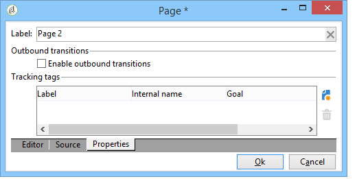

1. Save changes.

Use the following scenario:

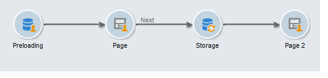

>[!NOTE]
>
>For more on creating a Web application, refer to [this section](../../web/using/creating-a-new-web-application.md).

## Step 1 - Selecting and loading templates {#step-1---selecting-and-loading-templates}

In this section, we are going to look at how to **import HTML content** for each page of the Web application.

A template must contain:

* an **HTML** file (mandatory)
* one or more **CSS** files (optional)
* one or more **images** (optional)

To load the template on the first page, apply the following steps:

1. Open the first **Page** activity of the Web application.
1. Select **From a file** to fetch your content template

   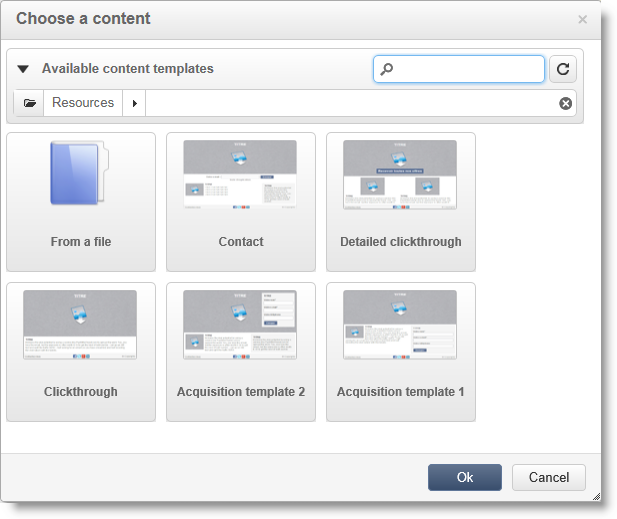

1. Select the HTML file to use.
1. Click **Open** to start the import.

   During loading, the list of shared files is displayed. The import system checks that all files linked to the selected HTML are there (CSS, images, etc.).

   Click the **Close** button once the import has finished.

   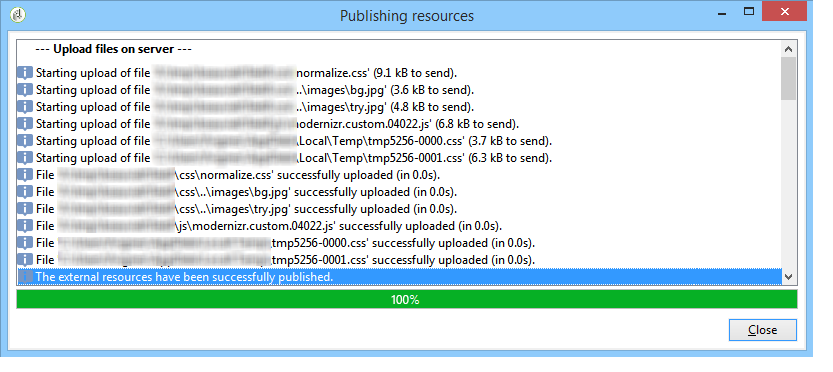

   >[!CAUTION]
   >
   >You must wait until you get the following message before closing: **The external resources have been successfully published**.

1. Click the **Properties** tab.
1. Enter a **label** for each page (for example: Page 1= Collect, Page 2=Thank you).

   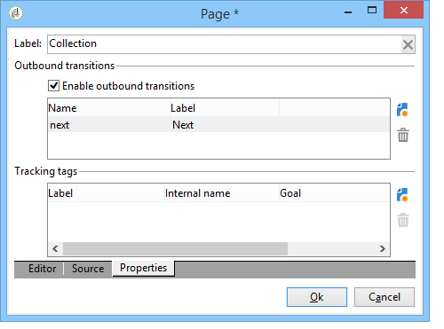

Apply these steps for each page inserted in the Web application.

>[!CAUTION]
>
>**The DCE executes the JavaScript code for the loaded HTML page.** JavaScript errors in the HTML template which may appear in the Adobe Campaign interface. These errors are not related to the editor. To check that there are no errors in the imported files, it is recommended you test them in a browser (Internet Explorer / Firefox / Chrome) before importing the files into the DCE.

## Step 2 - Configuring the content {#step-2---configuring-the-content}

In this section, we are going to adjust imported content and link the fields of the database to the form of the web page. The Web application created previously is: 

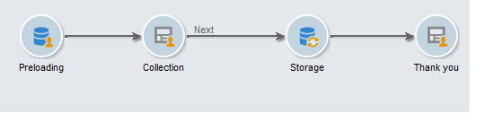

### Modifying content {#modifying-content}

Let's start by changing the colors of the page. To do this:

1. Open the **Collection** page.
1. Click the background.
1. Click **Background color** on the right-hand side.
1. Select a new background color.
1. Click **OK** to confirm the change.

   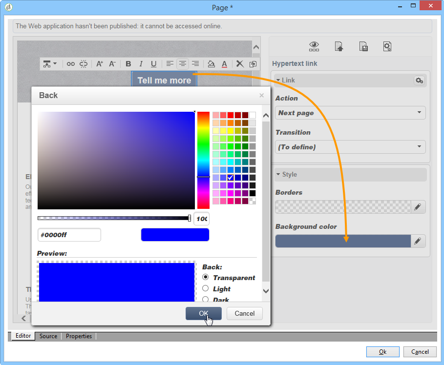

1. Apply these same processes to change the color of the button

   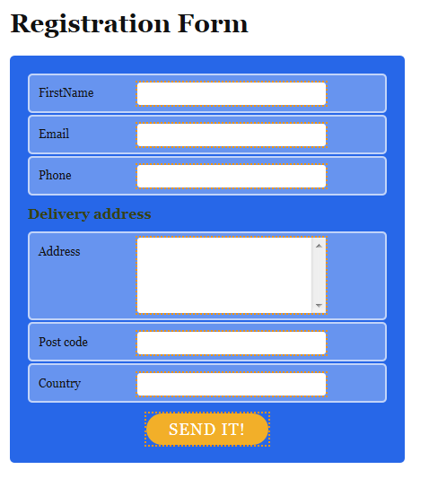

### Linking form fields {#linking-form-fields}

We are going to link the fields in the page to those in the database, in order to save the information provided.

1. Select a form field.
1. Edit the **Field** section on right-hand side of the editor.
1. Select the database field that you want to link to the selected field.

   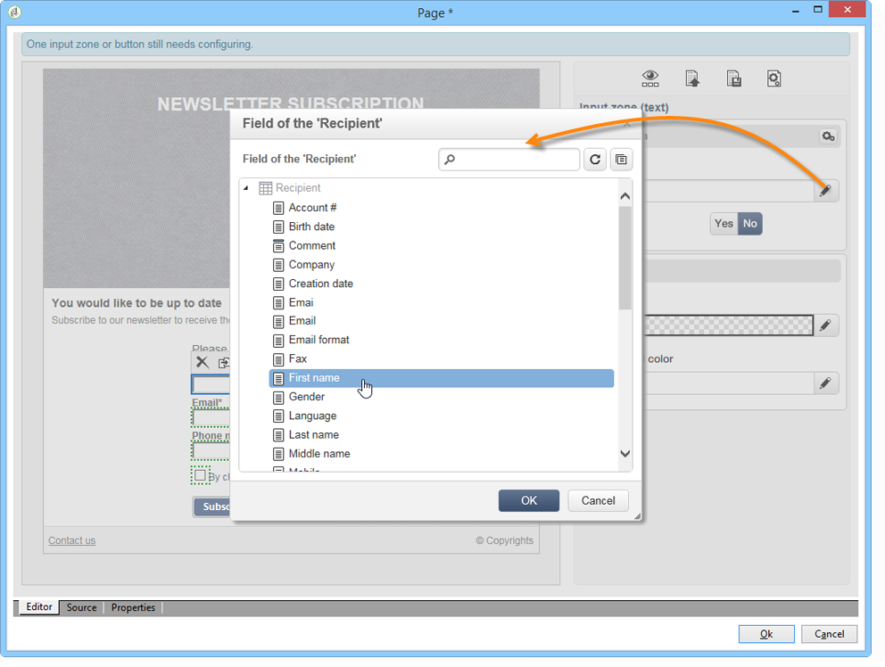

1. Repeat this process for each field on the page.

You can make a field mandatory: for example, click the **Email** field then enable the **Mandatory** option.

### Creating a link to the next page {#creating-a-link-to-the-next-page}

This step is mandatory because it will allow the Web application to determine the sequence of the next steps: Saving the collected data in the database then displaying the next page (**Thank you**).

1. Select the **Send it!** button of the **Collection** page.
1. Click the **Action** drop-down menu.
1. Select the **Next page** action.

   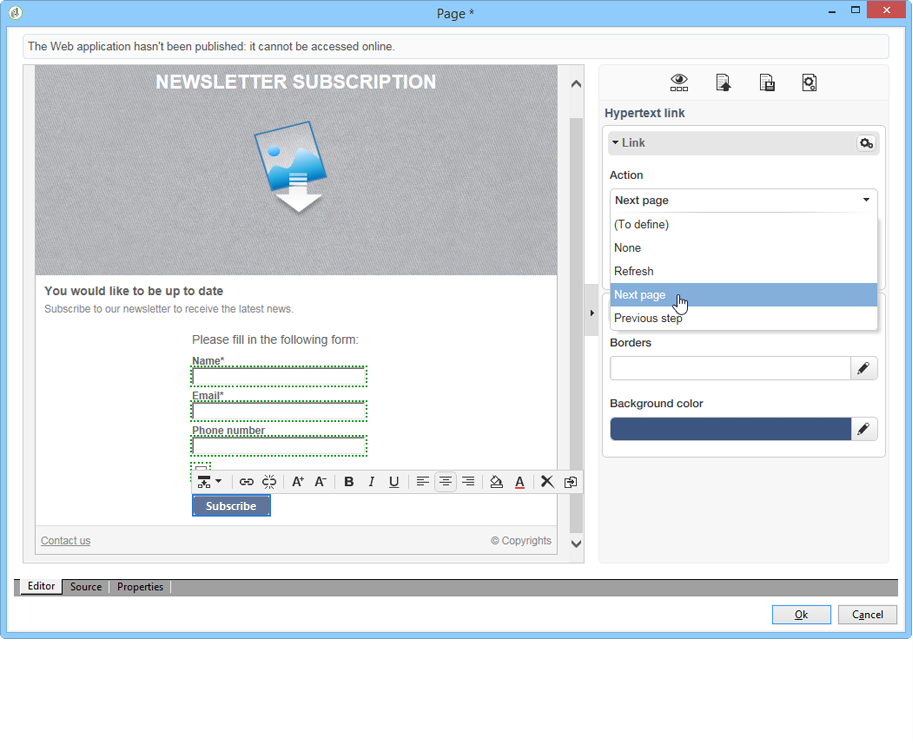

### Inserting a personalization field {#inserting-a-personalization-field}

This step lets you personalize the Thank you page. To do this:

1. Open the **Thank you** page.
1. Place the cursor in a text area, where you wish to insert the recipient's first name.
1. Select **Personalization field** in the **Insert** menu of the toolbar. 
1. Select the first name.

   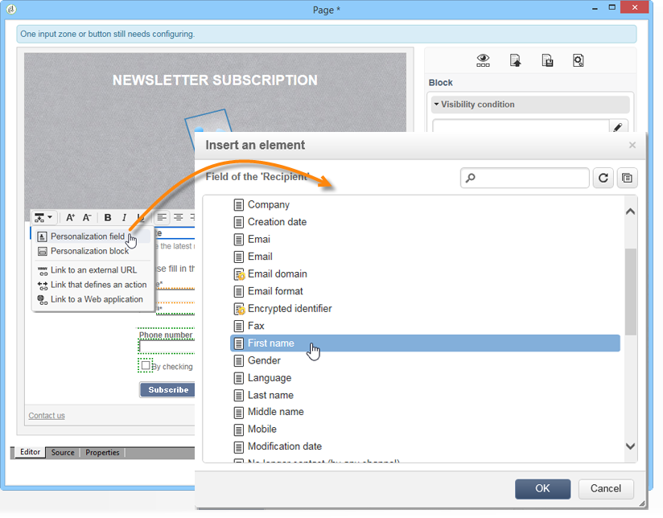

The personalization field has a yellow background in the editor.

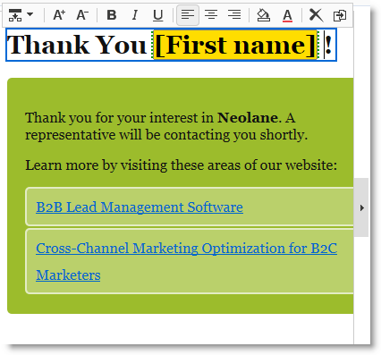

## Step 3 - Publishing content {#step-3---publishing-content}

Content is published from the Web application dashboard. Click the **Publication** button to run it.

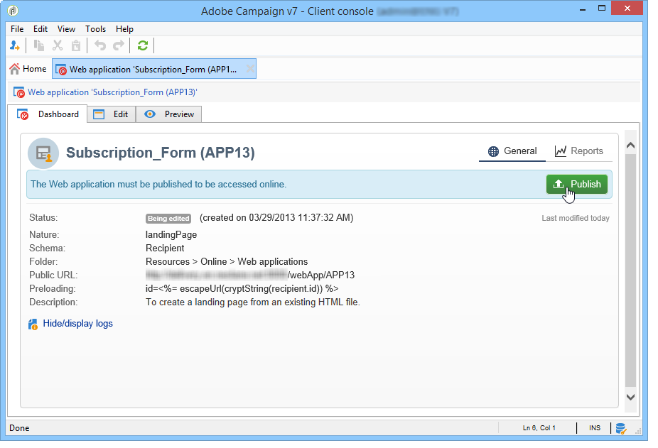

During publication, a log is displayed. The publishing system analyzes all the content found in the Web application 

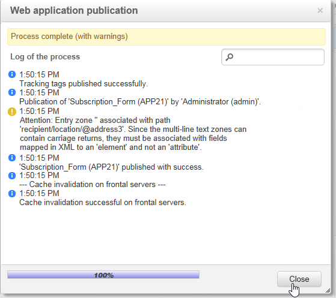

>[!NOTE]
>
>In the publication log, warnings and errors are sorted by activity.

The form is now available: its URL is accessible in the application dashboard and can be sent to recipients.
