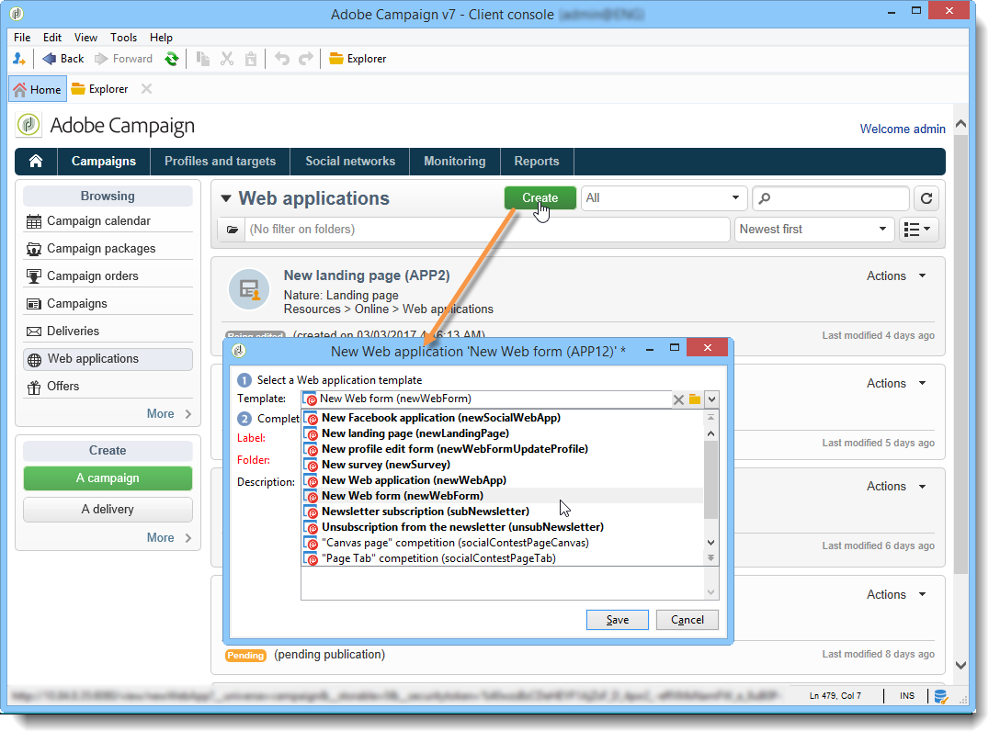

# Creating a new web application{#creating-a-new-web-application}

Web application types are selected during creation.

Go to the **Campaigns** tab and select the **[!UICONTROL Web Applications]** menu. Click the **[!UICONTROL Create]** button. Select the Web application template you want to use:

This template determines the type of Web application. You can create:

1. Web forms (+ profile modification)

   Web forms enable you to offer Web pages with input or selection fields: the information entered by users can be stored in the Adobe Campaign database. For more on this, refer to [Web forms](https://helpx.adobe.com/campaign/classic/web/using/about-web-forms.html).

1. Web applications

   Adobe Campaign lets you create Web applications to be exposed on a Web platform or an extranet for instance. This enables you to edit data and record information in Adobe Campaign. In this case, you can restrict their access to authenticated users (via access control) and set up data preloading based on various criteria. For more on this, refer to [this section](https://helpx.adobe.com/campaign/classic/web/using/about-web-applications.html).

1. Landing pages

   A landing page is an HTML page whose content is available on a Website and which enables users to enter information to be stored in the Adobe Campaign database profile. The content of this type of page is usually created by a specialized Web agency before being imported into Adobe Campaign for publication, management and follow-up. For more on this, refer to [this page](https://helpx.adobe.com/campaign/classic/web/using/creating-a-landing-page.html).

1. Surveys

   Adobe Campaign enables you, via the **Survey Manager** option, to design and manage online surveys and process their results: dynamic field creation, score management, export of answers and dedicated reports. For more on this, refer to [this section](https://helpx.adobe.com/campaign/classic/web/using/about-surveys.html).

   >[!CAUTION]
   >
   >**Survey Manager** is an optional Adobe Campaign module. Please check your license agreement.

1. Facebook applications

   Thanks to the **Social Marketing** option, Adobe Campaign lets you publish personalized content in a Facebook application. For more on this, refer to [this section](https://helpx.adobe.com/campaign/classic/social/using/about-social-marketing.html).

   >[!CAUTION]
   >
   >**Social Marketing** is an optional Adobe Campaign module. Please check your license agreement.

The page configuration mode as well as available configurations can be identical for several Web application types. For more on this, refer to [this section](https://helpx.adobe.com/campaign/classic/web/using/about-web-forms.html).
