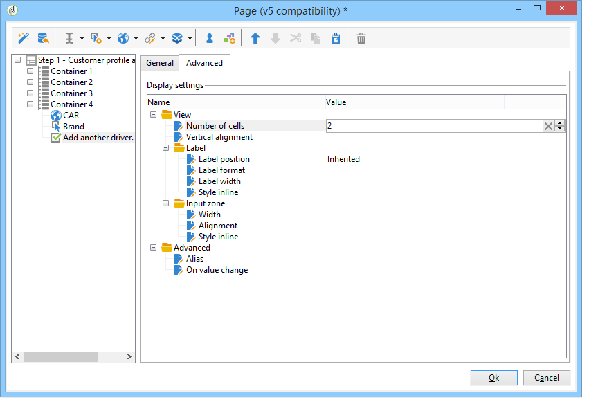

# Defining web forms layout{#defining-web-forms-layout}

## Creating containers {#creating-containers}

Containers let you combine the fields of a page and configure their layout; to organize the elements in the page.

For each page of the form, containers are created via the **[!UICONTROL Containers]** button of the toolbar.

Use a container to group elements of the page without adding a label to the final rendering. Elements are grouped into the container sub-tree. Standard containers let you manage the layout.

For example:

The position of labels is applied to elements placed below the container in the hierarchy. It can be overloaded for each element if necessary. Add or remove columns to change the layout. See [Positioning the fields on the page](#positioning-the-fields-on-the-page).

In the above example, the rendering will be as follows:

## Positioning the fields on the page {#positioning-the-fields-on-the-page}

The layout of the Web form is defined page by page in each container and can be overloaded if needed.

Pages are broken down into columns: each page contains a certain number of columns. Each field of the page occupies **n** cells. Containers also occupy a certain number of columns and the fields they contain occupy a certain number of cells.

By default, pages are built on a single column and each element occupies one cell. This means that fields are displayed one under another, each one occupying a whole line, as shown below:

In the following example, the default configuration has been kept. The page occupies a single column which includes four containers. 

Each container occupies one column and each element occupies one cell:

The rendering is as follows:

You can adapt the display parameters to obtain the following rendering:

In the above rendering example, each input field, title and image occupies one cell in the columns of the containers.

You can modify the formatting in each container. In our example, you can spread the content of container 4 over two columns and distribute the elements.

The title and the list occupy one cell each (and therefore an entire line of the container) and the checkbox extends over two cells. The number of cells attributed to the input field is defined in the **[!UICONTROL General]** tab or the **[!UICONTROL Advanced]** tab, according to the type of field:

## Defining the position of labels {#defining-the-position-of-labels}

You can define the alignment of fields and labels in the form.

By default, the display parameters for fields and other content of the page are inherited from the general configuration of the form, the configuration of the page, or the configuration of the parent container, if it exists.

The global display parameters for the entire form are specified in the form properties box. The **[!UICONTROL Rendering]** tab lets you select the position of labels. 

This position can be overloaded for each page, each container, and each field, via the **[!UICONTROL Advanced]** tab.

The following alignments are supported:

* Inherited: the alignment is inherited from the parent element (default value), i.e. the parent container if any, or else the page.
* Left/Right: the label is positioned to the right or to the left of the field,
* Above/Below: the label is positioned above or below the field,
* Hidden: the label is not displayed.
